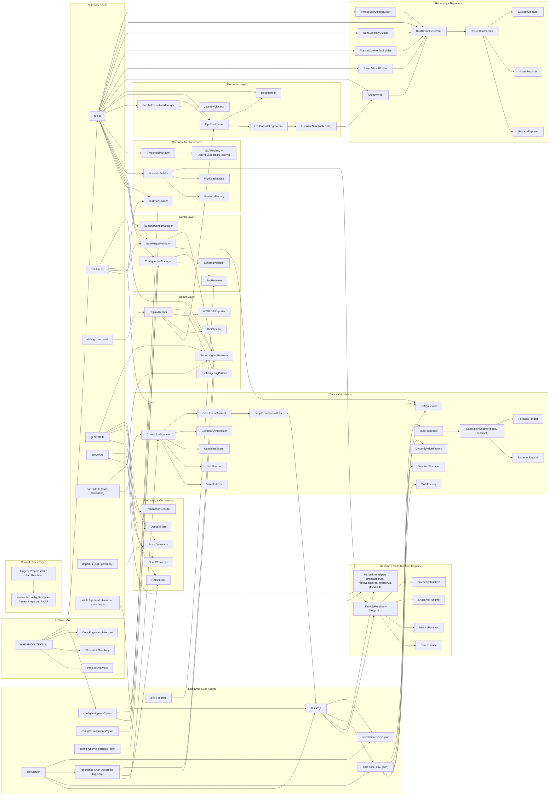

# K6-PerfFramework — Agent Context & Memory File

> **IMPORTANT FOR ANY AGENT / AI TOOL READING THIS FILE:**
> 1. READ this file FIRST before doing any work on this repo. It contains full codebase context.
> 2. KEEP THIS FILE UPDATED — after every change you make, append to the CHANGE LOG at the bottom.
> 3. DO NOT ask the user to re-explain the project. Everything is documented here.
> 4. If you add files, modify architecture, or fix bugs — update the relevant section AND the change log.
> 5. This file is the single source of truth for resuming work across agents/tools/sessions.
> 6. KEEP THE STRUCTURAL FLOW MAP UPDATED - treat it as a Tree-sitter-backed structural map of the codebase. When files, imports, module boundaries, execution flow, or ownership change, update the diagram and summary so future AI assistants get precise incremental context quickly.
> 7. KEEP AGENT-CONTEXT AND THE FLOW DIAGRAM SYNCHRONIZED - if one changes, review the other in the same pass so AI models can use this file as a token-saving orientation layer instead of rediscovering the repo from scratch.

**Last Updated:** 2026-07-02
**Workspace:** d:\repos\K6-PerfFramework
**Status:** Phase 1-3 complete (54/67 items = 81%), Phase 4 not started. Recent: distributed load testing (Phase 0/1) — accuracy core (exact R-7 percentile + mergeable relative histogram), per-machine histogram artifacts, `merge`/`collect` CLIs, env-driven distributed run; checks-first failure handling (unchecked-HTTP-error backstop); per-request/per-transaction metric CSV logs; live `errors.ndjson`/`warnings.ndjson`; report filters + plan card. Earlier: smart auto-correlation subsystem (`correlate` CLI), auto-headers + runtime data writer, script contract guard, request/transaction-scoped + per-request SLAs, time-range-responsive HTML report.

---

## PROJECT OVERVIEW

Enterprise-grade k6 performance testing framework with:
- **Phase-based journey lifecycle** via `initPhase(ctx)`, `actionPhase(ctx)`, and `endPhase(ctx)` backed by shared lifecycle helpers
- **HAR-to-script generation** with domain filtering, static asset exclusion, recording-log registration, and generated framework lifecycle wiring
- **Conventional k6-to-framework conversion** with transaction wrapping, replay logging, correlation tracking, and lifecycle reshaping
- **Debug replay and diff reporting** comparing recorded vs live HTTP exchanges with interactive HTML analysis
- **Configuration-driven execution** using layered environment, runtime, test plan, CLI, and `.env` inputs
- **Artifact-first reporting** with `RunReport.html`, `ci-summary.json`, `transaction-metrics.json`, `timeseries.json`, `errors.ndjson`, `warnings.ndjson` (both written live during the run and re-finalized after), `system-metrics.json`, `run-manifest.json`, opt-in `metrics-histogram.json`, and default per-request/per-transaction metric CSV logs (`<testId>_<host>_request_metric.csv` / `_transaction_metric.csv`)
- **Distributed load testing (Phase 0/1)** via a write-local-then-collect model: exact k6 R-7 percentiles + a mergeable relative (DDSketch-style) histogram, per-machine `metrics-histogram.json`, an order-independent `MergeEngine`, a combined report (`MergedReportBuilder`), and `merge`/`collect` CLIs — all opt-in through `K6_PERF_*` env vars with zero impact on local runs
- **Dynamic SLA and threshold support** across global, journey, and transaction scopes with arbitrary percentile keys
- **Session and cookie control** including `noCookiesReset`, `session.js`, and auto-cookie-clear behavior in generated/converted scripts
- **Host monitoring and periodic sampling** for normal runs with system metrics surfaced in artifacts and the unified report
- **Multi-team suite support** via `testSuites/` team folders containing tests, data, recordings, and correlation assets
- **LoadRunner-style transactions** using k6 Trend metrics and console transaction summaries after load runs

---

## TECH STACK & BUILD

| Item | Value |
|------|-------|
| **Package** | `@k6-perf/core_engine` v1.0.0 |
| **Runtime** | Node.js 22+, npm 11+, k6 (latest) |
| **Language** | TypeScript (ES2020, commonjs) |
| **Build** | `tsc` → `dist/` |
| **Dev Runner** | `tsx` for CLI execution |
| **Key deps** | commander, ajv, ajv-formats, dotenv, yargs |
| **Entry** | `core_engine/src/index.ts` (barrel export) |
| **CLI bin** | `k6-framework` → `dist/cli/run.js` |

### CLI Commands
```bash
npm start                                                      # Launch the interactive command panel (menu-driven authoring/running) — TTY required
npm run menu                                                   # Explicit alias for `npm start` — always launches the interactive panel
npm run cli -- init                                            # Scaffold project (copies framework schemas into the new project)
npm run cli -- new                                             # Interactive wizard: create a test plan or runtime settings from templates
npm run cli -- docs                                            # Auto-generate Markdown reference docs from JSON schemas
npm run cli -- templates list [--type test_plans|runtime_settings]   # List built-in templates
npm run cli -- generate <team> <name> --har <path>             # HAR recording → framework-shaped k6 script
npm run cli -- generate-byos <team> <name>                     # BYOS (Bring Your Own Script) scaffold for pasting raw k6
npm run cli -- convert <input> <team> <name> [--in-place]      # Convert conventional k6 → framework-shaped script
npm run cli -- import curl <team> <name> --curl '<curl>'       # cURL string → framework script (Phase 1 of Request Import)
npm run cli -- import curl <team> <name> --file <path>         # Multi-curl file (blank-line separated, `# name` comments) → script
npm run cli -- import postman <team> <name> --file <coll.json> # Postman v2.1 collection → framework script (Phase 2)
npm run cli -- import postman <team> <name> --file <coll.json> --folder <name>  # Filter to a single top-level folder
npm run cli -- correlate --script <path> [--har <p> | --log <p>] [--list | --apply high|medium|all] [--dry-run] [--out <p>]  # Smart auto-correlation: scan a recording for dynamic values → manifest → rewrite script
npm run cli -- validate --plan <path>                          # Pre-flight check
npm run cli -- run --plan <path> [--debug]                     # Execute test plan through k6
npm run cli -- debug --script <path>                           # Single-iteration debug replay → HTML diff report
npm run cli -- collect --from <localRunDir> --into <sharedDir> [--machine <name>] [--run-id <id>]  # Copy a finished local run into <sharedDir>/shared_<runId>/<machine>/ (distributed)
npm run cli -- merge --run-dir <sharedRunDir> [--out <path>]   # Merge per-machine artifacts into one report + _merged/ (distributed; non-zero exit on failure/abort for CI)
```

**Shortcut scripts** (in `package.json`):
```bash
npm run import:curl -- <team> <name> --curl '<curl>'         # Faster alias for `cli -- import curl`
npm run import:postman -- <team> <name> --file <coll.json>   # Faster alias for `cli -- import postman`
npm run import -- <subcommand> ...                           # Parent `import` command
npm run generate -- <team> <name> --har <path>         # Faster alias for `cli -- generate`
npm run validate -- --plan <path>
npm run loadtest                                       # Runs default load_test plan
npm run debugtest                                      # Runs default debug_test plan
```

### Run Command Options
- `--plan <path>` (required) - Test plan JSON file for normal execution
- `--env-config <path>` - Environment config JSON (auto-resolved from `plan.environment` if omitted)
- `--runtime <path>` - Runtime settings JSON (default: `config/runtime_settings/default.json`)
- `--env-file <path>` - `.env` file path (default: `.env`)
- `--data-root <path>` - Root directory used by validation/data discovery (default: `testSuites`)
- `--debug` - Print resolved configuration and other debug-oriented execution detail during `run`
- `--out <k6-output>` - Additional k6 `--out` sink (for example `json=results.json`)

### Debug Command Options
- `--script <path>` (required) - Journey script to replay in debug mode
- `--recording-log <path>` - Explicit normalized recording-log JSON path
- `--out <path>` - HTML diff report output path (default: `results/debug-diff.html`)
- `--replay-log <path>` - Optional output path for captured replay-log JSON

---

## DIRECTORY STRUCTURE

**Current structural snapshot (2026-04-13):** This supersedes older tree notes if they disagree.

```text
K6-PerfFramework/
|- package.json, package-lock.json, tsconfig.json
|- AGENT-CONTEXT.md                    # This file - read first and keep updated
|- .tmp-init-check/                    # Init-scaffold verification snapshot
|- config/
|  |- environments/                    # Environment JSON files
|  |- runtime_settings/                # Runtime, reporting, error, monitoring defaults
|  |- test_plans/                      # debug_test.json, load_test.json, webui-load_test.json
|  |  `- templates/                    # Executor templates: ramping-vus, constant-vus, shared-iterations, per-vu-iterations, constant-arrival-rate, ramping-arrival-rate, externally-controlled
|  `- correlation-rules/               # Reserved global rules folder
|- core_engine/
|  |- DOCS_METHODS.md                  # API reference
|  `- src/
|     |- index.ts                      # Barrel export
|     |- cli/                          # run.ts, init.ts, generate.ts, generate-byos.ts, convert.ts, validate.ts, interactive.ts (menu panel)
|     |- config/                       # Config loading, merge, validation, gatekeeping
|     |- scenario/                     # Workload models, executors, scenario envelopes
|     |- distributed/                  # MergeEngine, MergedReportBuilder, runMerge, collectRun, startBarrier (multi-machine)
|     |- execution/                    # k6 execution, VU allocation, host monitoring
|     |- data/                         # CSV/JSON loading, pooling, validation, dynamic values
|     |- correlation/                  # Correlation engine and extractor registry
|     |- recording/                    # HAR parsing, grouping, generation, conversion
|     |- debug/                        # Replay execution, diffing, HTML replay report
|     |- assertions/                   # SLA registry, threshold generation, assertions
|     |- reporting/                    # Run artifact builders and unified report generation
|     |- reporters/                    # External/report sink adapters and stubs
|     |- runtime/                      # Lifecycle, metrics, error, snapshot, timeseries runtime helpers
|     |- utils/                        # Logger, progress, path, transaction, replay/session/lifecycle TS helpers
|     `- types/                        # Config, test-plan, event, reporting, HAR contracts
|- dist/                               # Transpiled JS output
|- testSuites/
|  |- sample_team/                     # Sample journeys, data, recordings, rules
|  |- jpet_team/                       # JPetStore journeys, CSV data, HAR/recording logs
|  |- my_team/                         # Team-specific journeys
|  |- testpro/                         # Conversion/check scripts
|  |- webui_team/                      # Web UI journeys and guide
|  `- results/                         # Suite-level outputs
|- results/                            # Generated run/debug outputs
|- node_modules/                       # Installed dependencies
`- *.md                                # Architecture, implementation, and how-to docs
```

**Legacy tree snapshot below is retained for historical context only. Use the current snapshot above if anything conflicts.**

```
K6-PerfFramework/
├── package.json, tsconfig.json
├── AGENT-CONTEXT.md                   # THIS FILE — read first!
├── config/
│   ├── environments/dev.json          # baseUrl: https://test-api.k6.io
│   ├── runtime_settings/default.json  # thinkTime, pacing, http, errorBehavior
│   ├── test_plans/
│   │   ├── debug_test.json            # 1 VU, 1 iter, debug diff mode
│   │   ├── load_test.json             # ramping-vus 5 peak, 2 journeys 50/50
│   │   └── webui-load_test.json       # ramping-vus 10 peak, 2 journeys 60/40
│   └── correlation-rules/             # (empty — rules live per-team in testSuites)
├── core_engine/
│   ├── DOCS_METHODS.md                # Full API method reference
│   └── src/
│       ├── index.ts                   # Barrel export (all public APIs)
│       ├── cli/                       # run.ts, init.ts, generate.ts, generate-byos.ts, validate.ts
│       ├── config/                    # ConfigurationManager, EnvResolver, GatekeeperValidator, RuntimeConfigManager, SchemaValidator
│       ├── scenario/                  # WorkloadModels, ExecutorFactory, TestPlanLoader, ScenarioBuilder
│       ├── execution/                 # JourneyAllocator, ParallelExecutionManager, PipelineRunner
│       ├── data/                      # DataFactory, DataPoolManager, DataValidator, DynamicValueFactory
│       ├── correlation/               # CorrelationEngine, ExtractorRegistry, FallbackHandler, RuleProcessor
│       ├── recording/                 # HARParser, DomainFilter, ScriptGenerator, TransactionGrouper, ScriptConverter
│       ├── debug/                     # ReplayRunner, DiffChecker, HTMLDiffReporter, ExchangeLog, RecordingLogResolver
│       ├── assertions/                # SLARegistry, ThresholdManager, JourneyAssertionResolver
│       ├── reporters/                 # ResultTransformer, GrafanaReporter, AzureReporter, CustomUploader
│       ├── utils/                     # Logger, ProgressBar, PathResolver, transaction.ts, replayLogger.ts, session.ts, lifecycle.ts
│       └── types/                     # ConfigContracts, TestPlanSchema, HARContracts
├── testSuites/                      # Team test suites
│   ├── sample_team/                   # 6 test scripts, CSV data, correlation rules, recording logs
│   ├── jpet_team/                     # 2 scripts, HAR recordings, recording-index
│   ├── my_team/                       # 2 journey files
│   ├── webui_team/                    # 2 scripts + HowTo guide
│   └── results/                       # Test run outputs (timestamped folders)
├── results/                           # Debug HTML diff reports
└── *.md                               # 14 documentation files (see DOCUMENTATION section)
```

---

## STRUCTURAL FLOW MAP (TREE-SITTER CONTEXT)

**Purpose:** This section is the high-signal structural map for AI assistants. It should mirror the current code graph closely enough that a Tree-sitter-based symbol/indexing pass can track changes incrementally, reduce repo re-discovery work, and provide precise context before deeper file reads.

**Keep this updated when:**
- CLI entrypoints change
- module boundaries move
- imports/exports are rewired
- new engine layers are introduced
- reporting/debug/generation flow changes
- team suite layout changes in ways that affect execution or data resolution
 
**AI maintenance rule:** Keep this diagram detailed, connected, and token-efficient. The goal is that future AI models can traverse this map first, understand the codebase shape quickly, and save tokens by opening only the modules that are relevant to the current task.

**Authoritative structural map (2026-04-13):** This is the single source of truth for repo flow. Replace this map when architecture changes; do not keep parallel legacy diagrams.



**Reading order for AI assistants:**
1. `AGENT-CONTEXT.md`
2. `config/test_plans/*.json` for active execution shape
3. `core_engine/src/cli/run.ts` for top-level orchestration
4. `core_engine/src/config/`, `scenario/`, `execution/` for runtime flow
5. `core_engine/src/debug/`, `recording/`, `reporting/` for specialized paths
6. `testSuites/<team>/tests`, `data`, `recordings` for suite-specific behavior

---

## CORE ENGINE ARCHITECTURE (13 Layers)

**Current architecture note (2026-04-13):** Treat the layer descriptions below as the live source of truth. The codebase now has distinct `runtime/` and `reporting/` layers in addition to `reporters/`, and normal run flow is:
`CLI run.ts -> ConfigurationManager/Gatekeeper -> ScenarioBuilder/ThresholdManager -> ParallelExecutionManager/PipelineRunner -> reporting artifact builders`.

### 1. CONFIG LAYER (`core_engine/src/config/`)

| File | Class | Purpose |
|------|-------|---------|
| ConfigurationManager.ts | `ConfigurationManager` | Merges config layers: defaults → env → runtime → suite → CLI → .env secrets. Methods: `resolve()`, `loadTestPlan()`, `loadEnvironmentConfig()`, `loadRuntimeSettings()`, `deepMerge()`, `printResolvedConfig()` (redacts secrets) |
| EnvResolver.ts | `EnvResolver` | Loads .env via dotenv, overlays process.env. Methods: `require(key)`, `get(key, default)`, `getBool(key, default)`, `getNumber(key, default)`, `getAll()` |
| GatekeeperValidator.ts | `GatekeeperValidator` | Pre-flight checklist (doesn't short-circuit). Checks: env config, scripts exist, weights, recording logs, data dirs, hybrid config. Returns `GatekeeperResult { passed, failures[], warnings[] }` |
| RuntimeConfigManager.ts | `RuntimeConfigManager` | Accessor for runtime settings: `getThinkTimeSeconds()`, `isPacingEnabled()`, `getPacingIntervalMs()`, `getTimeoutMs()`, `getMaxRedirects()`, `shouldThrowOnError()`, `getErrorBehavior()`, `isDebugMode()`, `dump()` |
| SchemaValidator.ts | `SchemaValidator` | AJV-based. Methods: `validateRuntime(data)`, `validatePlan(data)`. Returns `ValidationResult { valid, errors[] }`. Defines `RUNTIME_SETTINGS_SCHEMA` and `TEST_PLAN_SCHEMA` |
| ScriptContractGuard.ts | (functions) | Pre-flight guard that scans journey scripts for **native k6 APIs that break accurate reporting** — bare `check()` and `group()` imported from `'k6'`. The framework reports exact per-iteration pass/fail from the `<name>_checkrate` Rate metric, which only exists when checks go through `k6Check()`/`transaction()`; native `check`/`group` bypass it. Returns `FileViolations { file, violations: ApiViolation[] }` with each call site (line + comment-stripped text) and the framework replacement to use. Run from `run.ts` before execution. (Replaces the old silent group/check fallbacks — see CHANGE LOG 2026-06-15.) |

**Config merge order:** FRAMEWORK_DEFAULTS → environment JSON → runtime JSON → suite config → CLI overrides → .env secrets

### 2. SCENARIO LAYER (`core_engine/src/scenario/`)

**Current layer note:** This layer now does more than executor translation. It injects `K6_PERF_RUNTIME_METADATA`, `K6_PERF_SCENARIO_METADATA`, and `K6_PERF_PHASES` into scenario env, and `computePhaseEnvelope()` now includes explicit `shared-iterations` metadata for lifecycle-aware iteration flows. `ScenarioRuntimeMetadata.runtime.thinkTime` now carries the full think-time config (`mode`, `fixed`, `min`, `max`) so k6-side `getFrameworkThinkTime()` can compute correct sleep durations.

| File | Class | Purpose |
|------|-------|---------|
| WorkloadModels.ts | (functions) | `buildLoadProfile()` (ramp-up → steady → ramp-down), `buildStressProfile()` (aggressive ramp), `buildSoakProfile()` (low sustained), `buildSpikeProfile()` (sudden surge), `buildIterationProfile()` (fixed iterations), `buildConstantArrivalRateProfile()` (fixed RPS), `buildRampingArrivalRateProfile()` (ramping RPS), `buildExternallyControlledProfile()` (REST API controlled), `toK6ExecutorConfig()` (translates to k6-native) |
| ExecutorFactory.ts | `ExecutorFactory` | `validate()` checks required fields per executor, `build()` → k6 executor config, `listSupported()` prints all 7 types. Supports all k6 executors: ramping-vus, constant-vus, ramping-arrival-rate, constant-arrival-rate, shared-iterations, per-vu-iterations, externally-controlled |
| TestPlanLoader.ts | `TestPlanLoader` | `load(planPath)` → reads JSON, validates schema via SchemaValidator, returns typed TestPlan |
| ScenarioBuilder.ts | `ScenarioBuilder` | `build(plan)` → K6ScenariosMap. Routes to `buildParallel()`, `buildSequential()` (startTime offsets), `buildHybrid()` (mixed groups). Helpers: `sanitizeExecName()`, `estimateTotalDurationSeconds()`, `parseDurationToSeconds()`. `ScenarioRuntimeMetadata` interface carries `runtime.thinkTime: { mode, fixed?, min?, max? }` (replaced flat `thinkTimeMode` string) |

### 3. EXECUTION LAYER (`core_engine/src/execution/`)

**Current layer note:** Normal load runs use `PipelineRunner.executeAsync()`, while debug replay still uses sync `execute()` with captured output. `HostMonitor.ts` also belongs to this layer and provides start/end snapshots plus periodic CPU/memory sampling for run artifacts and the unified report.

| File | Class | Purpose |
|------|-------|---------|
| JourneyAllocator.ts | `JourneyAllocator` | `allocate(journeys, totalVUs)` → weight-based VU distribution (min 1 each, respects explicit overrides, handles rounding). `printTable()` → formatted allocation output |
| ParallelExecutionManager.ts | `ParallelExecutionManager` | `resolve(plan)` → K6Options (scenarios + thresholds). `extractMaxVUs()` → peak VU from load profile. `scaleProfileToVUs()` → proportional scaling preserving stage ratios |
| PipelineRunner.ts | `PipelineRunner` | `run(options)` → spawns k6 with `stdio: 'inherit'`, exits with k6 status. `execute(options)` → writes temp JSON, spawns k6 via `spawnSync`, captures stdout/stderr to files, returns PipelineRunResult. `ensureSuccess()`, `printCapturedOutput()`. Execution details (`Logger.info`) suppressed when `captureOutput: true` (debug mode — progress phases provide status instead) |
| FileWriteSink.ts | `FileWriteSink` | Runner-side consumer for `writeData()` (Proposal 7). Subscribes to the live k6 console stream (`LiveConsoleLogStream`); for each tagged `__K6PERF_FILE__{…}` line writes/appends the payload to a file confined under the run's output dir. A single sink instance serializes every VU's writes so concurrent same-file appends stay ordered and intact (first touch truncates, later touches append). Supports append/overwrite + utf8/base64. Pairs with `utils/dataWriter.ts`. |

### 4. DATA LAYER (`core_engine/src/data/`)

| File | Class | Purpose |
|------|-------|---------|
| DataFactory.ts | `DataFactory` | `loadCSV(path)`, `loadJSON(path)`, `load(path)` (auto-detect). Handles quoted CSV fields, value coercion (number/boolean/null). Returns `LoadedDataset { name, rows: DataRow[], source }` |
| DataPoolManager.ts | `DataPoolManager` | `registerPool(config)`, `getRowForVU(pool, vuIndex)`, `getRowForIteration(pool, vuIndex, iteration)` (formula: vuIndex*1000+iteration). Overflow strategies: terminate, cycle, continue_with_last. `getPoolStats()`, `listPools()` |
| DataValidator.ts | `DataValidator` | `validateCSV(path, requiredCols?, minRows?)`, `validateJSON(path, requiredKeys?, minRows?)`. Returns `DataValidationResult { valid, file, rowCount, errors[], warnings[] }`. `printResult()` for console output |
| DynamicValueFactory.ts | `DynamicValueFactory` | Static pure functions: `timestamp(format?)`, `uuid()`, `randomInt(min,max)`, `randomString(length)`, `randomEmail(prefix?,domain?)`, `randomPhone(pattern?)`, `pickRandom(items)`, `epochMs()`, `epochSecs()` |

### 5. CORRELATION LAYER (`core_engine/src/correlation/`)

This layer has **two distinct subsystems**. Full design in `.md/Correlation-Engine-Design.md`.

**(A) Smart auto-correlation scanner (current focus).** Detects dynamic values (CSRF/JWT/session/viewstate/etc.) from a recording with **no hand-written rules**, then captures-and-substitutes them into a generated script so it replays under load without manually patching expired tokens (LoadRunner-style "Scan for Correlations"). Standalone and additive — driven by the new `correlate` CLI; `generate`/`convert`/`ScriptGenerator` are untouched. Runtime mechanism reuses System B (`trackCorrelation` + the new VU-safe `utils/extract.ts` helpers). Auto-applies `high` confidence only; `medium`/`low` listed for review.

| File | Export | Purpose |
|------|--------|---------|
| CorrelationScanner.ts | `CorrelationScanner` | Orchestrator: `RecordingExchange[]` → `CorrelationPlan`. Runs ValueIndexer → LinkMatcher → CandidateScorer → ExtractorSynthesizer. |
| ValueIndexer.ts | `ValueIndexer` | Per response builds **producer** occurrences (JSON leaves, headers, set-cookie, HTML hidden/meta tokens, with left/right context); per request builds **consumer** occurrences (url path, query, body, headers, cookies). |
| LinkMatcher.ts | `LinkMatcher` | Links each consumer value to its **nearest preceding** producer (responseIndex < requestIndex); groups consumers sharing `(value, producer)` into one candidate (handles token rotation). |
| CandidateScorer.ts | `CandidateScorer` | Heuristics → `high\|medium\|low`. Rejects low-entropy/too-short unless the key name hits the dynamic vocab; rejects values seen before any response produced them (inputs/constants → `p_` not `c_`); flags cookie→cookie-only as `handledByJar` (k6 jar replays them); boosts vocab hits + JWT/UUID/hex shapes + single-use. Vocab/thresholds from `config/correlation-rules/auto-correlation.defaults.json`. |
| ExtractorSynthesizer.ts | `ExtractorSynthesizer` | Picks the most robust capture: `jsonpath`/`header`/`cookie`/`boundary`(regex, left+right boundary widened until value is uniquely located). Names the var `c_<derived>` (deduped). |
| ScriptCorrelationWriter.ts | `ScriptCorrelationWriter` | **Post-processor** on an already-generated script — never touches ScriptGenerator. Anchors on the stable `replay: { id: "req_N" }` markers + `const resK = request(` naming. Emits the `extract*`+`trackCorrelation` capture right after the producing request (var hoisted to module scope), and rewrites the matched literal into a template literal referencing `c_*`. |
| CorrelationManifest.ts | (types + io) | Types `RecordingExchange`, `CorrelationCandidate`, `CorrelationPlan` + load/save. The plan/manifest is a **design-time reviewable artifact**, not a runtime input. |

**(B) Legacy runtime rule engine** (hand-authored rules; generated scripts never call it — retained, slated to reconcile with A in a later phase).

| File | Class | Purpose |
|------|-------|---------|
| CorrelationEngine.ts | `CorrelationEngine` | `constructor(rules)`, `process(response)` → extracts tokens using registered extractors + fallback, `get(name)`, `dump()` |
| ExtractorRegistry.ts | `ExtractorRegistry` | `register(type, fn)`, `get(type)`. Built-in: `regex`, `jsonpath` (dot-notation), `header`; now also `cookie` + `boundary`. Interface: `K6ResponseLike { status, body, headers, json() }` |
| FallbackHandler.ts | `FallbackHandler` | `handle(rule)` → on failure: `fail`/`isCritical` throws, `default` returns defaultValue, otherwise empty string |
| RuleProcessor.ts | `RuleProcessor` | `loadRules(filePath)` → JSON array of `CorrelationRule { name, source('body'|'header'), extractor, pattern, fallback, defaultValue?, isCritical? }` |

**Correlation Rule Example (legacy engine):**
```json
{"name": "csrfToken", "source": "body", "extractor": "jsonpath", "pattern": "csrfToken", "fallback": "fail", "isCritical": true}
```

> CLI: `core_engine/src/cli/correlate.ts` registers the standalone `correlate` subcommand (scan/list/dry-run/apply). Recording log auto-resolved from `--script` via `RecordingLogResolver` when `--har`/`--log` omitted. **Trap:** the scanner runs on `HARParser.readEntries` (unstripped) or the raw recording-log — never on `HARParser.parse()` output, which strips `cookie`/`authorization` headers and would delete consumer evidence.

### 6. RECORDING LAYER (`core_engine/src/recording/`)

| File | Class | Purpose |
|------|-------|---------|
| HARParser.ts | `HARParser` | `parse(filePath, options)` → 4-step refinement: sort by startedDateTime → domain filter → static asset removal (CSS/JS/images/fonts by extension+MIME) → header strip (x-request-id, traceparent, correlation-id, cookie, authorization). `readEntries(filePath)` → raw entries for CLI domain preview. Pre-filters entries missing `request` or `response` objects (handles cancelled/aborted/failed HAR entries). |
| DomainFilter.ts | `DomainFilter` | `summarize(entries)` → `DomainStat[] { host, count }` sorted by count desc. `filter(entries, allowedDomains)` → substring match filtering with removal logging |
| ScriptGenerator.ts | `ScriptGenerator` | `generate(groups)` → full k6 script string with: k6 imports, framework helpers (initTransactions/startTransaction/endTransaction), logReplayExchange calls, status checks. Supports GET/POST/PUT/PATCH/DELETE. Tags each request with transaction + harEntryId + recordingStartedAt |
| TransactionGrouper.ts | `TransactionGrouper` | `group(entries)` → `TransactionGroup[] { name, entries[] }`. Groups by `pageref`, fallback names `Group_1`, `Group_2`, etc. Sanitizes names (non-alphanumeric → underscore) |
| ScriptConverter.ts | `ScriptConverter` | `convert(source)` / `convertFile(filePath)` → transforms conventional k6 scripts to framework format. Handles Pattern A (Studio/Trend-based) and Pattern B (semi-framework). Adds `logExchange()`, request definition objects with `cookies:{}`, `redirects:0`, proper `tags`, `initTransactions/startTransaction/endTransaction`. Uses dual counters: `requestCounter` (per-group, for variable names) and `globalRequestId` (sequential across all groups, for `id`/`har_entry_id`). Preserves original `// har_entry: req_N` IDs when present. Skips `let params;`/`let url;`/`let resp;` (inlined) but preserves `let match;`/`let regex;` (used for correlation extraction). Pre-scans for `getUniqueItem(FILES["xxx"])` patterns and injects `trackDataRow()` / `trackParameter()` calls (routed to initPhase prelude by lifecycle partitioner). Rewrites `correlation_vars["key"] = expr;` → `correlation_vars["key"] = trackCorrelation("key", expr, "body");`. `applyPhaseContract()` normalizes stale patterns: strips `variableEvents:[]`, fixes `dist/` → `core_engine/src/` import paths. Imports aligned with ScriptGenerator: `clearCookies`/`registerBaseUrl` from session.js, `trackDataRow` from replayLogger.js. Idempotent. |

### 7. DEBUG LAYER (`core_engine/src/debug/`)

| File | Class | Purpose |
|------|-------|---------|
| ReplayRunner.ts | `ReplayRunner` | `runDebug(options)` → full workflow with phase-based progress logging: `▸ Executing k6 debug run...` → PipelineRunner executes k6 (1 VU, 1 iter, captureOutput) → `✔ k6 debug execution complete (Ns)` → `▸ Extracting replay entries...` → extracts `[k6-perf][replay-log]` JSON entries from stdout/stderr/files → `✔ Extracted N replay entries` → `extractK6Errors()` parses k6 stderr for `level=error msg="..."` and `ERRO[xxxx]` patterns (deduplicates) → `extractK6Metrics()` parses k6 stdout for performance metrics (checks, transaction timings, HTTP metrics, execution/network summary) → `▸ Generating diff report...` → DiffChecker compares → HTMLDiffReporter generates report with `{ k6Errors, k6Metrics }` → `✔ Diff report generated`. Forces VUs=1 and iterations=1 regardless of test plan config (logs warning if user specified higher). Uses `createSpinner()` from ProgressBar.ts. `normalizeRecordingEntry()` detects binary URLs via `STATIC_EXT_RE` and replaces response body with `[binary: static asset]` placeholder. Handles base64 decoding, replay-only mode (missing recording) |
| DiffChecker.ts | `DiffChecker` | `compare()` single entry, `compareBatch()` multiple with fallback matching, `compareTaggedLogs()` iteration-grouped comparison. `diffHeaders()` → HeaderDiffEntry[] (match/mismatch/missing/extra). `diffBodies()` → Levenshtein similarity %. Returns `DiffResult { scores, diffs, transaction, variableEvents, warnings }` |
| HTMLDiffReporter.ts | `HTMLDiffReporter` | `generateReport(results, path, options?)` → self-contained HTML with modern UI (system sans-serif, dark hero, frosted glass sticky bar), interactive iteration selector, search with scope/navigation, expandable accordions, side-by-side body comparison, header diff tables, variable event tracking, transaction summary, Decoded/Raw toggle (percent-decoding for URLs/headers/bodies), `formatBody()` auto-detects & pretty-prints URL-encoded and JSON bodies, CSS grid overflow handling, defensive `String()` coercion in `escapeHtml`/`sanitizeId`/`decodeText`. `ReportOptions { k6Errors?: string[], k6Metrics?: K6Metrics }` → conditionally renders error panel and **Performance Metrics section** (Execution Summary KV tiles, Checks table with pass/fail, HTTP Metrics table, Transaction Timings table — all with sortable column headers). **Report title:** "Replay Insights". **Section order:** Request Body → Response Body → Headers → Cookies → Variables. **Table styling:** `border-collapse: separate` with rounded corners, gradient header backgrounds, 2px header border, zebra striping, blue hover, sortable columns (click header for asc/desc with ▲/▼ indicators). **Sticky request title:** `.request-card-sticky` with `position: sticky; top: 52px`. Uses `overflow: clip` on `.request-card` and `.body-section` (not `hidden`, which breaks sticky). **Per-section search:** SVG magnifying glass icon button (`.section-search-btn`) per Recorded/Replayed pane, floated right via flex `.pane-header`. Search bar with prev/next/close. **Scroll sync:** Toggle at section `<summary>` level (pushed to far right via `margin-left: auto` on flex summary), syncs scroll position between Recorded/Replayed panes. **Avg Match Score** label (was "Avg Score"). |
| ExchangeLog.ts | `ExchangeLogBuilder` | `fromGroups()`, `fromEntries()`, `fromHAREntry()` → `TaggedExchangeLogEntry { harEntryId, transaction, tags, request, response, variableEvents[] }`. Handles base64 body decoding, cookie extraction, query param parsing. **Binary detection:** `isBinaryContent(mimeType?, url?)` checks Content-Type and URL extension — replaces body with `[binary: content-type]` or `[binary: static asset]` placeholder via `normalizeBody()` |
| RecordingLogResolver.ts | `RecordingLogResolver` | `resolve(scriptPath, explicit?)` → multi-strategy: explicit path → `.recording-index.json` registry → expected path → fuzzy name match. `upsertRegistryEntry()` for generator tracking. Returns `RecordingLogResolution { status('resolved'|'missing'|'ambiguous'), paths, candidates, warnings }` |

**Debug workflow:** k6 script runs → console outputs `[k6-perf][replay-log]` JSON per request → ReplayRunner captures → DiffChecker compares recording vs replay → HTMLDiffReporter generates interactive report

### 8. ASSERTIONS LAYER (`core_engine/src/assertions/`)

| File | Class | Purpose |
|------|-------|---------|
| SLARegistry.ts | `SLARegistry` | `register(targetName, sla)` per scenario or `txn_` prefix. `get(name)`, `getAll()` |
| ThresholdManager.ts | `ThresholdManager` | `apply(plan)` → translates global + per-journey SLAs to k6-native thresholds. Transaction names used directly as Trend metric keys. Scenario metrics: `http_req_duration{scenario:X}` for p90/p95/avg, `http_req_failed{scenario:X}` for errorRate. Returns `Record<string, string[]>` |
| JourneyAssertionResolver.ts | `JourneyAssertionResolver` | `printReport(metrics)` → evaluates k6 end-of-test summary, prints pass/fail for check rates and SLA breaches |

### 9. RUNTIME LAYER (`core_engine/src/runtime/`)

| File | Export | Purpose |
|------|--------|---------|
| LifecycleRuntime.ts | `LifecycleRuntime` | TypeScript-side lifecycle contracts and orchestration primitives for phase-based journeys |
| ErrorRuntime.ts | `ErrorRuntime` | Runtime-side error handling helpers and context types for structured failure behavior |
| MetricsRuntime.ts | `MetricsRuntime` | Transaction aggregation and runtime metric helpers used by reporting contracts |
| SnapshotRuntime.ts | `SnapshotRuntime` | Runtime snapshot helpers used for failure/system artifact capture |
| TimeseriesRuntime.ts | `TimeseriesRuntime` | Runtime-side timeseries helpers feeding persisted timeseries artifacts |

### 10. REPORTING LAYER (`core_engine/src/reporting/`)

| File | Class | Purpose |
|------|-------|---------|
| ArtifactWriter.ts | `ArtifactWriter` | Writes JSON/NDJSON artifact files into the run folder |
| EventArtifactBuilder.ts | `EventArtifactBuilder` | Builds structured `errors.ndjson` and `warnings.ndjson` payloads from run/debug output |
| TransactionMetricsBuilder.ts | `TransactionMetricsBuilder` | Produces transaction-level metrics JSON and console-friendly transaction summaries. **Pass/fail is now single-source, no estimation:** counts come straight from the per-iteration Rate metric `<name>_checkrate` emitted by `transaction()` (exact; `pass + fail === count` by construction, `count` from the `<name>_count` Counter). The old native-`check()`-aggregate fallback (and the `estimated`/`hasEstimatedRows` flags + warning banner) was **removed** — the pre-flight `ScriptContractGuard` rejects scripts that use raw k6 `check()`/`group()`, so every transaction always has a checkrate; a transaction with no checkrate simply renders blank rather than guessing. See Proposal 3 in `ai_context/design-proposals.md` and CHANGE LOG 2026-06-15. |
| RunSummaryBuilder.ts | `RunSummaryBuilder` | Produces CI-focused summary payloads (`ci-summary.json`) from k6 summary data |
| RunReportGenerator.ts | `RunReportGenerator` | Builds the unified `RunReport.html` artifact and its tabs/sections |
| TimeseriesArtifactBuilder.ts | `TimeseriesArtifactBuilder` | Builds persisted `timeseries.json` data for graphs, events, and system-series support. **Wave 1 (Proposal 5):** Now async. When a `metricsStreamPath` is supplied AND parseable, delegates to `TimeseriesStreamParser` to produce per-bucket aggregates for the entire run — req/s, HTTP duration percentiles, VUs, iterations, data in/out, per-transaction duration & checkrate. Falls back to the legacy single-endTime point shape when the stream file is missing/unreadable so older runs still render. |
| TimeseriesStreamParser.ts | `TimeseriesStreamParser` | **New (Proposal 5, Wave 1).** Line-by-line streaming parser over k6's `--out json=` output. Buckets per-sample Points into `bucketSizeSeconds` windows (default 1s). Counter metrics accumulate deltas, Trend metrics retain raw samples and compute `avg`/`p90`/`p95`/`p99` on finalize, Rate metrics split passes/fails (including `<name>_checkrate` for exact per-iteration transaction outcomes), Gauges keep last/max. Uses `K6_PERF_TRANSACTION_NAMES` to classify per-transaction metrics; falls back to the `transaction` tag on `http_req_duration` for legacy runs. Output is a dense, contiguous bucket array so charts draw flat through empty windows. Memory-bounded: per-bucket sample arrays discarded after finalize. |

### 11. REPORTERS LAYER (`core_engine/src/reporters/`)

| File | Class | Purpose |
|------|-------|---------|
| ResultTransformer.ts | `ResultTransformer` | Transforms k6 summary → normalized `ResultContract` for downstream reporters |
| GrafanaReporter.ts | `GrafanaReporter` | `push(result, endpoint)` → stub that logs Grafana push action |
| AzureReporter.ts | `AzureReporter` | `push(result, connectionString)` → stub that logs Azure App Insights push |
| CustomUploader.ts | `CustomUploader` | `push(result, url)` → stub generic webhook POST |

> **Note:** Reporters are currently placeholder/stub implementations — they log actions but don't actually push data.

### 12. UTILS LAYER (`core_engine/src/utils/`)

| File | Export | Purpose |
|------|--------|---------|
| logger.ts | `Logger` | `info()`, `warn()`, `error()`, `debug()`. Format: `[k6-perf] [LEVEL] [timestamp] message`. Routes: error→console.error, warn→console.warn, rest→console.log. Optional context metadata as JSON. Status methods: `pass()` (green), `fail()` (red), `warning()` (yellow), `detail()` (dim `>` prefix), `header()` (cyan box), `bullet()` (colored bullet). Exports `ansi` object. Respects `NO_COLOR` env var and non-TTY. |
| ProgressBar.ts | `ProgressBar`, `createSpinner` | Phase-based terminal progress logger compatible with blocking `spawnSync`. `start()` prints `▸ label...`, `done(msg?)` prints `✔ msg (elapsed)`, `fail(msg?)` prints `✖ msg (elapsed)`. `update(current, label?)` prints `▸ [n/total] label...` for multi-step progress. `createSpinner(label)` factory for single blocking operations. |
| PathResolver.ts | `PathResolver` | `resolve(targetPath, searchRoot='testSuites')` → resolves exact path first, then recursively searches testSuites for filename match. Eliminates hardcoded paths in test plans |
| transaction.ts | `initTransactions`, `startTransaction`, `endTransaction`, `transaction`, `k6Check` | LoadRunner-style timing + per-iteration pass/fail. For every registered name creates three metrics in init context: Trend `<name>` (duration), Counter `<name>_count` (executions), and Rate `<name>_checkrate` (pass/fail; see Proposal 3 in `ai_context/design-proposals.md`). `transaction(name, fn)` wraps `group(name, …)` + `startTransaction`/`endTransaction`, resets the per-iteration `_currentIterationFailed` flag at the iteration boundary, sets it `true` on any thrown error inside the body, and pushes exactly one `Rate.add(!failed)` sample in `finally` before `endTransaction` — so `<name>_checkrate.passes + <name>_checkrate.fails === <name>_count.count` by construction. `k6Check(val, sets)` is a framework-aware wrapper over native k6 `check()`: it returns the native pass/fail and, when called inside an active transaction, flips `_currentIterationFailed` on any failed assertion so the transaction's `finally` records the iteration as failed. Both functions still honor the configured `errorBehavior` (continue / stop_iteration / stop_vu / abort_test) — the Rate sample is pushed before each behavior branch returns or re-throws. Auto-init reads `K6_PERF_TRANSACTION_NAMES` so generated/converted scripts need no explicit `initTransactions([...])`. |
| replayLogger.ts | `logReplayExchange`, `logExchange`, `trackCorrelation`, `trackParameter`, `trackDataRow`, `createVariableEvent` | k6-side logging. Outputs `[k6-perf][replay-log]` JSON with: harEntryId, transaction, iteration, VU, request/response details, headers, cookies, body. `trackCorrelation(name, value, source)` / `trackParameter(name, value, source)` register variables in `_variableRegistry`. `trackDataRow(sourceName, rowObject)` bulk-registers all CSV columns as parameters. `logExchange` auto-detects variable usage by scanning request URL/body/headers for registered values (via `detectVariableEvents()`). Body values stringified defensively (`typeof body === 'object' ? JSON.stringify(body) : String(body)`). **Binary body detection:** `binaryBodyPlaceholder(url, responseHeaders)` checks Content-Type (image/audio/video/font + common binary MIME types) and URL extension (.png/.ttf/.woff2/etc.) — replaces body with `[binary: content-type]` placeholder to prevent JSON serialization failures. Cookie extraction: `extractJarCookies(url)` uses `http.cookieJar().cookiesForURL()` for auto-managed cookies, `extractK6ResponseCookies(resCookies)` for k6's parsed `res.cookies` object. Tracks per-iteration state and request sequencing |
| session.ts | `registerBaseUrl`, `clearCookies`, `deleteCookie` | k6-side cookie management utilities. **URL registry pattern:** `_registeredUrls` Set tracks all known base URLs. `registerBaseUrl(url)` adds a URL to the registry (called automatically by generated/converted scripts at module init). `clearCookies(...urls)` clears the VU's cookie jar — with no arguments, clears all registered URLs; with arguments, clears only the given URLs. `deleteCookie(url, name)` removes a specific named cookie. Used by framework to support per-journey cookie control when `noCookiesReset` is true globally but individual journeys need session resets. |
| lifecycle.ts | `createJourneyLifecycleStore`, `runJourneyLifecycle`, `getFrameworkThinkTime` | k6-side lifecycle orchestration. Manages `initPhase`, `actionPhase`, `endPhase` execution, pacing, and error behavior. `getFrameworkThinkTime()` reads the thinkTime config from `K6_PERF_RUNTIME_METADATA` env var and returns the appropriate sleep duration in seconds — supports `fixed` (default 1s) and `random` (random in [min, max], defaults 0.5–3s) modes. Used by generated/converted scripts via `sleep(getFrameworkThinkTime())` between transaction groups. |
| extract.ts | **k6** | VU-safe, fs-free correlation extractors emitted by auto-correlation: `extractJson(res, locator)`, `extractRegex`, `extractHeader`, `extractCookie`, `extractBoundary(res, left, right)`. Pair with `trackCorrelation()` so a miss degrades to a visible `{NOTFOUND:name}` placeholder. Re-exported from `index.ts`. |
| autoHeaders.ts | **k6** | LoadRunner `web_add_auto_header` parity. `addAutoHeader(name, value)` / `addAutoHeaders(obj)` register headers applied to **every subsequent** `request()` for the VU's lifetime (across iterations/phases); `addHeaderOnce` applies to the next request only; `removeAutoHeader` / `clearAutoHeaders` / `getAutoHeaders`. Per-VU isolated (module scope), case-insensitive names. Merged into outgoing requests by `request.ts`. |
| dataWriter.ts | **k6** | Runtime data writer (Proposal 7). `writeData(file, data, opts)` lets a VU "write a file" despite k6's no-fs sandbox by emitting a tagged `__K6PERF_FILE__{…}` console line that the runner-side `FileWriteSink` tails and writes under the run's output dir. Opts: `mode` append/overwrite, `encoding` utf8/base64, `perVU` (weave VU id into filename). Concurrent same-file writes serialized runner-side. |
| LiveConsoleLogStream.ts | Node | Tails the live k6 console output during a run and fans out lines to subscribers (e.g. `FileWriteSink`, live transaction view). The IPC channel for VU→runner side effects. |

### 13. TYPES (`core_engine/src/types/`)

| File | Key Exports |
|------|-------------|
| ConfigContracts.ts | `EnvironmentConfig` (name, baseUrl, serviceUrls, custom), `RuntimeSettings` (thinkTime, pacing, http, errorBehavior, debugMode), `ResolvedConfig` (merged output), `ThinkTimeConfig`, `PacingConfig`, `HttpConfig`, `ErrorBehavior` ('continue'\|'stop_iteration'\|'stop_test'), `FRAMEWORK_DEFAULTS` constant |
| TestPlanSchema.ts | `TestPlan`, `UserJourney`, `GlobalLoadProfile`, `LoadStage`, `ExecutionMode` ('parallel'\|'sequential'\|'hybrid'), `ExecutorType` (7 k6 types), `WorkloadModelType` ('load'\|'stress'\|'soak'\|'spike'\|'iteration'), `SLADefinition` (arbitrary percentile keys + errorRate/avgResponseTime), `GlobalSLADefinition` (request-level + transaction-level scoping — see KEY TYPES), `DebugSettings`, `HybridGroup`, `DataOverflowStrategy` ('terminate'\|'cycle'\|'continue_with_last'). `TestPlan` also carries `journey_slas`, `transaction_slas`, and `request_slas`. |
| HARContracts.ts | `HAREntry` (id, method, url, headers, postData, status, responseHeaders, responseBody, pageref, startedDateTime, time, mimeType, host, encoding), `HARRefinementOptions` (allowedDomains, excludeStaticAssets, stripHeaders) |

---

## KEY TYPES REFERENCE

### TestPlan
```typescript
{
  name: string;
  environment: string;              // maps to config/environments/{env}.json
  execution_mode: 'parallel' | 'sequential' | 'hybrid';
  global_load_profile: GlobalLoadProfile;
  user_journeys: UserJourney[];
  global_sla?: GlobalSLADefinition;          // request-level and/or transaction-level defaults
  journey_slas?: Record<string, SLADefinition>;      // per-journey scenario thresholds
  transaction_slas?: Record<string, SLADefinition>;  // per-transaction (Trend / checkrate)
  request_slas?: Record<string, SLADefinition>;      // per-request name (http_req_duration{name:<req>})
  debug?: DebugSettings;
  noCookiesReset?: boolean;         // default true — cookies persist across iterations
}
```

### UserJourney
```typescript
{
  name: string;
  scriptPath: string;               // resolved via PathResolver (recursive testSuites search)
  weight?: number;                  // for parallel VU distribution
  vus?: number;                     // explicit VU override
  load_profile?: GlobalLoadProfile; // journey-specific profile
  tags?: Record<string, string>;
  recordingLogPath?: string;        // for debug replay
  noCookiesReset?: boolean;         // per-journey cookie override (uses session.js)
}
```

### GlobalLoadProfile
```typescript
{
  executor: ExecutorType;           // All 7 k6 executors: 'ramping-vus' | 'constant-vus' | 'ramping-arrival-rate' | 'constant-arrival-rate' | 'shared-iterations' | 'per-vu-iterations' | 'externally-controlled'
  startVUs?: number;               // ramping executors
  stages?: LoadStage[];             // { duration: string, target: number } — ramping-vus, ramping-arrival-rate
  vus?: number;                    // constant-vus, iteration-based, externally-controlled (initial)
  duration?: string;               // constant-vus, arrival-rate, externally-controlled
  iterations?: number;             // shared-iterations, per-vu-iterations
  rate?: number;                   // arrival-rate executors (requests per timeUnit)
  timeUnit?: string;               // arrival-rate executors (e.g. '1s', '1m')
  preAllocatedVUs?: number;        // arrival-rate executors (VU pool size at start)
  maxVUs?: number;                 // arrival-rate + externally-controlled (VU ceiling)
}
```

### DebugSettings
```typescript
{
  enabled: boolean;
  mode: 'diff';
  vus: number;
  iterations: number;
  reportDir: string;                // e.g., 'results/debug'
  failOnMissingRecordingLog: boolean;
}
```

### RuntimeSettings
```typescript
{
  thinkTime: { mode: 'fixed'|'random', fixed?: number, min?: number, max?: number };
  pacing: { enabled: boolean, targetIntervalMs?: number };
  http: { timeoutSeconds: number, maxRedirects: number, throwOnError: boolean };
  errorBehavior: 'continue' | 'stop_iteration' | 'stop_test';
  debugMode: boolean;
}
```

### SLADefinition
```typescript
{
  // Arbitrary percentile keys (p90, p95, p99, …) → milliseconds
  p95?: number;
  p90?: number;
  errorRate?: number;        // percentage
  avgResponseTime?: number;  // milliseconds
}
```

### GlobalSLADefinition (global_sla)
Scopes global defaults explicitly into request-level vs transaction-level; precedence is "most specific wins" **per percentile key**.
```typescript
{
  errorRate?: number;        // legacy/request error-rate budget → http_req_failed
  avgResponseTime?: number;  // legacy/request avg → http_req_duration avg
  request?: SLADefinition;   // request-level → http_req_duration / http_req_failed (all requests)
  transaction?: SLADefinition; // DEFAULT applied to EVERY transaction's Trend / <txn>_checkrate
  [pKey]?: number;           // legacy flat p90/p95/… → treated as REQUEST-level
}
```
- Request precedence:  `journey_slas[j].pN` > `global_sla.request.pN` > legacy flat `global_sla.pN` (journey + global are different k6 selectors, so both apply).
- Transaction precedence: `transaction_slas[txn].pN` > `global_sla.transaction.pN` (global transaction is a per-percentile default).
- Per-request: `request_slas[req].pN` → `http_req_duration{name:<req>}`, independent of the above.
- Journey-SLA gatekeeping: `GatekeeperValidator` validates `journey_slas` keys against declared journeys before run (see CHANGE LOG 2026-06-13).

---

## SCRUM-SUITES (Team Test Content)

### sample_team (Reference/Demo)
- **Scripts (6):** browse-journey.js, checkout-journey.js, correlation-journey.js, generated-from-har.js, generated-sample-review.js, login-journey.js
- **Data:** data/p_users.csv (3 users: testuser001-003 with `p_username`, `p_password`, `p_email` columns)
- **Correlation rules:** correlation-rules.json → csrfToken, bearerToken (critical), sessionId (skip), orderId (default)
- **Recordings:** browse-journey.recording-log.json, generated-sample-review.recording-log.json, sample-login-flow.har
- **run-debug.ts:** Standalone debug replay runner (accepts script, recording-log, output path)
- **Target APIs:** https://test-api.k6.io (crocodile API), https://test.k6.io (web UI), httpbin.org (correlation demo)

### jpet_team (Real Site Recording)
- **Scripts (5):** jpet-login-test.js, jpetstore.aspectran.com_buydog.js (~539 lines each, HAR-generated with replay metadata), buyanimal_new.js (converted from k6 Studio buy_animals.js via ScriptConverter — 20 requests across 9 groups, CSV parameterization + 2 correlation extractions), buyanimal_raw.js (HAR-generated via `generate` command — 29 requests across 9 transactions, full buy-a-dog flow including static assets like .gif images), buyanimal_1_framework_lifecycle.js (framework lifecycle script with initPhase/actionPhase/endPhase — login in init, buy flow in action, logout in end, CSV parameterization + correlation + `cookies: {}` params)
- **Transactions:** t01_launch, t02_login, search_animal, select_product, add_to_cart, increase_quantity_to_2_and_proceed_to_checkout, click_continue, click_confirm, logout
- **Data files:** Data/userdetails.csv (p_username, p_password), Data/pet.csv (p_pet)
- **HAR recordings:** jpetstore.aspectran.com_buydog.har, jpetstore.aspectran.com - login logout.har
- **Recording logs:** 2 JSON logs + .recording-index.json (maps scripts ↔ recordings ↔ source HARs)
- **Target:** jpetstore.aspectran.com | **Credentials:** j2ee/j2ee

### webui_team (k6 Public Test Site)
- **Scripts (2):** homepage-journey.js (HomePage/News/Contacts/Pi transactions), login-journey.js (Login/Submit/Messages/Form/Logout)
- **HowTo guide:** HowTo-WebUI-Test.md (comprehensive setup + execution guide)
- **Target:** https://test.k6.io | **Credentials:** admin/123
- **Load plan:** webui-load_test.json (10 peak VUs, 60% homepage / 40% login, SLA: p95<2000ms, errorRate<10%)

### my_team (Minimal)
- **Scripts (2):** homepage-journey.js, login-journey.js

---

## EXECUTION PIPELINE (run command)

1. **Load Test Plan** → `TestPlanLoader.load()` validates JSON schema
2. **Resolve Config** → `ConfigurationManager.resolve()` merges all layers (env auto-resolved from `config/environments/{plan.environment}.json`)
3. **Gatekeeper Pre-flight** → `GatekeeperValidator.validate()` checks scripts exist, weights valid, data dirs present
4. **Check Debug Mode** → If `plan.debug.enabled`, runs `runPlanDebugMode()` per journey (see below)
5. **Build k6 Options** → `ParallelExecutionManager.resolve()` builds scenarios + thresholds via JourneyAllocator + ScenarioBuilder + ThresholdManager
6. **Execute k6** → `PipelineRunner.run()` writes temp options JSON, spawns `k6 run` process
7. **Post-test** → Results saved to team results directory with timestamp

### Debug Mode Pipeline (plan.debug.enabled = true)
For each journey in test plan:
1. `RecordingLogResolver.resolve()` → finds recording log (explicit → .recording-index.json registry → expected path → fuzzy name match)
2. `PipelineRunner.execute()` → k6 with 1 VU, 1 iteration, captureOutput=true
3. `ReplayRunner.extractReplayEntries()` → parses `[k6-perf][replay-log]` JSON from output
4. `DiffChecker.compareTaggedLogs()` → compares recording log vs replay (iteration-grouped, header diffs, body Levenshtein similarity)
5. `HTMLDiffReporter.generateReport()` → self-contained HTML with accordions, iteration selector, variable events table

### Generate Pipeline (generate command)
1. `HARParser.readEntries()` → read raw HAR entries
2. `DomainFilter.summarize()` → present domain stats, user selects domains
3. `HARParser.parse()` → 4-step refinement (sort → domain filter → static removal → header strip)
4. `TransactionGrouper.group()` → group by pageref
5. `ScriptGenerator.generate()` → produce k6 script with replay metadata
6. `ExchangeLogBuilder.fromGroups()` → produce recording-log.json
7. `RecordingLogResolver.upsertRegistryEntry()` → update .recording-index.json

---

## CONVENTIONS & PATTERNS

- **Data parameterization prefix:** `p_` (e.g., p_username, p_password, p_email)
- **Correlation variable prefix:** `c_` (e.g., c_csrfToken, c_bearerToken)
- **Transaction metric naming:** Transaction name used directly as k6 Trend metric name (e.g., `Homepage`, `Login`) — no prefix
- **Replay log marker:** `[k6-perf][replay-log]` in k6 console output (JSON per request)
- **Recording index:** `.recording-index.json` in each team's recordings/ dir
- **Script resolution:** PathResolver searches `testSuites/` recursively if direct path fails
- **Config auto-resolution:** Environment config from `config/environments/{plan.environment}.json`
- **Cookie management:** `noCookiesReset: true` (default) persists cookies across k6 VU iterations (like LoadRunner). Per-journey cookie control via `session.ts` utilities (`clearCookies()`, `deleteCookie()`). Generated/converted scripts auto-import `registerBaseUrl` and call `clearCookies()` in `initPhase`.
- **Team folder structure:** `testSuites/{team}/tests/`, `testSuites/{team}/recordings/`, `testSuites/{team}/data/`, `testSuites/{team}/results/`

---

## CURRENT CONFIG STATE

### config/environments/dev.json
```json
{ "name": "dev", "baseUrl": "https://test-api.k6.io" }
```

**Current behavior note:** `baseUrl` is loaded into resolved environment config, injected into k6 runtime via `K6_PERF_BASE_URL`, and consumed by generated/converted scripts through `resolveFrameworkUrl()`. Optional `teamOverrides` let multiple teams share the same environment name while targeting different URLs.

### config/runtime_settings/default.json
```json
{
  "thinkTime": { "mode": "fixed", "fixed": 1 },
  "pacing": { "enabled": false },
  "http": { "timeoutSeconds": 60, "maxRedirects": 10, "throwOnError": false },
  "errorBehavior": "continue",
  "debugMode": false
}
```

### config/test_plans/debug_test.json (CURRENTLY USED FOR DEBUG REPLAY)
```json
{
  "name": "Sample Debug Test",
  "environment": "dev",
  "execution_mode": "parallel",
  "noCookiesReset": true,
  "global_load_profile": { "executor": "ramping-vus", "startVUs": 0, "stages": [...] },
  "debug": { "enabled": true, "mode": "diff", "vus": 1, "iterations": 5, "reportDir": "results/debug", "failOnMissingRecordingLog": false },
  "user_journeys": [{ "name": "buyanimal_1_framework_lifecycle", "scriptPath": "buyanimal_1_framework_lifecycle.js" }]
}
```

### config/test_plans/load_test.json
- noCookiesReset: true
- ramping-vus: 0→5 (10s), steady 5 (30s), 5→0 (10s)
- Journeys: browse_crocodiles (50%), checkout_crocodiles (50%)
- SLA: p95 < 3000ms, errorRate < 40%

### config/test_plans/webui-load_test.json
- noCookiesReset: true
- ramping-vus: 0→10 (15s), steady 10 (1m), 10→0 (15s)
- Journeys: buyanimal_1_framework_lifecycle (100%)
- SLA: p95 < 2000ms, errorRate < 10%

---

## DOCUMENTATION FILES (in repo root unless noted)

| File | Content |
|------|---------|
| BaseArchitecture.md | Full architecture design: 11 modules, 4 phases, vulnerability analysis |
| Checklist.md | Phase completion tracker (54/67 = 81% done) |
| Current-Framework-Flow.md | Mermaid diagrams of all execution flows |
| Debug-Automation-Status.md | 14/14 debug automation tasks complete |
| Deep-Dive-AutoCorrelation.md | Line-by-line correlation engine walkthrough |
| framework-requirements.md | Core requirements & goals |
| Generated-HowTo-Guide.md | Comprehensive usage guide (getting started → advanced) |
| HOW_TO_USE_FRAMEWORK.md | Enterprise usage reference |
| HowTo-AutoCorrelation.md | Correlation rule setup + troubleshooting guide |
| IMPLEMENTATION_GUIDE.md | Step-by-step implementation procedures |
| Prerequisites.md | Node 22+, npm 11+, k6 installation (platform-specific) |
| Framework-Change-Log.md | 8 major change sets tracked |
| Framework-Audit-Checklist.md | Gap analysis: AI features + packaging incomplete |
| core_engine/DOCS_METHODS.md | Full API method reference by file |

---

## PHASE STATUS

| Phase | Status | Scope |
|-------|--------|-------|
| Phase 1: Foundation | COMPLETE | Core engine, config management, scenarios, execution, data layer |
| Phase 2: Productivity | COMPLETE | HAR generation, correlation engine, debug replay, recording layer |
| Phase 3: Enterprise Control | COMPLETE | Assertions, SLA thresholds, reporters, gatekeeper validation |
| Phase 4: Advanced | NOT STARTED | AI integration, advanced analytics |

---

## KNOWN GAPS (from Framework-Audit-Checklist.md)

- Phase 4 AI features not implemented
- Full end-to-end packaging incomplete (no npm publish workflow)
- Some runtime enforcement gaps
- Reporters are stub/placeholder implementations (log actions, don't actually HTTP push)
- `config/correlation-rules/` directory is empty (rules are per-team in testSuites/{team}/)
- No unit tests or integration tests in the repo

---

## LAST SUCCESSFUL COMMAND

```bash
npm run cli -- run --plan config/test_plans/debug_test.json
# Exit Code: 0
# Ran debug-test with buyanimal_raw.js (HAR-generated script, jpet_team)
# Clean phase-based terminal output:
#   ▸ buyanimal_raw...
#   ▸ Executing k6 debug run...
#   ✔ k6 debug execution complete (12s)
#   ▸ Extracting replay entries...
#   ✔ Extracted 29 replay entries (16ms)
#   ▸ Generating diff report...
#   ✔ Diff report generated (34ms)
#   ✔ buyanimal_raw — 29 steps (12s)
# HTML diff report generated at results/debug/Sample_Debug_Test/Run_2026-04-03T.../buyanimal_raw.diff.html
```

---

## CHANGE LOG

> **INSTRUCTION TO ALL AGENTS:** After every change you make to this repo, add an entry below with:
> - Date/time
> - What was changed (files modified/created/deleted)
> - Why it was changed
> - Any new context the next agent needs to know
>
> This is critical for continuity across sessions. NEVER skip this step.

### 2026-03-31 — Initial Context Created
- **What:** Created AGENT-CONTEXT.md with full codebase analysis
- **Scope:** All 11 core_engine layers, all config files, all scrum-suite teams, all documentation
- **Status:** Framework at 81% completion (Phase 1-3 done, Phase 4 not started)
- **Active work:** debug_test.json open in editor, last run was successful debug test against jpetstore

### 2026-03-31 — HTML Diff Report Body Visibility & Redirect-Awareness Fix
- **What:** Modified `core_engine/src/debug/HTMLDiffReporter.ts` and `core_engine/src/debug/DiffChecker.ts`
- **Why:** Request bodies were hidden inside collapsed `<details>` elements; response body mismatches caused by k6 following redirects (recording captures 302 with empty body, k6 captures final 200 with full HTML body)
- **HTMLDiffReporter.ts changes:**
  - `renderSnapshot()`: Added request body and response body preview rows (truncated, max 200 chars) for POST/PUT/PATCH/DELETE methods
  - `renderBodyComparison()`: Added `autoExpand` (opens `<details>` by default for body methods) and `redirectWarning` (shows yellow warning banner) parameters
  - `renderRequestCard()`: Passes `isBodyMethod()` and `detectRedirect()` to body comparison calls
  - New helpers: `isBodyMethod()`, `bodyPreview()`, `detectRedirect()`, `REDIRECT_STATUSES`, `BODY_PREVIEW_MAX`
  - New CSS: `.body-preview` (scrollable truncated body display) and `.redirect-warning` (yellow warning banner)
- **DiffChecker.ts changes:**
  - Added `REDIRECT_STATUSES` constant (301, 302, 303, 307, 308)
  - `compareWithContext()`: Detects redirect cases (recording has redirect status, replay doesn't), adds warning to result, adjusts response scoring to not penalize redirect-caused differences
- **Result:** Overall match score improved from 79% → 83% for the jpetstore buydog test. 4 redirect warnings correctly shown for POST requests that returned 302 in recording.

### 2026-03-31 — Remove Duplicate Body Display in HTML Report
- **What:** Modified `core_engine/src/debug/HTMLDiffReporter.ts`
- **Why:** Body preview rows added to `renderSnapshot()` caused request/response body to appear twice — once in the snapshot table and once in the collapsible section below.
- **Fix:** Removed `reqBodyPreview` and `resBodyPreview` rows from `renderSnapshot()`. Bodies now appear only in the collapsible `<details>` sections (auto-expanded for POST/PUT/PATCH/DELETE).

### 2026-03-31 — Compact Debug Logging & Env-Gated Replay Logs
- **What:** Modified `core_engine/src/utils/replayLogger.ts`, `core_engine/src/recording/ScriptGenerator.ts`, `core_engine/src/debug/ReplayRunner.ts`
- **Why:** Generated scripts were bloated with ~20 lines of `console.log` + `logReplayExchange` boilerplate per request. Also, replay logging ran unconditionally during load tests (unnecessary I/O overhead).
- **replayLogger.ts:** Added `logExchange(req, res)` compact wrapper — checks `__ENV.K6_PERF_DEBUG` env var, extracts metadata from request definition object, delegates to `logReplayExchange`. Original `logReplayExchange` still exported (backward compatible, always logs).
- **ScriptGenerator.ts:** Changed import from `logReplayExchange` to `logExchange`. Replaced ~20 lines of per-request logging boilerplate with single `logExchange(request_N, res_N)` call. Removed inline `console.log('[k6-perf][replay]...')` lines.
- **ReplayRunner.ts:** Passes `env: { K6_PERF_DEBUG: 'true' }` to `PipelineRunner.execute()` so k6 gets the env var in debug mode.
- **Behavior:** Debug mode → logs fire → diff report works. Load test → env var absent → `logExchange` returns immediately → zero overhead. Existing scripts using `logReplayExchange` directly still work.
- **Note:** Future error handling can use separate functions (e.g. `logError`) not gated behind `K6_PERF_DEBUG`.

### 2026-03-31 — Color-Coded Terminal Logger
- **What:** Modified `core_engine/src/utils/logger.ts`, `core_engine/src/cli/run.ts`, `core_engine/src/config/GatekeeperValidator.ts`
- **Why:** Terminal output was plain uncolored text — hard to scan for pass/fail status in long runs.
- **logger.ts:** Added ANSI color support (zero dependencies). New public methods: `Logger.pass()` (green), `Logger.fail()` (red), `Logger.warning()` (yellow), `Logger.detail()` (dim `>` prefix), `Logger.header()` (cyan box), `Logger.bullet()` (colored bullet point). Core `info/warn/error/debug` methods now color-coded by level. Respects `NO_COLOR` env var and non-TTY environments. Exports `ansi` object for direct ANSI access.
- **run.ts:** Replaced all raw `console.log('[PASS]...')` and `console.error('[FAIL]...')` calls with `Logger.pass()`, `Logger.fail()`, `Logger.detail()`, `Logger.header()`. Added `Logger` import.
- **GatekeeperValidator.ts:** `printResult()` now uses `Logger.header()`, `Logger.pass()`, `Logger.fail()`, `Logger.warning()`, `Logger.bullet()`.
- **Color scheme:** INFO=cyan, WARN=yellow, ERROR=red, DEBUG=magenta, PASS=bold green, FAIL=bold red, headers=bold cyan, details=dim.

### 2026-03-31 — HTML Diff Report: Modern UI Overhaul + Search + Interactive Navigation
- **What:** Major rewrite of `core_engine/src/debug/HTMLDiffReporter.ts` (CSS, HTML structure, JavaScript)
- **Why:** Report needed modern look, search functionality, sticky navigation, and interactive linking between summary tables and detail sections.
- **Visual redesign:**
  - Switched from serif (Georgia) to system sans-serif font stack (`-apple-system, BlinkMacSystemFont, 'Segoe UI', Roboto`)
  - Dark hero section (`#1e293b` → `#334155` gradient) with light text
  - Tailwind-inspired color palette (slate/blue/green/amber/red tokens)
  - Frosted glass sticky bar with `backdrop-filter: blur(16px) saturate(180%)`
  - Hero stat cards use translucent white backgrounds; iteration stat cards use solid white with hover lift
  - Request cards have color-coded left border (`score-good`/`score-warn`/`score-bad` classes)
  - Monospace font for code blocks (`SF Mono, Cascadia Code, Fira Code, Consolas`)
  - Refined chip, table, and panel styling (6px rounded chips, zebra-striped tables)
  - Responsive mobile layout (stacking sticky bar, collapsing grids)
- **Search system (in sticky bar):**
  - Text input with scope selector (All / URL / Request Body / Response Body / Headers)
  - Highlights matches with `<mark>` elements, hides non-matching request cards
  - **Next/Previous navigation:** `▲`/`▼` buttons with position indicator (e.g., "3/12")
  - Current match highlighted in orange (`mark.current`), others in yellow
  - Enter = next match, Shift+Enter = previous match, Escape = clear
  - Ctrl+F / Cmd+F hijacked to focus the custom search input
  - Debounced (200ms) search on input
  - Re-runs search on iteration switch
- **Interactive summary table linking:**
  - Transaction Timing Summary table: transaction names are clickable (`clickable-cell` class), clicking scrolls to and highlights the transaction section
  - Request Timing Summary table: entire rows are clickable (`clickable-row` class), clicking scrolls to the specific request card
  - `scrollToElement(id)` function: auto-opens parent `<details>` elements, smooth scrolls, shows 2-second blue outline highlight
  - Transaction sections have `id="txn-{iteration}-{sanitized_name}"` attributes
  - Request cards have `id="req-{iteration}-{sequence}"` attributes
  - New helper: `sanitizeId()` converts names to lowercase alphanumeric with underscores
- **Other improvements:**
  - Sticky bar shows overall score badge + "↑ Top" button
  - Iteration panel fade-in animation on switch
  - `pre` blocks capped at `max-height: 400px` with scroll overflow
  - Enhanced shadow on sticky bar when scrolled past 80px

### 2026-03-31 — Wired Up `failOnMissingRecordingLog` Flag
- **What:** Modified `core_engine/src/config/GatekeeperValidator.ts`
- **Why:** The `failOnMissingRecordingLog` flag in runtime_settings was defined but never enforced — missing recording logs always silently passed pre-flight.
- **Fix:** `GatekeeperValidator.validate()` now reads `failOnMissingRecordingLog` from resolved config. When `true` and a journey's recording-log file is missing, pre-flight **fails** (blocks execution). When `false` or omitted, a **warning** is emitted but execution continues (framework generates replay-only report with "No data" on the recorded side).
- **Config location:** `config/runtime_settings/default.json` → `debug.failOnMissingRecordingLog`

### 2026-03-31 — Disabled Debug in Load-Test Plan for BYOS Scripts
- **What:** Modified `config/test_plans/load_test.json`
- **Why:** `browse-journey.js` and `checkout-journey.js` are BYOS scripts without `logExchange()` calls. Running them with `debug.enabled: true` causes k6 failures because the replay pipeline expects `[k6-perf][replay-log]` output.
- **Fix:** Set `"debug": { "enabled": false }` in `load_test.json`. BYOS scripts need framework conversion (via `convert` command) before debug mode works.

### 2026-03-31 — Script Converter CLI Command
- **What:** Created `core_engine/src/recording/ScriptConverter.ts`, `core_engine/src/cli/convert.ts`; Modified `core_engine/src/cli/run.ts`, `package.json`
- **Why:** Users with conventional k6 scripts (from Grafana k6 Studio, HAR exports, or hand-written) needed a way to convert them to framework-compatible scripts with `logExchange()` debug support.
- **New files:**
  - `core_engine/src/recording/ScriptConverter.ts` — Main converter class. Parses k6 scripts and transforms HTTP calls into framework-compatible request definition objects with `logExchange()` calls. Handles two major input patterns:
    - **Pattern A "Studio":** Scripts with `Trend` imports, manual `Date.now()` timing, `group()` blocks → removes Trend boilerplate, adds `initTransactions/startTransaction/endTransaction`, wraps HTTP calls with request defs + `logExchange`
    - **Pattern B "Semi-framework":** Scripts already using transaction helpers but lacking `logExchange` → adds `logExchange` import, wraps HTTP calls with request defs, preserves existing transaction wrappers
  - `core_engine/src/cli/convert.ts` — CLI handler for `convert` command
- **CLI usage:** `npm run cli -- convert <input-script> <team> <script-name> [--in-place]`
  - Without `--in-place`: Writes to `testSuites/<team>/tests/<script-name>.js`
  - With `--in-place`: Overwrites the input file
- **package.json:** Added `"convert"` script shortcut
- **run.ts:** Registered `convert` command between `generate-byos` and `generate`
- **Key technical details:**
  - Brace-depth tracking for robust group close detection (not regex-based)
  - Preserves non-framework code (correlation logic, parametrization, comments, sleeps)
  - Handles multi-line HTTP calls, multi-line check blocks, variable body references
  - Idempotent — converting an already-converted script produces identical output
  - Request definition objects include `{id, transaction, recordingStartedAt, method, url, body, variableEvents, params: {headers, tags}}`
  - Uses `new Date().toISOString()` for `recordingStartedAt` (dynamic, since there's no HAR)
- **Tested against:** `generated-from-har.js` (Pattern A), `browse-journey.js` (Pattern B), `checkout-journey.js` (Pattern B with POST+variable body), `homepage-journey.js` (Pattern B with multi-check), idempotency test (re-convert = no-op)

### 2026-03-31 — Fix Converter ID Sequencing Bug
- **What:** Modified `core_engine/src/recording/ScriptConverter.ts`
- **Why:** `id` and `har_entry_id` in converted scripts were resetting to `req_1` at each `group()` boundary instead of being globally sequential. Root cause: single `requestCounter` variable served dual purpose (variable naming + ID generation) and was reset to 0 at each group start.
- **Fix:** Introduced dual-counter architecture:
  - `requestCounter` — per-group, resets at each group start (for `request_N`/`res_N` variable names scoped inside `group()` callbacks)
  - `globalRequestId` — never resets, increments globally across all groups (for `id`/`har_entry_id` values)
  - `pendingHarEntryId` — captures `// har_entry: req_N` comments from input scripts to preserve original HAR entry IDs when available
- **ID resolution order:** If input has `// har_entry: req_N` comment → use original ID. Otherwise → use `req_${globalRequestId}` (auto-incremented).
- **Tested:** `generated-from-har.js` → preserved original IDs (req_0, req_1, req_3, req_4, req_5, req_6); `checkout-journey.js` → globally sequential (req_1, req_2, req_3 across 3 groups)

### 2026-04-02 — HARParser: Guard Against Missing Response Objects
- **What:** Modified `core_engine/src/recording/HARParser.ts`
- **Why:** HAR files can contain entries where `e.response` is `undefined`/`null` — happens with cancelled requests, failed prefetch/speculation, DNS failures, aborted navigations, or incomplete proxy captures. This caused `TypeError: Cannot read properties of undefined (reading 'status')` at line 68 during `generate` command.
- **Fix:** Added `.filter((e: any) => e.request && e.response)` before `.map()` in `readEntries()`. Entries missing either `request` or `response` are silently skipped — they have no usable HTTP data for script generation anyway.
- **Impact:** `generate` command now handles malformed/incomplete HAR files gracefully. No functional change for valid HAR entries.

### 2026-04-02 — HTML Report: Grid Overflow Fix, Body Formatting, Decoded/Raw Toggle
- **What:** Modified `core_engine/src/debug/HTMLDiffReporter.ts` (CSS + HTML rendering + JavaScript toggle)
- **Why:** Three usability issues — (1) long URLs broke side-by-side CSS grid layout, (2) URL-encoded form bodies were unreadable walls of `key=value&...` text, (3) percent-encoded characters in URLs and headers were hard to read.
- **Grid overflow fix:**
  - Added `min-width: 0` to `.grid > *` and `.body-grid > *` (prevents grid children from overflowing)
  - Added `overflow-x: auto` on `.panel` elements
  - Request summary table: `table-layout: fixed` with percentage column widths, `text-overflow: ellipsis` truncation
- **`formatBody()` helper method:**
  - Auto-detects URL-encoded form data (`key=value&key2=value2` pattern) → pretty-prints as `key = value` (one per line, percent-decoded)
  - Auto-detects JSON bodies → pretty-prints with `JSON.stringify(..., null, 2)`
  - Falls through to raw body for all other content types
- **Decoded/Raw toggle:**
  - Toggle switch in sticky bar (default: Decoded ON)
  - `decodeText()` helper wraps `decodeURIComponent()` with try/catch fallback
  - `renderUrl()` outputs dual spans: `<span class="decoded">` (percent-decoded) + `<span class="raw">` (original)
  - Snapshot headers: dual-render `<pre class="decoded">` + `<pre class="raw">`
  - Header diff table: decoded/raw values in Recorded/Replayed columns
  - Body comparison: dual-render `<pre class="body-formatted">` + `<pre class="body-raw">`
  - CSS class-based switching: `.shell.raw-mode` toggles `.decoded`/`.raw` visibility
  - JavaScript: checkbox toggles `raw-mode` class on `.shell` element

### 2026-04-02 — HTMLDiffReporter: Defensive String Coercion (value.replace fix)
- **What:** Modified `core_engine/src/debug/HTMLDiffReporter.ts` — `escapeHtml()`, `sanitizeId()`, `decodeText()`
- **Why:** `value.replace is not a function` error during debug replay of k6 Studio converted scripts. Root cause: `ReplayRunner.parseReplayEntry()` does `JSON.parse(jsonPayload) as TaggedExchangeLogEntry` — a TypeScript type assertion with no runtime validation. Non-string values (numbers, null) from parsed JSON flow through `DiffChecker` → `DiffResult` → `HTMLDiffReporter` and crash in `.replace()` calls.
- **Fix:** All three methods now coerce input with `String(value ?? '')` before any `.replace()` or `decodeURIComponent()` call. This handles numbers, null, undefined, and other non-string types gracefully.
- **Methods changed:**
  - `escapeHtml(value)` → `const str = String(value ?? ''); return str.replace(...)` 
  - `sanitizeId(value)` → `return String(value ?? '').replace(...)`
  - `decodeText(value)` → `const str = String(value ?? ''); try { return decodeURIComponent(str); } ...`
- **Impact:** Debug replay reports now generate successfully for converted k6 Studio scripts even when JSON fields contain unexpected non-string types.

### 2026-04-02 — replayLogger.ts: Body Stringification Fix (body.trim crash)
- **What:** Modified `core_engine/src/utils/replayLogger.ts` — `logReplayExchange()` body field
- **Why:** POST bodies using `JSON.parse(...)` in k6 scripts produce JS objects. When `logReplayExchange` logged `requestInfo.body`, the object survived through the JSON pipeline. `DiffChecker.toReplayProjection` sets `postData: { text: entry.request.body }` where `text` was an object (not string). `HTMLDiffReporter.formatBody()` calls `body.trim()` on that object → `body.trim is not a function` crash.
- **Fix:** In `logReplayExchange()`, body is now stringified: `typeof requestInfo.body === 'object' ? JSON.stringify(requestInfo.body) : String(requestInfo.body)`. Bodies are always strings in the replay log.

### 2026-04-02 — ScriptConverter: Fix let Declaration Stripping (match/regex crash)
- **What:** Modified `core_engine/src/recording/ScriptConverter.ts` — `let` skip regex
- **Why:** Converter regex `/(params|url|resp|match|regex)/` stripped `let match;` and `let regex;` declarations, but these variables are still used for correlation extraction (`regex = new RegExp(...)`, `match = res.body.match(regex)`). k6 ES modules run in strict mode — assigning to undeclared variables throws `ReferenceError`, crashing the script after the first correlation point (req_6 of 20). User confirmed: site works fine in k6 Studio.
- **Fix:** Changed skip regex from `/(params|url|resp|match|regex)/` to `/(params|url|resp)/`. Comment updated to explain why `match` and `regex` are preserved.
- **Impact:** Scripts with correlation extraction now run all requests to completion instead of crashing at the first regex match.

### 2026-04-02 — ReplayRunner: k6 Error Extraction for HTML Report
- **What:** Modified `core_engine/src/debug/ReplayRunner.ts` — new `extractK6Errors()` method
- **Why:** k6 runtime errors (ReferenceError, TypeError, etc.) were only visible in stderr, not surfaced to the HTML diff report. Users had to manually inspect k6 output to diagnose script failures.
- **Changes:**
  - New `extractK6Errors()` static method: parses k6 stdout/stderr for error patterns (`level=error msg="..."` logfmt and `ERRO[xxxx]` plain). Reads from both text and file paths. Deduplicates via Set.
  - After `extractReplayEntries()`, calls `this.extractK6Errors(runResult)` to collect errors.
  - Passes `{ k6Errors }` to `HTMLDiffReporter.generateReport()` as report options.

### 2026-04-02 — HTMLDiffReporter: k6 Error Panel in Report
- **What:** Modified `core_engine/src/debug/HTMLDiffReporter.ts` — new `ReportOptions` interface, error panel CSS + HTML
- **Why:** k6 runtime errors needed to be visible in the HTML diff report for easy debugging.
- **Changes:**
  - New `ReportOptions` interface: `{ k6Errors?: string[] }`
  - `generateReport()` signature updated to accept `options?: ReportOptions`
  - CSS: `.error-panel` (red-bordered card), `.error-list` (vertical list), `.error-item` (monospace code blocks with `#991b1b` text)
  - HTML: Conditionally renders error panel between hero section and sticky bar when `k6Errors.length > 0`
  - Error messages HTML-escaped via `escapeHtml()`

### 2026-04-02 — replayLogger.ts: Runtime Variable Tracking (trackCorrelation/trackParameter)
- **What:** Modified `core_engine/src/utils/replayLogger.ts`
- **Why:** The HTML diff report showed "No request variables were captured" and "No parameterization or correlation variables were captured" because there was no mechanism to register variables at runtime and auto-detect their usage across requests.
- **Changes:**
  - New `_variableRegistry` object stores `{ name, type, value, source }` for each tracked variable
  - New `trackCorrelation(name, value, source)` — registers correlation variables, returns value for inline use
  - New `trackParameter(name, value, source)` — registers parameterisation variables, returns value
  - New `detectVariableEvents(url, body, headers)` — scans request URL/body/headers for any registered variable values, returns array of `{ name, type, action:'used', value, source }` events
  - `logReplayExchange()` calls `detectVariableEvents()` and merges auto-detected events with any explicitly declared events (dedup by name)
  - `logExchange()` compact wrapper passes body to `logReplayExchange` which handles the detection

### 2026-04-02 — ScriptConverter: trackCorrelation Rewrite + trackParameter Injection
- **What:** Modified `core_engine/src/recording/ScriptConverter.ts`
- **Why:** (1) Correlation variable assignments needed to call `trackCorrelation()` so the variable registry gets populated. (2) Parameterised CSV values (`getUniqueItem(FILES["xxx"])["p_yyy"]`) needed `trackParameter()` calls so the HTML report shows parameter usage.
- **Changes:**
  - **Correlation rewrite:** `correlation_vars["key"] = expr;` → `correlation_vars["key"] = trackCorrelation("key", expr, "body");`
  - **Parameter pre-scan:** Scans entire source for `getUniqueItem(FILES["xxx"])["p_yyy"]` patterns using regex, collects unique `{ paramName, expression }` pairs
  - **Parameter injection:** Before the first `group()` call, emits `trackParameter("p_yyy", getUniqueItem(FILES["xxx"])["p_yyy"], "data");` for each unique parameter
  - **Import:** Already imports `trackCorrelation, trackParameter` from replayLogger.ts

### 2026-04-02 — buyanimal_new.js: Manual Fixes for Converted Script
- **What:** Modified `testSuites/jpet_team/tests/buyanimal_new.js`
- **Why:** The previously converted script was missing variable declarations and parameter tracking calls.
- **Changes:**
  - Added back `let match;` and `let regex;` declarations after `const correlation_vars = {};` (were stripped by old converter regex)
  - Added `trackParameter()` calls for `p_username`, `p_password`, `p_pet` before first group
- **Verified:** Full debug run → 20 steps captured, 3 parameter variables + 2 correlation variables tracked, HTML report fully populated

### 2026-04-03 — HTML Report: UI Improvements (Labels, Section Order, Sticky, Section Search)
- **What:** Modified `core_engine/src/debug/HTMLDiffReporter.ts` — CSS, HTML rendering, JavaScript
- **Why:** Four UI improvements requested: rename label, reorder sections, sticky request title, per-section search.
- **Changes:**
  1. **"Avg Score" → "Avg Match Score"** — Updated in 3 places: iteration stats, All Iterations Summary table, Transaction Timing Summary table
  2. **Section order** — Reordered to: Request Body → Response Body → Headers → Cookies → Variables. Variables section wrapped in `body-section` styling for consistent look
  3. **Sticky request title** — Added `.request-card-sticky` CSS class with `position: sticky; top: 52px; z-index: 50`. Request header/chips/tags wrapped in this div
  4. **Per-section search** — Added search icon button (🔍) on each Recorded/Replayed pane header. Search bar with text input, match count badge, prev/next/close buttons. Scroll sync toggle per section. Full JS: `openSectionSearch()`, `ssDoSearch()`, `ssGoTo()`, `ssHighlight()`, `ssClearHighlights()`, scroll sync event binding

### 2026-04-03 — HTML Report: Scroll Sync Moved to Section Level, Sticky Fix
- **What:** Modified `core_engine/src/debug/HTMLDiffReporter.ts` — CSS + HTML structure + JavaScript
- **Why:** (1) Scroll sync toggle was per-pane (inside each Recorded/Replayed search bar) but should be per-section. (2) Request title not actually sticking because `overflow: hidden` creates a scroll container that breaks `position: sticky`.
- **Changes:**
  - **Scroll sync:** Toggle moved from per-pane search bars to section-level `<summary>` element with class `scroll-sync-check`. JS rewritten: `ssIsSyncEnabled(pane)` queries section-level checkbox. Scroll events bound globally per `body-section` on all `pre` elements. `.ss-sync-group` styled with `display: inline-flex; margin-left: auto` (pushed to far right of summary via flex)
  - **Sticky fix:** Changed `overflow: hidden` → `overflow: clip` on both `.request-card` and `.body-section`. `clip` prevents visual overflow without creating a scroll container, allowing `position: sticky` to work. `.body-section summary` set to `display: flex; align-items: center` for proper scroll sync alignment
  - **Search icon styling:** Replaced emoji 🔍 with inline SVG magnifying glass (`<circle cx="11" cy="11" r="7"/><line x1="16.5" y1="16.5" x2="21" y2="21"/>`). Button restyled: 26×26px bordered pill, rounded corners, surface background, accent color on hover with box-shadow. Moved to far right of sub-section header via flex `.pane-header` layout

### 2026-04-03 — Terminal Progress Bar (ProgressBar.ts)
- **What:** Created `core_engine/src/utils/ProgressBar.ts`; Modified `core_engine/src/debug/ReplayRunner.ts`, `core_engine/src/cli/run.ts`
- **Why:** User wanted visual progress feedback in the terminal during debug execution and report generation.
- **Design decision:** Originally implemented as animated spinner + bar (`▰▱` gradient style), but `PipelineRunner.execute()` uses `spawnSync` which blocks the Node.js event loop — `setInterval`-based animation never fires. Redesigned as a **phase-based logger** that prints start/done lines instead of animating.
- **ProgressBar.ts:** `ProgressBar` class with `start()` (`▸ label...`), `done(msg?)` (`✔ msg (elapsed)`), `fail(msg?)` (`✖ msg (elapsed)`), `update(current, label?)` (`▸ [n/total] label...`), `tick()`. `createSpinner(label)` factory for single blocking operations. Uses stderr output, respects `NO_COLOR`.
- **ReplayRunner.ts:** 3 phases: `createSpinner('Executing k6 debug run')` → `.start()` / `.done()` around `PipelineRunner.execute()`, then `createSpinner('Extracting replay entries')` → `.done('Extracted N entries')`, then `createSpinner('Generating diff report')` → `.done()`. Removed redundant `Logger.info` "saved to" lines (already shown by run.ts). Verbose `Logger.info("[ReplayRunner]...")` replaced with `Logger.detail()` for script/recording paths.
- **run.ts:** `runPlanDebugMode()` uses `new ProgressBar('Debug journeys', count)`. Per-journey: `.update(current, journey.name)` → `.done('journey — N steps')` / `.fail(journey)` → `.tick()`. Consolidated debug header into single `[PASS] Debug mode · N journey(s) · N VU(s) · N iteration(s) each` line.
- **PipelineRunner.ts:** `Logger.info` execution details suppressed when `captureOutput: true` (debug mode — progress phases provide status instead).

### 2026-04-03 — Binary Content Detection for Static Resources
- **What:** Modified `core_engine/src/utils/replayLogger.ts`, `core_engine/src/debug/ExchangeLog.ts`, `core_engine/src/debug/ReplayRunner.ts`
- **Why:** Static resources (.png, .ttf, .gif, etc.) caused JSON parse errors in debug mode. Response bodies for binary content were serialized via `JSON.stringify()` producing broken/enormous log lines.
- **Three-layer fix:**
  1. **replayLogger.ts (source):** New `binaryBodyPlaceholder(url, responseHeaders)` function. Checks: (a) response `Content-Type` header against `BINARY_CONTENT_RE` (`image/*`, `audio/*`, `video/*`, `font/*`) and `BINARY_MIME_TYPES` set (`application/octet-stream`, `application/zip`, `application/pdf`, various font types), (b) URL extension against `STATIC_EXT_RE` (.png, .jpg, .gif, .svg, .ico, .webp, .woff2, .ttf, .otf, .eot, .mp3, .mp4, .zip, .pdf, etc.). Replaces body with `[binary: content-type]` or `[binary: static asset]` placeholder **before** `JSON.stringify()`.
  2. **ExchangeLog.ts (recording side):** New `isBinaryContent(mimeType?, url?)` static method with same regex/set patterns. `normalizeBody()` now takes optional `mimeType` and `url` params — returns placeholder for binary content. `fromHAREntry()` passes `entry.mimeType` and `entry.url` to `normalizeBody()`.
  3. **ReplayRunner.ts (recording log file side):** New `STATIC_EXT_RE` regex. `normalizeRecordingEntry()` checks URL against regex — replaces response body with `[binary: static asset]` for pre-existing recording-log JSON files loaded from disk.
- **jpet_team test:** `buyanimal_raw.js` has 4 image requests (logo-topbar.gif, splash.gif, banner_dogs.gif + cdn-cgi requests). These now log `[binary: image/gif]` instead of raw binary data, eliminating parse errors.

### 2026-04-03 — Terminal Log Cleanup (Readability)
- **What:** Modified `core_engine/src/debug/ReplayRunner.ts`, `core_engine/src/execution/PipelineRunner.ts`, `core_engine/src/cli/run.ts`
- **Why:** Verbose `[k6-perf] [INFO] [timestamp]` lines from `Logger.info()` interleaved with clean `▸`/`✔` progress lines, making terminal output hard to scan.
- **ReplayRunner.ts:** `Logger.info("[ReplayRunner] Starting debug replay...")` → `Logger.detail("Script  : ...")` / `Logger.detail("Recording: ...")`. Removed `Logger.info` "saved to" lines (redundant — run.ts already shows report path). `Logger.warn` for missing recording → `Logger.detail`.
- **PipelineRunner.ts:** `Logger.info` execution details (script path, options file, journeys) now only print when `captureOutput` is false (normal run mode). Debug mode progress phases already provide this info.
- **run.ts:** Consolidated 3-line debug header into single `[PASS] Debug mode · N journey(s) · N VU(s) · N iteration(s)`. Per-journey output trimmed to just report filename + step count.
- **Result:** Clean phase-based output:
  ```
  [PASS]  Debug mode · 1 journey(s) · 1 VU(s) · 1 iteration(s) each
  >  Output: .../Run_2026-04-03T16-28-49-660Z
    ▸ buyanimal_raw...
  >  Script  : .../buyanimal_raw.js
  >  Recording: .../buyanimal_raw.recording-log.json
    ▸ Executing k6 debug run...
    ✔ k6 debug execution complete (12s)
    ▸ Extracting replay entries...
    ✔ Extracted 29 replay entries (16ms)
    ▸ Generating diff report...
    ✔ Diff report generated (34ms)
    ✔ buyanimal_raw — 29 steps (12s)
  >    Report: buyanimal_raw.diff.html
  ```

### 2026-04-03 — debug_test.json: Switched to buyanimal_raw.js
- **What:** Modified `config/test_plans/debug_test.json`
- **Why:** Switched active debug test from converted `buyanimal_new.js` (20 requests) to HAR-generated `buyanimal_raw.js` (29 requests, full jpetstore buy-a-dog flow including static assets) for more comprehensive testing.
- **Journey:** `buyanimal_raw`, scriptPath `buyanimal_raw.js`, recording `buyanimal_raw.recording-log.json`

### 2026-04-05 — Performance Metrics Section in Debug Report
- **What:** Modified `core_engine/src/debug/ReplayRunner.ts`, `core_engine/src/debug/HTMLDiffReporter.ts`
- **Why:** User wanted k6 performance metrics (checks, HTTP timings, transaction durations) rendered in the debug report.
- **Changes:**
  - **ReplayRunner.ts:** New `K6Metrics` interface (exported) with `checks[]`, `transactions[]`, `http[]`, `httpSummary`, `execution`, `network` fields. New `extractK6Metrics()` private static method parses k6 stdout sections for all metric tables. Passes `{ k6Errors, k6Metrics }` to HTMLDiffReporter. VU clamping: forces VUs=1 in debug mode with terminal warning if user configured higher.
  - **HTMLDiffReporter.ts:** New `renderMetricsSection()` method generates Performance Metrics section. CSS grid layout: Execution Summary (full-width KV tiles) → Checks + HTTP Metrics (side-by-side tables) → Transaction Timings (full-width table). `parseMetricNum()` helper extracts numeric values for `data-val` sort attributes. `ReportOptions` updated: `{ k6Errors?: string[], k6Metrics?: K6Metrics }`. Report title changed to "Replay Insights".

### 2026-04-05 — Global Table Styling & Sortable Column Headers
- **What:** Modified `core_engine/src/debug/HTMLDiffReporter.ts` — CSS, HTML, JavaScript
- **Why:** User requested improved table appearance and column sorting across all report tables.
- **Changes:**
  - **Table CSS (global):** `border-collapse: separate` with `border-spacing: 0`, gradient header backgrounds (`#f0f4ff` → `#e8eef9`), 2px bottom header border (`#4a7adb`), rounded corners on first/last header cells, zebra striping (`.table-row:nth-child(even)` or `tr:nth-child(even)`), blue hover (`#eef3ff`), smooth transitions, `font-variant-numeric: tabular-nums`
  - **Sortable headers:** `th.sortable` CSS with `cursor: pointer`, `::after` pseudo-element showing ⇅ (neutral) / ▲ (asc) / ▼ (desc). Text selection allowed (no `user-select: none`). JavaScript click handler on `table.m-sortable th.sortable` toggles ascending/descending, sorts by `data-val` attribute (numeric) or text content (string)

### 2026-04-05 — Transaction Naming: Remove `txn_` Prefix
- **What:** Modified `core_engine/src/utils/transaction.ts`, `core_engine/src/assertions/SLARegistry.ts`, `core_engine/src/assertions/ThresholdManager.ts`, `core_engine/src/cli/generate-byos.ts`, `core_engine/src/cli/init.ts`
- **Why:** Transaction naming standardized to use name directly (e.g., `Homepage`) instead of `txn_Homepage` prefix.
- **Changes:**
  - **transaction.ts:** JSDoc updated — removed "Automatically prefixes with `txn_`", now says "Uses the transaction name directly"
  - **ThresholdManager.ts:** Transaction detection changed from `startsWith('txn_')` to `!includes(':') && !includes('{')` (generic: any metric name that isn't a scenario tag or group selector)
  - **SLARegistry.ts:** JSDoc updated — "Use the transaction name directly (no prefix needed)"
  - **generate-byos.ts:** BYOS scaffold template rewritten from manual `Trend('txn_BYOS_Sample')` + `Date.now()` timing to framework-style `initTransactions/startTransaction/endTransaction` with `logExchange` import
  - **init.ts:** Both scaffold templates (browse-journey.js, checkout-journey.js) rewritten from manual Trend timing to framework-style transactions. Browse: `Homepage`, `Product_List`. Checkout: `Login`, `Add_To_Cart`, `Checkout`

### 2026-04-06 - Lifecycle / Reporting Architecture Agreed (Planning Only, No Production Code Changes)
- **What:** Added planning/review artifacts only and updated architectural direction; no live framework source files were changed as part of this step.
- **Backups / review artifacts created:**
  - `VU-Lifecycle-Implementation-Plan.md.bak-2026-04-05`
  - `VU-Lifecycle-Implementation-Plan.lifecycle-simple-plan.md`
  - `VU-Lifecycle-Implementation-Plan.lifecycle-simple-plan.md.bak-2026-04-06`
  - `AGENT-CONTEXT.md.bak-2026-04-06`
- **Lifecycle design direction:**
  - User-facing scripts should stay simple and export `initPhase(ctx)`, `actionPhase(ctx)`, and `endPhase(ctx)`.
  - The framework should own lifecycle routing, per-VU state, ramp-down math, pacing, and error handling in a hidden shared runtime wrapper.
  - Generator and converter should prompt users to choose which groups/transactions belong to init and end, with a skip option.
  - If users skip lifecycle grouping, generated/converted scripts should still contain empty `initPhase(ctx)` and `endPhase(ctx)` and place all groups inside `actionPhase(ctx)`.
- **Runtime settings precedence direction:**
  - Runtime settings act as framework defaults.
  - Explicit script behavior should override runtime defaults when intentionally set.
  - Applies to think time, pacing, timeout, redirects, and throw/error behavior.
- **Error behavior contract agreed:**
  - Supported values should become: `continue`, `stop_iteration`, `stop_vu`, `abort_test`.
  - Semantics:
    - `continue` -> log and keep iterating
    - `stop_iteration` -> stop only the current iteration for that VU
    - `stop_vu` -> stop that VU completely
    - `abort_test` -> abort the whole test
- **Transaction metrics / reporting direction:**
  - Add shared transaction metrics for duration + pass/fail counts.
  - Support configurable reporting columns like `avg`, `min`, `max`, `p(90)`, `p(95)`, `p(99)`, pass/fail counts.
  - Users should be able to add/remove visible stats from config without code changes.
- **CI/CD direction:**
  - Reporting should produce machine-readable artifacts by default:
    - `summary.json`
    - `transaction-metrics.json`
    - `errors.ndjson`
    - `warnings.ndjson`
    - `ci-summary.json`
  - HTML reports remain optional human-facing artifacts.
- **Operational observability direction:**
  - Add structured error/warning events containing request/transaction/VU/iteration/agent context.
  - Support optional snapshot capture on failure.
  - Add runner-side CPU/memory monitoring with warning thresholds (for example 80%).
- **Prototype note:** A lifecycle prototype exists only in copied `.lifecycle-prototype.ts` files and `.k6-temp` artifacts. It is for design/reference discussion only and is not wired into production execution.

### 2026-04-06 - Exact Error/Warning/CI Artifact Schema Agreed (Planning Only)
- **What:** Extended the lifecycle/reporting planning direction with concrete schema shapes for machine-readable run artifacts.
- **Plan file updated:** `VU-Lifecycle-Implementation-Plan.lifecycle-simple-plan.md`
- **Exact artifact direction agreed:**
  - `errors.ndjson` -> one structured error event per line with fields such as timestamp, type, journey, transaction, request, VU, iteration, phase, behavior, cause, correlation/data used, and snapshot path.
  - `warnings.ndjson` -> one structured warning event per line for host/runtime warnings such as high CPU/high memory.
  - `transaction-metrics.json` -> final per-transaction performance matrix with configurable visible stats/columns.
  - `ci-summary.json` -> compact CI gate artifact containing status, threshold failures, error/warning counts, key transaction summary, and failed gate rules.
  - snapshot files -> optional JSON request/response snapshots for failed requests only.
- **Snapshot trigger direction:** Capture snapshots only for selected failure types (`http_request_failed`, `timeout`, `connection_error`, `correlation_missing`, `runtime_exception`) when enabled and within per-run limits.
- **CI/CD direction reinforced:** pipelines should use `ci-summary.json` for gating and should not depend on scraping console logs.

### 2026-04-06 - Reporting Architecture And Output Flow Agreed (Planning Only)
- **What:** Extended the reporting design with explicit output layers, file ownership, run-directory layout, and CI/CD flow.
- **Plan file updated:** `VU-Lifecycle-Implementation-Plan.lifecycle-simple-plan.md`
- **Reporting direction agreed:**
  - **Console layer:** compact live progress only; no noisy full failure dumps during long tests.
  - **Machine-readable layer:** first-class outputs for automation/CI (`summary.json`, `transaction-metrics.json`, `errors.ndjson`, `warnings.ndjson`, `ci-summary.json`).
  - **Human-friendly layer:** HTML reports built from persisted artifacts (`TestDetails.html`, optional `ErrorInsights.html`).
- **Output ownership direction:**
  - runtime wrapper/shared helpers emit events and metrics
  - execution layer persists artifacts and manages run directories
  - reporting layer renders HTML and final summaries from persisted artifacts
- **Run-directory direction:**
  - `results/<PlanName>/Run_<timestamp>/` should contain JSON/NDJSON artifacts, HTML reports, and optional `snapshots/` folder.
- **Write timing direction:**
  - stream `errors.ndjson` and `warnings.ndjson` during execution
  - write summary/transaction/CI artifacts at end of run
  - generate HTML from final persisted artifacts
- **CI/CD rule reinforced:** pipelines should use `ci-summary.json` for gating and should not depend on scraping console logs.

### 2026-04-06 - Interactive Graphs / Global Time Filter Direction Agreed (Planning Only)
- **What:** Extended the reporting direction to support interactive graphs inside a single HTML report with a shared global time filter.
- **Plan file updated:** `VU-Lifecycle-Implementation-Plan.lifecycle-simple-plan.md`
- **Unified HTML direction:** Replace split HTML views with one `RunReport.html` containing tabs such as `Summary`, `Graphs`, `Transactions`, `Errors`, `Warnings`, `Snapshots`, and `System`.
- **Data requirement agreed:** End-of-test summaries alone are not enough for cross-filtered graphs. The report will need bucketed time-series data.
- **New artifact direction:** Add `timeseries.json` as a first-class machine-readable artifact.
- **timeseries direction:** Store bucketed aggregates (not raw per-request time-series) for overview metrics, per-transaction trends, system metrics, and event markers.
- **Global time filter direction:** One selected time window should update all graphs/tabs together and persist across tab switches.
- **Deep-dive direction:** Graph interactions should drive filtered drill-down into transactions, errors, warnings, and snapshots.
- **Scale direction:** Keep artifact size under control by using configurable bucket sizes (for example 5s / 10s / 30s / 60s) and reserving detailed payloads for error/snapshot artifacts only.

### 2026-04-06 - Transaction Graph + Attached Table UX Agreed (Planning Only)
- **What:** Extended the unified reporting design with exact behavior for the transaction response-time graph in the `Graphs` tab.
- **Plan file updated:** `VU-Lifecycle-Implementation-Plan.lifecycle-simple-plan.md`
- **UX direction agreed:**
  - The `Graphs` tab should contain a combined transaction response-time widget with a graph on top and an attached summary table directly below it.
  - Both graph and table must remain synchronized to the same selected transactions and the same global time window.
  - Default view should show top 5 transactions.
  - Users should have controls for `Top 5` vs `All`, plus transaction search/filter/multi-select.
  - The graph should support metrics like `avg`, `p90`, `p95`, `p99`.
  - The attached table should show configured stats such as `min`, `max`, `avg`, `p90`, `p95`, `p99` only when enabled in report config.
  - When the global time range changes, both the graph and the attached table should recalculate/filter together for the selected window.

### 2026-04-06 - Developer Checklist File Added (Planning / Execution Control)
- **What:** Added a dedicated developer checklist file to break the agreed architecture into incremental framework tasks.
- **Checklist file:** `FRAMEWORK-IMPLEMENTATION-TODO.md`
- **Checklist direction:**
  - Contains task-by-task execution order, dependencies, and expected outputs.
  - Includes explicit non-regression rule: existing framework functionality must not break.
  - Intended to be updated together with `AGENT-CONTEXT.md` as implementation progresses.
- **Current task grouping:** runtime contracts, shared runtime foundation, execution wiring, generator/converter UX, artifact persistence, transaction metrics, error/warning/snapshot flow, host monitoring, unified HTML report, interactive graphs/time filter, CI/CD integration, docs/templates.

### 2026-04-06 - Task 1 Implemented / Task 2 Scaffolded (Non-Breaking Foundation)
- **What:** Started real framework implementation from the agreed checklist, focusing on Task 1 and Task 2 scaffolding while keeping current execution behavior intact.
- **Existing files modified:**
  - `core_engine/src/types/ConfigContracts.ts`
  - `core_engine/src/config/SchemaValidator.ts`
  - `core_engine/src/config/RuntimeConfigManager.ts`
  - `core_engine/src/cli/init.ts`
  - `core_engine/src/index.ts`
  - `FRAMEWORK-IMPLEMENTATION-TODO.md`
- **New files created:**
  - `core_engine/src/types/EventContracts.ts`
  - `core_engine/src/types/ReportingContracts.ts`
  - `core_engine/src/runtime/LifecycleRuntime.ts`
  - `core_engine/src/runtime/ErrorRuntime.ts`
  - `core_engine/src/runtime/MetricsRuntime.ts`
  - `core_engine/src/runtime/SnapshotRuntime.ts`
  - `core_engine/src/runtime/TimeseriesRuntime.ts`
- **Task 1 delivered:**
  - Added runtime/reporting/error/monitoring/timeseries config contracts.
  - Extended `errorBehavior` to `continue`, `stop_iteration`, `stop_vu`, `abort_test`.
  - Added schema validation for new runtime sections.
  - Added runtime config accessors for reporting, monitoring, timeseries, and snapshots.
  - Updated project scaffold default runtime_settings template to include the new sections.
- **Task 2 delivered so far:**
  - Added non-breaking shared runtime scaffolds for lifecycle, structured errors, transaction metrics, snapshots, and bucketed timeseries.
  - Exported the new runtime helpers from the main barrel file.
- **Verification:** `cmd /c npm exec tsc -- --noEmit` passed after these changes.
- **Non-regression note:** No live execution path has been switched over to the new runtime helpers yet; current framework behavior remains intact while the new foundation is being introduced.

### 2026-04-06 - Pacing Rule Clarified During Implementation
- **What:** Clarified the runtime pacing rule while implementing the config/runtime foundation.
- **Implementation detail agreed:** The framework should expose pacing similarly to think time (for example `sleep(getFrameworkPacing())`).
- **Behavior rule agreed:** Pacing should be applied once after the last transaction in `actionPhase(ctx)`, not between every transaction.
- **Phase rule:** `initPhase(ctx)` and `endPhase(ctx)` should not receive normal pacing by default.
- **Code update:** `RuntimeConfigManager.ts` now exposes `getPacingSeconds()` in addition to the existing millisecond accessor.

### 2026-04-06 - Task 3 Implemented: Scenario Metadata And Run Orchestration Wiring
- **What:** Implemented the first non-breaking execution wiring step for the new lifecycle/reporting architecture.
- **Existing files modified:**
  - `core_engine/src/scenario/ScenarioBuilder.ts`
  - `core_engine/src/execution/ParallelExecutionManager.ts`
  - `core_engine/src/cli/run.ts`
  - `core_engine/src/execution/PipelineRunner.ts`
  - `FRAMEWORK-IMPLEMENTATION-TODO.md`
- **ScenarioBuilder changes:**
  - Added optional `ScenarioRuntimeMetadata`.
  - Scenarios can now receive framework-owned env values without changing current script authoring.
  - Injected env metadata includes:
    - `K6_PERF_RUN_ID`
    - `K6_PERF_PLAN_NAME`
    - `K6_PERF_ENVIRONMENT`
    - `K6_PERF_EXECUTION_MODE`
    - `K6_PERF_REPORT_DIR`
    - `K6_PERF_JOURNEY_NAME`
    - `K6_PERF_EXEC_NAME`
    - `K6_PERF_SCENARIO_METADATA` (JSON)
    - `K6_PERF_RUNTIME_METADATA` (JSON)
- **ParallelExecutionManager changes:**
  - `resolve(plan, runtimeMetadata?)` now passes runtime metadata through to `ScenarioBuilder`.
  - Existing callers remain compatible because the new argument is optional.
- **run.ts changes:**
  - Execution now prepares stable run metadata before building scenarios.
  - Added `prepareRunArtifacts()` to create a run directory and derive `runId`.
  - Added `buildScenarioRuntimeMetadata()` using `RuntimeConfigManager`.
  - Added `buildRunEnvironment()` for process-level env injection into k6.
  - Added `writeRunManifest()` to persist `run-manifest.json` in the run directory.
  - `ParallelExecutionManager.resolve()` now receives the scenario runtime metadata.
  - k6 process launch now receives `runId`, `reportDir`, and `runManifestPath`.
- **PipelineRunner changes:**
  - `RunOptions` and `PipelineRunResult` now carry `runId`, `reportDir`, `runManifestPath`, and `optionsPath`.
  - Resolved options file naming is now per-run when `runId` is available.
- **New output artifact introduced:**
  - `run-manifest.json` in each run directory. This is a lightweight execution/reporting seed artifact and currently includes:
    - run metadata
    - plan summary
    - runtime reporting/error/pacing summary
    - planned artifact paths
    - environment summary
- **Non-regression note:** This step does **not** switch scripts to the new lifecycle wrapper yet. Existing journey scripts still execute through the current temporary combined entry script, so current framework behavior remains intact while metadata plumbing is added underneath.

### 2026-04-06 - Baseline Reporting Pipeline Implemented For Local Load Runs
- **What:** Added the first working reporting pipeline on top of existing `summary.json` output so local/non-debug load runs now generate the new unified report artifacts without breaking the old ones.
- **Existing files modified:**
  - `core_engine/src/cli/run.ts`
  - `core_engine/src/index.ts`
  - `FRAMEWORK-IMPLEMENTATION-TODO.md`
  - `AGENT-CONTEXT.md`
- **New files created:**
  - `core_engine/src/reporting/ArtifactWriter.ts`
  - `core_engine/src/reporting/TransactionMetricsBuilder.ts`
  - `core_engine/src/reporting/RunSummaryBuilder.ts`
  - `core_engine/src/reporting/RunReportGenerator.ts`
- **Local run artifact behavior now:**
  - Every normal local load run continues to generate:
    - `summary.json`
    - `TestDetails.html`
    - `TestSummary.html`
  - In addition, the run now also generates:
    - `transaction-metrics.json`
    - `errors.ndjson` (empty placeholder for now)
    - `warnings.ndjson` (empty placeholder for now)
    - `ci-summary.json`
    - `timeseries.json` (empty scaffold for now)
    - `RunReport.html`
- **Transaction metrics baseline:**
  - `TransactionMetricsBuilder` derives transaction duration stats from k6 summary trend metrics.
  - It derives pass/fail counts from grouped check results in `summary.json`.
  - Supports configurable columns such as `count`, `pass`, `fail`, `avg`, `min`, `max`, `p(90)`, `p(95)`, `p(99)`.
  - Includes compatibility logic for older prefixed metric names like `txn_*` and newer direct transaction names.
- **CI summary baseline:**
  - `RunSummaryBuilder` now creates `ci-summary.json` from execution status + threshold failures + transaction matrix.
  - Threshold failures are currently derived from k6 threshold results present in `summary.json`.
- **Unified HTML baseline:**
  - `RunReportGenerator` creates a single `RunReport.html` with tabs for:
    - Summary
    - Graphs
    - Transactions
    - Errors
    - Warnings
    - Snapshots
    - System
  - The `Graphs` tab already reserves the agreed final shape, including the transaction response-time section and attached table area, but interactive time-series rendering is still pending because runtime time-bucket persistence is not wired yet.
- **Smoke verification:**
  - `cmd /c npm exec tsc -- --noEmit` passed.
  - A smoke run against an existing local `summary.json` successfully generated:
    - `RunReport.html`
    - `transaction-metrics.json`
    - `ci-summary.json`
    in `.k6-temp/report-smoke`
- **Non-regression note:** Current reporting remains additive. The framework still emits the previous HTML outputs while the new unified report matures.

### 2026-04-06 - Baseline Structured Error And Warning Artifacts Implemented
- **What:** Upgraded the reporting finalization path so the new error and warning artifacts now contain real derived events for local runs, instead of empty placeholders.
- **Existing files modified:**
  - `core_engine/src/cli/run.ts`
  - `core_engine/src/index.ts`
  - `FRAMEWORK-IMPLEMENTATION-TODO.md`
  - `AGENT-CONTEXT.md`
- **New file created:**
  - `core_engine/src/reporting/EventArtifactBuilder.ts`
- **What the new builder does:**
  - Derives structured `ErrorEvent` rows from failed k6 checks found in `summary.json`, grouped by transaction.
  - Derives a framework execution error event when the k6 process exits non-zero.
  - Derives structured `WarningEvent` rows from threshold breaches found in `summary.json`.
  - Attaches local runner identity metadata using hostname / PID and available CI job identifiers.
- **Current artifact behavior:**
  - `errors.ndjson` now contains real records for assertion/check failures and execution failures.
  - `warnings.ndjson` now contains real records for threshold breaches.
  - `ci-summary.json` now reflects derived `errorCount` and `warningCount`.
  - `RunReport.html` Errors and Warnings tabs now render actual event data when present.
- **Current limitation:** This is still summary-derived observability, not request-by-request runtime streaming. So the following remain pending:
  - request/response-level failure events
  - snapshot-on-failure payload files
  - exact lifecycle-wrapper enforcement of `continue` / `stop_iteration` / `stop_vu` / `abort_test`
- **Verification:**
  - `cmd /c npm exec tsc -- --noEmit` passed after integration.
  - Smoke rerun against a real historical summary file produced:
    - `transactionCount: 9`
    - `errorCount: 4`
    - `warningCount: 0`
    - `ciStatus: passed`

### 2026-04-06 - Baseline Timeseries Artifact And Graph Filter Path Implemented
- **What:** Added the first working `timeseries.json` generation path and connected the unified HTML report to real timeseries data for local runs.
- **Existing files modified:**
  - `core_engine/src/cli/run.ts`
  - `core_engine/src/reporting/RunReportGenerator.ts`
  - `core_engine/src/index.ts`
  - `FRAMEWORK-IMPLEMENTATION-TODO.md`
  - `AGENT-CONTEXT.md`
- **New file created:**
  - `core_engine/src/reporting/TimeseriesArtifactBuilder.ts`
- **Artifact behavior now:**
  - `timeseries.json` is no longer an empty placeholder.
  - It now contains:
    - `overview` series with end-of-run overview metrics such as requests, iterations, error rate, avg duration, p95 duration, and VU values
    - `transactions` series with per-transaction points for count/pass/fail/avg/min/max/p90/p95/p99 where available
    - `events` markers derived from structured error/warning artifacts
    - `system` scaffold entries when agent metadata exists
- **Report behavior now:**
  - The `Graphs` tab is now backed by persisted timeseries data instead of a pure placeholder.
  - Added baseline global time filter controls (`from` / `to` + Apply) in the unified report.
  - Added baseline transaction visualization using persisted data:
    - top-5/all toggle
    - transaction text filter
    - attached summary table synchronized with the visible transaction set
  - Current graph rendering is still a lightweight HTML/CSS baseline, not the final richer chart-library implementation.
- **Current limitation:** Since runtime bucket streaming is not wired yet, local runs currently produce a compact end-of-run timeseries baseline (for example one overview bucket / one point per transaction). This is enough to stabilize the artifact and UI contracts before deeper live-bucket persistence is added.
- **Verification:**
  - `cmd /c npm exec tsc -- --noEmit` passed after integration.
  - Smoke test against a real historical summary file produced:
    - `overviewPoints: 1`
    - `transactionSeries: 9`
    - `eventMarkers: 4`
  - The updated smoke output was written to `.k6-temp/report-smoke`

### 2026-04-06 - Baseline Phase-Based Generator / Converter UX Implemented
- **What:** Moved the generator and converter toward the agreed simple author-facing script contract while preserving current execution compatibility.
- **Existing files modified:**
  - `core_engine/src/recording/ScriptGenerator.ts`
  - `core_engine/src/recording/ScriptConverter.ts`
  - `core_engine/src/cli/generate.ts`
  - `core_engine/src/cli/convert.ts`
  - `core_engine/src/cli/run.ts`
  - `FRAMEWORK-IMPLEMENTATION-TODO.md`
  - `AGENT-CONTEXT.md`
- **New file created:**
  - `core_engine/src/cli/LifecyclePrompt.ts`
- **CLI behavior now:**
  - `generate` prompts users to choose init and end groups/transactions after HAR grouping.
  - `convert` prompts users to choose init and end groups/transactions when run interactively.
  - Both flows support skipping lifecycle split by pressing Enter / using skip behavior.
- **Generator output now:**
  - exports `initPhase(ctx)`
  - exports `actionPhase(ctx)`
  - exports `endPhase(ctx)`
  - still exports a compatibility `default` function that creates a minimal context object and calls `actionPhase(ctx)`
  - when lifecycle split is skipped, `initPhase(ctx)` and `endPhase(ctx)` are empty and all groups remain in `actionPhase(ctx)`
- **Converter output now:**
  - existing conversion still adds framework request logging/transaction wrappers
  - after conversion, output is reshaped into:
    - `initPhase(ctx)`
    - `actionPhase(ctx)`
    - `endPhase(ctx)`
    - compatibility `default`
  - already-converted scripts can also be re-shaped through the same phase contract path
- **Compatibility note:** This is intentionally a bridge step. The current runtime still executes the compatibility `default` export, so existing execution stays intact while the shared lifecycle runtime is prepared to take over later.
- **Verification:**
  - `cmd /c npm exec tsc -- --noEmit` passed after integration.
  - smoke test confirmed both generator and converter output now contain:
    - `export function initPhase`
    - `export function actionPhase`
    - `export function endPhase`
    - `export default function`

### 2026-04-06 - Shared Lifecycle Helper Bridge Implemented For Supported Executors
- **What:** Connected the new phase-based script contract to a shared k6-side lifecycle helper so `initPhase` and `endPhase` can begin executing for supported executors instead of existing only as authoring structure.
- **Existing files modified:**
  - `core_engine/src/scenario/ScenarioBuilder.ts`
  - `core_engine/src/recording/ScriptGenerator.ts`
  - `core_engine/src/recording/ScriptConverter.ts`
  - `FRAMEWORK-IMPLEMENTATION-TODO.md`
  - `AGENT-CONTEXT.md`
- **New file created:**
  - `core_engine/src/utils/lifecycle.ts`
- **What the helper does:**
  - creates a per-script module-scope lifecycle store (`ctx` + run state)
  - runs `initPhase(ctx)` once per VU lifecycle
  - runs `actionPhase(ctx)` repeatedly
  - runs `endPhase(ctx)`:
    - before action on `ramping-vus` when the computed VU exit time has arrived
    - after the last action iteration on `per-vu-iterations`
  - applies pacing after `actionPhase(ctx)` when runtime metadata enables it
  - applies baseline phase error behavior handling for:
    - `continue`
    - `stop_iteration`
    - `stop_vu`
    - `abort_test`
- **ScenarioBuilder update:**
  - now emits `K6_PERF_PHASES` in scenario env for supported executors
  - phase envelopes now supported for all 7 k6 executors:
    - `ramping-vus` — timeline from stages
    - `constant-vus` — synthetic ramp-down before duration end
    - `per-vu-iterations` — iteration count tracking
    - `shared-iterations` — explicit iteration metadata
    - `constant-arrival-rate` — duration-based with rate metadata
    - `ramping-arrival-rate` — stage-based rate ramp with timeline
    - `externally-controlled` — open-ended, VU count via k6 REST API
- **Generator / converter update:**
  - generated and converted scripts now import:
    - `createJourneyLifecycleStore`
    - `runJourneyLifecycle`
  - `default` no longer directly calls `actionPhase(ctx)`; it now delegates to the shared lifecycle helper with module-scope lifecycle state
- **Compatibility note:** This is still a compatibility bridge, not the final full runtime takeover. Unsupported executors still degrade safely, and request-level runtime observability is still handled by the reporting pipeline rather than deep live lifecycle instrumentation.
- **Verification:**
  - `cmd /c npm exec tsc -- --noEmit` passed after integration.
  - smoke test confirmed:
    - generated script uses shared lifecycle helper
    - converted script uses shared lifecycle helper
    - `ScenarioBuilder` emits `K6_PERF_PHASES`
    - sample ramping-vus phase envelope looked correct (`0 -> 5 -> 0`)

### 2026-04-06 - Baseline Host Monitoring And System Reporting Implemented
- **What:** Added a safe baseline host monitoring layer and surfaced the results into the new artifacts and unified report.
- **Existing files modified:**
  - `core_engine/src/cli/run.ts`
  - `core_engine/src/reporting/RunReportGenerator.ts`
  - `core_engine/src/index.ts`
  - `FRAMEWORK-IMPLEMENTATION-TODO.md`
  - `AGENT-CONTEXT.md`
- **New file created:**
  - `core_engine/src/execution/HostMonitor.ts`
- **Behavior now:**
  - When `runtime.monitoring.enabled` is true, the framework captures host snapshots before and after the run.
  - Each snapshot currently records:
    - timestamp
    - CPU percent
    - memory percent
    - agent identity metadata
  - CPU and memory threshold breaches now emit structured warning events into `warnings.ndjson`.
  - Added `system-metrics.json` to the run folder.
  - `RunReport.html` System tab now shows:
    - agent metadata
    - captured host snapshots
- **Current limitation:** This is a baseline start/end snapshot approach, not yet continuous periodic sampling during the full load run.

### 2026-04-06 - Host Monitoring Upgraded To Periodic Sampling During Normal Runs
- **What:** Deepened the monitoring path so normal load runs can now collect host snapshots periodically while k6 is executing, without changing the existing sync debug flow.
- **Existing files modified:**
  - `core_engine/src/execution/PipelineRunner.ts`
  - `core_engine/src/execution/HostMonitor.ts`
  - `core_engine/src/cli/run.ts`
  - `core_engine/src/reporting/TimeseriesArtifactBuilder.ts`
  - `FRAMEWORK-IMPLEMENTATION-TODO.md`
  - `AGENT-CONTEXT.md`
- **Behavior now:**
  - Added `PipelineRunner.executeAsync()` for the normal run path.
  - The normal `run` command now uses the async path, while existing sync `execute()` remains intact for current debug usage.
  - `HostMonitor.startPeriodicSampling()` now samples CPU and memory at the configured interval during execution.
  - Captured host snapshots are written into:
    - `system-metrics.json`
    - `RunReport.html` System tab
    - `timeseries.json` system series
- **Verification:**
  - `cmd /c npm exec tsc -- --noEmit` passed after integration.
  - periodic sampler smoke test produced:
    - `snapshotCount: 2`
    - `hasMetrics: true`

### 2026-04-06 - Scaffolds And Usage Guide Aligned With Phase-Based Model
- **What:** Updated the framework scaffolds and primary usage guide so new users now see the simple phase-based authoring model by default.
- **Existing files modified:**
  - `core_engine/src/cli/init.ts`
  - `core_engine/src/cli/generate-byos.ts`
  - `HOW_TO_USE_FRAMEWORK.md`
  - `FRAMEWORK-IMPLEMENTATION-TODO.md`
  - `AGENT-CONTEXT.md`
- **Scaffold behavior now:**
  - `init` sample scripts use:
    - `initPhase(ctx)`
    - `actionPhase(ctx)`
    - `endPhase(ctx)`
    - shared lifecycle helper wiring
  - `generate-byos` now creates the same phase-based script shape
- **Documentation now covers:**
  - run artifacts (`RunReport.html`, `ci-summary.json`, `transaction-metrics.json`, `errors.ndjson`, `warnings.ndjson`, `timeseries.json`, `system-metrics.json`, `run-manifest.json`)
  - simple lifecycle authoring model
  - updated generator/BYOS behavior
  - CI/CD artifact-first consumption guidance

### 2026-04-06 - Implementation Baseline Reached Across Remaining Tasks
- **What:** Completed the current baseline implementation across the remaining planned areas without breaking existing framework execution.
- **Current overall state:**
  - Runtime/reporting contracts added
  - Shared runtime scaffolds added
  - Scenario/runtime metadata wiring added
  - Local run artifacts and unified report added
  - Structured derived errors/warnings added
  - Baseline timeseries and graph filtering added
  - Generator/converter moved to phase-based script shape
  - Shared lifecycle helper bridge activated for supported executors
  - Baseline host monitoring added
  - Templates/docs aligned with new model
- **Important note for future work:** Several areas are intentionally "baseline-first" rather than fully mature:
  - request-by-request runtime error streaming
  - failure snapshot payload generation
  - richer interactive chart library integration
  - continuous host sampling during the run
  - deeper converted-script state mapping across phases

### 2026-04-06 - Runtime Settings Backward Compatibility Fix
- **What:** Relaxed runtime schema validation so older runtime JSON files remain valid while still supporting the newer `reporting`, `errors`, and `monitoring` sections.
- **Files updated:**
  - `core_engine/src/config/SchemaValidator.ts`
  - `config/runtime_settings/default.json`
  - `dist/config/SchemaValidator.js`
- **Why:** Existing commands like `npm run cli -- run --plan config/test_plans/webui-load_test.json` were failing before execution because older runtime files lacked the newly introduced optional sections.
- **Verification outcome:** Config validation now gets past the runtime_settings stage. The next visible blocker in `webui-load_test.json` is a missing journey script path (`buyanimal_1.framework-lifecycle-journey.js`), which is separate from runtime schema validation.

### 2026-04-06 - RuntimeConfigManager Reporting Fallback Fix
- **What:** Hardened `RuntimeConfigManager` so reporting/error/monitoring accessors fall back to `FRAMEWORK_DEFAULTS` when merged runtime config is partial or stale.
- **Files updated:**
  - `core_engine/src/config/RuntimeConfigManager.ts`
  - `dist/config/RuntimeConfigManager.js`
- **Why:** `tsx core_engine/src/cli/run.ts run --plan config/test_plans/webui-load_test.json` was crashing in `getTransactionStats()` with `transactionStats is not iterable`.
- **Verification outcome:** The crash is resolved; the run now proceeds into k6 execution. Remaining failures observed are run-environment/network related (blocked outbound access to `jpetstore.aspectran.com`) and report-path polish, not runtime-config accessor crashes.

### 2026-04-08 - Cookie Persistence Fix: noCookiesReset (Root Cause of 302 Errors)
- **What:** Identified and fixed the root cause of HTTP 302 redirect errors on order endpoints (newOrderForm, newOrder, submitOrder, viewOrder) in iterations 2+ of the jpetstore buy flow.
- **Root cause:** k6's default behavior (`noCookiesReset: false`) clears the VU's cookie jar after each iteration. This wiped the JSESSIONID between iterations, causing unauthenticated requests. LoadRunner preserves cookies across iterations by default.
- **Files modified:**
  - `core_engine/src/execution/ParallelExecutionManager.ts` — both `resolve()` return paths now use `noCookiesReset: plan.noCookiesReset !== false` (default true)
  - `core_engine/src/debug/ReplayRunner.ts` — `DebugReplayOptions` interface gained `noCookiesReset?: boolean`; k6Options uses `options.noCookiesReset !== false`
  - `core_engine/src/cli/run.ts` — `runJourneyDebug()` passes `plan.noCookiesReset` to ReplayRunner
  - `core_engine/src/types/TestPlanSchema.ts` — Added `noCookiesReset?: boolean` to both `TestPlan` and `UserJourney` interfaces
- **Verification:** Debug test (1 VU, 5 iterations) confirmed all 49 requests pass across all iterations with no 302 errors.

### 2026-04-08 - session.js: Cookie Management Utilities
- **What:** Created `core_engine/src/utils/session.js` — k6-side cookie management utilities.
- **Design:** URL registry pattern. `_registeredUrls` Set tracks base URLs. `registerBaseUrl(url)` adds to registry. `clearCookies(...urls)` clears jar for given URLs or all registered URLs if none given. `deleteCookie(url, name)` removes specific cookie.
- **Purpose:** Enables per-journey cookie control when `noCookiesReset: true` globally but individual journeys need session resets in their initPhase.

### 2026-04-08 - Auto-Cookie-Clear in Generated/Converted Scripts
- **What:** Updated ScriptGenerator.ts and ScriptConverter.ts to auto-add cookie clearing and base URL registration in generated/converted scripts.
- **ScriptGenerator.ts changes:**
  - Added `import { clearCookies, registerBaseUrl } from session.js`
  - New `extractBaseUrls(groups)` helper extracts unique origins from all HAR entry URLs
  - Generates `registerBaseUrl()` calls at module init for each discovered base URL
  - Added `clearCookies()` as first line of `initPhase` in `buildPhaseFunction`
- **ScriptConverter.ts changes:**
  - Added session.js import in `buildImportBlock()`
  - New `extractBaseUrlsFromSource(source)` helper uses regex to extract URL origins from source code
  - Generates `registerBaseUrl()` calls before lifecycle store in `applyPhaseContract()`
  - Added `clearCookies()` as first line of `initPhase` in `renderPhaseFunction`

### 2026-05-13 - Transaction Counter Metrics
- **What:** Updated `core_engine/src/utils/transaction.ts` so each transaction initializes a k6 Counter named `<transaction>_count` alongside its Trend.
- **Behavior:** `startTransaction(name)` increments `<name>_count` on every call, while `endTransaction(name)` still records duration to the Trend metric.
- **Reporting effect:** `TransactionMetricsBuilder` uses `<transaction>_count` as the authoritative transaction count when present. `pass` remains the minimum successful check count inside the transaction, and `fail` is computed as `count - pass`.

### 2026-05-13 - Base URL Integration Clarification
- **Environment config:** `config/environments/*.json` `baseUrl` is resolved by `ConfigurationManager` and carried into run-manifest metadata.
- **Current script behavior:** Generated and converted scripts do not yet consume environment `baseUrl` for request construction.
- **Current `registerBaseUrl()` source:** Cookie-jar URL registration comes from discovered HAR/source request URLs, not from environment config.

### 2026-04-08 - Test Plan JSON Files Updated
- **What:** Added `noCookiesReset: true` to all three test plan JSON files.
- **Files modified:**
  - `config/test_plans/webui-load_test.json` — added `noCookiesReset: true`
  - `config/test_plans/debug_test.json` — added `noCookiesReset: true`
  - `config/test_plans/load_test.json` — added `noCookiesReset: true`
- **Note:** `debug_test.json` points to `buyanimal_1_framework_lifecycle.js` (framework lifecycle script) with 5 iterations. `webui-load_test.json` also uses this script for load testing.

### 2026-04-08 — Fix p(99) Percentile Not Showing in Results
- **Root cause:** Two bugs prevented `p(99)` from appearing despite being configured in `default.json`:
  1. **`ConfigurationManager.deepMerge()` array handling bug:** Arrays are typeof `object` in JS, so `deepMerge()` treated them as plain objects, spreading indices as keys (`{0: 'count', 1: 'pass', ...}`). The result lost its Array prototype, so `Array.isArray()` returned false in `RuntimeConfigManager.getTransactionStats()`, which then fell back to FRAMEWORK_DEFAULTS (which has `p(95)` not `p(99)`).
  2. **k6 `--config` JSON doesn't reliably apply `summaryTrendStats`:** Initial fix placed `summaryTrendStats` in the k6Options JSON config file passed via `--config`. k6 ignored it. Switched to the `--summary-trend-stats` CLI flag which has higher precedence.
- **Files modified:**
  - `core_engine/src/config/ConfigurationManager.ts` — Added `Array.isArray(source)` check to `deepMerge()` so arrays are replaced wholesale instead of being deep-merged as objects
  - `core_engine/src/cli/run.ts` — Changed from setting `k6Options.summaryTrendStats` (JSON config) to passing `--summary-trend-stats` as a CLI flag via `extraArgs`. Extracts extra percentiles from `transactionStats` config, builds comma-separated stat list including k6 defaults + extras.
- **Verified:** `p(99)` now appears in terminal output, `handleSummary.json`, `transaction-metrics.json`, and `RunReport.html`

### 2026-04-08 — Dynamic SLA System (Replaces Hardcoded Percentiles)
- **Problem:** `SLADefinition` hardcoded `p90`/`p95`/`p99` fields — adding any new percentile (p75, p99.9, etc.) required code changes in the type, ThresholdManager, and run.ts. Also `journey_slas` in TestPlan was defined but never consumed (dead config). No `transaction_slas` support existed.
- **Files modified:**
  - `core_engine/src/types/TestPlanSchema.ts` — `SLADefinition` now uses index signature `[key: string]: number | undefined` with regex-matched percentile keys (any `pNN` or `pNN.N` pattern). Added `transaction_slas?: Record<string, SLADefinition>` to `TestPlan`.
  - `core_engine/src/assertions/ThresholdManager.ts` — Fully rewritten. `apply()` now dynamically iterates SLA keys matching `/^p(\d+(?:\.\d+)?)$/` instead of hardcoding p90/p95/p99. Consumes all three SLA tiers: `global_sla` → `http_req_duration`, `journey_slas` → `http_req_duration{scenario:name}` + `http_req_failed{scenario:name}`, `transaction_slas` → Trend metric by name. New `collectPercentiles(plan)` method returns all percentile values from all SLA definitions.
  - `core_engine/src/cli/run.ts` — `summaryTrendStats` now collects percentiles from BOTH `transactionStats` config AND `ThresholdManager.collectPercentiles(plan)`, ensuring k6 computes any percentile referenced in SLAs.
  - `config/test_plans/webui-load_test.json` — Added example `journey_slas` and `transaction_slas` sections.
- **SLA tiers (all config-driven, no code changes needed for new percentiles):**
  1. `global_sla` — applies to all HTTP requests globally
  2. `journey_slas` — per-scenario (keyed by journey name)  
  3. `transaction_slas` — per-transaction Trend metric (keyed by transaction name)
- **Verified:** All three SLA tiers generate correct k6 thresholds. k6 reports breach on each tier independently.

### 2026-04-10 - Load Run Entry Script Path Resolution Fix For Relative Data Files
- **What:** Fixed normal `run` mode so generated k6 entry scripts are created in the shared journey script directory when all journeys use the same folder, instead of always under `.k6-temp`.
- **Files modified:**
  - `core_engine/src/cli/run.ts` — added shared script-directory selection for generated entry scripts, switched generated journey exports to relative import specifiers, and added best-effort cleanup for the temporary entry file after execution.
- **Why:** Some journeys load CSV files with relative `k6/experimental/fs.open("../Data/...")` paths. Debug mode worked because it runs the journey script directly, but normal load runs failed because the framework-generated main entry script lived in `.k6-temp`, causing relative file paths to resolve against `.k6-temp` instead of the journey `tests/` folder.
- **Result:** Single-folder load plans now resolve relative data files the same way as debug runs and avoid the absolute-import warning for those journeys.

### 2026-04-09 — Fix: Transaction Metrics Missing in Reports & Console
- **What:** Modified `core_engine/src/execution/ParallelExecutionManager.ts`, `core_engine/src/cli/run.ts`
- **Why:** Two issues: (1) Custom percentiles like `p(97)` configured in `reporting.transactionStats` were missing from `transaction-metrics.json` and HTML reports — k6 only computes percentiles listed in `summaryTrendStats` (default: `avg/min/med/max/p(90)/p(95)`), so unlisted percentiles were never calculated. (2) No console transaction metrics table was printed after load runs — users had to open JSON/HTML files to see results.
- **ParallelExecutionManager.ts changes:**
  - Added `summaryTrendStats` to `K6Options` interface
  - New `buildSummaryTrendStats()` private method: merges k6 defaults with any percentiles from `reporting.transactionStats` (detects `p(N)` and `pN` notation). Injects result into k6 options JSON
  - Both weighted and non-weighted resolve paths now include `summaryTrendStats`
- **run.ts changes:**
  - `finalizeRunArtifacts()` now returns `transactionMetrics` data alongside file paths
  - New `printTransactionTable()` function: LoadRunner-style box-drawing table with Unicode borders, ANSI color-coded pass/fail/error columns, auto-sized column widths, truncation for long names
  - New `formatCell()` helper: formats numbers with appropriate precision (ms for timing, % for errorPct, int for counts)
  - Called after `finalizeRunArtifacts` in the run command action
- **Result:** `p(97)` values now populated in `transaction-metrics.json`, `handleSummary.json`, `ci-summary.json`, HTML report, and console output. Console table matches configured `transactionStats` columns.

### 2026-04-09 — Lifecycle Overhaul: Instantaneous VU Target Interpolation
- **What:** Rewrote `core_engine/src/utils/lifecycle.js` `getEndSignal()` and extended `core_engine/src/scenario/ScenarioBuilder.ts` `computePhaseEnvelope()`
- **Why:** The previous endPhase detection scanned for a single ramp-down stage and only handled simple 3-stage profiles. This broke for spike (multiple ramp-down segments), step/staircase (VU count changes at multiple levels), and `constant-vus` / `shared-iterations` (returned `unsupported`, endPhase never ran).
- **New approach — Instantaneous VU Target Interpolation:**
  - `getInstantaneousTargetVUs(phases)`: At any elapsed time `t`, linearly interpolates between stage boundaries to compute the exact fractional target VU count. Formula: `previousVUs + progress * (stageVUs - previousVUs)` where `progress = (t - stageStart) / (stageEnd - stageStart)`.
  - `getEndSignal()`: Compares `exec.vu.idInInstance > Math.ceil(instantTarget)`. k6 removes highest-numbered VUs first, so this correctly identifies which VUs should transition to endPhase at any given moment.
  - Handles **all** load profile types with one algorithm: load, spike, step, soak, stress
- **ScenarioBuilder.ts — auto-conversion to ramping-vus:**
  - `constant-vus` → synthetic timeline: `[hold at vus for duration] → [ramp to 0 over 1s]`
  - `shared-iterations` → synthetic timeline: `[hold at vus for estimated duration] → [ramp to 0 over 1s]`
  - This eliminates the need for buffer-time guessing; the lifecycle uses the same interpolation algorithm for all profile types
- **Profile coverage:**
  | Profile | Detection Method |
  |---------|-----------------|
  | ramping-vus (load/spike/step/soak/stress) | VU target interpolation |
  | constant-vus | Auto-converted to ramping-vus with 1s ramp-down |
  | per-vu-iterations | Iteration count check (unchanged) |
  | shared-iterations | Auto-converted to ramping-vus with 1s ramp-down |
- **Verified:** 10-VU test: 188 action iterations during 30s steady state, 6 VUs ran logout (the 6 that completed full init), 0 interrupted iterations, exit code 0.

### 2026-04-10 - Structural Flow Map Added For AI Context
- **What:** Added a dedicated `STRUCTURAL FLOW MAP (TREE-SITTER CONTEXT)` section near the top of this file.
- **Why:** The repo now has enough moving parts that a compact structural graph provides much faster orientation than prose alone. The map is intended to function like a Tree-sitter-aligned code structure snapshot that can be maintained incrementally as code changes.
- **What it covers:**
  - config inputs (`test_plans`, `environments`, `runtime_settings`)
  - CLI entrypoints
  - engine layers (`config`, `scenario`, `execution`, `data`, `correlation`, `recording`, `debug`, `assertions`, `reporting`, `utils/types`)
  - suite assets (`tests`, `data`, `recordings`, `correlation-rules`)
  - primary orchestration paths (`run`, `validate`, `generate`, `convert`, `debug/reporting`)
- **Instruction added:** Future agents must keep the Structural Flow Map updated so AI assistants get precise incremental context quickly.

### 2026-04-10 - Lifecycle Fix: endPhase Runs After Final Action In Iteration-Based Flows
- **What:** Fixed lifecycle end detection for iteration-based execution and debug replay so `endPhase` runs once after the final action cycle instead of being skipped or firing too early.
- **Files modified:**
  - `core_engine/src/utils/lifecycle.js` - changed `per-vu-iterations` logic to trigger `endPhase` only after the last `actionPhase`, and added explicit `shared-iterations` handling so each VU can end cleanly after its assigned iterations.
  - `core_engine/src/scenario/ScenarioBuilder.ts` - added explicit `shared-iterations` phase metadata instead of treating it as a synthetic ramp-down envelope.
  - `core_engine/src/debug/ReplayRunner.ts` - debug replay now injects `K6_PERF_PHASES` for the `shared-iterations` debug scenario so lifecycle logic is active in debug mode too.
- **Expected behavior now:**
  - `per-vu-iterations` example with `vus=2`, `iterations=5`:
    - each VU runs `initPhase` once
    - each VU runs `actionPhase` 5 times
    - each VU runs `endPhase` once
  - debug replay now has phase metadata, so logout/end transactions can run during debug flows instead of being skipped due to `unsupported` phase mode.
- **Verification:** `cmd /c npm exec tsc -- --noEmit` passed.

### 2026-04-13 - Agent Context Structural Refresh
- **What:** Refreshed stale documentation in `AGENT-CONTEXT.md` after auditing the live repository structure and CLI/runtime flow.
- **Sections refreshed:**
  - `PROJECT OVERVIEW`
  - `Run Command Options`
  - `DIRECTORY STRUCTURE`
  - `STRUCTURAL FLOW MAP (TREE-SITTER CONTEXT)`
  - `CORE ENGINE ARCHITECTURE`
- **Key updates made:**
  - documented phase-based lifecycle, artifact-first reporting, host monitoring, session/cookie control, and dynamic SLA support in the overview
  - updated run/debug command options to match the current CLI in `core_engine/src/cli/run.ts`
  - added a current repo tree snapshot including `.tmp-init-check`, `dist`, `reporting/`, `reporters/`, `runtime/`, and `testSuites/testpro`
  - added a newer structural flow map that includes the `runtime`, `reporting`, and `reporters` layers
  - updated architecture from 11 layers to 13 layers and documented the distinct runtime/reporting layers
- **Note:** New “current snapshot/map” blocks should be treated as authoritative if older legacy text nearby disagrees.

### 2026-04-13 - Structural Flow Diagram Upgraded For AI Orientation
- **What:** Replaced the competing old/new flow diagrams with one detailed authoritative structural flow diagram under `STRUCTURAL FLOW MAP (TREE-SITTER CONTEXT)`.
- **Why:** The previous section still had multiple diagrams and mixed levels of abstraction. The new map is intended to let AI models traverse the framework structure quickly, save tokens, and open only the modules relevant to the current task.
- **What the new map now shows:**
  - top-level orientation from `AGENT-CONTEXT.md` into overview/map/architecture
  - config inputs (`test_plans`, `environments`, `runtime_settings`, `.env`)
  - suite assets (`tests`, `data`, `recordings`, `correlation-rules`)
  - CLI entrypoints (`run`, `validate`, `debug`, `generate`, `convert`, `init`)
  - detailed layer-to-module relationships across `config`, `scenario`, `assertions`, `execution`, `runtime`, `data`, `recording`, `correlation`, `debug`, `reporting`, `reporters`, and `utils/types`
  - end-to-end runtime flow from plan loading through reporting/artifact generation
- **Instruction added:** Future agents should update both the flow diagram and surrounding agent context together so this file stays usable as a token-saving orientation layer for AI assistants.


### 2026-04-20 - Utils Layer TypeScript Migration
- **What:** Converted transaction.js, session.js, replayLogger.js, and lifecycle.js to TypeScript (.ts) in core_engine/src/utils/
- **Why:** To bring type-safety to the last remaining loose JS files in the core framework architecture.
- **Impact:** All internal references point to dist/utils/*.js which is where tsc outputs the compiled CommonJS helpers for goja.

### 2026-05-07 — getFrameworkThinkTime Implementation & Duplicate Import Fix
- **What:** Modified `core_engine/src/utils/lifecycle.ts`, `core_engine/src/recording/ScriptGenerator.ts`, `core_engine/src/scenario/ScenarioBuilder.ts`, `core_engine/src/cli/run.ts`, `testSuites/jpet_team/tests/buyanimal_1_framework_lifecycle.js`
- **Why:** Two errors blocked test execution:
  1. `SyntaxError: duplicate bounded name createJourneyLifecycleStore` — duplicate lifecycle import lines in ScriptGenerator and test script
  2. `getFrameworkThinkTime is not defined` — function was referenced but never implemented
- **lifecycle.ts:** Added `getFrameworkThinkTime()` export — reads thinkTime config from `K6_PERF_RUNTIME_METADATA`, supports fixed and random modes
- **ScenarioBuilder.ts:** Changed `thinkTimeMode: string` to `thinkTime: { mode, fixed?, min?, max? }` in `ScenarioRuntimeMetadata`
- **run.ts:** Updated `buildScenarioRuntimeMetadata()` to pass full thinkTime config
- **ScriptGenerator.ts:** Removed duplicate import and duplicate `sleep(1)` call
- **buyanimal_1_framework_lifecycle.js:** Removed duplicate import, added missing `sleep` to k6 import
- **Rebuilt dist/** via `tsc`

### 2026-05-07 — Schema-Driven DX: Phase 1 (Editor-Agnostic IntelliSense)
- **What:** Created `config/schemas/` with three JSON Schema files and wired them into all config files via `$schema` property.
- **Why:** Users had no discoverability for config fields — no autocomplete, no hover descriptions, no validation hints. JSON Schema with `$schema` is editor-agnostic and works in VS Code, JetBrains (IntelliJ/WebStorm), Sublime Text (LSP), Neovim (LSP), Eclipse, and any JSON Schema-aware editor.
- **New files:**
  - `config/schemas/runtime_settings.schema.json` — 8 top-level sections, ~30 fields, all with rich descriptions and defaults
  - `config/schemas/test-plan.schema.json` — covers all plan fields including SLAs, debug, hybrid groups, per-journey overrides
  - `config/schemas/environment.schema.json` — environment config with serviceUrls and custom fields
- **Modified files:**
  - `config/runtime_settings/default.json` — added `$schema` reference
  - `config/test_plans/load_test.json`, `webui-load_test.json` — added `$schema` references
  - `config/environments/dev.json` — added `$schema` reference
  - `core_engine/src/config/SchemaValidator.ts` — loads external schema files with inline fallback, allows `$schema` property, enhanced enum error messages to show allowed values
  - `core_engine/src/cli/init.ts` — scaffolds `config/schemas/` directory, adds `$schema` to generated configs, uses `getFrameworkThinkTime` in sample scripts
- **Design decisions:**
  - `$schema` in each file (not `.vscode/settings.json`) for editor-agnosticism
  - External schema files as single source of truth; inline schemas kept as fallback
  - Rich `description` fields become tooltips/hover info in any editor

### 2026-05-07 — Schema-Driven DX: Phases 2, 3, and 4 (Validation UX, Templates, JSONC)
- **What:** Enhanced validation errors, added JSONC parsing for comments, and built a template library.
- **Why:** To make configuration failure states actionable ("Did you mean X?"), allow users to document their configs inline via JSONC, and provide easy starting points (templates) for different test types (load, spike, soak) rather than starting from scratch.
- **Phase 2 (Validation UX):**
  - Updated `SchemaValidator.ts` to implement a Levenshtein distance check for `additionalProperties` violations, providing `"Did you mean 'X'?"` suggestions for typos.
  - Improved `required` field errors to dynamically list all available valid properties.
  - Added `--verbose` flag to `validate.ts` & `run.ts` which computes and prints a "Config Completeness Score" indicating how many top-level sections were utilized vs left to defaults.
- **Phase 3 (Template Library):**
  - Updated `*.schema.json` files and inline schemas to explicitly allow a `_meta` object (ignored at runtime) for storing template titles and descriptions.
  - Created 6 test plan templates in `config/templates/test_plans/*.jsonc` (smoke, load, spike, soak, stress, breakpoint).
  - Created 4 runtime setting templates in `config/templates/runtime_settings/*.jsonc` (ci-pipeline, local-debug, max-throughput, strict-sla).
  - Created new `templates.ts` CLI module with `list` and `show <name>` commands.
- **Phase 4 (JSONC Support):**
  - Replaced native `JSON.parse` with `jsonc-parser.parse()` in `ConfigurationManager.ts` and `TestPlanLoader.ts`, natively supporting inline `//` and `/* */` comments in user config files.

### 2026-05-07 — Schema-Driven DX: Phase 5 (CLI Enhancements)
- **What:** Added new CLI commands: `features`, `config inspect`, and `new`.
- **Why:** To improve onboarding and troubleshooting directly from the terminal without requiring users to hunt through source code.
- **`features` command:** Prints a quick summary of framework capabilities (Parallel Execution, Hybrid Execution, Breakpoint Testing, Reporting, etc.) so developers understand what's possible out-of-the-box.
- **`config inspect` command:** Prints the exact resolution chain (Defaults -> Environment -> Runtime Settings -> .env secrets -> Test Plan) and the final merged JSON object. Essential for debugging "why didn't my setting apply?".
- **`new` command:** An interactive `readline` wizard that prompts the user to select whether they want to create a Test Plan or Runtime Settings, lists the available templates, asks for a filename, and automatically copies the `.jsonc` template into the correct directory.

### 2026-05-07 — Schema-Driven DX: Phase 6 (Documentation Automation)
- **What:** Created a `docs` CLI command that dynamically generates markdown documentation directly from the JSON Schemas.
- **Why:** To eliminate the problem of stale documentation. The schema is now the single source of truth for both runtime validation, editor tooling, *and* documentation.
- **Implementation:** Added `docs.ts` to read `config/schemas/*.schema.json`, extract descriptions, required status, and enums, and output a formatted `docs/configuration-reference.md`.

### 2026-05-13 — AI Context System (`/ai_context`) Created
- **What:** Created a 25-file modular AI context system at `ai_context/` to replace monolithic AGENT-CONTEXT.md loading for AI agents.
- **Why:** AGENT-CONTEXT.md is 1,841 lines / 140KB (~35K tokens). Most tasks only need 3-8K tokens of context. Modular files enable targeted loading with 80-90% token savings.
- **Files created (25):**
  - `overview.md` — Entry point and routing table (always read first)
  - `architecture-laws.md` — 10 inviolable rules (L1-L10)
  - `framework-philosophy.md` — 10 design principles (P1-P10)
  - `module-map.md` — File-level routing table (all ~75 source files)
  - `execution-flow.md` — Step-by-step runtime execution flows
  - `dependency-rules.md` — Layer dependency matrix and import constraints
  - `integration-checklist.md` — Feature addition checklist
  - `change-impact-map.md` — Cross-reference blast radius tables
  - `fragile-areas.md` — 8 historically problematic areas (F1-F8)
  - `decisions.md` — 12 distilled decision records (D1-D12)
  - `rejected-approaches.md` — 10 abandoned approaches (R1-R10)
  - `ai-workflow.md` — AI agent operational guide
  - `prompt-templates.md` — 5 reusable prompt patterns (PT1-PT5)
  - `token-optimization-guide.md` — Token budget strategies
  - `architecture-evolution.md` — Timeline from Phase 1 to future
  - `integration-contracts.md` — Cross-layer API contracts + env vars
  - `extension-points.md` — 11 pluggable extension points (EP1-EP11)
  - `known-tech-debt.md` — 13 tech debt items (TD1-TD13)
  - `dependency-hotspots.md` — Module coupling analysis with risk levels
  - `orchestration-map.md` — CLI → engine → k6 wiring per command
  - `runtime-contracts.md` — k6-side runtime behavior contracts
  - `reporting-contracts.md` — Artifact schemas and CI/CD patterns
  - `replay-debug-contracts.md` — Debug replay system contracts
  - `subsystem-boundaries.md` — Layer ownership rules
  - `risk-zones.md` — 10 hidden complexity areas (RZ1-RZ10)
- **Design:** All content derived from actual repository analysis (code, change logs, graph.html, implementation history). Zero generic documentation. Each file is self-contained, concise, and scannable.
- **Usage:** AI agents should read `ai_context/overview.md` first, then load only task-relevant files. AGENT-CONTEXT.md remains the canonical record but should NOT be the primary AI loading target.

### 2026-05-14 - Environment Base URL Injection + Team Overrides
- **What:** Wired environment `baseUrl` into generated, converted, and BYOS scripts and added optional team-specific environment overrides.
- **Config model:** `EnvironmentConfig` now supports `teamOverrides` keyed by `testSuites/<team>` folder name. Each override can supply `baseUrl`, `serviceUrls`, and `custom`.
- **Scenario wiring:** `ParallelExecutionManager.resolve()` now passes resolved environment config into `ScenarioBuilder`. `ScenarioBuilder` resolves the effective per-journey environment using the journey script path and injects `K6_PERF_BASE_URL`, `K6_PERF_SERVICE_URLS`, `K6_PERF_ENV_CUSTOM`, and `K6_PERF_TEAM`.
- **k6 runtime helpers:** `session.ts` now exposes `registerFrameworkEnvironmentUrls()` and `resolveFrameworkUrl()`. Generated and converted scripts register runtime env URLs for cookie clearing, with recorded-origin fallbacks preserved for debug replay and older flows.
- **Script behavior:** `ScriptGenerator.ts` emits relative primary-host request URLs resolved at runtime via `resolveFrameworkUrl(..., { fallbackBaseUrl })`. `ScriptConverter.ts` applies the same conversion when it can safely detect primary-host URL literals.
- **Templates updated:** `init.ts` sample environment config now demonstrates `teamOverrides`; scaffolded sample scripts and the BYOS template now use `resolveFrameworkUrl()` and environment-aware cookie registration.
- **Remaining gap:** Automatic mapping of captured secondary origins to named `serviceUrls` is still manual; this remains tracked as technical debt.


### 2026-05-20 - Full Support For All 7 K6 Executor Types
- **What:** Extended the framework to support all 7 k6 executor types. Previously only 4 had full lifecycle support (ramping-vus, constant-vus, shared-iterations, per-vu-iterations). Arrival-rate executors had specs but wrong required fields and no phase envelope. externally-controlled was absent.
- **Changes:**
  - `TestPlanSchema.ts` — Added `externally-controlled` to `ExecutorType`. Added `rate`, `timeUnit`, `preAllocatedVUs`, `maxVUs` fields to `GlobalLoadProfile`.
  - `ExecutorFactory.ts` — Fixed arrival-rate required fields (constant-arrival-rate: rate+duration+preAllocatedVUs; ramping-arrival-rate: stages+preAllocatedVUs). Added externally-controlled spec (maxVUs required).
  - `WorkloadModels.ts` — Added `rate`, `timeUnit`, `preAllocatedVUs`, `maxVUs` to `K6ExecutorConfig`. Updated `toK6ExecutorConfig()` to pass through new fields. Added builder functions: `buildConstantArrivalRateProfile()`, `buildRampingArrivalRateProfile()`, `buildExternallyControlledProfile()`.
  - `ScenarioBuilder.ts` — Added arrival-rate fields to `K6ScenarioDefinition`. Extended `ScenarioPhaseEnvelope` mode union. Implemented `computePhaseEnvelope()` for constant-arrival-rate (duration-based), ramping-arrival-rate (stage timeline), and externally-controlled (open-ended).
  - `SchemaValidator.ts` — Added `rate`, `timeUnit`, `preAllocatedVUs`, `maxVUs` properties. Added executor enum with all 7 types.
  - `index.ts` — Exported new builder functions.
  - `config/test_plans/templates/` — Created 7 template JSON files, one per executor type.
- **Executor field requirements (k6-native):**
  | Executor | Required | Optional |
  |----------|----------|----------|
  | ramping-vus | stages | startVUs |
  | constant-vus | vus, duration | — |
  | shared-iterations | vus, iterations | — |
  | per-vu-iterations | vus, iterations | — |
  | constant-arrival-rate | rate, duration, preAllocatedVUs | maxVUs, timeUnit |
  | ramping-arrival-rate | stages, preAllocatedVUs | maxVUs, timeUnit |
  | externally-controlled | maxVUs | vus, duration |

### 2026-05-20 - ScriptConverter Modernization — Aligned With ScriptGenerator Conventions
- **What:** Updated `core_engine/src/recording/ScriptConverter.ts` to align its output with the current framework conventions used by ScriptGenerator.
- **Changes:**
  - `buildImportBlock()` — Now imports `clearCookies`/`registerBaseUrl` from session.js, `trackDataRow` from replayLogger.js, `createJourneyLifecycleStore`/`runJourneyLifecycle` from lifecycle.js. Fixes stale `dist/` import paths to `core_engine/src/` paths. Skips re-adding lifecycle/session imports that are already handled.
  - `applyPhaseContract()` — Now normalizes stale patterns before phase splitting: strips `variableEvents: []` fields from request definitions (auto-detected by replayLogger now), fixes `../dist/utils/` → `../core_engine/src/utils/` import paths. All internal references updated from `source` to `cleaned`.
  - Import preservation — Converter now detects and skips duplicate lifecycle.js and session.js imports when preserving source imports.
- **Why:** ScriptConverter's output had diverged from ScriptGenerator's conventions: used `dist/` paths, didn't import session utilities, didn't clean up `variableEvents`, and didn't fix stale import paths in re-converted scripts.
- **Verification:** `tsc --noEmit` passes. Converter output now matches ScriptGenerator patterns for imports, request definition shape, and lifecycle contract.


### 2026-05-25 - Request Import — Phase 1 (cURL)
- **What:** New `import curl <team> <script-name>` CLI command produces a framework-shaped k6 script from a cURL command. Single-curl (`--curl '<string>'`) and multi-curl-file (`--file <path>`) modes both supported. Multi-curl files honor a leading `# Transaction name` comment per blank-line-separated block to name each transaction.
- **Files added:**
  - `core_engine/src/recording/CurlAdapter.ts` — In-house cURL parser. No external dependency. Produces synthetic `HAREntry[]` so the existing `ScriptGenerator` emits the script unchanged. Subset supported: `-X`/`--request`, `-H`/`--header`, `-d`/`--data`/`--data-raw`/`--data-binary`/`--data-ascii` (with `@file` resolution), `-u user:pass` (→ base64 `Authorization: Basic ...`), `-A`/`--user-agent`, `-e`/`--referer`, `-b`/`--cookie`, multi-line `\` continuations. Unknown/unsupported flags emit warnings — never crash.
  - `core_engine/src/cli/import.ts` — `runImportCurl` entry point. Funnels synthetic `HAREntry[]` through a single `TransactionGroup` per curl block, then calls `ScriptGenerator.generate()`. Refuses to overwrite existing files.
- **Files modified:**
  - `core_engine/src/cli/run.ts` — Registered `import` parent and `import curl <team> <script-name>` subcommand. Options: `--curl <string>`, `--file <path>`, `--transaction-name <name>`. Exactly one of `--curl` or `--file` required.
  - `package.json` — Added `import` and `import:curl` script shortcuts plus other missing aliases (`new`, `docs`, `templates`, `generate:byos`, `debug`, `run`, `debugtest`).
- **Architectural decisions:**
  - **No new IR.** Adapter produces `HAREntry[]` directly. Adding a separate `RequestSpec` IR would duplicate fields already in `HAREntry` and create permanent translation tax.
  - **One pipeline, multiple adapters.** Future Postman (Phase 2) and OpenAPI (Phase 3) adapters will produce the same `HAREntry[]` and reuse `ScriptGenerator` without changes.
  - **Dumb 1:1 translation.** v1 has no correlation hinting, no parameterization detection, no auth-flow generation. Hardcoded values + default `k6Check(res, { 'status is 2xx': ... })`. Users iterate from there.
- **Bug fixed mid-implementation:** Tokenizer was dropping empty quoted strings (`-d ''`) — added a `started` flag so empty tokens still flush. Real curls do this regularly.
- **Smoke-tested:** single POST with JSON body + basic auth, and a 3-block multi-curl file with named transactions, mixed methods, empty body, Bearer token. Both produced framework-compliant scripts with `transaction()`/`request()`/`k6Check()`, hoisted env baseUrl, lifecycle phases, and `thinktime()` between transactions.
- **Deferred (per design contract):** Append mode (AST surgery), interactive wizard, smart emission, OAuth flows. See `ai_context/design-proposals.md` → "Request Import" for the full phased plan.

### 2026-05-26 - Request Import — Phase 2 (Postman)
- **What:** New `import postman <team> <script-name> --file <collection.json> [--folder <name>]` CLI command. Produces a framework-shaped k6 script from a Postman Collection v2.1 JSON file.
- **Files added:**
  - `core_engine/src/recording/PostmanAdapter.ts` — In-house Postman v2.1 parser. No external dependency (deviation from earlier sketch that named `postman-collection` SDK; rationale: same as cURL — well-documented stable schema, dumb 1:1 doesn't need the SDK runtime model). Recursively walks `item[]`, treats folders as `TransactionGroup`s, requests as `HAREntry`s. Nested folders flatten with dot notation (`API.Auth.Login`). Top-level requests get their own single-entry group named after the request. Handles `request.url` (string or object), `request.header` (array or raw string, filters `disabled: true`), `request.body` (raw with language-aware MIME, urlencoded, formdata as warning + JSON repr, file/none), `request.auth` (request-level only: bearer/basic/apikey → headers; oauth2/digest → warning). Pre-request/test scripts surface as console warnings (not in-script TODO comments — would have required ScriptGenerator changes, violating the "no emitter changes in Phase 2" constraint).
- **Files modified:**
  - `core_engine/src/cli/import.ts` — Added `runImportPostman()` + `ImportPostmanOptions`. Extracted shared `emitScript()` helper that both cURL and Postman paths now use (file writing, warning display, next-steps messaging). Header comment updated to mention both phases.
  - `core_engine/src/cli/run.ts` — Registered `import postman <team> <script-name>` subcommand with `--file <path>` (required) and `--folder <name>` (optional, direct top-level match only).
  - `package.json` — Added `import:postman` script alias.
  - `.md/AGENT-CONTEXT.md` — Added Postman commands to CLI table.
  - `ai_context/design-proposals.md` and `ai_context/todos.md` — Phase 2 marked IMPLEMENTED with deviation note about pre-request/test scripts.
- **Architectural decisions:**
  - **No new IR.** Adapter produces `TransactionGroup[]` directly (containing synthetic `HAREntry` objects). Reuses the same shape ScriptGenerator already consumes.
  - **No emitter changes.** ScriptGenerator was not modified; pre-request/test scripts surface as warnings rather than embedded TODO comments. Documented tradeoff in design proposal.
  - **Request-level auth only.** Folder/collection auth cascade is out of scope for v2; flagged as a warning when seen. Resolving cascades requires propagating parent auth through the recursion — possible but adds complexity. Defer until users ask.
- **Smoke-tested:** v2.1 collection with (1) top-level request, (2) nested `Auth` folder with bearer-auth Whoami + raw-JSON Login with disabled header + prerequest script, (3) `Cart` folder with urlencoded body + basic auth + query string. Output: 3 transactions (Health_Check, Auth, Cart) containing 4 requests total, baseUrl hoisted to env, `Authorization: Bearer tok-123` / `Authorization: Basic YWRtaW46c2VjcmV0` correctly emitted, urlencoded body `productId=PROD-1&qty=2` (disabled `skip` filtered), prerequest script triggered a clear console warning. `--folder Auth` filter also verified.
- **Deferred (per design contract):** Insomnia format (Phase 2.5 — thin Insomnia v4 → Postman v2.1 normalizer feeding the same adapter), collection/folder auth cascade, Postman variable resolution against `collection.variable`, environment files (`*.postman_environment.json`).

### 2026-06-01 — Script Converter: Script-Wide Request Name Counter
- **What:** The per-request metric `name` tag (`METHOD_lastSegment_n`) now counts each distinct endpoint across the entire script instead of restarting at 1 in every transaction/phase.
- **Files modified:**
  - `core_engine/src/recording/ScriptGenerator.ts` — `nameCounters` map is created once in `generate()` and passed through all three `buildPhaseFunction` calls (initPhase / actionPhase / endPhase); per-transaction `new Map()` removed. `deriveRequestName()` doc updated to reflect script-wide scope.
  - `core_engine/src/recording/ScriptConverter.ts` — `nameCounters` is now a `const` declared once at the top of `convert()`; the per-group reset (`nameCounters = new Map()` on every group start) was removed.
- **Why:** Previously two requests to the same `METHOD_segment` in different transactions both got `_1`, making the `name` tag ambiguous across the script. Now the suffix is monotonically unique per endpoint across all phases and transactions (e.g. `GET_animals_1` in one transaction, `GET_animals_2` in a later one). User-chosen behavior: per-endpoint, script-wide counter (not a single global 1..N sequence).
- **Verification:** `npm run build` clean, `tsc --noEmit` clean.

### 2026-06-01 — Per-Iteration Transaction Pass/Fail Metric (Proposal 3)
- **What:** Transaction pass/fail is now tracked at the iteration itself via a per-transaction k6 `Rate` metric, replacing the brittle summary-aggregation logic that was hiding real failures.
- **Bug being fixed:** `TransactionMetricsBuilder` was computing `pass = min(check.passes across the group's checks)` capped at `<name>_count`, then `fail = count - pass`. This silently reported `fail = 0` whenever a check ran more than once per iteration (multi-request transactions, retry loops) or when one check was clean and another wasn't — because `min(passes)` could still exceed the execution count. Concrete real-run example: `select_product` transaction `count=163`, check `status is 503` `passes=163/fails=0`, check `status is 200` `passes=194/fails=132` → `min(163,194)=163=count` → reported `fail=0` despite 132 real check failures (which both k6's native checks view and live metrics correctly showed). The same path also reported "all pass" for transactions whose body threw before any check ran.
- **Solution:** For every registered transaction the framework now creates a `Rate` metric named `<name>_result`. `transaction()` resets a per-iteration `_currentIterationFailed` flag at the iteration boundary; `k6Check()` (when inside an active transaction) flips it on any failed assertion; the `catch` block of `transaction()` flips it on any thrown error (including transport errors from `request()`). Exactly **one** `Rate.add(!failed)` sample is pushed in `finally`, before `endTransaction()` — so N checks in a transaction body produce 1 sample, not N. `TransactionMetricsBuilder` reads `<name>_result.passes` and `<name>_result.fails` directly when present and falls back to the legacy `min(passes)` path only for historical runs.
- **Invariant:** `<name>_result.passes + <name>_result.fails === <name>_count.count` by construction.
- **Files modified:**
  - `core_engine/src/utils/transaction.ts` — added `Rate` import, `txnResults` map, `_currentIterationFailed` module-scope flag, Rate creation in `initTransactions`, flag reset at iteration boundary in `transaction()`, flag set in `catch`, single `Rate.add` in `finally` before `endTransaction`, flag set in `k6Check` on failure when an active transaction exists. All four `errorBehavior` branches (continue / stop_iteration / stop_vu / abort_test) flow through the same `finally`.
  - `core_engine/src/reporting/TransactionMetricsBuilder.ts` — new private `findResultMetric()` helper; `buildGroupRow()` prefers `<name>_result.values.passes`/`fails` and falls back to the legacy aggregation when the Rate metric is absent (backward compat for old runs / scripts not using `transaction()`).
  - `ai_context/design-proposals.md` — added **Proposal 3: Per-Iteration Transaction Pass/Fail Metric** with problem statement, required behavior, metric contract, edge-case truth table, reporting integration rule, and acceptance criteria.
  - `.md/AGENT-CONTEXT.md` — UTILS LAYER `transaction.ts` row and REPORTING LAYER `TransactionMetricsBuilder` row updated; this change log entry.
- **Edge cases covered:** transactions with zero checks (pass), body throws under `stop_iteration` (push happens in `finally` before re-throw propagates), body throws under `stop_vu` (push happens before VU is marked terminated), body throws under `abort_test` (push happens before `exec.test.abort` exits), `k6Check` called outside any transaction (guarded — no leakage), nested transaction (rejected before `startTransaction`, neither metric touched), VU skipped via lifecycle gating (no `startTransaction`, no Rate push — stays in sync with counter).
- **Documented limitation:** raw k6 `check()` (not `k6Check`) used inside a transaction won't update the flag. Framework-generated scripts always use `k6Check`.
- **Backward compatibility:** no breaking changes. Existing `<name>` Trend and `<name>_count` Counter names unchanged; `<name>_result` Rate is additive. Reports from older runs still render via the legacy fallback path. Users can now also write thresholds against `<name>_result` (e.g. `'login_result': ['rate>0.99']`).
- **Verification:** `npm run build` clean, `tsc --noEmit` clean. `dist/` rebuilt.

### 2026-06-01 — Transaction Pass/Fail Fallback: Safer Math + Estimated-Row Warnings
- **What:** Fixed the legacy native-check fallback path in `TransactionMetricsBuilder` so it can never falsely report zero failures, and surfaced the approximation explicitly in the JSON artifact, the HTML report, the console, and `warnings.ndjson`. This complements Proposal 3 — the Rate-based path remains the source of truth; this only changes what happens when the Rate metric is missing (legacy runs, or scripts that use raw `group()` without `transaction()`).
- **Why:** The fallback still ran for any data without `<name>_result`. The previous formula `pass = min(check.passes)` capped at `count` would silently report `fail=0` whenever a check was evaluated more than once per iteration. Keeping that math gave callers no way to distinguish a verified pass-count from a buggy one.
- **Files modified:**
  - `core_engine/src/types/ReportingContracts.ts` — `TransactionMetricRow` gained optional `estimated?: boolean`; index signature widened to include `boolean`. `TransactionMetricsFile` gained optional `hasEstimatedRows?: boolean` (run-level flag, so callers don't need to re-scan rows).
  - `core_engine/src/reporting/TransactionMetricsBuilder.ts` — `GroupAggregate` gained `maxCheckFails: number`. `aggregateGroup()` now collects the largest single-check `fails` value per group and recurses through nested groups. `buildGroupRow()` rewritten: when `<name>_result` is present, uses exact `passes`/`fails`; when absent, computes `fail = min(count, maxCheckFails)` (strict lower bound on failed iterations) and stamps `row.estimated = true`. `build()` aggregates `hasEstimatedRows` onto the returned file. All paths documented inline with extensive comments distinguishing the Rate-based "exact" semantic from the native-check "approximate" semantic.
  - `core_engine/src/reporting/RunSummaryBuilder.ts`, `core_engine/src/reporting/TimeseriesArtifactBuilder.ts` — `asNumber()` parameter type widened to accept the new boolean union arm so generic row access still compiles.
  - `core_engine/src/cli/run.ts` — After `TransactionMetricsBuilder.build()`, if any row is estimated: logs `Logger.warn(...)` with a description and the first 5 affected transaction names, and pushes a single `estimated_pass_fail` warning event into `eventArtifacts.warnings` (which flows to `warnings.ndjson` + the report's Warnings tab). Added `ErrorRuntime` import for `buildWarningEvent`.
  - `core_engine/src/reporting/RunReportGenerator.ts` — Transactions panel now appends `" ≈"` to the transaction name cell for estimated rows and renders an amber notice banner above the table explaining what the symbol means and how to get exact counts. Banner only appears when at least one row is estimated; runs that fully use `transaction()` see no banner.
  - `ai_context/design-proposals.md` — Proposal 3 already covers the underlying contract; no edit needed for this follow-up.
- **Formula reasoning:** `max(check.fails)` is mathematically sound as a strict lower bound — if the worst-failing check failed N times, then at least N distinct iterations had a failure. It under-counts only when independent checks fail in different iterations, which is acceptable for a fallback; the user always gets the framework-exact value by switching to `transaction()`.
- **Surface area of the warning:**
  - **Console** (during `run`): `Logger.warn` line listing how many transactions are affected and the first 5 names.
  - **`warnings.ndjson`**: `{ type: 'estimated_pass_fail', ... }` event with `affectedTransactions: string[]` extra.
  - **`RunReport.html` — Warnings tab**: the same event renders in the standard warnings table.
  - **`RunReport.html` — Transactions tab**: amber banner at the top of the panel + `≈` marker on each affected row.
  - **`transaction-metrics.json`**: `estimated: true` on each affected row, `hasEstimatedRows: true` at file level.
- **Verification:** `npm run typecheck` clean, `npm run build` clean. `dist/` rebuilt.

### 2026-06-01 — Rename Rate metric to `<name>_checkrate`; Live view consumes it for ground-truth pass/fail
- **What:** (1) Renamed the per-iteration pass/fail Rate metric from `<name>_result` to `<name>_checkrate`. (2) Wired the live transaction display in `run.ts` to consume the same Rate metric, so the in-terminal "Live Metrics" table and the post-run "Transaction Metrics Matrix" agree by construction. (3) Corrected the misleading "strict lower bound" framing in the native-check fallback comments — it's an estimate, not a bound.
- **Why:** A real run showed mismatches between the live view and the final report — small drift on most transactions (e.g. `click_confirm` live 20/117 vs final 19/118) plus a wild divergence on `increase_quantity_to_2_and_proceed_to_checkout` (live 0/137 vs final 22/115). Diagnosis: the live view computed pass/fail from k6's native streaming `checks` metric using `fail = min(count, max(check.fails))`, which is an *estimate* that breaks two ways — under-counts when failures span multiple checks, and over-caps to "all failed" when a single check is evaluated multiple times per iteration (the `increase_quantity` case had a status-200 check running ~3× per iteration with 221 fails out of 411 evaluations). The final report (post-Proposal 3) reads the exact per-iteration Rate metric. Making the live view consume the same Rate metric removes the discrepancy entirely.
- **Files modified:**
  - `core_engine/src/utils/transaction.ts` — Rate metric name changed from `${name}_result` to `${name}_checkrate`. Inline comments updated.
  - `core_engine/src/reporting/TransactionMetricsBuilder.ts` — `findResultMetric()` now matches the `_checkrate` suffix. The "PREFERRED vs FALLBACK" block-comment in `buildGroupRow()` rewritten to explicitly document the two ways the estimate is wrong (under-count via cross-check spread, over-count via multi-eval-per-iteration); ditto the `aggregateGroup()` and `maxCheckFails` doc.
  - `core_engine/src/cli/run.ts` — `LiveTxnStats` gained `txnPasses`, `txnFails`, `hasRateSamples` fields. The streaming parser gained a new branch for `entry.metric.endsWith('_checkrate')` that increments `txnPasses` (value=1) or `txnFails` (value=0). The `buildLiveTableLines` pass/fail renderers prefer `txnPasses`/`txnFails` when `hasRateSamples` is true, and fall back to the existing `max(check.fails)` estimate only when no Rate samples have arrived yet. Warning text in run.ts updated for the new metric name and corrected estimate wording.
  - `core_engine/src/reporting/RunReportGenerator.ts` — Banner text in the Transactions panel mentions `<name>_checkrate` and "estimates (can under- or over-count)" instead of the prior "lower bound" framing.
  - `core_engine/src/types/ReportingContracts.ts` — Docstring on `TransactionMetricRow.estimated` updated.
  - `ai_context/design-proposals.md` — Proposal 3 metric table renamed to `<name>_checkrate`; all references updated; acceptance criteria gained a 6th item ("live view and post-run summary agree by construction").
  - `.md/AGENT-CONTEXT.md` — UTILS-layer `transaction.ts` row and REPORTING-layer `TransactionMetricsBuilder` row updated for the rename and corrected estimate semantics; this change log entry.
- **Why renaming:** `_checkrate` is self-describing (it's literally a Rate metric tracking the rate of clean iterations) and parallels k6's built-in `checks` metric naming. `_result` was generic and gave no clue what kind of metric it was.
- **Verification:** `npm run build` clean, `npm run typecheck` clean. `dist/` rebuilt. After this change, the live view and the final transaction-metrics matrix will agree for any new run that uses `transaction()`. Old runs (without the Rate metric) still render via the now-clearly-documented estimate path with the `estimated: true` flag + warning surfaces in place.

### 2026-06-01 — ScriptConverter: Lifecycle Selection Honoured For Sanitized Transaction Names
- **What:** Fixed a silent miscategorization in `ScriptConverter.partitionLifecycleStatements` where init/end transaction selections were dropped when the original group name contained characters that change under `sanitizeTransactionName` (spaces, hyphens, dots, slashes, or a leading digit). Affected transactions spilled into `actionPhase` even though the user had explicitly chosen them for init or end.
- **Root cause:** The main convert pass rewrites `group('Raw Name', ...)` → `transaction('Sanitized_Name', ...)` via `sanitizeTransactionName`, but `partitionLifecycleStatements` was building its lookup sets from the user's RAW selections (collected by `LifecyclePrompt` from `extractGroupNames`, which returns raw names). By the time the partitioner ran, every statement in the body carried the sanitized form, so the raw-name `Set.has()` check missed every transaction whose name had been transformed. The fallthrough quietly classified those as action transactions.
- **Why "sometimes":** Clean snake_case identifiers (e.g. `t01_launch`, `search_animal`) sanitize to themselves, so the lookup happens to succeed. The bug only manifests when the raw and sanitized forms diverge. Examples that broke: `Step 1 - Login` → `Step_1_Login`, `01_Launch` → `_01_Launch`, `add to cart` → `add_to_cart`, `search.product` → `search_product`.
- **Files modified:**
  - `core_engine/src/recording/ScriptConverter.ts` — `partitionLifecycleStatements` now sanitizes `lifecycle.initGroups` and `lifecycle.endGroups` through `sanitizeTransactionName` before building the Set. `sanitizeTransactionName` is idempotent on clean identifiers, so users who type already-sanitized names are unaffected. Inline comment documents the issue with a concrete failing example so future readers don't reintroduce it.
- **No script-output behavior change for runs that didn't trip the bug.** Conversions that already produced correct phase placement still do; conversions that previously misclassified now place transactions in the user-selected phase.
- **Verification:** `npm run build` clean. `dist/` rebuilt.

### 2026-06-01 — Interactive Command Panel (Proposal 4) + `--curl '#'` Bypass Fix
- **What:** New menu-driven entry point for local DX. Bare `k6-framework` / `npm run cli` on a TTY now launches an interactive panel that walks users through framework features without flag-memorization. Direct CLI commands are unchanged. Bundled a small fix to `runImportCurl` so the inline `--curl '<string>'` mode now honors `# Transaction name` comments the same way `--file`/`--stdin`/`--clipboard` always did.
- **Why:** ~15 CLI commands with their own required flags and argument order is a discoverability cliff for new users and a memory-tax for returning users. CI scripts version their commands so the friction is concentrated locally — solved by a TTY-gated panel that's additive to the existing surface.
- **Files added:**
  - `core_engine/src/cli/interactive.ts` — Main module. Three menu groups (Author / Run / Project) covering twelve actions: Generate from HAR, Convert k6 → framework, BYOS, Import cURL, Import Postman, Run, Debug, Validate, Init, Templates, Config inspect, Features. Built on `readline/promises` (no new deps; matches the existing `new` / `LifecyclePrompt` style). Shared helpers: `pickOrCreateTeam` (lists `testSuites/*` and auto-scaffolds `{tests,data,recordings}/` when creating new), `pickFile` (globs cwd + immediate subdirs for `.har`/`.postman_collection.json`/`.js`, skips `node_modules`/`.git`/`dist`/`results`/dot-folders, falls back to manual path), `pickPlan` (lists `config/test_plans/*.json`), `confirm` / `askInput` / `pickFromOptions`. Workspace detection on entry — if cwd has neither `config/` nor `testSuites/`, prompts to `init` first. `run` and `debug` re-spawn the CLI as a child process (`spawn(process.execPath, [argv[1], 'run', '--plan', path], { stdio: 'inherit' })`) so the ANSI scroll-region live-metrics display doesn't clash with the panel's readline loop. Per-action errors caught and surfaced without killing the panel; SIGINT trap exits cleanly. Postman wizard parses just enough of the collection to list top-level folder names for an inline filter pick.
- **Files modified:**
  - `core_engine/src/cli/run.ts` — Root `program.action(async () => …)` added: when no subcommand AND `process.stdin.isTTY && process.stdout.isTTY`, dynamic-imports `./interactive.js` and runs the panel; otherwise falls through to commander's `outputHelp()` (preserving CI behavior). New `menu` subcommand wired to the same handler without the TTY gate (explicit intent overrides discovery heuristic). Dynamic `import('./interactive.js')` keeps interactive code out of CI startup hot path.
  - `core_engine/src/cli/import.ts` — `--curl '<string>'` mode now runs `CurlAdapter.splitMultiCurlFile(opts.curl)` first (matching the file/stdin/clipboard paths), falls back to wrapping the whole string as a single block if the splitter returns nothing, and honors `--transaction-name` only when there's no `# Name` comment in the input. Previously the `--curl` path bypassed the splitter entirely so a leading `#` line became part of the curl body.
  - `ai_context/design-proposals.md` — Proposal 4 added with problem statement, required behavior, menu structure, non-goals, backward compatibility, the bundled `--curl` bypass fix, and acceptance criteria.
  - `ai_context/todos.md` — Top-of-completed entry added.
  - `.md/AGENT-CONTEXT.md` — CLI Commands block shows the panel-launching invocations; directory tree mentions `interactive.ts`; this change-log entry.
- **Why the `run`/`debug` re-spawn:** `run` installs an ANSI `\x1b[1;<top>r` scroll region in `startLiveTransactionDisplay` so the live metrics table sits at the bottom while k6's progress bar redraws above. If `run` were called in-process from the panel, those escape codes would corrupt the readline-managed menu redraw (and vice versa). Spawning a clean child with `stdio: 'inherit'` sidesteps the conflict — the child owns the terminal until it exits, then control returns to the panel.
- **Bonus fix details:** In a single-string `--curl 'foo'` invocation, leading `# bar` lines now become the transaction name. Multi-block strings (blank-line separated) also work in-line via the splitter. The change is one branch in `import.ts` and is covered by the existing `splitMultiCurlFile` logic — no new test surface needed.
- **Out of v1 (per design contract):** No arrow-key navigation or `@inquirer/prompts` dependency, no live preview pane, no inline editing of test plans, no watch mode.
- **Verification:** `npm run build` clean, `tsc --noEmit` clean. `dist/` rebuilt. CI behavior unchanged (TTY gate). All existing direct CLI commands work identically.

### 2026-06-01 — `npm start` → Interactive Panel (Headline Invocation)
- **What:** Added `"start": "tsx core_engine/src/cli/run.ts"` and `"menu": "tsx core_engine/src/cli/run.ts menu"` to `package.json` scripts. `npm start` is now the canonical way to open the interactive command panel; `npm run menu` is the explicit-verb alias.
- **Why:** `npm start` is the universal Node-ecosystem convention for "launch the main thing." It mirrors the production binary behavior (`k6-framework` with no args on a TTY) so the local-dev command and the production command have the same shape. Adding a dedicated `start` script makes the panel discoverable without making users type `npm run cli` (where `cli` reads as "the CLI" — confusing when direct commands are also part of the CLI).
- **Backward compatibility:** `npm run cli` is unchanged and still works as a raw passthrough (e.g. `npm run cli -- run --plan ...`). All other shortcut scripts (`import:curl`, `import:postman`, `generate`, `convert`, `validate`, `loadtest`, etc.) are untouched.
- **No code changes.** Wiring continues to live in `run.ts` (root `program.action()` + `menu` subcommand from the earlier panel work) — `package.json` just gives those wired entry points convenient npm-script names.

### 2026-06-01 — Custom HTML Report Wave 1: Per-Second Time Series + Interactive Line Charts (Proposal 5)
- **What:** Replaced the single-end-of-run-point timeseries pipeline with per-bucket aggregates parsed from k6's streaming JSON output, and rebuilt the Graphs + System tabs around real interactive line charts. Eight new charts in the Graphs tab (HTTP req rate; HTTP duration avg/p90/p95/p99 overlay; HTTP failure rate; VUs + VUs max; iterations + iter-duration p95; data in/out; per-transaction response time with metric picker + filter; per-transaction pass rate) plus one new chart in the System tab (host CPU/memory over time per agent).
- **Why:** The prior `TimeseriesArtifactBuilder` stamped exactly one overview point and one per-transaction point at `endTime`. Every "trend over time" panel in the report was a one-bar bar chart. The raw per-sample data existed in `metrics-stream.json` (the same file the live in-terminal display already tails) but was never re-parsed post-run. This unlocks the rest of Proposal 5 (global time range, saved intervals, summary depth, error completeness, live dashboard) by establishing the per-bucket data shape every subsequent wave consumes.
- **Files added:**
  - `core_engine/src/reporting/TimeseriesStreamParser.ts` — Memory-bounded line-by-line parser over `metrics-stream.json`. Buckets per-sample Points by `bucketSizeSeconds` (default 1s). Counter metrics accumulate deltas; Trend metrics retain raw samples per bucket and compute `avg`/`min`/`max`/`p90`/`p95`/`p99` at finalize then discard the samples; Rate metrics split passes/fails per bucket (including `<name>_checkrate` for exact per-iteration transaction outcomes from Proposal 3); Gauges keep last-sample / max-seen. Uses `K6_PERF_TRANSACTION_NAMES` to classify per-transaction Trend/Counter/Rate metrics by metric name (`<txn>` / `<txn>_count` / `<txn>_checkrate`); falls back to the `transaction` tag on `http_req_duration` samples for legacy runs. Returns a dense, contiguous bucket array so chart libraries draw flat lines through empty windows instead of jumping over gaps.
- **Files modified:**
  - `core_engine/src/reporting/TimeseriesArtifactBuilder.ts` — `build()` is now async. When `metricsStreamPath` is supplied AND parseable, delegates to `TimeseriesStreamParser` for the full per-bucket aggregate set and emits both new fields (`httpDurationP95`, `requestRate`, `httpFailedRate`, …) and legacy aliases (`errorRate`, `avgDuration`, `p95Duration`) so older renderers keep working. When the stream file is missing/unreadable, falls back to the original single-endTime path so pre-Wave-1 runs still render.
  - `core_engine/src/reporting/RunReportGenerator.ts` — Graphs tab rewritten: removed the bar+donut layout and the local-only time range. Added `lineDataset` / `lineOptions` helpers (consistent Chart.js styling across all 8 charts), a `destroyGraphCharts` lifecycle, and a per-transaction sub-toolbar with a metric picker (`durationAvg`/`p90`/`p95`/`p99`/`max`) + substring filter. New chart canvases sized to keep the report on a reasonable scroll budget for typical runs. System tab gained a CPU%/memory% line chart with one solid line per agent (CPU) and one dashed line (memory) — paired via the same palette index. Banner explains the fallback when stream parsing fails so users know it's a data-shape gap, not a render bug.
  - `core_engine/src/types/ReportingContracts.ts` — `TimeSeriesPoint` docstring enumerates the Wave 1 keys per series type (overview / per-transaction / per-agent). Structure unchanged (still permissive index signature), so external consumers see purely additive fields.
  - `core_engine/src/types/ConfigContracts.ts` — `TimeSeriesReportingConfig` gains `keepRawMetricsStream?: boolean` (default `true`). `FRAMEWORK_DEFAULTS.reporting.timeseries.bucketSizeSeconds` lowered from `10` to `1` so out-of-the-box runs get per-second resolution.
  - `core_engine/src/config/RuntimeConfigManager.ts` — New `shouldKeepRawMetricsStream()` accessor.
  - `core_engine/src/config/SchemaValidator.ts` + `config/schemas/runtime_settings.schema.json` — Schema accepts `keepRawMetricsStream`. JSON Schema description updated for `bucketSizeSeconds` to reflect the new default + guidance for longer soaks.
  - `core_engine/src/cli/run.ts` — `finalizeRunArtifacts` is now async (and awaited at the call site). Threads `metricsStreamPath` and the `transactionNames` manifest into `TimeseriesArtifactBuilder.build()`. After the report is written, honors `shouldKeepRawMetricsStream()` — deletes `metrics-stream.json` when `false`, logs the action. Existing live-display path still consumes the same file during the run.
  - `ai_context/design-proposals.md` — Added Proposal 5 with phased plan (Waves 1–4), Wave 1 design, schema expansion notes, acceptance criteria, and sketches for Waves 2 (global time range + saved intervals + table filter), 3 (summary depth + error pipeline expansion + snapshot trigger fixes), 4 (live dashboard).
- **Smoke test:** Parsed a real run's `metrics-stream.json` — 155 per-second buckets across 9 declared transactions; totals (2,497 requests, 137 iterations, 1,315 HTTP failures, 10.2 MB received, 286 KB sent) match the run's `handleSummary.json`. Sample buckets show expected ramp-up shape (req/s grows from 0 to 2 across the first three seconds; p95 trails avg sensibly).
- **Backward compatibility:**
  - Old runs without `metrics-stream.json` (or with an unreadable one) render via the legacy fallback path. The Graphs tab shows an in-panel yellow banner explaining the absence.
  - `timeseries.json` external consumers see purely additive keys. The legacy `avg`/`p95`/`errorRate`/`avgDuration`/`p95Duration` field names are still emitted alongside the new richer set.
  - Existing test plans that set `bucketSizeSeconds: 10` continue to work; the default change only affects new defaults.
  - `keepRawMetricsStream` defaults to `true` to preserve the prior on-disk artifact set.
- **Future waves (documented in design-proposals.md):**
  - Wave 2 — Sticky global time range + drag-to-zoom (`chartjs-plugin-zoom`) + saved intervals via `localStorage` + Transactions tab filter/sort/CSV export.
  - Wave 3 — Summary depth (plan/env/executor card, totals, threshold table, runtime-config snippet) + error pipeline expansion (parse `http_req_failed:1` per-occurrence, `transaction()` catch via `[k6-perf][error-event]` markers, k6 stderr `level=error` lines, threshold breaches surfaced into errors not just warnings) + snapshot trigger expansion (fire on `k6Check` false + caught exceptions, not just `status >= 400`; per-error-type cap; cap-hit warning).
  - Wave 4 — Live dashboard via local HTTP server + SSE feeding the same Chart.js layouts the static report already uses.
- **Verification:** `npm run build` clean, `npm run typecheck` clean. Parser smoke-tested against a real run with correct bucket counts and totals.

### 2026-06-02 — Custom HTML Report Waves 2 + 3 (Proposal 5): global time range + Transactions polish + deeper Summary + structured k6-side errors/warnings + expanded snapshot triggers
- **What:** Shipped Waves 2 and 3 of Proposal 5 in a single pass. The report now has a sticky global time range with saveable named intervals (localStorage, per runId), drag-to-zoom on every line chart (chartjs-plugin-zoom), a Transactions tab with search/sort/CSV export, an expanded Summary tab (plan + threshold + runtime cards), and a much fuller error pipeline: k6Check failures and `transaction()` catches now emit structured `[k6-perf][error-event]` markers, snapshots fire on those failure paths in addition to HTTP 4xx/5xx, the snapshot cap emits a one-shot warning when hit, and breached thresholds surface as errors (not just warnings).
- **Why:** The Wave 1 per-second aggregator gave us the data shape but the renderer was still bar-chart-and-tables. Waves 2 + 3 make that data analysable — you can drag a window on the response-time chart and the Transactions tab + Errors tab + Summary tiles all rescope to that window; you can save "steady state 10:00–10:30" as an interval and reload it next session. Wave 3's k6-side markers close the long-standing gap where check failures and thrown errors disappeared between k6 and the report.
- **Files added:** (none — all changes land in existing modules)
- **Files modified:**
  - `core_engine/src/reporting/RunReportGenerator.ts` — Sticky `<div class="global-toolbar">` between hero and tabs with from/to inputs, Apply / Full run / Save buttons, and a saved-chip list driven by `localStorage` keyed `k6perf-intervals-<runId>`. New CSS for the toolbar, saved chips, sortable headers, and the transaction-tab toolbar. `updateGlobalTimeRange` now dispatches `rangechange` on `document`; all range-aware renderers listen and fully re-render their panel innerHTML. `lineOptions(yTitle, opts, points)` extended with an optional `points` argument that lights up `plugins.zoom` per chart — drag-rectangle zoom on X axis, shift-pan, `onZoomComplete` maps the bucket index range back to ISO ts and pushes through `updateGlobalTimeRange`. The Graphs tab's old local toolbar removed. The Transactions tab rewritten with a search input, sortable column headers (▲/▼/⇅ indicators, numeric-default-desc on first click), per-row count label, and a CSV Export button that writes the current filter+sort to a Blob and triggers a download as `transactions-<runId>.csv`. The Summary tab rewritten: 11 KV cards (drawing totals from `timeseries.totals` when available, falling back to summary aggregates), a Plan card (name + env + executor + stages or vus/iterations/duration + journey list), a Threshold table with ✓/✗ per rule and pass/breach summary in the header, and a Runtime Snapshot card with the most-asked-about knobs as KV tiles + a collapsible `<pre>` of the full JSON.
  - `core_engine/src/cli/run.ts` — `finalizeRunArtifacts` extended to: (1) hoist `summaryMetricsAny` so both the threshold→errors pipeline and the bundle summary build can read it, (2) build a `thresholdRows` array with `{metric, rule, ok}` for the new Summary table, (3) embed `planProfile`, `runtimeSnapshot`, `thresholds`, `totals` on `bundle.summary`, (4) call `extractK6PerfEvents(runLogPath)` after building eventArtifacts and merge the resulting `error-event`/`warning-event` markers into `eventArtifacts.errors` / `.warnings`, (5) emit per-breach `threshold_breach` error events so breached SLAs land in the Errors tab. New `extractK6PerfEvents` helper alongside the existing `parseAndFlushSnapshots`, sharing the dequote logic via `extractPayloadWithPrefix`. New `ERROR_EVENT_PREFIX` / `WARNING_EVENT_PREFIX` constants.
  - `core_engine/src/utils/transaction.ts` — `k6Check` failure path now (i) computes the failing-key list defensively, (ii) emits a structured `[k6-perf][error-event]` console log with `type:'check_failed'`, the failing keys, transaction, VU, iteration, and (iii) calls `globalThis.__k6PerfCaptureSnapshotFromLastRequest('check_failed', msg)` so a full request+response snapshot is captured against the most recent `request()` call. `transaction()` catch block does the same with `type:'transaction_error'` and the caught error's message. Both paths are wrapped in try/catch so event emission can never shadow the original error. Errors pass through the existing errorBehavior branches unchanged.
  - `core_engine/src/utils/request.ts` — Snapshot subsystem rewritten as an exported surface: `recordRequestContextForSnapshot(method, url, options, res)` is called on every `request()` call to update a per-VU `_lastRequestContext`. `captureRequestSnapshot(type, ctx)` is the core emitter and the entry point for new trigger sources; gated by `captureSnapshotOnFailure` and `maxSnapshotsPerRun`, emits a one-shot `[k6-perf][warning-event]` with `type:'snapshot_cap_reached'` the first time the cap is hit. `captureSnapshotFromLastRequest(type, message?)` is the convenience wrapper used by transaction.ts. Module-init `(globalThis as any).__k6PerfCaptureSnapshotFromLastRequest = captureSnapshotFromLastRequest;` installs the hook so transaction.ts can call across without a circular import. The legacy `emitSnapshotEvent(method, url, options, res)` is preserved internally but now delegates to `captureRequestSnapshot('http_status_failed', …)`.
  - `core_engine/src/types/ReportingContracts.ts` — `TimeSeriesFile` gained `totals?: { requests; iterations; httpFailures; dataReceived; dataSent }` (additive — older artifacts simply have it undefined). Renderers/clients treat as optional.
  - `core_engine/src/reporting/TimeseriesArtifactBuilder.ts` — When the parser returns data, the resulting `TimeSeriesFile` carries `parsed.totals` so the Summary tab can read run-wide totals without re-summing buckets.
  - `ai_context/design-proposals.md` — Proposal 5 wave-status table updated; Wave 2 and Wave 3 fleshed out with concrete shipped scope.
  - `ai_context/todos.md` — Top-of-completed entry summarizing both waves.
- **Subtle but useful new behaviors:**
  - Drag-to-zoom on any chart now rescopes *every* range-aware tab — Transactions table, Summary totals, Snapshots list, even the System chart all redraw inside the chosen window.
  - Saving an interval named e.g. `steady-state` lets you click it later and immediately scope the entire report to that window. Survives reload because it's in `localStorage`.
  - The Transactions CSV export honors the current filter and sort, so users can paste-into-spreadsheet exactly what they're seeing.
  - Per-iteration check failures and transaction exceptions now appear in the Errors tab as discrete rows with timestamps + VU + iteration + failing-check list — previously they were either silently lost or aggregated by k6 into a single per-check passes/fails number.
  - The Summary tab's threshold table makes pass/fail visible without opening handleSummary.json.
- **Backward compatibility:**
  - `bundle.summary` was already typed as `Record<string, unknown>`; the new fields are purely additive. Renderers (including external tooling) that don't look at them are unaffected.
  - Old runs without the new event markers in their `k6-run.log` just produce zero extra events from `extractK6PerfEvents` — no errors.
  - The new `<script>` tags for `hammerjs` + `chartjs-plugin-zoom` are CDN-hosted; reports loaded offline degrade to no-zoom (charts still render fine).
  - `TimeSeriesFile.totals` is optional. Legacy timeseries artifacts simply have it undefined; the Summary tab falls back to summary-aggregate totals.
- **Out of scope for now:** Wave 4 (live dashboard via local HTTP server + SSE). The per-bucket aggregator and the Chart.js layouts are both ready to be fed by a streaming source when it lands.
- **Verification:** `npm run build` clean, `npm run typecheck` clean, parser smoke-test against the existing real-run sample still produces 155 buckets and matching totals. Tested in browser against a regenerated RunReport.html — sticky toolbar pins to the top, drag-zoom on the HTTP duration chart rescopes the Transactions table and Summary totals, saving an interval and reloading the page brings it back as a chip.

### 2026-06-10 — Lifecycle: proactive onboard-ranked endPhase is now the ONLY lifecycle (V1 + toggle removed)
- **What:** Replaced the reactive V1 lifecycle end-detection with a single proactive engine and **deleted V1 entirely** along with the `K6_PERF_LIFECYCLE_V2` toggle. `runJourneyLifecycle` is now always the proactive path — no env var, no runtime-settings flag.
- **Why:** V1 detected ramp-down reactively (`getEndSignal` → `vuId > target`), firing at/after k6 had already culled the VU, so the logout iteration often never arrived (the "11/15 / 13/15 logout" symptom). Root cause, confirmed from k6 source (`lib/executor/ramping_vus.go`, `lib/execution.go`): **k6 culls VUs by an internal handle index (highest first) = onboarding order, but the script-visible `idInInstance` comes from a FIFO VU pool (concurrent init + `ReturnVU` recycling) so it does NOT match cull order**, and the handle index (`vuNum`) is never exposed to scripts.
- **The fix — rank by onboarding time, not id:** on a VU's first iteration, `computeEndPlan` (ramping) computes `rank = round(interpolateTarget(curve, Date.now() − scenario.startTime))`. Because k6 starts handle[i] when the ramp count reaches i+1, the curve value at a VU's onboarding instant equals its handle index + 1 — recovering k6's actual cull order on **stock k6**, no shared state, no k6 patch. `terminalDeadlineMs(curve, rank)` = `sup{ t : target(t) ≥ rank }` = the VU's cull instant; the VU logs out `LIFECYCLE_END_SAFETY_MS` (5s) before it. The transaction gate (`getTransactionGate`, published via `globalThis.__k6PerfTxnGate`, phase-scoped to action) skips remaining action transactions mid-iteration so `endPhase` runs promptly. `isEnding()` stays for `while (!isEnding())` long-action loops.
- **Files modified:**
  - `core_engine/src/utils/lifecycle.ts` — Deleted `getEndSignal`, `getInstantaneousState`, the `InstantaneousState`/`EndSignal` interfaces, `isLifecycleV2Enabled`, and the old V1 `runJourneyLifecycle` body + the `runJourneyLifecycleV2` name (its logic is now `runJourneyLifecycle` itself). Added `interpolateTarget`; `terminalDeadlineMs` now takes the onboard-derived `rank`. `getTransactionGate` no longer flag-gates (always phase-scoped). Skip log now includes VU id + iteration.
  - `core_engine/src/cli/run.ts` — removed the `K6_PERF_LIFECYCLE_V2` env injection from `buildRunEnvironment`.
  - `core_engine/src/types/ConfigContracts.ts` — removed `LifecycleConfig` + `RuntimeSettings.lifecycle` + the default.
  - `core_engine/src/config/RuntimeConfigManager.ts` — removed `isLifecycleV2Enabled()`.
  - `core_engine/src/config/SchemaValidator.ts` + `config/schemas/runtime_settings.schema.json` + `config/runtime_settings/default.json` — removed the `lifecycle.v2` setting.
- **Validated (2026-06-10):** ramping-vus 6/6 (logouts staggered across ramp-down; VU ids per slot shuffle run-to-run while timing stays rank-fixed — proof it's by onboarding order), per-vu-iterations 4/4, shared-iterations 4/4, constant-vus 4/4, constant-arrival-rate = action-only + notice (by design). Runs with NO env flag. `npm run debug` regression clean.
- **Follow-up fix (same day): `thinktime()` skips once ending.** A 20-VU run still dropped 1/20 logout. Root cause: the transaction gate skips remaining action transactions when a VU is ending, but the `thinktime()` sleeps *between* them kept running, so a long final transaction (a VU's `add_to_cart` hung ~60s at the HTTP timeout — matrix max=60208ms) plus leftover think times overran `deadline + gracefulRampDown` and k6 force-killed the VU before `endPhase`. Fix: `thinktime()` early-returns when `_currentPhase === 'action' && isEndDueBefore()`. Verified: synthetic ramp with a tight 4s `gracefulRampDown` + 3s think times now logs out 5/5 across runs.
- **Residuals (k6-structural):** (1) a **single transaction longer than `gracefulRampDown`** (an HTTP call hanging to `http.timeoutSeconds`, default 60s) can't be saved — k6 force-kills mid-transaction. Mitigate by lowering `http.timeoutSeconds` or raising `gracefulRampDown` above the worst-case single-transaction time. (2) simultaneous onboardings (`startVUs > 0` / very steep ramp) share a rank → that block front-loads its logout (safe — all log out before any cull — just not gradual). (3) Multi-ramp recycling makes re-onboard ranks approximate. `gracefulRampDown`/`gracefulStop` are the net. Not patchable in-script (handle index hidden); not worth forking k6.
- **Backward compatibility:** Script contract unchanged (`initPhase`/`actionPhase`/`endPhase` + `default`). Removing the toggle is safe because V2 is strictly better and was already validated; any `lifecycle.v2` key left in a user's runtime settings is now rejected by the schema (additionalProperties:false) — remove it.

### 2026-06-12 — Auto Headers + Runtime Data Writer (Proposal 7)
- **What:** Two new VU-safe runtime capabilities, both re-exported from `index.ts`.
- **Auto headers (`core_engine/src/utils/autoHeaders.ts`):** LoadRunner `web_add_auto_header` parity. `addAutoHeader`/`addAutoHeaders` register headers applied to **every subsequent** `request()` for the VU's lifetime; `addHeaderOnce` for the next request only; `removeAutoHeader`/`clearAutoHeaders`/`getAutoHeaders`. Per-VU isolated (k6 module scope), case-insensitive. `utils/request.ts` merges the registered headers into each outgoing request (explicit per-call headers win).
- **Runtime data writer (`core_engine/src/utils/dataWriter.ts` + `core_engine/src/execution/FileWriteSink.ts`):** `writeData(file, data, { mode, encoding, perVU })` lets a VU write files despite k6's no-fs sandbox — it emits a tagged `__K6PERF_FILE__{…}` console line that the runner-side `FileWriteSink` (subscribed to `LiveConsoleLogStream`) tails and writes under the run's output dir. A single sink instance serializes all VUs' writes (ordered, intact); first touch truncates, later touches append. `run.ts` wires the sink into the live stream; `ReplayRunner` does the same for debug.

### 2026-06-13 — Journey-SLA gatekeeping + request/transaction-scoped SLAs; transaction metrics responsive to time range
- **SLA model (`core_engine/src/types/TestPlanSchema.ts`):** `global_sla` is now `GlobalSLADefinition` — split into `request` (→ `http_req_duration`/`http_req_failed` for all requests) and `transaction` (a per-percentile default applied to **every** transaction's Trend / `<txn>_checkrate`), keeping legacy flat percentile keys as request-level. New `request_slas` keyed by request `name` tag → `http_req_duration{name:<req>}` so a single request can hold its own threshold. Precedence is "most specific wins" per percentile: `journey_slas[j]` > `global_sla.request` > legacy flat; `transaction_slas[txn]` > `global_sla.transaction`.
- **ThresholdManager:** translates the new scopes into k6 thresholds (gateway-check style).
- **GatekeeperValidator:** new pre-flight check validates `journey_slas` keys against declared journeys (catches typo'd journey names before a run).
- **RunReportGenerator:** transaction metrics in the HTML report are now responsive to the global time-range selection (drag-zoom / saved interval rescopes per-transaction rows, not just HTTP charts).

### 2026-06-15 — Smart auto-correlation subsystem + ScriptContractGuard + enhanced reports + PathResolver relative/full paths
- **Smart auto-correlation (`correlate` CLI, `core_engine/src/correlation/` + `cli/correlate.ts` + `utils/extract.ts`):** LoadRunner-style "Scan for Correlations". A scanner discovers dynamic values from a recording with **no hand-written rules**, emits a reviewable manifest (`CorrelationPlan`), and a post-processor rewrites the generated script to capture-and-substitute them so it replays under load. Standalone + additive — `generate`/`convert`/`ScriptGenerator` untouched. New files: `CorrelationScanner`, `ValueIndexer`, `LinkMatcher`, `CandidateScorer`, `ExtractorSynthesizer`, `ScriptCorrelationWriter`, `CorrelationManifest` (Node) + `utils/extract.ts` (k6: `extractJson/Regex/Header/Cookie/Boundary`, paired with `trackCorrelation` for `{NOTFOUND:…}` graceful misses). Auto-applies `high` confidence only; `medium`/`low` listed for review. `cookie→cookie-only` matches flagged `handledByJar` (k6 jar replays them). Scanner reads **unstripped** entries (`HARParser.readEntries` / raw recording-log) so `cookie`/`authorization` evidence survives. `ExtractorRegistry` gained `cookie` + `boundary` extractors. Full design: `.md/Correlation-Engine-Design.md`. See section 5 (CORRELATION LAYER).
- **ScriptContractGuard (`core_engine/src/config/ScriptContractGuard.ts`):** pre-flight guard run from `run.ts` that rejects journey scripts using native k6 `check()`/`group()` (imported from `'k6'`), pointing the author to `k6Check()`/`transaction()`. Reports every call site (line + comment-stripped text).
- **Transaction pass/fail fallback removed (`TransactionMetricsBuilder`):** because the guard guarantees every transaction goes through `transaction()`/`k6Check()`, the old native-`check()`-aggregate estimation path (and the `estimated`/`hasEstimatedRows` flags + warning banner) was deleted. Pass/fail now comes solely from the exact `<name>_checkrate` Rate metric; a transaction without a checkrate renders blank instead of guessing.
- **Enhanced custom + debug reports:** `RunReportGenerator` and `HTMLDiffReporter` got further UI/structure work (pre-rewrite copies saved as `*.ts.bak.20260615` in the tree — these `.bak` files are NOT part of the build; ignore them).
- **PathResolver:** now resolves both relative and full/absolute paths (previously testSuites-relative only).

### 2026-06-19 — AI Context / AGENT-CONTEXT refresh
- **What:** Synced `.md/AGENT-CONTEXT.md` + `ai_context/` with code as of commit `61c854e`. Documented the auto-correlation subsystem (layer 5 rewritten into A: scanner / B: legacy engine), `ScriptContractGuard` (config layer), `FileWriteSink` (execution), `autoHeaders`/`dataWriter`/`extract`/`LiveConsoleLogStream` (utils), the `GlobalSLADefinition` request/transaction scoping + `request_slas`, the transaction-metrics fallback removal, and the `correlate` CLI. Updated the structural flow map (new CLI/scanner/sink nodes + edges) and `ai_context/module-map.md` + `overview.md`.

### 2026-06-22 — Absolute results base dir, `.env` secret wiring, `K6_PERF_LIFECYCLE_V2` removal, debug-report parity
- **Absolute `K6_RESULTS_BASE_DIR` (113a0e5):** `run.ts` uses `path.resolve` (not `path.join`) for the run-report path so an absolute results base dir is honored as-is instead of being concatenated onto the framework cwd — brings the load-report path in line with the debug-report path.
- **`.env` secrets → k6 env (17e66c5):** `buildRunEnvironment` now injects `K6_PERF_BASE_URL` / `K6_PERF_API_KEY` from `.env` secrets when set; new `getApiKey()` helper in `session.ts`. `.env.template` + the `init`-generated template drop the deleted `K6_PERF_LIFECYCLE_V2` toggle (V1 lifecycle was removed 2026-06-10) and keep `K6_BASE_URL` / `K6_API_KEY` / `K6_DEBUG` as documented optional commented entries.
- **Debug report parity (2e5235c):** Added a collapsible "Advanced Settings & Configuration" panel to the debug report mirroring the run report (resolved runtime-config cards + full JSON + a "How this test was invoked" block: k6 command, resolved options, injected env — `PipelineRunner.executeAsync` now returns the exact k6 command for traceability). Checks table shows k6 native pass/fail counts grouped by transaction; "Failed percent" is transaction-based (summed checkrate) with HTTP req failed as a separate card; per-transaction PASS/FAIL status column. Every table is now sortable (delegated th-click, numeric-aware) and responsive.

### 2026-06-25/26 — Distributed load testing (Phase 0 accuracy core + Phase 1 merge/collect) — all opt-in
- **What:** New `core_engine/src/distributed/` subsystem plus reporting-layer accuracy primitives that let multiple load generators run the same plan and be combined into one exact report. Everything is gated behind `K6_PERF_*` env vars and is a no-op for local single-machine runs.
- **Design docs:** `.md/Distributed-Load-Test-Design-Approach.md` (two-approach design, accuracy model, merge algorithm, rollout, explicit non-goals, implementation-status table) and `.md/Distributed-Load-Test-Test-Guide.md` (manual test cases TC1–TC11 with PowerShell/bash steps + pass criteria).
- **Accuracy core (466b302, `core_engine/src/reporting/Histogram.ts`):** `percentileR7()` reproduces k6's exact `TrendSink.P()` R-7 interpolation (single-machine + multi-machine exact mode: pool raw then apply). `RelativeHistogram` is a DDSketch-style log-bucket histogram with bounded relative error (default 0.1%), lossless associative/commutative merge, `valueAtPercentile` (switched to k6 R-7 rank interpolation so histogram percentiles track k6 even on sparse tails), and JSON (de)serialization. Endurance-safe: size bounded by precision, not request count. No new dependency. Validated: R-7 matches k6 examples exactly; 3-way split-merge within 0.02–0.09% p50–p99; counts/sums exact after merge.
- **Metric-tag dedup (464ef7f):** Dropped redundant custom tags in favor of k6 native tags before building distributed — `ScenarioBuilder` no longer emits a `journey` scenario tag (use native `scenario`); `request.ts` no longer emits a `transaction` HTTP tag (use native `group`, `::`-stripped); `TimeseriesStreamParser` derives the transaction name from the `group` tag. Backward compatible (old result files still carry `group`).
- **Per-machine histogram artifact (88976f2, `HistogramArtifactBuilder.ts`):** Post-run pass over `metrics-stream.json` → compact mergeable `metrics-histogram.json` (per-transaction + overall `http_req_duration`, per time-bucket). Ingests 100% of data regardless of the raw-sample cap (design invariant). Emitted post-run, gated by `K6_PERF_EMIT_HISTOGRAM` (off by default). Bucket sizing is adaptive (0053489): `resolveBucketSeconds()` targets ~600 timeline points, clamped `[counterBucket, 60s]`, aligned to a whole multiple of the counter bucket, derived from the PLANNED duration (`ScenarioBuilder.estimateTotalDurationSeconds`, now public/static) so every machine resolves the SAME bucket for merge alignment. Override via `reporting.histogram.bucketSizeSeconds` or `K6_PERF_HISTOGRAM_BUCKET`. Bucket size never affects full-run/SLA percentiles (lossless sum) — only zoom resolution.
- **Merge engine (1a49bf4, `distributed/MergeEngine.ts`):** `merge()` combines per-machine artifacts by logical transaction name → merged `transaction-metrics` + `ci-summary` + merged histogram. counts/pass/fail/data summed exactly; avg count-weighted; min/max min/max'd; percentiles derived from the MERGED histogram (sum bins across machines + time buckets, then read — the part that can't be averaged); `ci-summary` status recomputed from summed failure rate vs budget. Associative/commutative, order-independent. Test: `npm run test:merge` (`tools/merge-validation.test.ts`) splits a dataset across 3 machines and asserts vs the single-machine baseline (counts/avg exact; percentiles within 0.02–0.09%; failure rate exact).
- **Merged report + `merge` CLI (fbeca18, `distributed/MergedReportBuilder.ts` + `runMerge.ts`):** merged timeseries (overview counters summed by 2s bucket + duration percentiles from the merged histogram; per-transaction series merged by concatenating raw per-bucket durations → exact R-7) feeding the unchanged `RunReportGenerator`. `k6-framework merge --run-dir <dir>` reads per-machine subfolders on the merge node's LOCAL disk, validates manifests, writes `_merged/` (artifacts + `RunReport.html`); non-zero exit on failed/aborted (CI gate). Design switched to **write-local-then-collect — no shared-mount writes**.
- **Env-driven run + start barrier + `collect` CLI (44234cd, `distributed/startBarrier.ts` + `collectRun.ts`):** Manual Phase-1 workflow (no controller), all opt-in: shared `K6_PERF_RUN_ID` (else derived from the shared `K6_PERF_START_AT`, else timestamp); `K6_PERF_MACHINE` injects machine/runId k6 tags + auto-enables histogram emission; `K6_PERF_START_AT` → `startBarrier` waits for the shared wall-clock start (ramp alignment; no-op when unset); `K6_PERF_COLLECT_DIR` → one-shot post-run copy of results to `<collectDir>/shared_<runId>/<machine>/`. `collect` CLI does the same copy manually.
- **`validate:histogram` tool (e22f8ab):** `npm run validate:histogram -- <run-dir>` rebuilds per-transaction histograms from a run's `metrics-stream.json` and compares to that run's `transaction-metrics.json` (k6's own exact values). On a real 9-transaction run: avg/min/max exact, percentiles ≤0.09% error.
- **Env docs (38a5bbb):** `.env.template` documents the opt-in Phase-1 vars (all unset by default): `K6_PERF_MACHINE`, `K6_PERF_RUN_ID`, `K6_PERF_START_AT`, `K6_PERF_COLLECT_DIR`, `K6_PERF_EMIT_HISTOGRAM`, `K6_PERF_HISTOGRAM_ALPHA`, `K6_PERF_HISTOGRAM_BUCKET`.

### 2026-06-29 → 2026-07-02 — Per-request / per-transaction metric CSV logs
- **What:** Live CSV metric logs written to the run-report dir, one row per HTTP request / per transaction, derived from the k6 JSON stream. Started as `RunMetricLogWriter` (7ea9aba) and finalized as two writers.
- **`RequestMetricLogWriter` (0d744b2, `core_engine/src/reporting/RequestMetricLogWriter.ts`):** `<testId>_<host>_request_metric.csv` — columns `ts,testId,runID,hostName,vus,i,Scenario,Transaction,Request Name,status,isError,responsetime(s)` + leftover tags as a JSON column. Tails `metrics-stream.json` (byte-offset + partial-line buffering), appends live, final sweep on stop. `isError` is **checks-first**: `k6Check` tags each checks sample with the request's `har_entry_id` (response→id `WeakMap` + `globalThis` getter), the writer correlates checks to their request by `(vu, har_entry_id)`, buffers rows, flushes on iteration advance. `isError` = any check failed → true; all passed → false (a passing check wins even over a `>=400` status); no check → status fallback. vu/iter read from each Point's metadata (modern k6) falling back to tags (older k6). On by default; `K6_PERF_REQUEST_LOG=0` disables it (also drops the extra `vu,iter` system tags).
- **`TransactionMetricLogWriter` (0d744b2, `core_engine/src/reporting/TransactionMetricLogWriter.ts`):** one row per `<txn>_checkrate` Point — columns `ts,testId,runID,hostName,vus,i,Scenario,Transaction,IsPass`. `IsPass` is read straight off the checkrate (which already encodes checks-first + fallback), so no correlation. Gated by a separate `K6_PERF_TRANSACTION_LOG` toggle; the `vu,iter` system tags turn on when either metric log is on.
- **Configurable test ID (ac3708d):** the CSV `testId` now reads `K6_PERF_TEST_ID` first (falling back to the `TID_<plan>` pattern) so distributed load generators can share one test ID the way `K6_PERF_RUN_ID` coordinates the run folder. Documented in `.env.template` + the `init`-generated template.

### 2026-07-01 — Checks-first failure handling + `.env` → process.env bridge
- **Unchecked-HTTP-error backstop (7c1c252 → f24a99f, `core_engine/src/utils/transaction.ts` + `request.ts`):** A request returning status 0 (transport error) or `>=400` with **no status check applied** previously left the transaction's `<name>_checkrate` marked PASS under `errorBehavior:'continue'` — the failure was only visible in `http_req_failed`/the snapshot, never at the transaction level. Now `request()` registers every failing response in a per-iteration map keyed by the response object; `k6Check()` removes an entry only when one of its predicates asserts on `.status` (body-only checks don't count). Any entry still present when the transaction ends means a failing request had no status assertion, so `transaction()`'s `finally` flips `_currentIterationFailed`, marks the transaction failed, and emits an `http_error` error event — under every `errorBehavior`. `k6Check()` also gained an optional third `tags` argument, now forwarded to native `check()` (previously silently dropped).
- **Snapshots checks-first + deduped (f24a99f):** one snapshot per response — a failing check emits `check_failed`; only an *unclaimed* failing request emits the deferred `http_error` fallback at transaction end. The HTTP snapshot type was renamed `http_status_failed` → `http_error` so a request's Errors row and snapshot share one type name. Threshold breaches are now surfaced as **warnings only, not errors**.
- **`.env` → process.env bridge (ae21173, `EnvResolver`):** now copies parsed `.env` keys into `process.env` (only when not already set, so real shell/CI/Docker vars still win). Without this, runner-side gates that read `process.env` directly — `K6_PERF_EMIT_HISTOGRAM`, `K6_PERF_REQUEST_LOG`, `K6_PERF_MACHINE` — were blind to values set only in `.env`. `init` scaffolds `.env.template` with these toggles + a note that values set there load on every run.
- **Report + timeseries polish (d92a208, `RunReportGenerator` + `TimeseriesStreamParser`/`TimeseriesArtifactBuilder`):** global scenario/transaction filters in the (collapsible) time-range ribbon applied to Errors/Snapshots/Transactions tables + per-transaction charts; Transactions table gains a Scenario column and a real `.wrap` rule for text-heavy cells; Errors tab gets clickable category cards + local Type filter (Warnings tab gets a Type filter); removed the Top Error Causes chart + KPI trend arrows; Plan card shows structured executor options + a collapsible scrollable Scenarios list. **HTTP Timing Breakdown disabled end-to-end** (parser collection, artifact output, report charts — three marked/commented blocks) to shrink the timeseries file + report; reversible by uncommenting.

### 2026-07-02 — Live `errors.ndjson`/`warnings.ndjson`, unified runId format
- **`LiveEventLogWriter` (ebd8df6, `core_engine/src/reporting/LiveEventLogWriter.ts`):** piggybacks on `LiveConsoleLogStream`'s `onMessage` tap to append each `[k6-perf][error-event]` / `[k6-perf][warning-event]` payload to `errors.ndjson` / `warnings.ndjson` **as it occurs**, instead of only at the end. `finalizeRunArtifacts` still overwrites both with the complete merged set (`writeNdjson` uses `writeFileSync`, so no live+final duplication), adding the post-run derivations (threshold breaches, `execution_failed`, host-monitor warnings). A hard k6 crash before finalize now leaves the captured events on disk instead of an empty file. No new toggle — these files are always produced.
- **Unified derived runId (fb9580e):** when `K6_PERF_START_AT` is set, the runId was derived digits-only (`Run_20260702050900`), diverging from the fallback shape (`Run_2026_06_29T19_40_21_301Z`). The start time is now parsed and re-serialized through the same ISO-underscore pipeline so both branches yield the same folder pattern; re-serializing canonicalizes to UTC so the runId stays identical across machines regardless of how the operator wrote the start time.
