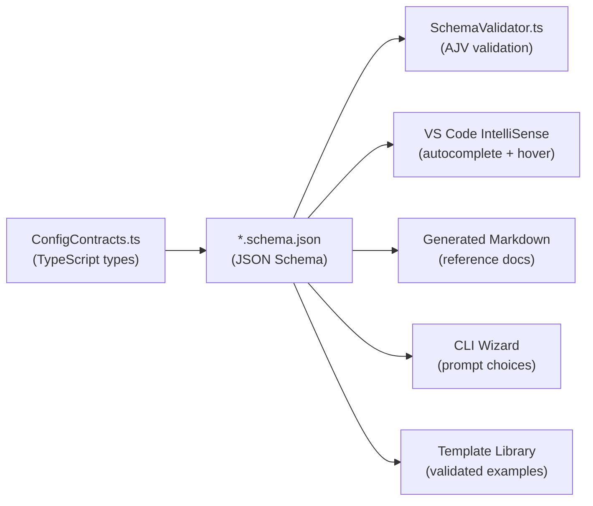

# K6-PerfFramework — Schema-Driven DX Strategy

> **Purpose:** Transform the framework from "powerful but opaque" to "powerful and self-discoverable" through schema-driven architecture, IDE integration, guided templates, and progressive disclosure.

---

## Executive Summary

Your framework has **three config surfaces** that need discoverability:

| Config | File | Current Pain |
|--------|------|-------------|
| **Test Plan** | `config/test_plans/*.json` | Users don't know about SLAs, debug settings, hybrid mode, cookie control |
| **Runtime Settings** | `config/runtime_settings/*.json` | 8 top-level sections, ~30 fields — overwhelming |
| **Environment** | `config/environments/*.json` | Simplest, but `serviceUrls` and `custom` are undiscovered |

The core insight: **you already have the schemas** in `SchemaValidator.ts` (AJV inline schemas) and the TypeScript types in `ConfigContracts.ts` + `TestPlanSchema.ts`. The problem is that these schemas are **trapped inside code** and never reach the user's editor.

---

## Phase 1: Immediate Wins (1–2 days)

### 1.1 Extract JSON Schema Files from Existing AJV Schemas

You already have `RUNTIME_SETTINGS_SCHEMA` and `TEST_PLAN_SCHEMA` as JS objects in `SchemaValidator.ts`. Extract them as standalone `.json` files with `description` fields added.

**Create:** `config/schemas/runtime_settings.schema.json`

```json
{
  "$schema": "http://json-schema.org/draft-07/schema#",
  "$id": "https://k6-perf.dev/schemas/runtime_settings.json",
  "title": "K6-PerfFramework Runtime Settings",
  "description": "Controls think time, pacing, HTTP behavior, error handling, reporting, monitoring, and debug mode for all test executions.",
  "type": "object",
  "required": ["thinkTime", "pacing", "http", "errorBehavior"],
  "additionalProperties": false,
  "properties": {
    "thinkTime": {
      "type": "object",
      "description": "Simulates user think time between transaction groups. Applied via sleep(getFrameworkThinkTime()) in scripts.",
      "required": ["mode"],
      "additionalProperties": false,
      "properties": {
        "mode": {
          "type": "string",
          "enum": ["fixed", "random"],
          "description": "fixed = constant delay | random = uniform random in [min, max]",
          "default": "fixed"
        },
        "fixed": {
          "type": "number",
          "minimum": 0,
          "description": "Think time in seconds when mode='fixed'",
          "default": 1
        },
        "min": {
          "type": "number",
          "minimum": 0,
          "description": "Minimum think time in seconds when mode='random'",
          "default": 0.5
        },
        "max": {
          "type": "number",
          "minimum": 0,
          "description": "Maximum think time in seconds when mode='random'",
          "default": 3
        }
      }
    },
    "errorBehavior": {
      "type": "string",
      "enum": ["continue", "stop_iteration", "stop_vu", "abort_test"],
      "description": "continue = log and proceed | stop_iteration = skip remaining actions | stop_vu = terminate this VU | abort_test = halt entire test",
      "default": "continue"
    }
  }
}
```

> [!TIP]
> The `description` fields are the key insight — they become tooltips in VS Code automatically.

### 1.2 Wire Schemas to VS Code via `$schema` Property

Add a `$schema` reference to every config JSON:

```json
{
  "$schema": "../schemas/runtime_settings.schema.json",
  "thinkTime": { "mode": "fixed", "fixed": 1 }
}
```

**Immediate result:** Users get autocomplete dropdowns, hover descriptions, red squiggles on invalid values, and enum suggestions — **zero tooling install required**.

### 1.3 Alternative: Workspace-Level Schema Mapping

Add a `.vscode/settings.json` to the repo so schemas apply even without `$schema` in each file:

```json
{
  "json.schemas": [
    {
      "fileMatch": ["config/runtime_settings/*.json"],
      "url": "./config/schemas/runtime_settings.schema.json"
    },
    {
      "fileMatch": ["config/test_plans/*.json"],
      "url": "./config/schemas/test-plan.schema.json"
    },
    {
      "fileMatch": ["config/environments/*.json"],
      "url": "./config/schemas/environment.schema.json"
    }
  ]
}
```

> [!IMPORTANT]
> This is the **single highest-ROI change** in the entire strategy. One file gives every team member IntelliSense across all configs.

---

## Phase 2: Validation UX (2–3 days)

### 2.1 Actionable Error Messages

**Current behavior** (from AJV):
```
[RuntimeSettings] /errorBehavior: must be equal to one of the allowed values
```

**Target behavior:**
```
[RuntimeSettings] errorBehavior: "stop_test" is not valid.
  Allowed values: continue | stop_iteration | stop_vu | abort_test
  • continue     — Log error, keep running (default)
  • stop_iteration — Skip remaining actions in this iteration
  • stop_vu      — Terminate this virtual user permanently
  • abort_test   — Halt the entire test immediately
  Docs: https://github.com/your-org/k6-perf/wiki/Error-Behavior
```

**Implementation approach:** Post-process AJV errors in `SchemaValidator.runValidation()` — detect `keyword: 'enum'` and inject the descriptions from the schema's `description` field. This is ~30 lines of code.

### 2.2 Missing Field Suggestions

When a user has an incomplete config, the `validate` command should print what's missing AND what's available:

```
[RuntimeSettings] Missing required: "thinkTime"
  
  Available top-level sections:
    thinkTime      — Think time between transactions (required)
    pacing         — Iteration-level rate control (required)
    http           — Timeout, redirects, error throwing (required)
    errorBehavior  — What happens on error (required)
    reporting      — Transaction table, stats columns (optional)
    errors         — Snapshot capture on failure (optional)
    monitoring     — Host CPU/memory tracking (optional)
    debugMode      — Verbose logging (optional)
```

### 2.3 Config Completeness Score

Add a `--verbose` flag to validate that shows config coverage:

```
Config completeness: 62% (5/8 sections configured)
  ✔ thinkTime    ✔ pacing    ✔ http    ✔ errorBehavior    ✔ reporting
  ○ errors (using defaults)
  ○ monitoring (using defaults)  
  ○ debugMode (using default: false)
```

---

## Phase 3: Template Library (3–5 days)

### 3.1 Template Architecture

```
config/templates/
├── test_plans/
│   ├── smoke-test.json              # 1 VU, 1 iteration — sanity check
│   ├── baseline-load.json           # 10 VUs, 2 min — establish baseline
│   ├── ramp-load.json               # 0→50→0 VUs ramping
│   ├── spike-test.json              # Sudden 10x surge
│   ├── soak-test.json               # Low load, long duration (1h+)
│   ├── stress-test.json             # Find breaking point
│   ├── debug-replay.json            # Single VU diff replay
│   ├── ci-pipeline.json             # Fast, SLA-gated, CI-friendly
│   └── multi-journey-weighted.json  # 3+ journeys with weight distribution
├── runtime_settings/
│   ├── aggressive.json              # Fast, no think time, throw on error
│   ├── realistic.json               # Random think time, pacing enabled
│   ├── debug-verbose.json           # All captures on, debug mode
│   └── ci-minimal.json              # Minimal reporting for CI
└── environments/
    ├── local.json
    ├── dev.json
    ├── staging.json
    └── production.json              # Read-only baseUrl, no destructive ops
```

### 3.2 Template Metadata

Each template should include a `_meta` block (stripped at load time):

```json
{
  "_meta": {
    "template": "spike-test",
    "description": "Simulates a sudden traffic surge to test system resilience",
    "difficulty": "intermediate",
    "estimatedDuration": "3m",
    "tags": ["resilience", "capacity", "spike"],
    "prerequisites": ["At least one journey script created"],
    "relatedTemplates": ["stress-test", "baseline-load"]
  },
  "name": "Spike Test — {{APP_NAME}}",
  "environment": "dev",
  "execution_mode": "parallel",
  "global_load_profile": {
    "executor": "ramping-vus",
    "startVUs": 5,
    "stages": [
      { "duration": "30s", "target": 5 },
      { "duration": "10s", "target": 100 },
      { "duration": "1m",  "target": 100 },
      { "duration": "30s", "target": 5 }
    ]
  }
}
```

### 3.3 CLI Template Command

```bash
npm run cli -- new --template spike-test --team my_team
npm run cli -- templates list                    # Show all templates
npm run cli -- templates show spike-test         # Print template with docs
```

---

## Phase 4: Interactive CLI Wizard (3–5 days)

### 4.1 Guided Plan Creation

Enhance `init` or add a `new` command with `inquirer`-style prompts:

```
? What type of test do you want to create?
  ❯ Load Test (ramp up → steady → ramp down)
    Spike Test (sudden traffic surge)
    Soak Test (sustained low load, long duration)
    Stress Test (find breaking point)
    Debug Replay (single VU diff comparison)
    Smoke Test (1 VU sanity check)
    CI Pipeline Test (fast, SLA-gated)

? Target environment: dev
? Peak VU count: 50
? Test duration: 5m
? Enable SLA enforcement? Yes
  ? P95 response time threshold (ms): 3000
  ? Max error rate (%): 5
? Enable debug replay mode? No
? Enable host monitoring? No

✔ Created: config/test_plans/my-load_test.json
✔ Created: config/runtime_settings/my-load-test-runtime.json
```

### 4.2 Progressive Disclosure

The wizard should have two modes:

- **Quick mode** (default): 5 questions → working config
- **Advanced mode** (`--advanced`): All options exposed with explanations

```
? [Advanced] Cookie behavior between iterations:
  ❯ Persist cookies (default — like a real browser session)
    Clear cookies each iteration (isolated sessions)
    
? [Advanced] Error behavior on HTTP failure:
  ❯ continue — Log and keep running
    stop_iteration — Skip remaining actions  
    stop_vu — Terminate this virtual user
    abort_test — Halt everything immediately
```

---

## Phase 5: Documentation Automation (2–3 days)

### 5.1 Schema → Markdown Generator

Build a script that reads each `.schema.json` and generates markdown docs:

```
npm run cli -- docs generate
```

Output: `docs/generated/runtime_settings-reference.md`

```markdown
## Runtime Settings Reference

### thinkTime
Simulates user think time between transaction groups.

| Field | Type | Default | Description |
|-------|------|---------|-------------|
| mode | `"fixed"` \| `"random"` | `"fixed"` | fixed = constant delay, random = uniform |
| fixed | number | 1 | Seconds when mode='fixed' |
| min | number | 0.5 | Min seconds when mode='random' |
| max | number | 3 | Max seconds when mode='random' |
```

### 5.2 Single Source of Truth Chain



> [!IMPORTANT]
> The JSON Schema files become the **single source of truth**. TypeScript types and AJV validation should both be derived from or validated against these schemas. Never let them drift.

---

## Phase 6: Long-Term Evolution Ideas

### 6.1 JSONC Support (JSON with Comments)

Switch config files from `.json` to `.jsonc` (JSON with Comments). VS Code supports JSONC natively. This lets you embed inline documentation:

```jsonc
{
  // Think time simulates user pause between actions
  "thinkTime": {
    "mode": "fixed",  // "fixed" or "random"
    "fixed": 1        // seconds (only used when mode="fixed")
  },
  // What happens when a request fails?
  // Options: continue | stop_iteration | stop_vu | abort_test
  "errorBehavior": "continue"
}
```

**Implementation:** Use `jsonc-parser` (already used by VS Code internally) instead of `JSON.parse()` in `ConfigurationManager` and `TestPlanLoader`. This is a ~10-line change per loader.

### 6.2 Config Layers Visualization

Add a `config inspect` CLI command:

```bash
npm run cli -- config inspect --plan config/test_plans/load_test.json
```

```
Configuration Resolution Chain:
  Layer 1: FRAMEWORK_DEFAULTS (built-in)
  Layer 2: config/runtime_settings/default.json (12 overrides)
  Layer 3: config/environments/dev.json
  Layer 4: .env (2 secrets loaded)
  Layer 5: CLI flags (--debug)

  Final resolved thinkTime:
    mode: "fixed" ← default.json (overrides FRAMEWORK_DEFAULTS)
    fixed: 1      ← default.json
```

### 6.3 Config Diff Between Templates

```bash
npm run cli -- config diff --base templates/ci-minimal.json --compare templates/realistic.json
```

### 6.4 Feature Discovery Command

```bash
npm run cli -- features
```

```
K6 Performance Framework — Feature Discovery

  Execution Models:
    ✔ parallel        Run journeys concurrently with weighted VU distribution
    ✔ sequential      Run journeys one after another with startTime offsets
    ✔ hybrid          Mix parallel and sequential groups

  Lifecycle Phases:
    ✔ initPhase       Run once per VU (login, data setup)
    ✔ actionPhase     Main iteration loop (business flow)
    ✔ endPhase        Cleanup before VU exits (logout)

  Advanced Features:
    ○ SLA enforcement       Set p95/p99/errorRate thresholds per journey or transaction
    ○ Debug replay          Compare recorded vs live HTTP exchanges
    ○ Host monitoring       Track runner CPU/memory during tests
    ○ Correlation engine    Auto-extract dynamic values from responses
    ○ Cookie control        Per-journey cookie persistence settings
    ○ Snapshot capture      Save request/response on assertion failure

  ✔ = configured in your current test plan
  ○ = available but not configured
```

---

## Recommended Implementation Order

| Priority | Phase | Effort | Impact |
|----------|-------|--------|--------|
| **P0** | 1.1–1.3: Extract schemas + VS Code wiring | 1–2 days | 🔥🔥🔥🔥🔥 |
| **P1** | 2.1: Actionable error messages | 1 day | 🔥🔥🔥🔥 |
| **P1** | 6.1: JSONC support | 0.5 day | 🔥🔥🔥🔥 |
| **P2** | 3.1–3.2: Template library (5–6 templates) | 2 days | 🔥🔥🔥 |
| **P2** | 4.1: Basic CLI wizard | 2 days | 🔥🔥🔥 |
| **P3** | 2.2–2.3: Missing field suggestions, completeness | 1 day | 🔥🔥 |
| **P3** | 5.1: Schema → docs generator | 1 day | 🔥🔥 |
| **P4** | 3.3: CLI template command | 1 day | 🔥 |
| **P4** | 6.2–6.4: Config inspect, diff, features | 2 days | 🔥🔥 |

---

## Key Design Principles

1. **Progressive Disclosure** — Show 5 options to beginners, 30 to experts. Never both at once.
2. **Schema as Source of Truth** — Types, validation, IDE, docs, and CLI all derive from the same schemas.
3. **Defaults Over Configuration** — Every field should have a sensible default. A valid config should be 5 lines, not 40.
4. **Show, Don't Tell** — Templates teach by example. Descriptions teach inline. Never require external doc reads.
5. **Fail Helpfully** — Every error message should include: what's wrong, what's allowed, and what's recommended.

---

## Challenging Your Assumptions

### ⚠️ Don't over-invest in CLI wizards early
Interactive CLI wizards are high effort and low reuse. The VS Code schema integration gives 80% of the benefit at 10% of the cost. Prioritize schemas first.

### ⚠️ Templates > wizards for enterprise adoption
Enterprise teams copy templates and modify them. They rarely use interactive wizards in CI/CD pipelines. Build a rich template library before building wizards.

### ⚠️ JSONC is better than YAML
YAML is tempting for comments, but introduces whitespace bugs and a new parser. JSONC keeps JSON tooling compatibility while adding comments. VS Code, TypeScript, and many tools support it natively.

### ⚠️ Don't auto-generate schemas from TypeScript
TypeScript → JSON Schema generators (like `ts-json-schema-generator`) produce technically correct but **terrible** descriptions. Hand-write the schemas with rich descriptions — this is where the UX lives. Use TypeScript types as a cross-check, not a generator input.
