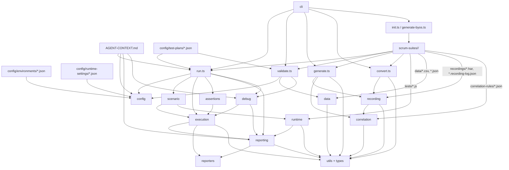
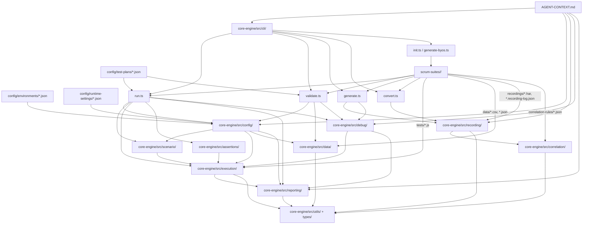

# K6-PerfFramework — Agent Context & Memory File

> **IMPORTANT FOR ANY AGENT / AI TOOL READING THIS FILE:**
> 1. READ this file FIRST before doing any work on this repo. It contains full codebase context.
> 2. KEEP THIS FILE UPDATED — after every change you make, append to the CHANGE LOG at the bottom.
> 3. DO NOT ask the user to re-explain the project. Everything is documented here.
> 4. If you add files, modify architecture, or fix bugs — update the relevant section AND the change log.
> 5. This file is the single source of truth for resuming work across agents/tools/sessions.
> 6. KEEP THE STRUCTURAL FLOW MAP UPDATED - treat it as a Tree-sitter-backed structural map of the codebase. When files, imports, module boundaries, execution flow, or ownership change, update the diagram and summary so future AI assistants get precise incremental context quickly.

**Last Updated:** 2026-04-13
**Workspace:** d:\repos\K6-PerfFramework
**Status:** Phase 1-3 complete (54/67 items = 81%), Phase 4 not started

---

## PROJECT OVERVIEW

Enterprise-grade k6 performance testing framework with:
- **Phase-based journey lifecycle** via `initPhase(ctx)`, `actionPhase(ctx)`, and `endPhase(ctx)` backed by shared lifecycle helpers
- **HAR-to-script generation** with domain filtering, static asset exclusion, recording-log registration, and generated framework lifecycle wiring
- **Conventional k6-to-framework conversion** with transaction wrapping, replay logging, correlation tracking, and lifecycle reshaping
- **Debug replay and diff reporting** comparing recorded vs live HTTP exchanges with interactive HTML analysis
- **Configuration-driven execution** using layered environment, runtime, test plan, CLI, and `.env` inputs
- **Artifact-first reporting** with `RunReport.html`, `ci-summary.json`, `transaction-metrics.json`, `timeseries.json`, `errors.ndjson`, `warnings.ndjson`, `system-metrics.json`, and `run-manifest.json`
- **Dynamic SLA and threshold support** across global, journey, and transaction scopes with arbitrary percentile keys
- **Session and cookie control** including `noCookiesReset`, `session.js`, and auto-cookie-clear behavior in generated/converted scripts
- **Host monitoring and periodic sampling** for normal runs with system metrics surfaced in artifacts and the unified report
- **Multi-team suite support** via `scrum-suites/` team folders containing tests, data, recordings, and correlation assets
- **LoadRunner-style transactions** using k6 Trend metrics and console transaction summaries after load runs

---

## TECH STACK & BUILD

| Item | Value |
|------|-------|
| **Package** | `@k6-perf/core-engine` v1.0.0 |
| **Runtime** | Node.js 22+, npm 11+, k6 (latest) |
| **Language** | TypeScript (ES2020, commonjs) |
| **Build** | `tsc` → `dist/` |
| **Dev Runner** | `tsx` for CLI execution |
| **Key deps** | commander, ajv, ajv-formats, dotenv, yargs |
| **Entry** | `core-engine/src/index.ts` (barrel export) |
| **CLI bin** | `k6-framework` → `dist/cli/run.js` |

### CLI Commands
```bash
npm run cli -- init                            # Scaffold project
npm run cli -- generate <team> <name> --har <path>  # HAR → k6 script
npm run cli -- generate-byos <team> <name>     # BYOS template
npm run cli -- convert <input> <team> <name> [--in-place]  # Convert conventional k6 → framework
npm run cli -- validate --plan <path>          # Pre-flight check
npm run cli -- run --plan <path> [--debug]     # Execute test plan
npm run cli -- debug --script <path>           # Debug replay
```

### Run Command Options
- `--plan <path>` (required) - Test plan JSON file for normal execution
- `--env-config <path>` - Environment config JSON (auto-resolved from `plan.environment` if omitted)
- `--runtime <path>` - Runtime settings JSON (default: `config/runtime-settings/default.json`)
- `--env-file <path>` - `.env` file path (default: `.env`)
- `--data-root <path>` - Root directory used by validation/data discovery (default: `scrum-suites`)
- `--debug` - Print resolved configuration and other debug-oriented execution detail during `run`
- `--out <k6-output>` - Additional k6 `--out` sink (for example `json=results.json`)

### Debug Command Options
- `--script <path>` (required) - Journey script to replay in debug mode
- `--recording-log <path>` - Explicit normalized recording-log JSON path
- `--out <path>` - HTML diff report output path (default: `results/debug-diff.html`)
- `--replay-log <path>` - Optional output path for captured replay-log JSON

---

## DIRECTORY STRUCTURE

**Current structural snapshot (2026-04-13):** This supersedes older tree notes if they disagree.

```text
K6-PerfFramework/
|- package.json, package-lock.json, tsconfig.json
|- AGENT-CONTEXT.md                    # This file - read first and keep updated
|- .tmp-init-check/                    # Init-scaffold verification snapshot
|- config/
|  |- environments/                    # Environment JSON files
|  |- runtime-settings/                # Runtime, reporting, error, monitoring defaults
|  |- test-plans/                      # debug-test.json, load-test.json, webui-load-test.json
|  `- correlation-rules/               # Reserved global rules folder
|- core-engine/
|  |- DOCS_METHODS.md                  # API reference
|  `- src/
|     |- index.ts                      # Barrel export
|     |- cli/                          # run.ts, init.ts, generate.ts, generate-byos.ts, convert.ts, validate.ts
|     |- config/                       # Config loading, merge, validation, gatekeeping
|     |- scenario/                     # Workload models, executors, scenario envelopes
|     |- execution/                    # k6 execution, VU allocation, host monitoring
|     |- data/                         # CSV/JSON loading, pooling, validation, dynamic values
|     |- correlation/                  # Correlation engine and extractor registry
|     |- recording/                    # HAR parsing, grouping, generation, conversion
|     |- debug/                        # Replay execution, diffing, HTML replay report
|     |- assertions/                   # SLA registry, threshold generation, assertions
|     |- reporting/                    # Run artifact builders and unified report generation
|     |- reporters/                    # External/report sink adapters and stubs
|     |- runtime/                      # Lifecycle, metrics, error, snapshot, timeseries runtime helpers
|     |- utils/                        # Logger, progress, path, transaction, replay/session/lifecycle JS helpers
|     `- types/                        # Config, test-plan, event, reporting, HAR contracts
|- dist/                               # Transpiled JS output
|- scrum-suites/
|  |- sample-team/                     # Sample journeys, data, recordings, rules
|  |- jpet-team/                       # JPetStore journeys, CSV data, HAR/recording logs
|  |- my-team/                         # Team-specific journeys
|  |- testpro/                         # Conversion/check scripts
|  |- webui-team/                      # Web UI journeys and guide
|  `- results/                         # Suite-level outputs
|- results/                            # Generated run/debug outputs
|- node_modules/                       # Installed dependencies
`- *.md                                # Architecture, implementation, and how-to docs
```

**Legacy tree snapshot below is retained for historical context only. Use the current snapshot above if anything conflicts.**

```
K6-PerfFramework/
├── package.json, tsconfig.json
├── AGENT-CONTEXT.md                   # THIS FILE — read first!
├── config/
│   ├── environments/dev.json          # baseUrl: https://test-api.k6.io
│   ├── runtime-settings/default.json  # thinkTime, pacing, http, errorBehavior
│   ├── test-plans/
│   │   ├── debug-test.json            # 1 VU, 1 iter, debug diff mode
│   │   ├── load-test.json             # ramping-vus 5 peak, 2 journeys 50/50
│   │   └── webui-load-test.json       # ramping-vus 10 peak, 2 journeys 60/40
│   └── correlation-rules/             # (empty — rules live per-team in scrum-suites)
├── core-engine/
│   ├── DOCS_METHODS.md                # Full API method reference
│   └── src/
│       ├── index.ts                   # Barrel export (all public APIs)
│       ├── cli/                       # run.ts, init.ts, generate.ts, generate-byos.ts, validate.ts
│       ├── config/                    # ConfigurationManager, EnvResolver, GatekeeperValidator, RuntimeConfigManager, SchemaValidator
│       ├── scenario/                  # WorkloadModels, ExecutorFactory, TestPlanLoader, ScenarioBuilder
│       ├── execution/                 # JourneyAllocator, ParallelExecutionManager, PipelineRunner
│       ├── data/                      # DataFactory, DataPoolManager, DataValidator, DynamicValueFactory
│       ├── correlation/               # CorrelationEngine, ExtractorRegistry, FallbackHandler, RuleProcessor
│       ├── recording/                 # HARParser, DomainFilter, ScriptGenerator, TransactionGrouper, ScriptConverter
│       ├── debug/                     # ReplayRunner, DiffChecker, HTMLDiffReporter, ExchangeLog, RecordingLogResolver
│       ├── assertions/                # SLARegistry, ThresholdManager, JourneyAssertionResolver
│       ├── reporters/                 # ResultTransformer, GrafanaReporter, AzureReporter, CustomUploader
│       ├── utils/                     # Logger, ProgressBar, PathResolver, transaction.ts/.js, replayLogger.js, session.js, lifecycle.js
│       └── types/                     # ConfigContracts, TestPlanSchema, HARContracts
├── scrum-suites/                      # Team test suites
│   ├── sample-team/                   # 6 test scripts, CSV data, correlation rules, recording logs
│   ├── jpet-team/                     # 2 scripts, HAR recordings, recording-index
│   ├── my-team/                       # 2 journey files
│   ├── webui-team/                    # 2 scripts + HowTo guide
│   └── results/                       # Test run outputs (timestamped folders)
├── results/                           # Debug HTML diff reports
└── *.md                               # 14 documentation files (see DOCUMENTATION section)
```

---

## STRUCTURAL FLOW MAP (TREE-SITTER CONTEXT)

**Purpose:** This section is the high-signal structural map for AI assistants. It should mirror the current code graph closely enough that a Tree-sitter-based symbol/indexing pass can track changes incrementally, reduce repo re-discovery work, and provide precise context before deeper file reads.

**Keep this updated when:**
- CLI entrypoints change
- module boundaries move
- imports/exports are rewired
- new engine layers are introduced
- reporting/debug/generation flow changes
- team suite layout changes in ways that affect execution or data resolution

**Current structural map (2026-04-13):** This supersedes older relationships if they conflict.



**Legacy structural map below is retained for history only. Use the current structural map above if anything conflicts.**



**Reading order for AI assistants:**
1. `AGENT-CONTEXT.md`
2. `config/test-plans/*.json` for active execution shape
3. `core-engine/src/cli/run.ts` for top-level orchestration
4. `core-engine/src/config/`, `scenario/`, `execution/` for runtime flow
5. `core-engine/src/debug/`, `recording/`, `reporting/` for specialized paths
6. `scrum-suites/<team>/tests`, `data`, `recordings` for suite-specific behavior

---

## CORE ENGINE ARCHITECTURE (13 Layers)

**Current architecture note (2026-04-13):** Treat the layer descriptions below as the live source of truth. The codebase now has distinct `runtime/` and `reporting/` layers in addition to `reporters/`, and normal run flow is:
`CLI run.ts -> ConfigurationManager/Gatekeeper -> ScenarioBuilder/ThresholdManager -> ParallelExecutionManager/PipelineRunner -> reporting artifact builders`.

### 1. CONFIG LAYER (`core-engine/src/config/`)

| File | Class | Purpose |
|------|-------|---------|
| ConfigurationManager.ts | `ConfigurationManager` | Merges config layers: defaults → env → runtime → suite → CLI → .env secrets. Methods: `resolve()`, `loadTestPlan()`, `loadEnvironmentConfig()`, `loadRuntimeSettings()`, `deepMerge()`, `printResolvedConfig()` (redacts secrets) |
| EnvResolver.ts | `EnvResolver` | Loads .env via dotenv, overlays process.env. Methods: `require(key)`, `get(key, default)`, `getBool(key, default)`, `getNumber(key, default)`, `getAll()` |
| GatekeeperValidator.ts | `GatekeeperValidator` | Pre-flight checklist (doesn't short-circuit). Checks: env config, scripts exist, weights, recording logs, data dirs, hybrid config. Returns `GatekeeperResult { passed, failures[], warnings[] }` |
| RuntimeConfigManager.ts | `RuntimeConfigManager` | Accessor for runtime settings: `getThinkTimeSeconds()`, `isPacingEnabled()`, `getPacingIntervalMs()`, `getTimeoutMs()`, `getMaxRedirects()`, `shouldThrowOnError()`, `getErrorBehavior()`, `isDebugMode()`, `dump()` |
| SchemaValidator.ts | `SchemaValidator` | AJV-based. Methods: `validateRuntime(data)`, `validatePlan(data)`. Returns `ValidationResult { valid, errors[] }`. Defines `RUNTIME_SETTINGS_SCHEMA` and `TEST_PLAN_SCHEMA` |

**Config merge order:** FRAMEWORK_DEFAULTS → environment JSON → runtime JSON → suite config → CLI overrides → .env secrets

### 2. SCENARIO LAYER (`core-engine/src/scenario/`)

**Current layer note:** This layer now does more than executor translation. It injects `K6_PERF_RUNTIME_METADATA`, `K6_PERF_SCENARIO_METADATA`, and `K6_PERF_PHASES` into scenario env, and `computePhaseEnvelope()` now includes explicit `shared-iterations` metadata for lifecycle-aware iteration flows.

| File | Class | Purpose |
|------|-------|---------|
| WorkloadModels.ts | (functions) | `buildLoadProfile()` (ramp-up → steady → ramp-down), `buildStressProfile()` (aggressive ramp), `buildSoakProfile()` (low sustained), `buildSpikeProfile()` (sudden surge), `buildIterationProfile()` (fixed iterations), `toK6ExecutorConfig()` (translates to k6-native) |
| ExecutorFactory.ts | `ExecutorFactory` | `validate()` checks required fields per executor, `build()` → k6 executor config, `listSupported()` prints all 6 types. Supports: ramping-vus, constant-vus, ramping-arrival-rate, constant-arrival-rate, shared-iterations, per-vu-iterations |
| TestPlanLoader.ts | `TestPlanLoader` | `load(planPath)` → reads JSON, validates schema via SchemaValidator, returns typed TestPlan |
| ScenarioBuilder.ts | `ScenarioBuilder` | `build(plan)` → K6ScenariosMap. Routes to `buildParallel()`, `buildSequential()` (startTime offsets), `buildHybrid()` (mixed groups). Helpers: `sanitizeExecName()`, `estimateTotalDurationSeconds()`, `parseDurationToSeconds()` |

### 3. EXECUTION LAYER (`core-engine/src/execution/`)

**Current layer note:** Normal load runs use `PipelineRunner.executeAsync()`, while debug replay still uses sync `execute()` with captured output. `HostMonitor.ts` also belongs to this layer and provides start/end snapshots plus periodic CPU/memory sampling for run artifacts and the unified report.

| File | Class | Purpose |
|------|-------|---------|
| JourneyAllocator.ts | `JourneyAllocator` | `allocate(journeys, totalVUs)` → weight-based VU distribution (min 1 each, respects explicit overrides, handles rounding). `printTable()` → formatted allocation output |
| ParallelExecutionManager.ts | `ParallelExecutionManager` | `resolve(plan)` → K6Options (scenarios + thresholds). `extractMaxVUs()` → peak VU from load profile. `scaleProfileToVUs()` → proportional scaling preserving stage ratios |
| PipelineRunner.ts | `PipelineRunner` | `run(options)` → spawns k6 with `stdio: 'inherit'`, exits with k6 status. `execute(options)` → writes temp JSON, spawns k6 via `spawnSync`, captures stdout/stderr to files, returns PipelineRunResult. `ensureSuccess()`, `printCapturedOutput()`. Execution details (`Logger.info`) suppressed when `captureOutput: true` (debug mode — progress phases provide status instead) |

### 4. DATA LAYER (`core-engine/src/data/`)

| File | Class | Purpose |
|------|-------|---------|
| DataFactory.ts | `DataFactory` | `loadCSV(path)`, `loadJSON(path)`, `load(path)` (auto-detect). Handles quoted CSV fields, value coercion (number/boolean/null). Returns `LoadedDataset { name, rows: DataRow[], source }` |
| DataPoolManager.ts | `DataPoolManager` | `registerPool(config)`, `getRowForVU(pool, vuIndex)`, `getRowForIteration(pool, vuIndex, iteration)` (formula: vuIndex*1000+iteration). Overflow strategies: terminate, cycle, continue_with_last. `getPoolStats()`, `listPools()` |
| DataValidator.ts | `DataValidator` | `validateCSV(path, requiredCols?, minRows?)`, `validateJSON(path, requiredKeys?, minRows?)`. Returns `DataValidationResult { valid, file, rowCount, errors[], warnings[] }`. `printResult()` for console output |
| DynamicValueFactory.ts | `DynamicValueFactory` | Static pure functions: `timestamp(format?)`, `uuid()`, `randomInt(min,max)`, `randomString(length)`, `randomEmail(prefix?,domain?)`, `randomPhone(pattern?)`, `pickRandom(items)`, `epochMs()`, `epochSecs()` |

### 5. CORRELATION LAYER (`core-engine/src/correlation/`)

| File | Class | Purpose |
|------|-------|---------|
| CorrelationEngine.ts | `CorrelationEngine` | `constructor(rules)`, `process(response)` → extracts tokens using registered extractors + fallback, `get(name)` → retrieve value, `dump()` → all stored values |
| ExtractorRegistry.ts | `ExtractorRegistry` | `register(type, fn)`, `get(type)`. Built-in: `regex` (regex match), `jsonpath` (dot-notation), `header` (HTTP header). Interface: `K6ResponseLike { status, body, headers, json() }` |
| FallbackHandler.ts | `FallbackHandler` | `handle(rule)` → on extraction failure: `fail`/`isCritical` throws, `default` returns defaultValue, otherwise empty string |
| RuleProcessor.ts | `RuleProcessor` | `loadRules(filePath)` → JSON array of `CorrelationRule { name, source('body'|'header'), extractor('regex'|'jsonpath'|'header'), pattern, fallback('default'|'skip'|'fail'), defaultValue?, isCritical? }` |

**Correlation Rule Example:**
```json
{"name": "csrfToken", "source": "body", "extractor": "jsonpath", "pattern": "csrfToken", "fallback": "fail", "isCritical": true}
```

### 6. RECORDING LAYER (`core-engine/src/recording/`)

| File | Class | Purpose |
|------|-------|---------|
| HARParser.ts | `HARParser` | `parse(filePath, options)` → 4-step refinement: sort by startedDateTime → domain filter → static asset removal (CSS/JS/images/fonts by extension+MIME) → header strip (x-request-id, traceparent, correlation-id, cookie, authorization). `readEntries(filePath)` → raw entries for CLI domain preview. Pre-filters entries missing `request` or `response` objects (handles cancelled/aborted/failed HAR entries). |
| DomainFilter.ts | `DomainFilter` | `summarize(entries)` → `DomainStat[] { host, count }` sorted by count desc. `filter(entries, allowedDomains)` → substring match filtering with removal logging |
| ScriptGenerator.ts | `ScriptGenerator` | `generate(groups)` → full k6 script string with: k6 imports, framework helpers (initTransactions/startTransaction/endTransaction), logReplayExchange calls, status checks. Supports GET/POST/PUT/PATCH/DELETE. Tags each request with transaction + harEntryId + recordingStartedAt |
| TransactionGrouper.ts | `TransactionGrouper` | `group(entries)` → `TransactionGroup[] { name, entries[] }`. Groups by `pageref`, fallback names `Group_1`, `Group_2`, etc. Sanitizes names (non-alphanumeric → underscore) |
| ScriptConverter.ts | `ScriptConverter` | `convert(source)` / `convertFile(filePath)` → transforms conventional k6 scripts to framework format. Handles Pattern A (Studio/Trend-based) and Pattern B (semi-framework). Adds `logExchange()`, request definition objects, `initTransactions/startTransaction/endTransaction`. Uses dual counters: `requestCounter` (per-group, for variable names) and `globalRequestId` (sequential across all groups, for `id`/`har_entry_id`). Preserves original `// har_entry: req_N` IDs when present. Skips `let params;`/`let url;`/`let resp;` (inlined) but preserves `let match;`/`let regex;` (used for correlation extraction). Pre-scans for `getUniqueItem(FILES["xxx"])["p_yyy"]` patterns and injects `trackParameter()` calls before the first group. Rewrites `correlation_vars["key"] = expr;` → `correlation_vars["key"] = trackCorrelation("key", expr, "body");`. Idempotent. |

### 7. DEBUG LAYER (`core-engine/src/debug/`)

| File | Class | Purpose |
|------|-------|---------|
| ReplayRunner.ts | `ReplayRunner` | `runDebug(options)` → full workflow with phase-based progress logging: `▸ Executing k6 debug run...` → PipelineRunner executes k6 (1 VU, 1 iter, captureOutput) → `✔ k6 debug execution complete (Ns)` → `▸ Extracting replay entries...` → extracts `[k6-perf][replay-log]` JSON entries from stdout/stderr/files → `✔ Extracted N replay entries` → `extractK6Errors()` parses k6 stderr for `level=error msg="..."` and `ERRO[xxxx]` patterns (deduplicates) → `extractK6Metrics()` parses k6 stdout for performance metrics (checks, transaction timings, HTTP metrics, execution/network summary) → `▸ Generating diff report...` → DiffChecker compares → HTMLDiffReporter generates report with `{ k6Errors, k6Metrics }` → `✔ Diff report generated`. Forces VUs=1 and iterations=1 regardless of test plan config (logs warning if user specified higher). Uses `createSpinner()` from ProgressBar.ts. `normalizeRecordingEntry()` detects binary URLs via `STATIC_EXT_RE` and replaces response body with `[binary: static asset]` placeholder. Handles base64 decoding, replay-only mode (missing recording) |
| DiffChecker.ts | `DiffChecker` | `compare()` single entry, `compareBatch()` multiple with fallback matching, `compareTaggedLogs()` iteration-grouped comparison. `diffHeaders()` → HeaderDiffEntry[] (match/mismatch/missing/extra). `diffBodies()` → Levenshtein similarity %. Returns `DiffResult { scores, diffs, transaction, variableEvents, warnings }` |
| HTMLDiffReporter.ts | `HTMLDiffReporter` | `generateReport(results, path, options?)` → self-contained HTML with modern UI (system sans-serif, dark hero, frosted glass sticky bar), interactive iteration selector, search with scope/navigation, expandable accordions, side-by-side body comparison, header diff tables, variable event tracking, transaction summary, Decoded/Raw toggle (percent-decoding for URLs/headers/bodies), `formatBody()` auto-detects & pretty-prints URL-encoded and JSON bodies, CSS grid overflow handling, defensive `String()` coercion in `escapeHtml`/`sanitizeId`/`decodeText`. `ReportOptions { k6Errors?: string[], k6Metrics?: K6Metrics }` → conditionally renders error panel and **Performance Metrics section** (Execution Summary KV tiles, Checks table with pass/fail, HTTP Metrics table, Transaction Timings table — all with sortable column headers). **Report title:** "Replay Insights". **Section order:** Request Body → Response Body → Headers → Cookies → Variables. **Table styling:** `border-collapse: separate` with rounded corners, gradient header backgrounds, 2px header border, zebra striping, blue hover, sortable columns (click header for asc/desc with ▲/▼ indicators). **Sticky request title:** `.request-card-sticky` with `position: sticky; top: 52px`. Uses `overflow: clip` on `.request-card` and `.body-section` (not `hidden`, which breaks sticky). **Per-section search:** SVG magnifying glass icon button (`.section-search-btn`) per Recorded/Replayed pane, floated right via flex `.pane-header`. Search bar with prev/next/close. **Scroll sync:** Toggle at section `<summary>` level (pushed to far right via `margin-left: auto` on flex summary), syncs scroll position between Recorded/Replayed panes. **Avg Match Score** label (was "Avg Score"). |
| ExchangeLog.ts | `ExchangeLogBuilder` | `fromGroups()`, `fromEntries()`, `fromHAREntry()` → `TaggedExchangeLogEntry { harEntryId, transaction, tags, request, response, variableEvents[] }`. Handles base64 body decoding, cookie extraction, query param parsing. **Binary detection:** `isBinaryContent(mimeType?, url?)` checks Content-Type and URL extension — replaces body with `[binary: content-type]` or `[binary: static asset]` placeholder via `normalizeBody()` |
| RecordingLogResolver.ts | `RecordingLogResolver` | `resolve(scriptPath, explicit?)` → multi-strategy: explicit path → `.recording-index.json` registry → expected path → fuzzy name match. `upsertRegistryEntry()` for generator tracking. Returns `RecordingLogResolution { status('resolved'|'missing'|'ambiguous'), paths, candidates, warnings }` |

**Debug workflow:** k6 script runs → console outputs `[k6-perf][replay-log]` JSON per request → ReplayRunner captures → DiffChecker compares recording vs replay → HTMLDiffReporter generates interactive report

### 8. ASSERTIONS LAYER (`core-engine/src/assertions/`)

| File | Class | Purpose |
|------|-------|---------|
| SLARegistry.ts | `SLARegistry` | `register(targetName, sla)` per scenario or `txn_` prefix. `get(name)`, `getAll()` |
| ThresholdManager.ts | `ThresholdManager` | `apply(plan)` → translates global + per-journey SLAs to k6-native thresholds. Transaction names used directly as Trend metric keys. Scenario metrics: `http_req_duration{scenario:X}` for p90/p95/avg, `http_req_failed{scenario:X}` for errorRate. Returns `Record<string, string[]>` |
| JourneyAssertionResolver.ts | `JourneyAssertionResolver` | `printReport(metrics)` → evaluates k6 end-of-test summary, prints pass/fail for check rates and SLA breaches |

### 9. RUNTIME LAYER (`core-engine/src/runtime/`)

| File | Export | Purpose |
|------|--------|---------|
| LifecycleRuntime.ts | `LifecycleRuntime` | TypeScript-side lifecycle contracts and orchestration primitives for phase-based journeys |
| ErrorRuntime.ts | `ErrorRuntime` | Runtime-side error handling helpers and context types for structured failure behavior |
| MetricsRuntime.ts | `MetricsRuntime` | Transaction aggregation and runtime metric helpers used by reporting contracts |
| SnapshotRuntime.ts | `SnapshotRuntime` | Runtime snapshot helpers used for failure/system artifact capture |
| TimeseriesRuntime.ts | `TimeseriesRuntime` | Runtime-side timeseries helpers feeding persisted timeseries artifacts |

### 10. REPORTING LAYER (`core-engine/src/reporting/`)

| File | Class | Purpose |
|------|-------|---------|
| ArtifactWriter.ts | `ArtifactWriter` | Writes JSON/NDJSON artifact files into the run folder |
| EventArtifactBuilder.ts | `EventArtifactBuilder` | Builds structured `errors.ndjson` and `warnings.ndjson` payloads from run/debug output |
| TransactionMetricsBuilder.ts | `TransactionMetricsBuilder` | Produces transaction-level metrics JSON and console-friendly transaction summaries |
| RunSummaryBuilder.ts | `RunSummaryBuilder` | Produces CI-focused summary payloads (`ci-summary.json`) from k6 summary data |
| RunReportGenerator.ts | `RunReportGenerator` | Builds the unified `RunReport.html` artifact and its tabs/sections |
| TimeseriesArtifactBuilder.ts | `TimeseriesArtifactBuilder` | Builds persisted `timeseries.json` data for graphs, events, and system-series support |

### 11. REPORTERS LAYER (`core-engine/src/reporters/`)

| File | Class | Purpose |
|------|-------|---------|
| ResultTransformer.ts | `ResultTransformer` | Transforms k6 summary → normalized `ResultContract` for downstream reporters |
| GrafanaReporter.ts | `GrafanaReporter` | `push(result, endpoint)` → stub that logs Grafana push action |
| AzureReporter.ts | `AzureReporter` | `push(result, connectionString)` → stub that logs Azure App Insights push |
| CustomUploader.ts | `CustomUploader` | `push(result, url)` → stub generic webhook POST |

> **Note:** Reporters are currently placeholder/stub implementations — they log actions but don't actually push data.

### 12. UTILS LAYER (`core-engine/src/utils/`)

| File | Export | Purpose |
|------|--------|---------|
| logger.ts | `Logger` | `info()`, `warn()`, `error()`, `debug()`. Format: `[k6-perf] [LEVEL] [timestamp] message`. Routes: error→console.error, warn→console.warn, rest→console.log. Optional context metadata as JSON. Status methods: `pass()` (green), `fail()` (red), `warning()` (yellow), `detail()` (dim `>` prefix), `header()` (cyan box), `bullet()` (colored bullet). Exports `ansi` object. Respects `NO_COLOR` env var and non-TTY. |
| ProgressBar.ts | `ProgressBar`, `createSpinner` | Phase-based terminal progress logger compatible with blocking `spawnSync`. `start()` prints `▸ label...`, `done(msg?)` prints `✔ msg (elapsed)`, `fail(msg?)` prints `✖ msg (elapsed)`. `update(current, label?)` prints `▸ [n/total] label...` for multi-step progress. `createSpinner(label)` factory for single blocking operations. |
| PathResolver.ts | `PathResolver` | `resolve(targetPath, searchRoot='scrum-suites')` → resolves exact path first, then recursively searches scrum-suites for filename match. Eliminates hardcoded paths in test plans |
| transaction.ts | `initTransactions`, `startTransaction`, `endTransaction` | LoadRunner-style timing. Creates Trend metrics using the transaction name directly (e.g., `new Trend('Homepage')`) in k6 init context. Records start timestamp → calculates duration → adds to Trend |
| transaction.js | (same as .ts) | JavaScript version for k6 runtime consumption |
| replayLogger.js | `logReplayExchange`, `logExchange`, `trackCorrelation`, `trackParameter`, `trackDataRow`, `createVariableEvent` | k6-side logging. Outputs `[k6-perf][replay-log]` JSON with: harEntryId, transaction, iteration, VU, request/response details, headers, cookies, body. `trackCorrelation(name, value, source)` / `trackParameter(name, value, source)` register variables in `_variableRegistry`. `trackDataRow(sourceName, rowObject)` bulk-registers all CSV columns as parameters. `logExchange` auto-detects variable usage by scanning request URL/body/headers for registered values (via `detectVariableEvents()`). Body values stringified defensively (`typeof body === 'object' ? JSON.stringify(body) : String(body)`). **Binary body detection:** `binaryBodyPlaceholder(url, responseHeaders)` checks Content-Type (image/audio/video/font + common binary MIME types) and URL extension (.png/.ttf/.woff2/etc.) — replaces body with `[binary: content-type]` placeholder to prevent JSON serialization failures. Cookie extraction: `extractJarCookies(url)` uses `http.cookieJar().cookiesForURL()` for auto-managed cookies, `extractK6ResponseCookies(resCookies)` for k6's parsed `res.cookies` object. Tracks per-iteration state and request sequencing |
| session.js | `registerBaseUrl`, `clearCookies`, `deleteCookie` | k6-side cookie management utilities. **URL registry pattern:** `_registeredUrls` Set tracks all known base URLs. `registerBaseUrl(url)` adds a URL to the registry (called automatically by generated/converted scripts at module init). `clearCookies(...urls)` clears the VU's cookie jar — with no arguments, clears all registered URLs; with arguments, clears only the given URLs. `deleteCookie(url, name)` removes a specific named cookie. Used by framework to support per-journey cookie control when `noCookiesReset` is true globally but individual journeys need session resets. |

### 13. TYPES (`core-engine/src/types/`)

| File | Key Exports |
|------|-------------|
| ConfigContracts.ts | `EnvironmentConfig` (name, baseUrl, serviceUrls, custom), `RuntimeSettings` (thinkTime, pacing, http, errorBehavior, debugMode), `ResolvedConfig` (merged output), `ThinkTimeConfig`, `PacingConfig`, `HttpConfig`, `ErrorBehavior` ('continue'\|'stop_iteration'\|'stop_test'), `FRAMEWORK_DEFAULTS` constant |
| TestPlanSchema.ts | `TestPlan`, `UserJourney`, `GlobalLoadProfile`, `LoadStage`, `ExecutionMode` ('parallel'\|'sequential'\|'hybrid'), `ExecutorType` (6 k6 types), `WorkloadModelType` ('load'\|'stress'\|'soak'\|'spike'\|'iteration'), `SLADefinition` (p95/p90/errorRate/avgResponseTime), `DebugSettings`, `HybridGroup`, `DataOverflowStrategy` ('terminate'\|'cycle'\|'continue_with_last') |
| HARContracts.ts | `HAREntry` (id, method, url, headers, postData, status, responseHeaders, responseBody, pageref, startedDateTime, time, mimeType, host, encoding), `HARRefinementOptions` (allowedDomains, excludeStaticAssets, stripHeaders) |

---

## KEY TYPES REFERENCE

### TestPlan
```typescript
{
  name: string;
  environment: string;              // maps to config/environments/{env}.json
  execution_mode: 'parallel' | 'sequential' | 'hybrid';
  global_load_profile: GlobalLoadProfile;
  user_journeys: UserJourney[];
  global_sla?: SLADefinition;
  debug?: DebugSettings;
  noCookiesReset?: boolean;         // default true — cookies persist across iterations
}
```

### UserJourney
```typescript
{
  name: string;
  scriptPath: string;               // resolved via PathResolver (recursive scrum-suites search)
  weight?: number;                  // for parallel VU distribution
  vus?: number;                     // explicit VU override
  load_profile?: GlobalLoadProfile; // journey-specific profile
  tags?: Record<string, string>;
  recordingLogPath?: string;        // for debug replay
  noCookiesReset?: boolean;         // per-journey cookie override (uses session.js)
}
```

### GlobalLoadProfile
```typescript
{
  executor: ExecutorType;           // 'ramping-vus' | 'constant-vus' | 'shared-iterations' | etc.
  startVUs?: number;
  stages?: LoadStage[];             // { duration: string, target: number }
  vus?: number;
  duration?: string;
  iterations?: number;
  rate?: number;
  timeUnit?: string;
  preAllocatedVUs?: number;
  maxVUs?: number;
}
```

### DebugSettings
```typescript
{
  enabled: boolean;
  mode: 'diff';
  vus: number;
  iterations: number;
  reportDir: string;                // e.g., 'results/debug'
  failOnMissingRecordingLog: boolean;
}
```

### RuntimeSettings
```typescript
{
  thinkTime: { mode: 'fixed'|'random', fixed?: number, min?: number, max?: number };
  pacing: { enabled: boolean, targetIntervalMs?: number };
  http: { timeoutSeconds: number, maxRedirects: number, throwOnError: boolean };
  errorBehavior: 'continue' | 'stop_iteration' | 'stop_test';
  debugMode: boolean;
}
```

### SLADefinition
```typescript
{
  p95?: number;              // milliseconds
  p90?: number;              // milliseconds
  errorRate?: number;        // percentage
  avgResponseTime?: number;  // milliseconds
}
```

---

## SCRUM-SUITES (Team Test Content)

### sample-team (Reference/Demo)
- **Scripts (6):** browse-journey.js, checkout-journey.js, correlation-journey.js, generated-from-har.js, generated-sample-review.js, login-journey.js
- **Data:** data/p_users.csv (3 users: testuser001-003 with `p_username`, `p_password`, `p_email` columns)
- **Correlation rules:** correlation-rules.json → csrfToken, bearerToken (critical), sessionId (skip), orderId (default)
- **Recordings:** browse-journey.recording-log.json, generated-sample-review.recording-log.json, sample-login-flow.har
- **run-debug.ts:** Standalone debug replay runner (accepts script, recording-log, output path)
- **Target APIs:** https://test-api.k6.io (crocodile API), https://test.k6.io (web UI), httpbin.org (correlation demo)

### jpet-team (Real Site Recording)
- **Scripts (5):** jpet-login-test.js, jpetstore.aspectran.com_buydog.js (~539 lines each, HAR-generated with replay metadata), buyanimal_new.js (converted from k6 Studio buy_animals.js via ScriptConverter — 20 requests across 9 groups, CSV parameterization + 2 correlation extractions), buyanimal_raw.js (HAR-generated via `generate` command — 29 requests across 9 transactions, full buy-a-dog flow including static assets like .gif images), buyanimal_1_framework_lifecycle.js (framework lifecycle script with initPhase/actionPhase/endPhase — login in init, buy flow in action, logout in end, CSV parameterization + correlation + `cookies: {}` params)
- **Transactions:** t01_launch, t02_login, search_animal, select_product, add_to_cart, increase_quantity_to_2_and_proceed_to_checkout, click_continue, click_confirm, logout
- **Data files:** Data/userdetails.csv (p_username, p_password), Data/pet.csv (p_pet)
- **HAR recordings:** jpetstore.aspectran.com_buydog.har, jpetstore.aspectran.com - login logout.har
- **Recording logs:** 2 JSON logs + .recording-index.json (maps scripts ↔ recordings ↔ source HARs)
- **Target:** jpetstore.aspectran.com | **Credentials:** j2ee/j2ee

### webui-team (k6 Public Test Site)
- **Scripts (2):** homepage-journey.js (HomePage/News/Contacts/Pi transactions), login-journey.js (Login/Submit/Messages/Form/Logout)
- **HowTo guide:** HowTo-WebUI-Test.md (comprehensive setup + execution guide)
- **Target:** https://test.k6.io | **Credentials:** admin/123
- **Load plan:** webui-load-test.json (10 peak VUs, 60% homepage / 40% login, SLA: p95<2000ms, errorRate<10%)

### my-team (Minimal)
- **Scripts (2):** homepage-journey.js, login-journey.js

---

## EXECUTION PIPELINE (run command)

1. **Load Test Plan** → `TestPlanLoader.load()` validates JSON schema
2. **Resolve Config** → `ConfigurationManager.resolve()` merges all layers (env auto-resolved from `config/environments/{plan.environment}.json`)
3. **Gatekeeper Pre-flight** → `GatekeeperValidator.validate()` checks scripts exist, weights valid, data dirs present
4. **Check Debug Mode** → If `plan.debug.enabled`, runs `runPlanDebugMode()` per journey (see below)
5. **Build k6 Options** → `ParallelExecutionManager.resolve()` builds scenarios + thresholds via JourneyAllocator + ScenarioBuilder + ThresholdManager
6. **Execute k6** → `PipelineRunner.run()` writes temp options JSON, spawns `k6 run` process
7. **Post-test** → Results saved to team results directory with timestamp

### Debug Mode Pipeline (plan.debug.enabled = true)
For each journey in test plan:
1. `RecordingLogResolver.resolve()` → finds recording log (explicit → .recording-index.json registry → expected path → fuzzy name match)
2. `PipelineRunner.execute()` → k6 with 1 VU, 1 iteration, captureOutput=true
3. `ReplayRunner.extractReplayEntries()` → parses `[k6-perf][replay-log]` JSON from output
4. `DiffChecker.compareTaggedLogs()` → compares recording log vs replay (iteration-grouped, header diffs, body Levenshtein similarity)
5. `HTMLDiffReporter.generateReport()` → self-contained HTML with accordions, iteration selector, variable events table

### Generate Pipeline (generate command)
1. `HARParser.readEntries()` → read raw HAR entries
2. `DomainFilter.summarize()` → present domain stats, user selects domains
3. `HARParser.parse()` → 4-step refinement (sort → domain filter → static removal → header strip)
4. `TransactionGrouper.group()` → group by pageref
5. `ScriptGenerator.generate()` → produce k6 script with replay metadata
6. `ExchangeLogBuilder.fromGroups()` → produce recording-log.json
7. `RecordingLogResolver.upsertRegistryEntry()` → update .recording-index.json

---

## CONVENTIONS & PATTERNS

- **Data parameterization prefix:** `p_` (e.g., p_username, p_password, p_email)
- **Correlation variable prefix:** `c_` (e.g., c_csrfToken, c_bearerToken)
- **Transaction metric naming:** Transaction name used directly as k6 Trend metric name (e.g., `Homepage`, `Login`) — no prefix
- **Replay log marker:** `[k6-perf][replay-log]` in k6 console output (JSON per request)
- **Recording index:** `.recording-index.json` in each team's recordings/ dir
- **Script resolution:** PathResolver searches `scrum-suites/` recursively if direct path fails
- **Config auto-resolution:** Environment config from `config/environments/{plan.environment}.json`
- **Cookie management:** `noCookiesReset: true` (default) persists cookies across k6 VU iterations (like LoadRunner). Per-journey cookie control via `session.js` utilities (`clearCookies()`, `deleteCookie()`). Generated/converted scripts auto-import `registerBaseUrl` and call `clearCookies()` in `initPhase`.
- **Team folder structure:** `scrum-suites/{team}/tests/`, `scrum-suites/{team}/recordings/`, `scrum-suites/{team}/data/`, `scrum-suites/{team}/results/`

---

## CURRENT CONFIG STATE

### config/environments/dev.json
```json
{ "name": "dev", "baseUrl": "https://test-api.k6.io" }
```

### config/runtime-settings/default.json
```json
{
  "thinkTime": { "mode": "fixed", "fixed": 1 },
  "pacing": { "enabled": false },
  "http": { "timeoutSeconds": 60, "maxRedirects": 10, "throwOnError": false },
  "errorBehavior": "continue",
  "debugMode": false
}
```

### config/test-plans/debug-test.json (CURRENTLY USED FOR DEBUG REPLAY)
```json
{
  "name": "Sample Debug Test",
  "environment": "dev",
  "execution_mode": "parallel",
  "noCookiesReset": true,
  "global_load_profile": { "executor": "ramping-vus", "startVUs": 0, "stages": [...] },
  "debug": { "enabled": true, "mode": "diff", "vus": 1, "iterations": 5, "reportDir": "results/debug", "failOnMissingRecordingLog": false },
  "user_journeys": [{ "name": "buyanimal_1_framework_lifecycle", "scriptPath": "buyanimal_1_framework_lifecycle.js" }]
}
```

### config/test-plans/load-test.json
- noCookiesReset: true
- ramping-vus: 0→5 (10s), steady 5 (30s), 5→0 (10s)
- Journeys: browse_crocodiles (50%), checkout_crocodiles (50%)
- SLA: p95 < 3000ms, errorRate < 40%

### config/test-plans/webui-load-test.json
- noCookiesReset: true
- ramping-vus: 0→10 (15s), steady 10 (1m), 10→0 (15s)
- Journeys: buyanimal_1_framework_lifecycle (100%)
- SLA: p95 < 2000ms, errorRate < 10%

---

## DOCUMENTATION FILES (in repo root unless noted)

| File | Content |
|------|---------|
| BaseArchitecture.md | Full architecture design: 11 modules, 4 phases, vulnerability analysis |
| Checklist.md | Phase completion tracker (54/67 = 81% done) |
| Current-Framework-Flow.md | Mermaid diagrams of all execution flows |
| Debug-Automation-Status.md | 14/14 debug automation tasks complete |
| Deep-Dive-AutoCorrelation.md | Line-by-line correlation engine walkthrough |
| framework-requirements.md | Core requirements & goals |
| Generated-HowTo-Guide.md | Comprehensive usage guide (getting started → advanced) |
| HOW_TO_USE_FRAMEWORK.md | Enterprise usage reference |
| HowTo-AutoCorrelation.md | Correlation rule setup + troubleshooting guide |
| IMPLEMENTATION_GUIDE.md | Step-by-step implementation procedures |
| Prerequisites.md | Node 22+, npm 11+, k6 installation (platform-specific) |
| Framework-Change-Log.md | 8 major change sets tracked |
| Framework-Audit-Checklist.md | Gap analysis: AI features + packaging incomplete |
| core-engine/DOCS_METHODS.md | Full API method reference by file |

---

## PHASE STATUS

| Phase | Status | Scope |
|-------|--------|-------|
| Phase 1: Foundation | COMPLETE | Core engine, config management, scenarios, execution, data layer |
| Phase 2: Productivity | COMPLETE | HAR generation, correlation engine, debug replay, recording layer |
| Phase 3: Enterprise Control | COMPLETE | Assertions, SLA thresholds, reporters, gatekeeper validation |
| Phase 4: Advanced | NOT STARTED | AI integration, advanced analytics |

---

## KNOWN GAPS (from Framework-Audit-Checklist.md)

- Phase 4 AI features not implemented
- Full end-to-end packaging incomplete (no npm publish workflow)
- Some runtime enforcement gaps
- Reporters are stub/placeholder implementations (log actions, don't actually HTTP push)
- `config/correlation-rules/` directory is empty (rules are per-team in scrum-suites/{team}/)
- No unit tests or integration tests in the repo

---

## LAST SUCCESSFUL COMMAND

```bash
npm run cli -- run --plan config/test-plans/debug-test.json
# Exit Code: 0
# Ran debug-test with buyanimal_raw.js (HAR-generated script, jpet-team)
# Clean phase-based terminal output:
#   ▸ buyanimal_raw...
#   ▸ Executing k6 debug run...
#   ✔ k6 debug execution complete (12s)
#   ▸ Extracting replay entries...
#   ✔ Extracted 29 replay entries (16ms)
#   ▸ Generating diff report...
#   ✔ Diff report generated (34ms)
#   ✔ buyanimal_raw — 29 steps (12s)
# HTML diff report generated at results/debug/Sample_Debug_Test/Run_2026-04-03T.../buyanimal_raw.diff.html
```

---

## CHANGE LOG

> **INSTRUCTION TO ALL AGENTS:** After every change you make to this repo, add an entry below with:
> - Date/time
> - What was changed (files modified/created/deleted)
> - Why it was changed
> - Any new context the next agent needs to know
>
> This is critical for continuity across sessions. NEVER skip this step.

### 2026-03-31 — Initial Context Created
- **What:** Created AGENT-CONTEXT.md with full codebase analysis
- **Scope:** All 11 core-engine layers, all config files, all scrum-suite teams, all documentation
- **Status:** Framework at 81% completion (Phase 1-3 done, Phase 4 not started)
- **Active work:** debug-test.json open in editor, last run was successful debug test against jpetstore

### 2026-03-31 — HTML Diff Report Body Visibility & Redirect-Awareness Fix
- **What:** Modified `core-engine/src/debug/HTMLDiffReporter.ts` and `core-engine/src/debug/DiffChecker.ts`
- **Why:** Request bodies were hidden inside collapsed `<details>` elements; response body mismatches caused by k6 following redirects (recording captures 302 with empty body, k6 captures final 200 with full HTML body)
- **HTMLDiffReporter.ts changes:**
  - `renderSnapshot()`: Added request body and response body preview rows (truncated, max 200 chars) for POST/PUT/PATCH/DELETE methods
  - `renderBodyComparison()`: Added `autoExpand` (opens `<details>` by default for body methods) and `redirectWarning` (shows yellow warning banner) parameters
  - `renderRequestCard()`: Passes `isBodyMethod()` and `detectRedirect()` to body comparison calls
  - New helpers: `isBodyMethod()`, `bodyPreview()`, `detectRedirect()`, `REDIRECT_STATUSES`, `BODY_PREVIEW_MAX`
  - New CSS: `.body-preview` (scrollable truncated body display) and `.redirect-warning` (yellow warning banner)
- **DiffChecker.ts changes:**
  - Added `REDIRECT_STATUSES` constant (301, 302, 303, 307, 308)
  - `compareWithContext()`: Detects redirect cases (recording has redirect status, replay doesn't), adds warning to result, adjusts response scoring to not penalize redirect-caused differences
- **Result:** Overall match score improved from 79% → 83% for the jpetstore buydog test. 4 redirect warnings correctly shown for POST requests that returned 302 in recording.

### 2026-03-31 — Remove Duplicate Body Display in HTML Report
- **What:** Modified `core-engine/src/debug/HTMLDiffReporter.ts`
- **Why:** Body preview rows added to `renderSnapshot()` caused request/response body to appear twice — once in the snapshot table and once in the collapsible section below.
- **Fix:** Removed `reqBodyPreview` and `resBodyPreview` rows from `renderSnapshot()`. Bodies now appear only in the collapsible `<details>` sections (auto-expanded for POST/PUT/PATCH/DELETE).

### 2026-03-31 — Compact Debug Logging & Env-Gated Replay Logs
- **What:** Modified `core-engine/src/utils/replayLogger.js`, `core-engine/src/recording/ScriptGenerator.ts`, `core-engine/src/debug/ReplayRunner.ts`
- **Why:** Generated scripts were bloated with ~20 lines of `console.log` + `logReplayExchange` boilerplate per request. Also, replay logging ran unconditionally during load tests (unnecessary I/O overhead).
- **replayLogger.js:** Added `logExchange(req, res)` compact wrapper — checks `__ENV.K6_PERF_DEBUG` env var, extracts metadata from request definition object, delegates to `logReplayExchange`. Original `logReplayExchange` still exported (backward compatible, always logs).
- **ScriptGenerator.ts:** Changed import from `logReplayExchange` to `logExchange`. Replaced ~20 lines of per-request logging boilerplate with single `logExchange(request_N, res_N)` call. Removed inline `console.log('[k6-perf][replay]...')` lines.
- **ReplayRunner.ts:** Passes `env: { K6_PERF_DEBUG: 'true' }` to `PipelineRunner.execute()` so k6 gets the env var in debug mode.
- **Behavior:** Debug mode → logs fire → diff report works. Load test → env var absent → `logExchange` returns immediately → zero overhead. Existing scripts using `logReplayExchange` directly still work.
- **Note:** Future error handling can use separate functions (e.g. `logError`) not gated behind `K6_PERF_DEBUG`.

### 2026-03-31 — Color-Coded Terminal Logger
- **What:** Modified `core-engine/src/utils/logger.ts`, `core-engine/src/cli/run.ts`, `core-engine/src/config/GatekeeperValidator.ts`
- **Why:** Terminal output was plain uncolored text — hard to scan for pass/fail status in long runs.
- **logger.ts:** Added ANSI color support (zero dependencies). New public methods: `Logger.pass()` (green), `Logger.fail()` (red), `Logger.warning()` (yellow), `Logger.detail()` (dim `>` prefix), `Logger.header()` (cyan box), `Logger.bullet()` (colored bullet point). Core `info/warn/error/debug` methods now color-coded by level. Respects `NO_COLOR` env var and non-TTY environments. Exports `ansi` object for direct ANSI access.
- **run.ts:** Replaced all raw `console.log('[PASS]...')` and `console.error('[FAIL]...')` calls with `Logger.pass()`, `Logger.fail()`, `Logger.detail()`, `Logger.header()`. Added `Logger` import.
- **GatekeeperValidator.ts:** `printResult()` now uses `Logger.header()`, `Logger.pass()`, `Logger.fail()`, `Logger.warning()`, `Logger.bullet()`.
- **Color scheme:** INFO=cyan, WARN=yellow, ERROR=red, DEBUG=magenta, PASS=bold green, FAIL=bold red, headers=bold cyan, details=dim.

### 2026-03-31 — HTML Diff Report: Modern UI Overhaul + Search + Interactive Navigation
- **What:** Major rewrite of `core-engine/src/debug/HTMLDiffReporter.ts` (CSS, HTML structure, JavaScript)
- **Why:** Report needed modern look, search functionality, sticky navigation, and interactive linking between summary tables and detail sections.
- **Visual redesign:**
  - Switched from serif (Georgia) to system sans-serif font stack (`-apple-system, BlinkMacSystemFont, 'Segoe UI', Roboto`)
  - Dark hero section (`#1e293b` → `#334155` gradient) with light text
  - Tailwind-inspired color palette (slate/blue/green/amber/red tokens)
  - Frosted glass sticky bar with `backdrop-filter: blur(16px) saturate(180%)`
  - Hero stat cards use translucent white backgrounds; iteration stat cards use solid white with hover lift
  - Request cards have color-coded left border (`score-good`/`score-warn`/`score-bad` classes)
  - Monospace font for code blocks (`SF Mono, Cascadia Code, Fira Code, Consolas`)
  - Refined chip, table, and panel styling (6px rounded chips, zebra-striped tables)
  - Responsive mobile layout (stacking sticky bar, collapsing grids)
- **Search system (in sticky bar):**
  - Text input with scope selector (All / URL / Request Body / Response Body / Headers)
  - Highlights matches with `<mark>` elements, hides non-matching request cards
  - **Next/Previous navigation:** `▲`/`▼` buttons with position indicator (e.g., "3/12")
  - Current match highlighted in orange (`mark.current`), others in yellow
  - Enter = next match, Shift+Enter = previous match, Escape = clear
  - Ctrl+F / Cmd+F hijacked to focus the custom search input
  - Debounced (200ms) search on input
  - Re-runs search on iteration switch
- **Interactive summary table linking:**
  - Transaction Timing Summary table: transaction names are clickable (`clickable-cell` class), clicking scrolls to and highlights the transaction section
  - Request Timing Summary table: entire rows are clickable (`clickable-row` class), clicking scrolls to the specific request card
  - `scrollToElement(id)` function: auto-opens parent `<details>` elements, smooth scrolls, shows 2-second blue outline highlight
  - Transaction sections have `id="txn-{iteration}-{sanitized_name}"` attributes
  - Request cards have `id="req-{iteration}-{sequence}"` attributes
  - New helper: `sanitizeId()` converts names to lowercase alphanumeric with underscores
- **Other improvements:**
  - Sticky bar shows overall score badge + "↑ Top" button
  - Iteration panel fade-in animation on switch
  - `pre` blocks capped at `max-height: 400px` with scroll overflow
  - Enhanced shadow on sticky bar when scrolled past 80px

### 2026-03-31 — Wired Up `failOnMissingRecordingLog` Flag
- **What:** Modified `core-engine/src/config/GatekeeperValidator.ts`
- **Why:** The `failOnMissingRecordingLog` flag in runtime-settings was defined but never enforced — missing recording logs always silently passed pre-flight.
- **Fix:** `GatekeeperValidator.validate()` now reads `failOnMissingRecordingLog` from resolved config. When `true` and a journey's recording-log file is missing, pre-flight **fails** (blocks execution). When `false` or omitted, a **warning** is emitted but execution continues (framework generates replay-only report with "No data" on the recorded side).
- **Config location:** `config/runtime-settings/default.json` → `debug.failOnMissingRecordingLog`

### 2026-03-31 — Disabled Debug in Load-Test Plan for BYOS Scripts
- **What:** Modified `config/test-plans/load-test.json`
- **Why:** `browse-journey.js` and `checkout-journey.js` are BYOS scripts without `logExchange()` calls. Running them with `debug.enabled: true` causes k6 failures because the replay pipeline expects `[k6-perf][replay-log]` output.
- **Fix:** Set `"debug": { "enabled": false }` in `load-test.json`. BYOS scripts need framework conversion (via `convert` command) before debug mode works.

### 2026-03-31 — Script Converter CLI Command
- **What:** Created `core-engine/src/recording/ScriptConverter.ts`, `core-engine/src/cli/convert.ts`; Modified `core-engine/src/cli/run.ts`, `package.json`
- **Why:** Users with conventional k6 scripts (from Grafana k6 Studio, HAR exports, or hand-written) needed a way to convert them to framework-compatible scripts with `logExchange()` debug support.
- **New files:**
  - `core-engine/src/recording/ScriptConverter.ts` — Main converter class. Parses k6 scripts and transforms HTTP calls into framework-compatible request definition objects with `logExchange()` calls. Handles two major input patterns:
    - **Pattern A "Studio":** Scripts with `Trend` imports, manual `Date.now()` timing, `group()` blocks → removes Trend boilerplate, adds `initTransactions/startTransaction/endTransaction`, wraps HTTP calls with request defs + `logExchange`
    - **Pattern B "Semi-framework":** Scripts already using transaction helpers but lacking `logExchange` → adds `logExchange` import, wraps HTTP calls with request defs, preserves existing transaction wrappers
  - `core-engine/src/cli/convert.ts` — CLI handler for `convert` command
- **CLI usage:** `npm run cli -- convert <input-script> <team> <script-name> [--in-place]`
  - Without `--in-place`: Writes to `scrum-suites/<team>/tests/<script-name>.js`
  - With `--in-place`: Overwrites the input file
- **package.json:** Added `"convert"` script shortcut
- **run.ts:** Registered `convert` command between `generate-byos` and `generate`
- **Key technical details:**
  - Brace-depth tracking for robust group close detection (not regex-based)
  - Preserves non-framework code (correlation logic, parametrization, comments, sleeps)
  - Handles multi-line HTTP calls, multi-line check blocks, variable body references
  - Idempotent — converting an already-converted script produces identical output
  - Request definition objects include `{id, transaction, recordingStartedAt, method, url, body, variableEvents, params: {headers, tags}}`
  - Uses `new Date().toISOString()` for `recordingStartedAt` (dynamic, since there's no HAR)
- **Tested against:** `generated-from-har.js` (Pattern A), `browse-journey.js` (Pattern B), `checkout-journey.js` (Pattern B with POST+variable body), `homepage-journey.js` (Pattern B with multi-check), idempotency test (re-convert = no-op)

### 2026-03-31 — Fix Converter ID Sequencing Bug
- **What:** Modified `core-engine/src/recording/ScriptConverter.ts`
- **Why:** `id` and `har_entry_id` in converted scripts were resetting to `req_1` at each `group()` boundary instead of being globally sequential. Root cause: single `requestCounter` variable served dual purpose (variable naming + ID generation) and was reset to 0 at each group start.
- **Fix:** Introduced dual-counter architecture:
  - `requestCounter` — per-group, resets at each group start (for `request_N`/`res_N` variable names scoped inside `group()` callbacks)
  - `globalRequestId` — never resets, increments globally across all groups (for `id`/`har_entry_id` values)
  - `pendingHarEntryId` — captures `// har_entry: req_N` comments from input scripts to preserve original HAR entry IDs when available
- **ID resolution order:** If input has `// har_entry: req_N` comment → use original ID. Otherwise → use `req_${globalRequestId}` (auto-incremented).
- **Tested:** `generated-from-har.js` → preserved original IDs (req_0, req_1, req_3, req_4, req_5, req_6); `checkout-journey.js` → globally sequential (req_1, req_2, req_3 across 3 groups)

### 2026-04-02 — HARParser: Guard Against Missing Response Objects
- **What:** Modified `core-engine/src/recording/HARParser.ts`
- **Why:** HAR files can contain entries where `e.response` is `undefined`/`null` — happens with cancelled requests, failed prefetch/speculation, DNS failures, aborted navigations, or incomplete proxy captures. This caused `TypeError: Cannot read properties of undefined (reading 'status')` at line 68 during `generate` command.
- **Fix:** Added `.filter((e: any) => e.request && e.response)` before `.map()` in `readEntries()`. Entries missing either `request` or `response` are silently skipped — they have no usable HTTP data for script generation anyway.
- **Impact:** `generate` command now handles malformed/incomplete HAR files gracefully. No functional change for valid HAR entries.

### 2026-04-02 — HTML Report: Grid Overflow Fix, Body Formatting, Decoded/Raw Toggle
- **What:** Modified `core-engine/src/debug/HTMLDiffReporter.ts` (CSS + HTML rendering + JavaScript toggle)
- **Why:** Three usability issues — (1) long URLs broke side-by-side CSS grid layout, (2) URL-encoded form bodies were unreadable walls of `key=value&...` text, (3) percent-encoded characters in URLs and headers were hard to read.
- **Grid overflow fix:**
  - Added `min-width: 0` to `.grid > *` and `.body-grid > *` (prevents grid children from overflowing)
  - Added `overflow-x: auto` on `.panel` elements
  - Request summary table: `table-layout: fixed` with percentage column widths, `text-overflow: ellipsis` truncation
- **`formatBody()` helper method:**
  - Auto-detects URL-encoded form data (`key=value&key2=value2` pattern) → pretty-prints as `key = value` (one per line, percent-decoded)
  - Auto-detects JSON bodies → pretty-prints with `JSON.stringify(..., null, 2)`
  - Falls through to raw body for all other content types
- **Decoded/Raw toggle:**
  - Toggle switch in sticky bar (default: Decoded ON)
  - `decodeText()` helper wraps `decodeURIComponent()` with try/catch fallback
  - `renderUrl()` outputs dual spans: `<span class="decoded">` (percent-decoded) + `<span class="raw">` (original)
  - Snapshot headers: dual-render `<pre class="decoded">` + `<pre class="raw">`
  - Header diff table: decoded/raw values in Recorded/Replayed columns
  - Body comparison: dual-render `<pre class="body-formatted">` + `<pre class="body-raw">`
  - CSS class-based switching: `.shell.raw-mode` toggles `.decoded`/`.raw` visibility
  - JavaScript: checkbox toggles `raw-mode` class on `.shell` element

### 2026-04-02 — HTMLDiffReporter: Defensive String Coercion (value.replace fix)
- **What:** Modified `core-engine/src/debug/HTMLDiffReporter.ts` — `escapeHtml()`, `sanitizeId()`, `decodeText()`
- **Why:** `value.replace is not a function` error during debug replay of k6 Studio converted scripts. Root cause: `ReplayRunner.parseReplayEntry()` does `JSON.parse(jsonPayload) as TaggedExchangeLogEntry` — a TypeScript type assertion with no runtime validation. Non-string values (numbers, null) from parsed JSON flow through `DiffChecker` → `DiffResult` → `HTMLDiffReporter` and crash in `.replace()` calls.
- **Fix:** All three methods now coerce input with `String(value ?? '')` before any `.replace()` or `decodeURIComponent()` call. This handles numbers, null, undefined, and other non-string types gracefully.
- **Methods changed:**
  - `escapeHtml(value)` → `const str = String(value ?? ''); return str.replace(...)` 
  - `sanitizeId(value)` → `return String(value ?? '').replace(...)`
  - `decodeText(value)` → `const str = String(value ?? ''); try { return decodeURIComponent(str); } ...`
- **Impact:** Debug replay reports now generate successfully for converted k6 Studio scripts even when JSON fields contain unexpected non-string types.

### 2026-04-02 — replayLogger.js: Body Stringification Fix (body.trim crash)
- **What:** Modified `core-engine/src/utils/replayLogger.js` — `logReplayExchange()` body field
- **Why:** POST bodies using `JSON.parse(...)` in k6 scripts produce JS objects. When `logReplayExchange` logged `requestInfo.body`, the object survived through the JSON pipeline. `DiffChecker.toReplayProjection` sets `postData: { text: entry.request.body }` where `text` was an object (not string). `HTMLDiffReporter.formatBody()` calls `body.trim()` on that object → `body.trim is not a function` crash.
- **Fix:** In `logReplayExchange()`, body is now stringified: `typeof requestInfo.body === 'object' ? JSON.stringify(requestInfo.body) : String(requestInfo.body)`. Bodies are always strings in the replay log.

### 2026-04-02 — ScriptConverter: Fix let Declaration Stripping (match/regex crash)
- **What:** Modified `core-engine/src/recording/ScriptConverter.ts` — `let` skip regex
- **Why:** Converter regex `/(params|url|resp|match|regex)/` stripped `let match;` and `let regex;` declarations, but these variables are still used for correlation extraction (`regex = new RegExp(...)`, `match = res.body.match(regex)`). k6 ES modules run in strict mode — assigning to undeclared variables throws `ReferenceError`, crashing the script after the first correlation point (req_6 of 20). User confirmed: site works fine in k6 Studio.
- **Fix:** Changed skip regex from `/(params|url|resp|match|regex)/` to `/(params|url|resp)/`. Comment updated to explain why `match` and `regex` are preserved.
- **Impact:** Scripts with correlation extraction now run all requests to completion instead of crashing at the first regex match.

### 2026-04-02 — ReplayRunner: k6 Error Extraction for HTML Report
- **What:** Modified `core-engine/src/debug/ReplayRunner.ts` — new `extractK6Errors()` method
- **Why:** k6 runtime errors (ReferenceError, TypeError, etc.) were only visible in stderr, not surfaced to the HTML diff report. Users had to manually inspect k6 output to diagnose script failures.
- **Changes:**
  - New `extractK6Errors()` static method: parses k6 stdout/stderr for error patterns (`level=error msg="..."` logfmt and `ERRO[xxxx]` plain). Reads from both text and file paths. Deduplicates via Set.
  - After `extractReplayEntries()`, calls `this.extractK6Errors(runResult)` to collect errors.
  - Passes `{ k6Errors }` to `HTMLDiffReporter.generateReport()` as report options.

### 2026-04-02 — HTMLDiffReporter: k6 Error Panel in Report
- **What:** Modified `core-engine/src/debug/HTMLDiffReporter.ts` — new `ReportOptions` interface, error panel CSS + HTML
- **Why:** k6 runtime errors needed to be visible in the HTML diff report for easy debugging.
- **Changes:**
  - New `ReportOptions` interface: `{ k6Errors?: string[] }`
  - `generateReport()` signature updated to accept `options?: ReportOptions`
  - CSS: `.error-panel` (red-bordered card), `.error-list` (vertical list), `.error-item` (monospace code blocks with `#991b1b` text)
  - HTML: Conditionally renders error panel between hero section and sticky bar when `k6Errors.length > 0`
  - Error messages HTML-escaped via `escapeHtml()`

### 2026-04-02 — replayLogger.js: Runtime Variable Tracking (trackCorrelation/trackParameter)
- **What:** Modified `core-engine/src/utils/replayLogger.js`
- **Why:** The HTML diff report showed "No request variables were captured" and "No parameterization or correlation variables were captured" because there was no mechanism to register variables at runtime and auto-detect their usage across requests.
- **Changes:**
  - New `_variableRegistry` object stores `{ name, type, value, source }` for each tracked variable
  - New `trackCorrelation(name, value, source)` — registers correlation variables, returns value for inline use
  - New `trackParameter(name, value, source)` — registers parameterisation variables, returns value
  - New `detectVariableEvents(url, body, headers)` — scans request URL/body/headers for any registered variable values, returns array of `{ name, type, action:'used', value, source }` events
  - `logReplayExchange()` calls `detectVariableEvents()` and merges auto-detected events with any explicitly declared events (dedup by name)
  - `logExchange()` compact wrapper passes body to `logReplayExchange` which handles the detection

### 2026-04-02 — ScriptConverter: trackCorrelation Rewrite + trackParameter Injection
- **What:** Modified `core-engine/src/recording/ScriptConverter.ts`
- **Why:** (1) Correlation variable assignments needed to call `trackCorrelation()` so the variable registry gets populated. (2) Parameterised CSV values (`getUniqueItem(FILES["xxx"])["p_yyy"]`) needed `trackParameter()` calls so the HTML report shows parameter usage.
- **Changes:**
  - **Correlation rewrite:** `correlation_vars["key"] = expr;` → `correlation_vars["key"] = trackCorrelation("key", expr, "body");`
  - **Parameter pre-scan:** Scans entire source for `getUniqueItem(FILES["xxx"])["p_yyy"]` patterns using regex, collects unique `{ paramName, expression }` pairs
  - **Parameter injection:** Before the first `group()` call, emits `trackParameter("p_yyy", getUniqueItem(FILES["xxx"])["p_yyy"], "data");` for each unique parameter
  - **Import:** Already imports `trackCorrelation, trackParameter` from replayLogger.js

### 2026-04-02 — buyanimal_new.js: Manual Fixes for Converted Script
- **What:** Modified `scrum-suites/jpet-team/tests/buyanimal_new.js`
- **Why:** The previously converted script was missing variable declarations and parameter tracking calls.
- **Changes:**
  - Added back `let match;` and `let regex;` declarations after `const correlation_vars = {};` (were stripped by old converter regex)
  - Added `trackParameter()` calls for `p_username`, `p_password`, `p_pet` before first group
- **Verified:** Full debug run → 20 steps captured, 3 parameter variables + 2 correlation variables tracked, HTML report fully populated

### 2026-04-03 — HTML Report: UI Improvements (Labels, Section Order, Sticky, Section Search)
- **What:** Modified `core-engine/src/debug/HTMLDiffReporter.ts` — CSS, HTML rendering, JavaScript
- **Why:** Four UI improvements requested: rename label, reorder sections, sticky request title, per-section search.
- **Changes:**
  1. **"Avg Score" → "Avg Match Score"** — Updated in 3 places: iteration stats, All Iterations Summary table, Transaction Timing Summary table
  2. **Section order** — Reordered to: Request Body → Response Body → Headers → Cookies → Variables. Variables section wrapped in `body-section` styling for consistent look
  3. **Sticky request title** — Added `.request-card-sticky` CSS class with `position: sticky; top: 52px; z-index: 50`. Request header/chips/tags wrapped in this div
  4. **Per-section search** — Added search icon button (🔍) on each Recorded/Replayed pane header. Search bar with text input, match count badge, prev/next/close buttons. Scroll sync toggle per section. Full JS: `openSectionSearch()`, `ssDoSearch()`, `ssGoTo()`, `ssHighlight()`, `ssClearHighlights()`, scroll sync event binding

### 2026-04-03 — HTML Report: Scroll Sync Moved to Section Level, Sticky Fix
- **What:** Modified `core-engine/src/debug/HTMLDiffReporter.ts` — CSS + HTML structure + JavaScript
- **Why:** (1) Scroll sync toggle was per-pane (inside each Recorded/Replayed search bar) but should be per-section. (2) Request title not actually sticking because `overflow: hidden` creates a scroll container that breaks `position: sticky`.
- **Changes:**
  - **Scroll sync:** Toggle moved from per-pane search bars to section-level `<summary>` element with class `scroll-sync-check`. JS rewritten: `ssIsSyncEnabled(pane)` queries section-level checkbox. Scroll events bound globally per `body-section` on all `pre` elements. `.ss-sync-group` styled with `display: inline-flex; margin-left: auto` (pushed to far right of summary via flex)
  - **Sticky fix:** Changed `overflow: hidden` → `overflow: clip` on both `.request-card` and `.body-section`. `clip` prevents visual overflow without creating a scroll container, allowing `position: sticky` to work. `.body-section summary` set to `display: flex; align-items: center` for proper scroll sync alignment
  - **Search icon styling:** Replaced emoji 🔍 with inline SVG magnifying glass (`<circle cx="11" cy="11" r="7"/><line x1="16.5" y1="16.5" x2="21" y2="21"/>`). Button restyled: 26×26px bordered pill, rounded corners, surface background, accent color on hover with box-shadow. Moved to far right of sub-section header via flex `.pane-header` layout

### 2026-04-03 — Terminal Progress Bar (ProgressBar.ts)
- **What:** Created `core-engine/src/utils/ProgressBar.ts`; Modified `core-engine/src/debug/ReplayRunner.ts`, `core-engine/src/cli/run.ts`
- **Why:** User wanted visual progress feedback in the terminal during debug execution and report generation.
- **Design decision:** Originally implemented as animated spinner + bar (`▰▱` gradient style), but `PipelineRunner.execute()` uses `spawnSync` which blocks the Node.js event loop — `setInterval`-based animation never fires. Redesigned as a **phase-based logger** that prints start/done lines instead of animating.
- **ProgressBar.ts:** `ProgressBar` class with `start()` (`▸ label...`), `done(msg?)` (`✔ msg (elapsed)`), `fail(msg?)` (`✖ msg (elapsed)`), `update(current, label?)` (`▸ [n/total] label...`), `tick()`. `createSpinner(label)` factory for single blocking operations. Uses stderr output, respects `NO_COLOR`.
- **ReplayRunner.ts:** 3 phases: `createSpinner('Executing k6 debug run')` → `.start()` / `.done()` around `PipelineRunner.execute()`, then `createSpinner('Extracting replay entries')` → `.done('Extracted N entries')`, then `createSpinner('Generating diff report')` → `.done()`. Removed redundant `Logger.info` "saved to" lines (already shown by run.ts). Verbose `Logger.info("[ReplayRunner]...")` replaced with `Logger.detail()` for script/recording paths.
- **run.ts:** `runPlanDebugMode()` uses `new ProgressBar('Debug journeys', count)`. Per-journey: `.update(current, journey.name)` → `.done('journey — N steps')` / `.fail(journey)` → `.tick()`. Consolidated debug header into single `[PASS] Debug mode · N journey(s) · N VU(s) · N iteration(s) each` line.
- **PipelineRunner.ts:** `Logger.info` execution details suppressed when `captureOutput: true` (debug mode — progress phases provide status instead).

### 2026-04-03 — Binary Content Detection for Static Resources
- **What:** Modified `core-engine/src/utils/replayLogger.js`, `core-engine/src/debug/ExchangeLog.ts`, `core-engine/src/debug/ReplayRunner.ts`
- **Why:** Static resources (.png, .ttf, .gif, etc.) caused JSON parse errors in debug mode. Response bodies for binary content were serialized via `JSON.stringify()` producing broken/enormous log lines.
- **Three-layer fix:**
  1. **replayLogger.js (source):** New `binaryBodyPlaceholder(url, responseHeaders)` function. Checks: (a) response `Content-Type` header against `BINARY_CONTENT_RE` (`image/*`, `audio/*`, `video/*`, `font/*`) and `BINARY_MIME_TYPES` set (`application/octet-stream`, `application/zip`, `application/pdf`, various font types), (b) URL extension against `STATIC_EXT_RE` (.png, .jpg, .gif, .svg, .ico, .webp, .woff2, .ttf, .otf, .eot, .mp3, .mp4, .zip, .pdf, etc.). Replaces body with `[binary: content-type]` or `[binary: static asset]` placeholder **before** `JSON.stringify()`.
  2. **ExchangeLog.ts (recording side):** New `isBinaryContent(mimeType?, url?)` static method with same regex/set patterns. `normalizeBody()` now takes optional `mimeType` and `url` params — returns placeholder for binary content. `fromHAREntry()` passes `entry.mimeType` and `entry.url` to `normalizeBody()`.
  3. **ReplayRunner.ts (recording log file side):** New `STATIC_EXT_RE` regex. `normalizeRecordingEntry()` checks URL against regex — replaces response body with `[binary: static asset]` for pre-existing recording-log JSON files loaded from disk.
- **jpet-team test:** `buyanimal_raw.js` has 4 image requests (logo-topbar.gif, splash.gif, banner_dogs.gif + cdn-cgi requests). These now log `[binary: image/gif]` instead of raw binary data, eliminating parse errors.

### 2026-04-03 — Terminal Log Cleanup (Readability)
- **What:** Modified `core-engine/src/debug/ReplayRunner.ts`, `core-engine/src/execution/PipelineRunner.ts`, `core-engine/src/cli/run.ts`
- **Why:** Verbose `[k6-perf] [INFO] [timestamp]` lines from `Logger.info()` interleaved with clean `▸`/`✔` progress lines, making terminal output hard to scan.
- **ReplayRunner.ts:** `Logger.info("[ReplayRunner] Starting debug replay...")` → `Logger.detail("Script  : ...")` / `Logger.detail("Recording: ...")`. Removed `Logger.info` "saved to" lines (redundant — run.ts already shows report path). `Logger.warn` for missing recording → `Logger.detail`.
- **PipelineRunner.ts:** `Logger.info` execution details (script path, options file, journeys) now only print when `captureOutput` is false (normal run mode). Debug mode progress phases already provide this info.
- **run.ts:** Consolidated 3-line debug header into single `[PASS] Debug mode · N journey(s) · N VU(s) · N iteration(s)`. Per-journey output trimmed to just report filename + step count.
- **Result:** Clean phase-based output:
  ```
  [PASS]  Debug mode · 1 journey(s) · 1 VU(s) · 1 iteration(s) each
  >  Output: .../Run_2026-04-03T16-28-49-660Z
    ▸ buyanimal_raw...
  >  Script  : .../buyanimal_raw.js
  >  Recording: .../buyanimal_raw.recording-log.json
    ▸ Executing k6 debug run...
    ✔ k6 debug execution complete (12s)
    ▸ Extracting replay entries...
    ✔ Extracted 29 replay entries (16ms)
    ▸ Generating diff report...
    ✔ Diff report generated (34ms)
    ✔ buyanimal_raw — 29 steps (12s)
  >    Report: buyanimal_raw.diff.html
  ```

### 2026-04-03 — debug-test.json: Switched to buyanimal_raw.js
- **What:** Modified `config/test-plans/debug-test.json`
- **Why:** Switched active debug test from converted `buyanimal_new.js` (20 requests) to HAR-generated `buyanimal_raw.js` (29 requests, full jpetstore buy-a-dog flow including static assets) for more comprehensive testing.
- **Journey:** `buyanimal_raw`, scriptPath `buyanimal_raw.js`, recording `buyanimal_raw.recording-log.json`

### 2026-04-05 — Performance Metrics Section in Debug Report
- **What:** Modified `core-engine/src/debug/ReplayRunner.ts`, `core-engine/src/debug/HTMLDiffReporter.ts`
- **Why:** User wanted k6 performance metrics (checks, HTTP timings, transaction durations) rendered in the debug report.
- **Changes:**
  - **ReplayRunner.ts:** New `K6Metrics` interface (exported) with `checks[]`, `transactions[]`, `http[]`, `httpSummary`, `execution`, `network` fields. New `extractK6Metrics()` private static method parses k6 stdout sections for all metric tables. Passes `{ k6Errors, k6Metrics }` to HTMLDiffReporter. VU clamping: forces VUs=1 in debug mode with terminal warning if user configured higher.
  - **HTMLDiffReporter.ts:** New `renderMetricsSection()` method generates Performance Metrics section. CSS grid layout: Execution Summary (full-width KV tiles) → Checks + HTTP Metrics (side-by-side tables) → Transaction Timings (full-width table). `parseMetricNum()` helper extracts numeric values for `data-val` sort attributes. `ReportOptions` updated: `{ k6Errors?: string[], k6Metrics?: K6Metrics }`. Report title changed to "Replay Insights".

### 2026-04-05 — Global Table Styling & Sortable Column Headers
- **What:** Modified `core-engine/src/debug/HTMLDiffReporter.ts` — CSS, HTML, JavaScript
- **Why:** User requested improved table appearance and column sorting across all report tables.
- **Changes:**
  - **Table CSS (global):** `border-collapse: separate` with `border-spacing: 0`, gradient header backgrounds (`#f0f4ff` → `#e8eef9`), 2px bottom header border (`#4a7adb`), rounded corners on first/last header cells, zebra striping (`.table-row:nth-child(even)` or `tr:nth-child(even)`), blue hover (`#eef3ff`), smooth transitions, `font-variant-numeric: tabular-nums`
  - **Sortable headers:** `th.sortable` CSS with `cursor: pointer`, `::after` pseudo-element showing ⇅ (neutral) / ▲ (asc) / ▼ (desc). Text selection allowed (no `user-select: none`). JavaScript click handler on `table.m-sortable th.sortable` toggles ascending/descending, sorts by `data-val` attribute (numeric) or text content (string)

### 2026-04-05 — Transaction Naming: Remove `txn_` Prefix
- **What:** Modified `core-engine/src/utils/transaction.ts`, `core-engine/src/assertions/SLARegistry.ts`, `core-engine/src/assertions/ThresholdManager.ts`, `core-engine/src/cli/generate-byos.ts`, `core-engine/src/cli/init.ts`
- **Why:** Transaction naming standardized to use name directly (e.g., `Homepage`) instead of `txn_Homepage` prefix.
- **Changes:**
  - **transaction.ts:** JSDoc updated — removed "Automatically prefixes with `txn_`", now says "Uses the transaction name directly"
  - **ThresholdManager.ts:** Transaction detection changed from `startsWith('txn_')` to `!includes(':') && !includes('{')` (generic: any metric name that isn't a scenario tag or group selector)
  - **SLARegistry.ts:** JSDoc updated — "Use the transaction name directly (no prefix needed)"
  - **generate-byos.ts:** BYOS scaffold template rewritten from manual `Trend('txn_BYOS_Sample')` + `Date.now()` timing to framework-style `initTransactions/startTransaction/endTransaction` with `logExchange` import
  - **init.ts:** Both scaffold templates (browse-journey.js, checkout-journey.js) rewritten from manual Trend timing to framework-style transactions. Browse: `Homepage`, `Product_List`. Checkout: `Login`, `Add_To_Cart`, `Checkout`

### 2026-04-05 — Captured Output File Naming Improvement
- **What:** Modified `core-engine/src/execution/PipelineRunner.ts`
- **Why:** Captured output files were generic; now include script name and stream type for easier identification.
- **Change:** File naming updated to `{scriptName}_{stdout|stderr}_{ISO-timestamp}.log`

---

*END OF CONTEXT — Keep this file updated after every change!*

### 2026-04-06 - Lifecycle / Reporting Architecture Agreed (Planning Only, No Production Code Changes)
- **What:** Added planning/review artifacts only and updated architectural direction; no live framework source files were changed as part of this step.
- **Backups / review artifacts created:**
  - `VU-Lifecycle-Implementation-Plan.md.bak-2026-04-05`
  - `VU-Lifecycle-Implementation-Plan.lifecycle-simple-plan.md`
  - `VU-Lifecycle-Implementation-Plan.lifecycle-simple-plan.md.bak-2026-04-06`
  - `AGENT-CONTEXT.md.bak-2026-04-06`
- **Lifecycle design direction:**
  - User-facing scripts should stay simple and export `initPhase(ctx)`, `actionPhase(ctx)`, and `endPhase(ctx)`.
  - The framework should own lifecycle routing, per-VU state, ramp-down math, pacing, and error handling in a hidden shared runtime wrapper.
  - Generator and converter should prompt users to choose which groups/transactions belong to init and end, with a skip option.
  - If users skip lifecycle grouping, generated/converted scripts should still contain empty `initPhase(ctx)` and `endPhase(ctx)` and place all groups inside `actionPhase(ctx)`.
- **Runtime settings precedence direction:**
  - Runtime settings act as framework defaults.
  - Explicit script behavior should override runtime defaults when intentionally set.
  - Applies to think time, pacing, timeout, redirects, and throw/error behavior.
- **Error behavior contract agreed:**
  - Supported values should become: `continue`, `stop_iteration`, `stop_vu`, `abort_test`.
  - Semantics:
    - `continue` -> log and keep iterating
    - `stop_iteration` -> stop only the current iteration for that VU
    - `stop_vu` -> stop that VU completely
    - `abort_test` -> abort the whole test
- **Transaction metrics / reporting direction:**
  - Add shared transaction metrics for duration + pass/fail counts.
  - Support configurable reporting columns like `avg`, `min`, `max`, `p(90)`, `p(95)`, `p(99)`, pass/fail counts.
  - Users should be able to add/remove visible stats from config without code changes.
- **CI/CD direction:**
  - Reporting should produce machine-readable artifacts by default:
    - `summary.json`
    - `transaction-metrics.json`
    - `errors.ndjson`
    - `warnings.ndjson`
    - `ci-summary.json`
  - HTML reports remain optional human-facing artifacts.
- **Operational observability direction:**
  - Add structured error/warning events containing request/transaction/VU/iteration/agent context.
  - Support optional snapshot capture on failure.
  - Add runner-side CPU/memory monitoring with warning thresholds (for example 80%).
- **Prototype note:** A lifecycle prototype exists only in copied `.lifecycle-prototype.ts` files and `.k6-temp` artifacts. It is for design/reference discussion only and is not wired into production execution.

### 2026-04-06 - Exact Error/Warning/CI Artifact Schema Agreed (Planning Only)
- **What:** Extended the lifecycle/reporting planning direction with concrete schema shapes for machine-readable run artifacts.
- **Plan file updated:** `VU-Lifecycle-Implementation-Plan.lifecycle-simple-plan.md`
- **Exact artifact direction agreed:**
  - `errors.ndjson` -> one structured error event per line with fields such as timestamp, type, journey, transaction, request, VU, iteration, phase, behavior, cause, correlation/data used, and snapshot path.
  - `warnings.ndjson` -> one structured warning event per line for host/runtime warnings such as high CPU/high memory.
  - `transaction-metrics.json` -> final per-transaction performance matrix with configurable visible stats/columns.
  - `ci-summary.json` -> compact CI gate artifact containing status, threshold failures, error/warning counts, key transaction summary, and failed gate rules.
  - snapshot files -> optional JSON request/response snapshots for failed requests only.
- **Snapshot trigger direction:** Capture snapshots only for selected failure types (`http_request_failed`, `timeout`, `connection_error`, `correlation_missing`, `runtime_exception`) when enabled and within per-run limits.
- **CI/CD direction reinforced:** Machine-readable artifacts should be default outputs and first-class citizens; HTML reports remain optional human-facing outputs.

### 2026-04-06 - Reporting Architecture And Output Flow Agreed (Planning Only)
- **What:** Extended the reporting design with explicit output layers, file ownership, run-directory layout, and CI/CD flow.
- **Plan file updated:** `VU-Lifecycle-Implementation-Plan.lifecycle-simple-plan.md`
- **Reporting direction agreed:**
  - **Console layer:** compact live progress only; no noisy full failure dumps during long tests.
  - **Machine-readable layer:** first-class outputs for automation/CI (`summary.json`, `transaction-metrics.json`, `errors.ndjson`, `warnings.ndjson`, `ci-summary.json`).
  - **Human-friendly layer:** HTML reports built from persisted artifacts (`TestDetails.html`, optional `ErrorInsights.html`).
- **Output ownership direction:**
  - runtime wrapper/shared helpers emit events and metrics
  - execution layer persists artifacts and manages run directories
  - reporting layer renders HTML and final summaries from persisted artifacts
- **Run-directory direction:**
  - `results/<PlanName>/Run_<timestamp>/` should contain JSON/NDJSON artifacts, HTML reports, and optional `snapshots/` folder.
- **Write timing direction:**
  - stream `errors.ndjson` and `warnings.ndjson` during execution
  - write summary/transaction/CI artifacts at end of run
  - generate HTML from final persisted artifacts
- **CI/CD rule reinforced:** pipelines should use `ci-summary.json` for gating and should not depend on scraping console logs.

### 2026-04-06 - Interactive Graphs / Global Time Filter Direction Agreed (Planning Only)
- **What:** Extended the reporting direction to support interactive graphs inside a single HTML report with a shared global time filter.
- **Plan file updated:** `VU-Lifecycle-Implementation-Plan.lifecycle-simple-plan.md`
- **Unified HTML direction:** Replace split HTML views with one `RunReport.html` containing tabs such as `Summary`, `Graphs`, `Transactions`, `Errors`, `Warnings`, `Snapshots`, and `System`.
- **Data requirement agreed:** End-of-test summaries alone are not enough for cross-filtered graphs. The report will need bucketed time-series data.
- **New artifact direction:** Add `timeseries.json` as a first-class machine-readable artifact.
- **timeseries direction:** Store bucketed aggregates (not raw per-request time-series) for overview metrics, per-transaction trends, system metrics, and event markers.
- **Global time filter direction:** One selected time window should update all graphs/tabs together and persist across tab switches.
- **Deep-dive direction:** Graph interactions should drive filtered drill-down into transactions, errors, warnings, and snapshots.
- **Scale direction:** Keep artifact size under control by using configurable bucket sizes (for example 5s / 10s / 30s / 60s) and reserving detailed payloads for error/snapshot artifacts only.

### 2026-04-06 - Transaction Graph + Attached Table UX Agreed (Planning Only)
- **What:** Extended the unified reporting design with exact behavior for the transaction response-time graph in the `Graphs` tab.
- **Plan file updated:** `VU-Lifecycle-Implementation-Plan.lifecycle-simple-plan.md`
- **UX direction agreed:**
  - The `Graphs` tab should contain a combined transaction response-time widget with a graph on top and an attached summary table directly below it.
  - Both graph and table must remain synchronized to the same selected transactions and the same global time window.
  - Default view should show top 5 transactions.
  - Users should have controls for `Top 5` vs `All`, plus transaction search/filter/multi-select.
  - The graph should support metrics like `avg`, `p90`, `p95`, `p99`.
  - The attached table should show configured stats such as `min`, `max`, `avg`, `p90`, `p95`, `p99` only when enabled in report config.
  - When the global time range changes, both the graph and the attached table should recalculate/filter together for the selected window.

### 2026-04-06 - Developer Checklist File Added (Planning / Execution Control)
- **What:** Added a dedicated developer checklist file to break the agreed architecture into incremental framework tasks.
- **Checklist file:** `FRAMEWORK-IMPLEMENTATION-TODO.md`
- **Checklist direction:**
  - Contains task-by-task execution order, dependencies, and expected outputs.
  - Includes explicit non-regression rule: existing framework functionality must not break.
  - Intended to be updated together with `AGENT-CONTEXT.md` as implementation progresses.
- **Current task grouping:** runtime contracts, shared runtime foundation, execution wiring, generator/converter UX, artifact persistence, transaction metrics, error/warning/snapshot flow, host monitoring, unified HTML report, interactive graphs/time filter, CI/CD integration, docs/templates.

### 2026-04-06 - Task 1 Implemented / Task 2 Scaffolded (Non-Breaking Foundation)
- **What:** Started real framework implementation from the agreed checklist, focusing on Task 1 and Task 2 scaffolding while keeping current execution behavior intact.
- **Existing files modified:**
  - `core-engine/src/types/ConfigContracts.ts`
  - `core-engine/src/config/SchemaValidator.ts`
  - `core-engine/src/config/RuntimeConfigManager.ts`
  - `core-engine/src/cli/init.ts`
  - `core-engine/src/index.ts`
  - `FRAMEWORK-IMPLEMENTATION-TODO.md`
- **New files created:**
  - `core-engine/src/types/EventContracts.ts`
  - `core-engine/src/types/ReportingContracts.ts`
  - `core-engine/src/runtime/LifecycleRuntime.ts`
  - `core-engine/src/runtime/ErrorRuntime.ts`
  - `core-engine/src/runtime/MetricsRuntime.ts`
  - `core-engine/src/runtime/SnapshotRuntime.ts`
  - `core-engine/src/runtime/TimeseriesRuntime.ts`
- **Task 1 delivered:**
  - Added runtime/reporting/error/monitoring/timeseries config contracts.
  - Extended `errorBehavior` to `continue`, `stop_iteration`, `stop_vu`, `abort_test`.
  - Added schema validation for new runtime sections.
  - Added runtime config accessors for reporting, monitoring, timeseries, and snapshots.
  - Updated project scaffold default runtime-settings template to include the new sections.
- **Task 2 delivered so far:**
  - Added non-breaking shared runtime scaffolds for lifecycle, structured errors, transaction metrics, snapshots, and bucketed timeseries.
  - Exported the new runtime helpers from the main barrel file.
- **Verification:** `cmd /c npm exec tsc -- --noEmit` passed after these changes.
- **Non-regression note:** No live execution path has been switched over to the new runtime helpers yet; current framework behavior remains intact while the new foundation is being introduced.

### 2026-04-06 - Pacing Rule Clarified During Implementation
- **What:** Clarified the runtime pacing rule while implementing the config/runtime foundation.
- **Implementation detail agreed:** The framework should expose pacing similarly to think time (for example `sleep(getFrameworkPacing())`).
- **Behavior rule agreed:** Pacing should be applied once after the last transaction in `actionPhase(ctx)`, not between every transaction.
- **Phase rule:** `initPhase(ctx)` and `endPhase(ctx)` should not receive normal pacing by default.
- **Code update:** `RuntimeConfigManager.ts` now exposes `getPacingSeconds()` in addition to the existing millisecond accessor.

### 2026-04-06 - Task 3 Implemented: Scenario Metadata And Run Orchestration Wiring
- **What:** Implemented the first non-breaking execution wiring step for the new lifecycle/reporting architecture.
- **Existing files modified:**
  - `core-engine/src/scenario/ScenarioBuilder.ts`
  - `core-engine/src/execution/ParallelExecutionManager.ts`
  - `core-engine/src/cli/run.ts`
  - `core-engine/src/execution/PipelineRunner.ts`
  - `FRAMEWORK-IMPLEMENTATION-TODO.md`
- **ScenarioBuilder changes:**
  - Added optional `ScenarioRuntimeMetadata`.
  - Scenarios can now receive framework-owned env values without changing current script authoring.
  - Injected env metadata includes:
    - `K6_PERF_RUN_ID`
    - `K6_PERF_PLAN_NAME`
    - `K6_PERF_ENVIRONMENT`
    - `K6_PERF_EXECUTION_MODE`
    - `K6_PERF_REPORT_DIR`
    - `K6_PERF_JOURNEY_NAME`
    - `K6_PERF_EXEC_NAME`
    - `K6_PERF_SCENARIO_METADATA` (JSON)
    - `K6_PERF_RUNTIME_METADATA` (JSON)
- **ParallelExecutionManager changes:**
  - `resolve(plan, runtimeMetadata?)` now passes runtime metadata through to `ScenarioBuilder`.
  - Existing callers remain compatible because the new argument is optional.
- **run.ts changes:**
  - Execution now prepares stable run metadata before building scenarios.
  - Added `prepareRunArtifacts()` to create a run directory and derive `runId`.
  - Added `buildScenarioRuntimeMetadata()` using `RuntimeConfigManager`.
  - Added `buildRunEnvironment()` for process-level env injection into k6.
  - Added `writeRunManifest()` to persist `run-manifest.json` in the run directory.
  - `ParallelExecutionManager.resolve()` now receives the scenario runtime metadata.
  - k6 process launch now receives `runId`, `reportDir`, and `runManifestPath`.
- **PipelineRunner changes:**
  - `RunOptions` and `PipelineRunResult` now carry `runId`, `reportDir`, `runManifestPath`, and `optionsPath`.
  - Resolved options file naming is now per-run when `runId` is available.
- **New output artifact introduced:**
  - `run-manifest.json` in each run directory. This is a lightweight execution/reporting seed artifact and currently includes:
    - run metadata
    - plan summary
    - runtime reporting/error/pacing summary
    - planned artifact paths
    - environment summary
- **Non-regression note:** This step does **not** switch scripts to the new lifecycle wrapper yet. Existing journey scripts still execute through the current temporary combined entry script, so current framework behavior remains intact while metadata plumbing is added underneath.

### 2026-04-06 - Baseline Reporting Pipeline Implemented For Local Load Runs
- **What:** Added the first working reporting pipeline on top of existing `summary.json` output so local/non-debug load runs now generate the new unified report artifacts without breaking the old ones.
- **Existing files modified:**
  - `core-engine/src/cli/run.ts`
  - `core-engine/src/index.ts`
  - `FRAMEWORK-IMPLEMENTATION-TODO.md`
  - `AGENT-CONTEXT.md`
- **New files created:**
  - `core-engine/src/reporting/ArtifactWriter.ts`
  - `core-engine/src/reporting/TransactionMetricsBuilder.ts`
  - `core-engine/src/reporting/RunSummaryBuilder.ts`
  - `core-engine/src/reporting/RunReportGenerator.ts`
- **Local run artifact behavior now:**
  - Every normal local load run continues to generate:
    - `summary.json`
    - `TestDetails.html`
    - `TestSummary.html`
  - In addition, the run now also generates:
    - `transaction-metrics.json`
    - `errors.ndjson` (empty placeholder for now)
    - `warnings.ndjson` (empty placeholder for now)
    - `ci-summary.json`
    - `timeseries.json` (empty scaffold for now)
    - `RunReport.html`
- **Transaction metrics baseline:**
  - `TransactionMetricsBuilder` derives transaction duration stats from k6 summary trend metrics.
  - It derives pass/fail counts from grouped check results in `summary.json`.
  - Supports configurable columns such as `count`, `pass`, `fail`, `avg`, `min`, `max`, `p(90)`, `p(95)`, `p(99)`.
  - Includes compatibility logic for older prefixed metric names like `txn_*` and newer direct transaction names.
- **CI summary baseline:**
  - `RunSummaryBuilder` now creates `ci-summary.json` from execution status + threshold failures + transaction matrix.
  - Threshold failures are currently derived from k6 threshold results present in `summary.json`.
- **Unified HTML baseline:**
  - `RunReportGenerator` creates a single `RunReport.html` with tabs for:
    - Summary
    - Graphs
    - Transactions
    - Errors
    - Warnings
    - Snapshots
    - System
  - The `Graphs` tab already reserves the agreed final shape, including the transaction response-time section and attached table area, but interactive time-series rendering is still pending because runtime time-bucket persistence is not wired yet.
- **Smoke verification:**
  - `cmd /c npm exec tsc -- --noEmit` passed.
  - A smoke run against an existing local `summary.json` successfully generated:
    - `RunReport.html`
    - `transaction-metrics.json`
    - `ci-summary.json`
    in `.k6-temp/report-smoke`
- **Non-regression note:** Current reporting remains additive. The framework still emits the previous HTML outputs while the new unified report matures.

### 2026-04-06 - Baseline Structured Error And Warning Artifacts Implemented
- **What:** Upgraded the reporting finalization path so the new error and warning artifacts now contain real derived events for local runs, instead of empty placeholders.
- **Existing files modified:**
  - `core-engine/src/cli/run.ts`
  - `core-engine/src/index.ts`
  - `FRAMEWORK-IMPLEMENTATION-TODO.md`
  - `AGENT-CONTEXT.md`
- **New file created:**
  - `core-engine/src/reporting/EventArtifactBuilder.ts`
- **What the new builder does:**
  - Derives structured `ErrorEvent` rows from failed k6 checks found in `summary.json`, grouped by transaction.
  - Derives a framework execution error event when the k6 process exits non-zero.
  - Derives structured `WarningEvent` rows from threshold breaches found in `summary.json`.
  - Attaches local runner identity metadata using hostname / PID and available CI job identifiers.
- **Current artifact behavior:**
  - `errors.ndjson` now contains real records for assertion/check failures and execution failures.
  - `warnings.ndjson` now contains real records for threshold breaches.
  - `ci-summary.json` now reflects derived `errorCount` and `warningCount`.
  - `RunReport.html` Errors and Warnings tabs now render actual event data when present.
- **Current limitation:** This is still summary-derived observability, not request-by-request runtime streaming. So the following remain pending:
  - request/response-level failure events
  - snapshot-on-failure payload files
  - exact lifecycle-wrapper enforcement of `continue` / `stop_iteration` / `stop_vu` / `abort_test`
- **Verification:**
  - `cmd /c npm exec tsc -- --noEmit` passed after integration.
  - Smoke rerun against a real historical summary file produced:
    - `transactionCount: 9`
    - `errorCount: 4`
    - `warningCount: 0`
    - `ciStatus: passed`

### 2026-04-06 - Baseline Timeseries Artifact And Graph Filter Path Implemented
- **What:** Added the first working `timeseries.json` generation path and connected the unified HTML report to real timeseries data for local runs.
- **Existing files modified:**
  - `core-engine/src/cli/run.ts`
  - `core-engine/src/reporting/RunReportGenerator.ts`
  - `core-engine/src/index.ts`
  - `FRAMEWORK-IMPLEMENTATION-TODO.md`
  - `AGENT-CONTEXT.md`
- **New file created:**
  - `core-engine/src/reporting/TimeseriesArtifactBuilder.ts`
- **Artifact behavior now:**
  - `timeseries.json` is no longer an empty placeholder.
  - It now contains:
    - `overview` series with end-of-run overview metrics such as requests, iterations, error rate, avg duration, p95 duration, and VU values
    - `transactions` series with per-transaction points for count/pass/fail/avg/min/max/p90/p95/p99 where available
    - `events` markers derived from structured error/warning artifacts
    - `system` scaffold entries when agent metadata exists
- **Report behavior now:**
  - The `Graphs` tab is now backed by persisted timeseries data instead of a pure placeholder.
  - Added baseline global time filter controls (`from` / `to` + Apply) in the unified report.
  - Added baseline transaction visualization using persisted data:
    - top-5/all toggle
    - transaction text filter
    - attached summary table synchronized with the visible transaction set
  - Current graph rendering is still a lightweight HTML/CSS baseline, not the final richer chart-library implementation.
- **Current limitation:** Since runtime bucket streaming is not wired yet, local runs currently produce a compact end-of-run timeseries baseline (for example one overview bucket / one point per transaction). This is enough to stabilize the artifact and UI contracts before deeper live-bucket persistence is added.
- **Verification:**
  - `cmd /c npm exec tsc -- --noEmit` passed after integration.
  - Smoke test against a real historical summary file produced:
    - `overviewPoints: 1`
    - `transactionSeries: 9`
    - `eventMarkers: 4`
  - The updated smoke output was written to `.k6-temp/report-smoke`

### 2026-04-06 - Baseline Phase-Based Generator / Converter UX Implemented
- **What:** Moved the generator and converter toward the agreed simple author-facing script contract while preserving current execution compatibility.
- **Existing files modified:**
  - `core-engine/src/recording/ScriptGenerator.ts`
  - `core-engine/src/recording/ScriptConverter.ts`
  - `core-engine/src/cli/generate.ts`
  - `core-engine/src/cli/convert.ts`
  - `core-engine/src/cli/run.ts`
  - `FRAMEWORK-IMPLEMENTATION-TODO.md`
  - `AGENT-CONTEXT.md`
- **New file created:**
  - `core-engine/src/cli/LifecyclePrompt.ts`
- **CLI behavior now:**
  - `generate` prompts users to choose init and end groups/transactions after HAR grouping.
  - `convert` prompts users to choose init and end groups/transactions when run interactively.
  - Both flows support skipping lifecycle split by pressing Enter / using skip behavior.
- **Generator output now:**
  - exports `initPhase(ctx)`
  - exports `actionPhase(ctx)`
  - exports `endPhase(ctx)`
  - still exports a compatibility `default` function that creates a minimal context object and calls `actionPhase(ctx)`
  - when lifecycle split is skipped, `initPhase(ctx)` and `endPhase(ctx)` are empty and all groups remain in `actionPhase(ctx)`
- **Converter output now:**
  - existing conversion still adds framework request logging/transaction wrappers
  - after conversion, output is reshaped into:
    - `initPhase(ctx)`
    - `actionPhase(ctx)`
    - `endPhase(ctx)`
    - compatibility `default`
  - already-converted scripts can also be re-shaped through the same phase contract path
- **Compatibility note:** This is intentionally a bridge step. The current runtime still executes the compatibility `default` export, so existing execution stays intact while the shared lifecycle runtime is prepared to take over later.
- **Verification:**
  - `cmd /c npm exec tsc -- --noEmit` passed after integration.
  - smoke test confirmed both generator and converter output now contain:
    - `export function initPhase`
    - `export function actionPhase`
    - `export function endPhase`
    - `export default function`

### 2026-04-06 - Shared Lifecycle Helper Bridge Implemented For Supported Executors
- **What:** Connected the new phase-based script contract to a shared k6-side lifecycle helper so `initPhase` and `endPhase` can begin executing for supported executors instead of existing only as authoring structure.
- **Existing files modified:**
  - `core-engine/src/scenario/ScenarioBuilder.ts`
  - `core-engine/src/recording/ScriptGenerator.ts`
  - `core-engine/src/recording/ScriptConverter.ts`
  - `FRAMEWORK-IMPLEMENTATION-TODO.md`
  - `AGENT-CONTEXT.md`
- **New file created:**
  - `core-engine/src/utils/lifecycle.js`
- **What the helper does:**
  - creates a per-script module-scope lifecycle store (`ctx` + run state)
  - runs `initPhase(ctx)` once per VU lifecycle
  - runs `actionPhase(ctx)` repeatedly
  - runs `endPhase(ctx)`:
    - before action on `ramping-vus` when the computed VU exit time has arrived
    - after the last action iteration on `per-vu-iterations`
  - applies pacing after `actionPhase(ctx)` when runtime metadata enables it
  - applies baseline phase error behavior handling for:
    - `continue`
    - `stop_iteration`
    - `stop_vu`
    - `abort_test`
- **ScenarioBuilder update:**
  - now emits `K6_PERF_PHASES` in scenario env for supported executors
  - current supported phase envelopes:
    - `ramping-vus`
    - `per-vu-iterations`
  - unsupported executors still fall back safely
- **Generator / converter update:**
  - generated and converted scripts now import:
    - `createJourneyLifecycleStore`
    - `runJourneyLifecycle`
  - `default` no longer directly calls `actionPhase(ctx)`; it now delegates to the shared lifecycle helper with module-scope lifecycle state
- **Compatibility note:** This is still a compatibility bridge, not the final full runtime takeover. Unsupported executors still degrade safely, and request-level runtime observability is still handled by the reporting pipeline rather than deep live lifecycle instrumentation.
- **Verification:**
  - `cmd /c npm exec tsc -- --noEmit` passed after integration.
  - smoke test confirmed:
    - generated script uses shared lifecycle helper
    - converted script uses shared lifecycle helper
    - `ScenarioBuilder` emits `K6_PERF_PHASES`
    - sample ramping-vus phase envelope looked correct (`0 -> 5 -> 0`)

### 2026-04-06 - Baseline Host Monitoring And System Reporting Implemented
- **What:** Added a safe baseline host monitoring layer and surfaced the results into the new artifacts and unified report.
- **Existing files modified:**
  - `core-engine/src/cli/run.ts`
  - `core-engine/src/reporting/RunReportGenerator.ts`
  - `core-engine/src/index.ts`
  - `FRAMEWORK-IMPLEMENTATION-TODO.md`
  - `AGENT-CONTEXT.md`
- **New file created:**
  - `core-engine/src/execution/HostMonitor.ts`
- **Behavior now:**
  - When `runtime.monitoring.enabled` is true, the framework captures host snapshots before and after the run.
  - Each snapshot currently records:
    - timestamp
    - CPU percent
    - memory percent
    - agent identity metadata
  - CPU and memory threshold breaches now emit structured warning events into `warnings.ndjson`.
  - Added `system-metrics.json` to the run folder.
  - `RunReport.html` System tab now shows:
    - agent metadata
    - captured host snapshots
- **Current limitation:** This is a baseline start/end snapshot approach, not yet continuous periodic sampling during the full load run.

### 2026-04-06 - Host Monitoring Upgraded To Periodic Sampling During Normal Runs
- **What:** Deepened the monitoring path so normal load runs can now collect host snapshots periodically while k6 is executing, without changing the existing sync debug flow.
- **Existing files modified:**
  - `core-engine/src/execution/PipelineRunner.ts`
  - `core-engine/src/execution/HostMonitor.ts`
  - `core-engine/src/cli/run.ts`
  - `core-engine/src/reporting/TimeseriesArtifactBuilder.ts`
  - `FRAMEWORK-IMPLEMENTATION-TODO.md`
  - `AGENT-CONTEXT.md`
- **Behavior now:**
  - Added `PipelineRunner.executeAsync()` for the normal run path.
  - The normal `run` command now uses the async path, while existing sync `execute()` remains intact for current debug usage.
  - `HostMonitor.startPeriodicSampling()` now samples CPU and memory at the configured interval during execution.
  - Captured host snapshots are written into:
    - `system-metrics.json`
    - `RunReport.html` System tab
    - `timeseries.json` system series
- **Verification:**
  - `cmd /c npm exec tsc -- --noEmit` passed after integration.
  - periodic sampler smoke test produced:
    - `snapshotCount: 2`
    - `hasMetrics: true`

### 2026-04-06 - Scaffolds And Usage Guide Aligned With Phase-Based Model
- **What:** Updated the framework scaffolds and primary usage guide so new users now see the simple phase-based authoring model by default.
- **Existing files modified:**
  - `core-engine/src/cli/init.ts`
  - `core-engine/src/cli/generate-byos.ts`
  - `HOW_TO_USE_FRAMEWORK.md`
  - `FRAMEWORK-IMPLEMENTATION-TODO.md`
  - `AGENT-CONTEXT.md`
- **Scaffold behavior now:**
  - `init` sample scripts use:
    - `initPhase(ctx)`
    - `actionPhase(ctx)`
    - `endPhase(ctx)`
    - shared lifecycle helper wiring
  - `generate-byos` now creates the same phase-based script shape
- **Documentation now covers:**
  - run artifacts (`RunReport.html`, `ci-summary.json`, `transaction-metrics.json`, `errors.ndjson`, `warnings.ndjson`, `timeseries.json`, `system-metrics.json`, `run-manifest.json`)
  - simple lifecycle authoring model
  - updated generator/BYOS behavior
  - CI/CD artifact-first consumption guidance

### 2026-04-06 - Implementation Baseline Reached Across Remaining Tasks
- **What:** Completed the current baseline implementation across the remaining planned areas without breaking existing framework execution.
- **Current overall state:**
  - Runtime/reporting contracts added
  - Shared runtime scaffolds added
  - Scenario/runtime metadata wiring added
  - Local run artifacts and unified report added
  - Structured derived errors/warnings added
  - Baseline timeseries and graph filtering added
  - Generator/converter moved to phase-based script shape
  - Shared lifecycle helper bridge activated for supported executors
  - Baseline host monitoring added
  - Templates/docs aligned with new model
- **Important note for future work:** Several areas are intentionally "baseline-first" rather than fully mature:
  - request-by-request runtime error streaming
  - failure snapshot payload generation
  - richer interactive chart library integration
  - continuous host sampling during the run
  - deeper converted-script state mapping across phases

### 2026-04-06 - Runtime Settings Backward Compatibility Fix
- **What:** Relaxed runtime schema validation so older runtime JSON files remain valid while still supporting the newer `reporting`, `errors`, and `monitoring` sections.
- **Files updated:**
  - `core-engine/src/config/SchemaValidator.ts`
  - `config/runtime-settings/default.json`
  - `dist/config/SchemaValidator.js`
- **Why:** Existing commands like `npm run cli -- run --plan config/test-plans/webui-load-test.json` were failing before execution because older runtime files lacked the newly introduced optional sections.
- **Verification outcome:** Config validation now gets past the runtime-settings stage. The next visible blocker in `webui-load-test.json` is a missing journey script path (`buyanimal_1.framework-lifecycle-journey.js`), which is separate from runtime schema validation.

### 2026-04-06 - RuntimeConfigManager Reporting Fallback Fix
- **What:** Hardened `RuntimeConfigManager` so reporting/error/monitoring accessors fall back to `FRAMEWORK_DEFAULTS` when merged runtime config is partial or stale.
- **Files updated:**
  - `core-engine/src/config/RuntimeConfigManager.ts`
  - `dist/config/RuntimeConfigManager.js`
- **Why:** `tsx core-engine/src/cli/run.ts run --plan config/test-plans/webui-load-test.json` was crashing in `getTransactionStats()` with `transactionStats is not iterable`.
- **Verification outcome:** The crash is resolved; the run now proceeds into k6 execution. Remaining failures observed are run-environment/network related (blocked outbound access to `jpetstore.aspectran.com`) and report-path polish, not runtime-config accessor crashes.

### 2026-04-08 - Cookie Persistence Fix: noCookiesReset (Root Cause of 302 Errors)
- **What:** Identified and fixed the root cause of HTTP 302 redirect errors on order endpoints (newOrderForm, newOrder, submitOrder, viewOrder) in iterations 2+ of the jpetstore buy flow.
- **Root cause:** k6's default behavior (`noCookiesReset: false`) clears the VU's cookie jar after each iteration. This wiped the JSESSIONID between iterations, causing unauthenticated requests. LoadRunner preserves cookies across iterations by default.
- **Files modified:**
  - `core-engine/src/execution/ParallelExecutionManager.ts` — both `resolve()` return paths now use `noCookiesReset: plan.noCookiesReset !== false` (default true)
  - `core-engine/src/debug/ReplayRunner.ts` — `DebugReplayOptions` interface gained `noCookiesReset?: boolean`; k6Options uses `options.noCookiesReset !== false`
  - `core-engine/src/cli/run.ts` — `runJourneyDebug()` passes `plan.noCookiesReset` to ReplayRunner
  - `core-engine/src/types/TestPlanSchema.ts` — Added `noCookiesReset?: boolean` to both `TestPlan` and `UserJourney` interfaces
- **Verification:** Debug test (1 VU, 5 iterations) confirmed all 49 requests pass across all iterations with no 302 errors.

### 2026-04-08 - session.js: Cookie Management Utilities
- **What:** Created `core-engine/src/utils/session.js` — k6-side cookie management utilities.
- **Design:** URL registry pattern. `_registeredUrls` Set tracks base URLs. `registerBaseUrl(url)` adds to registry. `clearCookies(...urls)` clears jar for given URLs or all registered URLs if none given. `deleteCookie(url, name)` removes specific cookie.
- **Purpose:** Enables per-journey cookie control when `noCookiesReset: true` globally but individual journeys need session resets in their initPhase.

### 2026-04-08 - Auto-Cookie-Clear in Generated/Converted Scripts
- **What:** Updated ScriptGenerator.ts and ScriptConverter.ts to auto-add cookie clearing and base URL registration in generated/converted scripts.
- **ScriptGenerator.ts changes:**
  - Added `import { clearCookies, registerBaseUrl } from session.js`
  - New `extractBaseUrls(groups)` helper extracts unique origins from all HAR entry URLs
  - Generates `registerBaseUrl()` calls at module init for each discovered base URL
  - Added `clearCookies()` as first line of `initPhase` in `buildPhaseFunction`
- **ScriptConverter.ts changes:**
  - Added session.js import in `buildImportBlock()`
  - New `extractBaseUrlsFromSource(source)` helper uses regex to extract URL origins from source code
  - Generates `registerBaseUrl()` calls before lifecycle store in `applyPhaseContract()`
  - Added `clearCookies()` as first line of `initPhase` in `renderPhaseFunction`

### 2026-04-08 - Test Plan JSON Files Updated
- **What:** Added `noCookiesReset: true` to all three test plan JSON files.
- **Files modified:**
  - `config/test-plans/webui-load-test.json` — added `noCookiesReset: true`
  - `config/test-plans/debug-test.json` — added `noCookiesReset: true`
  - `config/test-plans/load-test.json` — added `noCookiesReset: true`
- **Note:** `debug-test.json` points to `buyanimal_1_framework_lifecycle.js` (framework lifecycle script) with 5 iterations. `webui-load-test.json` also uses this script for load testing.

### 2026-04-08 — Fix p(99) Percentile Not Showing in Results
- **Root cause:** Two bugs prevented `p(99)` from appearing despite being configured in `default.json`:
  1. **`ConfigurationManager.deepMerge()` array handling bug:** Arrays are typeof `object` in JS, so `deepMerge()` treated them as plain objects, spreading indices as keys (`{0: 'count', 1: 'pass', ...}`). The result lost its Array prototype, so `Array.isArray()` returned false in `RuntimeConfigManager.getTransactionStats()`, which then fell back to FRAMEWORK_DEFAULTS (which has `p(95)` not `p(99)`).
  2. **k6 `--config` JSON doesn't reliably apply `summaryTrendStats`:** Initial fix placed `summaryTrendStats` in the k6Options JSON config file passed via `--config`. k6 ignored it. Switched to the `--summary-trend-stats` CLI flag which has higher precedence.
- **Files modified:**
  - `core-engine/src/config/ConfigurationManager.ts` — Added `Array.isArray(source)` check to `deepMerge()` so arrays are replaced wholesale instead of being deep-merged as objects
  - `core-engine/src/cli/run.ts` — Changed from setting `k6Options.summaryTrendStats` (JSON config) to passing `--summary-trend-stats` as a CLI flag via `extraArgs`. Extracts extra percentiles from `transactionStats` config, builds comma-separated stat list including k6 defaults + extras.
- **Verified:** `p(99)` now appears in terminal output, `handleSummary.json`, `transaction-metrics.json`, and `RunReport.html`

### 2026-04-08 — Dynamic SLA System (Replaces Hardcoded Percentiles)
- **Problem:** `SLADefinition` hardcoded `p90`/`p95`/`p99` fields — adding any new percentile (p75, p99.9, etc.) required code changes in the type, ThresholdManager, and run.ts. Also `journey_slas` in TestPlan was defined but never consumed (dead config). No `transaction_slas` support existed.
- **Files modified:**
  - `core-engine/src/types/TestPlanSchema.ts` — `SLADefinition` now uses index signature `[key: string]: number | undefined` with regex-matched percentile keys (any `pNN` or `pNN.N` pattern). Added `transaction_slas?: Record<string, SLADefinition>` to `TestPlan`.
  - `core-engine/src/assertions/ThresholdManager.ts` — Fully rewritten. `apply()` now dynamically iterates SLA keys matching `/^p(\d+(?:\.\d+)?)$/` instead of hardcoding p90/p95/p99. Consumes all three SLA tiers: `global_sla` → `http_req_duration`, `journey_slas` → `http_req_duration{scenario:name}` + `http_req_failed{scenario:name}`, `transaction_slas` → Trend metric by name. New `collectPercentiles(plan)` method returns all percentile values from all SLA definitions.
  - `core-engine/src/cli/run.ts` — `summaryTrendStats` now collects percentiles from BOTH `transactionStats` config AND `ThresholdManager.collectPercentiles(plan)`, ensuring k6 computes any percentile referenced in SLAs.
  - `config/test-plans/webui-load-test.json` — Added example `journey_slas` and `transaction_slas` sections.
- **SLA tiers (all config-driven, no code changes needed for new percentiles):**
  1. `global_sla` — applies to all HTTP requests globally
  2. `journey_slas` — per-scenario (keyed by journey name)  
  3. `transaction_slas` — per-transaction Trend metric (keyed by transaction name)
- **Verified:** All three SLA tiers generate correct k6 thresholds. k6 reports breach on each tier independently.

### 2026-04-10 - Load Run Entry Script Path Resolution Fix For Relative Data Files
- **What:** Fixed normal `run` mode so generated k6 entry scripts are created in the shared journey script directory when all journeys use the same folder, instead of always under `.k6-temp`.
- **Files modified:**
  - `core-engine/src/cli/run.ts` — added shared script-directory selection for generated entry scripts, switched generated journey exports to relative import specifiers, and added best-effort cleanup for the temporary entry file after execution.
- **Why:** Some journeys load CSV files with relative `k6/experimental/fs.open("../Data/...")` paths. Debug mode worked because it runs the journey script directly, but normal load runs failed because the framework-generated main entry script lived in `.k6-temp`, causing relative file paths to resolve against `.k6-temp` instead of the journey `tests/` folder.
- **Result:** Single-folder load plans now resolve relative data files the same way as debug runs and avoid the absolute-import warning for those journeys.

### 2026-04-09 — Fix: Transaction Metrics Missing in Reports & Console
- **What:** Modified `core-engine/src/execution/ParallelExecutionManager.ts`, `core-engine/src/cli/run.ts`
- **Why:** Two issues: (1) Custom percentiles like `p(97)` configured in `reporting.transactionStats` were missing from `transaction-metrics.json` and HTML reports — k6 only computes percentiles listed in `summaryTrendStats` (default: `avg/min/med/max/p(90)/p(95)`), so unlisted percentiles were never calculated. (2) No console transaction metrics table was printed after load runs — users had to open JSON/HTML files to see results.
- **ParallelExecutionManager.ts changes:**
  - Added `summaryTrendStats` to `K6Options` interface
  - New `buildSummaryTrendStats()` private method: merges k6 defaults with any percentiles from `reporting.transactionStats` (detects `p(N)` and `pN` notation). Injects result into k6 options JSON
  - Both weighted and non-weighted resolve paths now include `summaryTrendStats`
- **run.ts changes:**
  - `finalizeRunArtifacts()` now returns `transactionMetrics` data alongside file paths
  - New `printTransactionTable()` function: LoadRunner-style box-drawing table with Unicode borders, ANSI color-coded pass/fail/error columns, auto-sized column widths, truncation for long names
  - New `formatCell()` helper: formats numbers with appropriate precision (ms for timing, % for errorPct, int for counts)
  - Called after `finalizeRunArtifacts` in the run command action
- **Result:** `p(97)` values now populated in `transaction-metrics.json`, `handleSummary.json`, `ci-summary.json`, HTML report, and console output. Console table matches configured `transactionStats` columns.

### 2026-04-09 — Lifecycle Overhaul: Instantaneous VU Target Interpolation
- **What:** Rewrote `core-engine/src/utils/lifecycle.js` `getEndSignal()` and extended `core-engine/src/scenario/ScenarioBuilder.ts` `computePhaseEnvelope()`
- **Why:** The previous endPhase detection scanned for a single ramp-down stage and only handled simple 3-stage profiles. This broke for spike (multiple ramp-down segments), step/staircase (VU count changes at multiple levels), and `constant-vus` / `shared-iterations` (returned `unsupported`, endPhase never ran).
- **New approach — Instantaneous VU Target Interpolation:**
  - `getInstantaneousTargetVUs(phases)`: At any elapsed time `t`, linearly interpolates between stage boundaries to compute the exact fractional target VU count. Formula: `previousVUs + progress * (stageVUs - previousVUs)` where `progress = (t - stageStart) / (stageEnd - stageStart)`.
  - `getEndSignal()`: Compares `exec.vu.idInInstance > Math.ceil(instantTarget)`. k6 removes highest-numbered VUs first, so this correctly identifies which VUs should transition to endPhase at any given moment.
  - Handles **all** load profile types with one algorithm: load, spike, step, soak, stress
- **ScenarioBuilder.ts — auto-conversion to ramping-vus:**
  - `constant-vus` → synthetic timeline: `[hold at vus for duration] → [ramp to 0 over 1s]`
  - `shared-iterations` → synthetic timeline: `[hold at vus for estimated duration] → [ramp to 0 over 1s]`
  - This eliminates the need for buffer-time guessing; the lifecycle uses the same interpolation algorithm for all profile types
- **Profile coverage:**
  | Profile | Detection Method |
  |---------|-----------------|
  | ramping-vus (load/spike/step/soak/stress) | VU target interpolation |
  | constant-vus | Auto-converted to ramping-vus with 1s ramp-down |
  | per-vu-iterations | Iteration count check (unchanged) |
  | shared-iterations | Auto-converted to ramping-vus with 1s ramp-down |
- **Verified:** 10-VU test: 188 action iterations during 30s steady state, 6 VUs ran logout (the 6 that completed full init), 0 interrupted iterations, exit code 0.

### 2026-04-10 - Structural Flow Map Added For AI Context
- **What:** Added a dedicated `STRUCTURAL FLOW MAP (TREE-SITTER CONTEXT)` section near the top of this file.
- **Why:** The repo now has enough moving parts that a compact structural graph provides much faster orientation than prose alone. The map is intended to function like a Tree-sitter-aligned code structure snapshot that can be maintained incrementally as code changes.
- **What it covers:**
  - config inputs (`test-plans`, `environments`, `runtime-settings`)
  - CLI entrypoints
  - engine layers (`config`, `scenario`, `execution`, `data`, `correlation`, `recording`, `debug`, `assertions`, `reporting`, `utils/types`)
  - suite assets (`tests`, `data`, `recordings`, `correlation-rules`)
  - primary orchestration paths (`run`, `validate`, `generate`, `convert`, `debug/reporting`)
- **Instruction added:** Future agents must keep the Structural Flow Map updated so AI assistants get precise incremental context quickly.

### 2026-04-10 - Lifecycle Fix: endPhase Runs After Final Action In Iteration-Based Flows
- **What:** Fixed lifecycle end detection for iteration-based execution and debug replay so `endPhase` runs once after the final action cycle instead of being skipped or firing too early.
- **Files modified:**
  - `core-engine/src/utils/lifecycle.js` - changed `per-vu-iterations` logic to trigger `endPhase` only after the last `actionPhase`, and added explicit `shared-iterations` handling so each VU can end cleanly after its assigned iterations.
  - `core-engine/src/scenario/ScenarioBuilder.ts` - added explicit `shared-iterations` phase metadata instead of treating it as a synthetic ramp-down envelope.
  - `core-engine/src/debug/ReplayRunner.ts` - debug replay now injects `K6_PERF_PHASES` for the `shared-iterations` debug scenario so lifecycle logic is active in debug mode too.
- **Expected behavior now:**
  - `per-vu-iterations` example with `vus=2`, `iterations=5`:
    - each VU runs `initPhase` once
    - each VU runs `actionPhase` 5 times
    - each VU runs `endPhase` once
  - debug replay now has phase metadata, so logout/end transactions can run during debug flows instead of being skipped due to `unsupported` phase mode.
- **Verification:** `cmd /c npm exec tsc -- --noEmit` passed.

### 2026-04-13 - Agent Context Structural Refresh
- **What:** Refreshed stale documentation in `AGENT-CONTEXT.md` after auditing the live repository structure and CLI/runtime flow.
- **Sections refreshed:**
  - `PROJECT OVERVIEW`
  - `Run Command Options`
  - `DIRECTORY STRUCTURE`
  - `STRUCTURAL FLOW MAP (TREE-SITTER CONTEXT)`
  - `CORE ENGINE ARCHITECTURE`
- **Key updates made:**
  - documented phase-based lifecycle, artifact-first reporting, host monitoring, session/cookie control, and dynamic SLA support in the overview
  - updated run/debug command options to match the current CLI in `core-engine/src/cli/run.ts`
  - added a current repo tree snapshot including `.tmp-init-check`, `dist`, `reporting/`, `reporters/`, `runtime/`, and `scrum-suites/testpro`
  - added a newer structural flow map that includes the `runtime`, `reporting`, and `reporters` layers
  - updated architecture from 11 layers to 13 layers and documented the distinct runtime/reporting layers
- **Note:** New “current snapshot/map” blocks should be treated as authoritative if older legacy text nearby disagrees.
