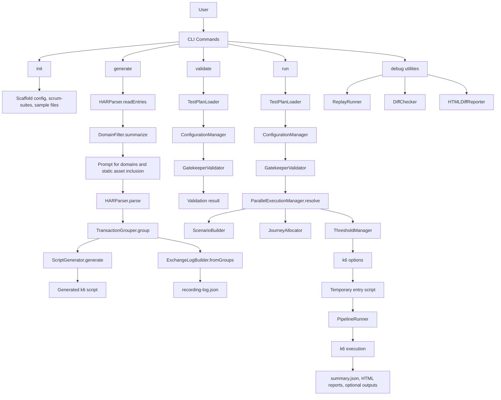
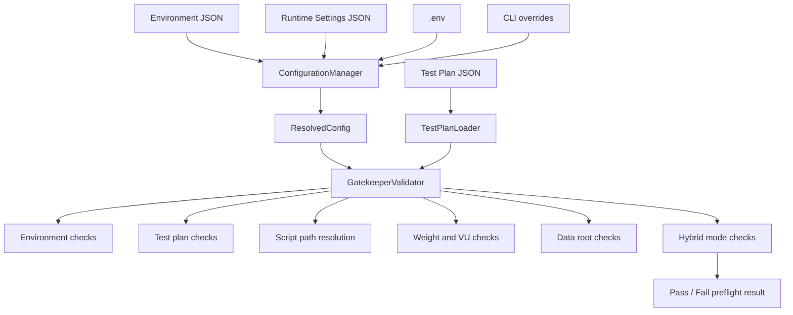
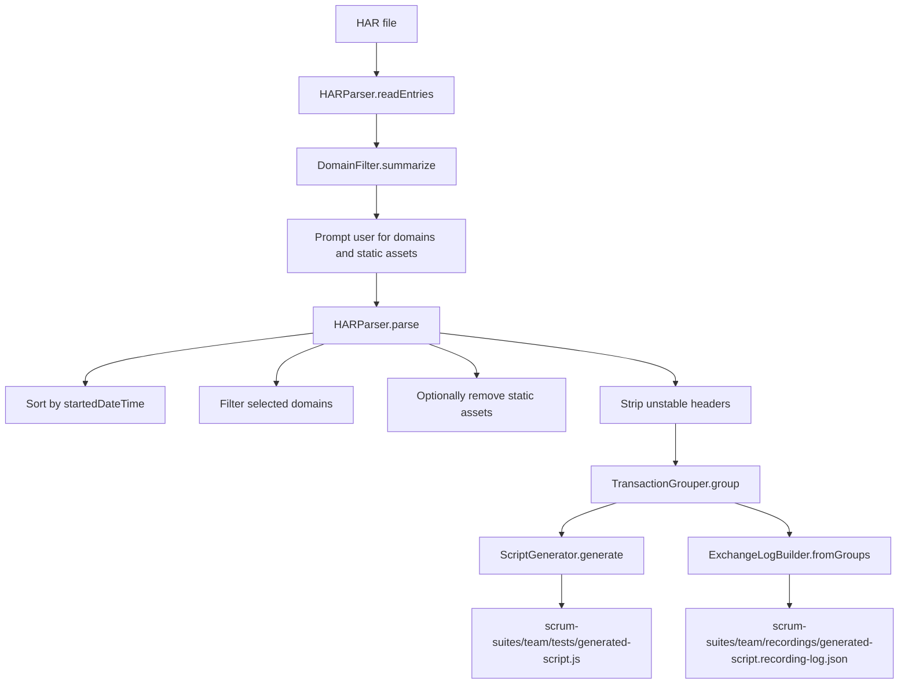
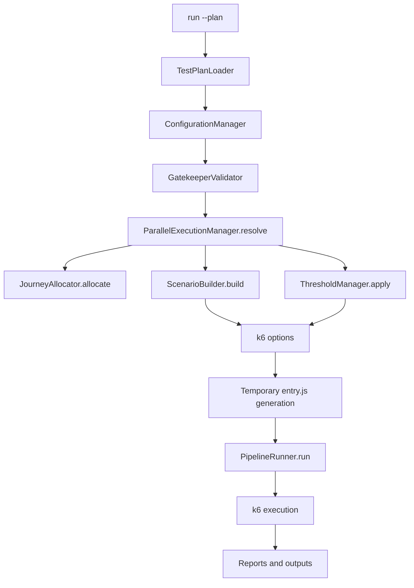
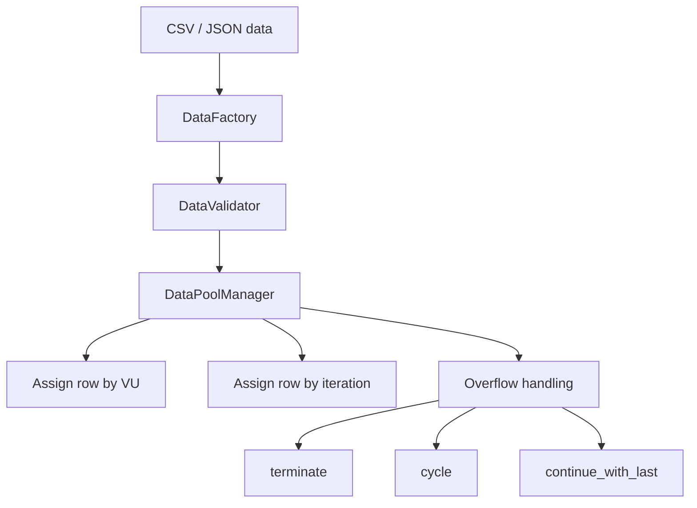
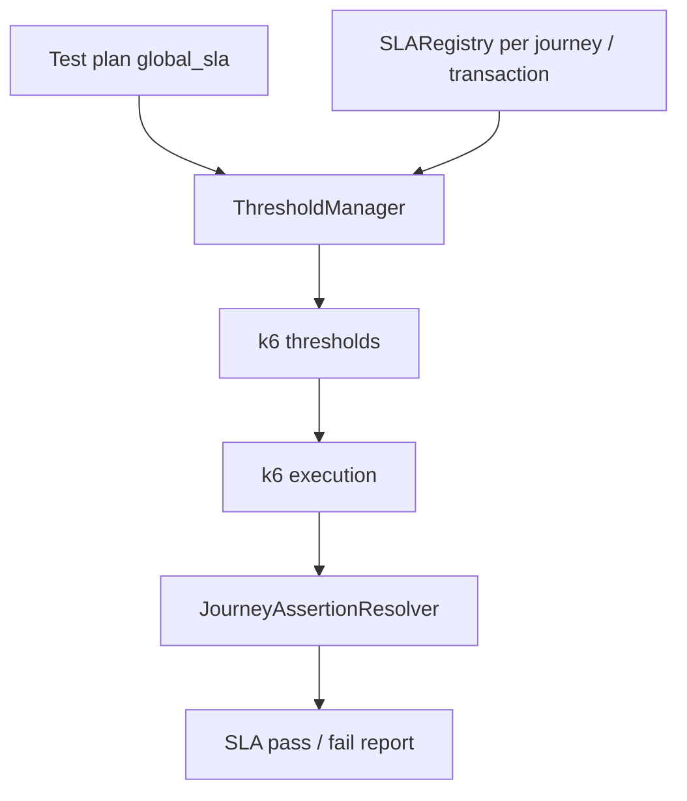
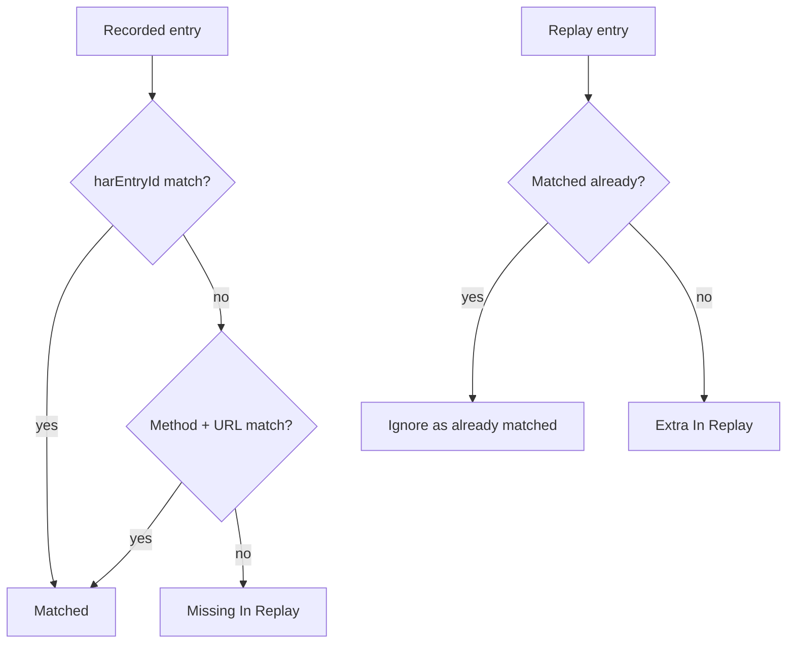
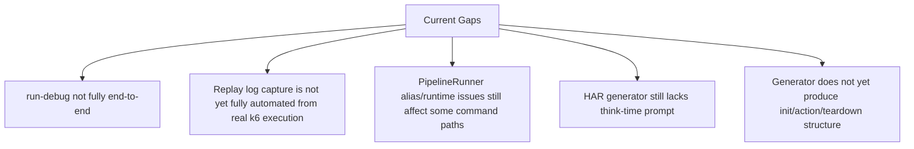

# Current Framework Flow

Date: 2026-03-30

This document describes how the current `K6-PerfFramework` works today, based on the present implementation.

## 1. End-to-End Framework Flow



## 2. Configuration and Validation Flow



## 3. HAR Generation Flow



## 4. Run Command Flow



## 5. Generated Script Runtime Flow

```mermaid
flowchart TD
    SCRIPT[Generated journey script] --> INITCTX[Init context]
    INITCTX --> INITTXN[initTransactions([...])]

    INITTXN --> DEFAULT[export default function]
    DEFAULT --> GROUP[group(transaction)]
    GROUP --> START[startTransaction(name)]
    START --> META[Create replay metadata object]
    META --> LOG[console.log replay metadata]
    LOG --> HTTP[http request with k6 tags]
    HTTP --> CHECK[check(response)]
    CHECK --> END[endTransaction(name)]
    END --> SLEEP[sleep between groups]
```

## 6. Data Layer Flow



## 7. Assertion and SLA Flow



## 8. Diff and Debug Flow Today

```mermaid
flowchart TD
    RECLOG[recording-log.json]
    REPLAYLOG[replay log or replay-like normalized data]

    RECLOG --> DCHK[DiffChecker.compareTaggedLogs]
    REPLAYLOG --> DCHK

    DCHK --> MATCH1[Match by harEntryId]
    DCHK --> MATCH2[Fallback to method + URL]
    DCHK --> STATES[matched / missing_in_replay / extra_in_replay]

    STATES --> RESULTS[DiffResult[]]
    RESULTS --> HTML[HTMLDiffReporter.generateReport]
    HTML --> REPORT[HTML diff report]
```

## 9. Recording vs Replay Matching Logic



## 10. Current Known Gaps



## 11. Practical Summary

- `init` scaffolds the framework structure.
- `generate` turns HAR into:
  - a generated k6 script
  - a normalized recording log JSON
- `validate` performs preflight checks manually.
- `run` performs validation automatically before executing k6.
- generated scripts use:
  - `initTransactions`
  - `startTransaction`
  - `endTransaction`
  - replay tags and replay logs
- diff reporting currently works well when supplied with normalized recording and replay data.
- the remaining gap is a fully automated real replay-log capture pipeline from `run-debug` / debug execution.

