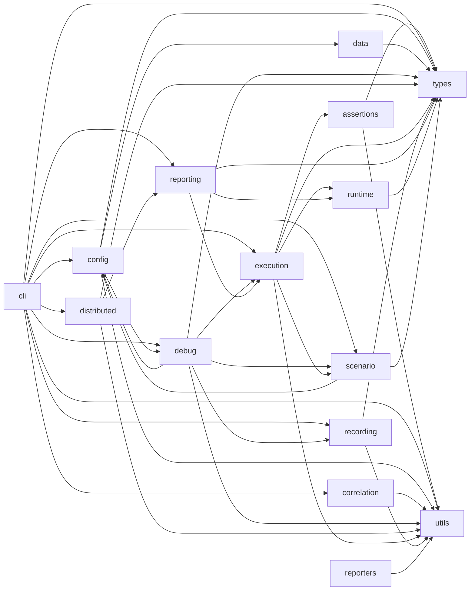

<!-- GENERATED by tools/gen-presentation.js — DO NOT EDIT. Regenerate: npm run docs:index -->
<!-- Render as slides with Marp (VS Code “Marp for VS Code” or `marp architecture-deck.md`). Also readable as plain Markdown. -->
---
marp: true
theme: default
paginate: true
---

# K6-PerfFramework
### Architecture at a glance

**13** features · **111** source files · **16** layers · **5** deep-dive EDDs

*This deck is generated from the code indexes — it cannot drift.*

---

## Two execution worlds

- **Node orchestration** — before/after the run: `cli` → `config` → `scenario` → `execution` → `reporting`/`debug`
- **k6 runtime (goja)** — during the run, per VU: `utils/*` imported via `dist/index.js` (no Node built-ins)

> k6 loads compiled `dist/`, not `.ts`. Rebuild after VU-side edits.

---

## Layer dependency map

*Aggregated from `ai_generated/dependency_graph.json` (file edges → layer edges).*

---

## Features & owners

| Feature | Entry | Tier |
|---------|-------|------|
| Smart Auto-Correlation | `cli/correlate.ts` | full |
| CLI Command Surface | `cli/run.ts` | mini |
| Configuration Resolution | `config/ConfigurationManager.ts` | full |
| Test Data Management | `data/DataFactory.ts` | mini |
| Debug Replay & Diff | `debug/ReplayRunner.ts` | full |
| k6 Process Execution | `execution/PipelineRunner.ts` | mini |
| Legacy Runtime Rule Engine | `correlation/CorrelationEngine.ts` | mini |
| VU Lifecycle & Phase Envelope | `utils/lifecycle.ts` | full |
| Recording → Script Generation | `recording/ScriptGenerator.ts` | mini |
| External Reporters (stubs) | `reporters/ResultTransformer.ts` | mini |
| Artifact-First Reporting & Thresholds | `reporting/RunReportGenerator.ts` | full |
| Scenario & Workload Modeling | `scenario/ScenarioBuilder.ts` | mini |
| k6-side VU Runtime Helpers | `index.ts` | mini |

---

## Highest-risk subsystems (full EDDs)

- **VU Lifecycle & Phase Envelope** → `engineering_docs/edd/EDD-lifecycle.md` — risks: RZ1, RZ4, F5
- **Smart Auto-Correlation** → `engineering_docs/edd/EDD-auto-correlation.md` — risks: F4
- **Debug Replay & Diff** → `engineering_docs/edd/EDD-debug-replay.md` — risks: RZ6, F1, F2
- **Artifact-First Reporting & Thresholds** → `engineering_docs/edd/EDD-reporting.md` — risks: RZ7, RZ8
- **Configuration Resolution** → `engineering_docs/edd/EDD-config.md` — risks: RZ3, RZ10, F3

---

## Documentation is source code

| Layer | Where | Role |
|-------|-------|------|
| L1 | `ai_context/` + `FrameworkAtlas.md` | routing / rules |
| L2 | `engineering_docs/` | EDDs (reverse-engineered from code) |
| L3 | `docs/` | published user docs |
| L4 | `ai_generated/*.json` | generated indexes |

Outdated docs are bugs — a staleness gate (`npm run docs:check`) keeps generated parts honest.

---

## Start here

- Navigate: `FrameworkAtlas.md`
- Onboard: `docs/onboarding/day-1.md`
- Go deep: `engineering_docs/edd/`

