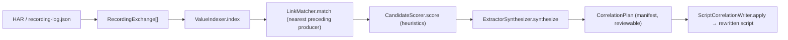
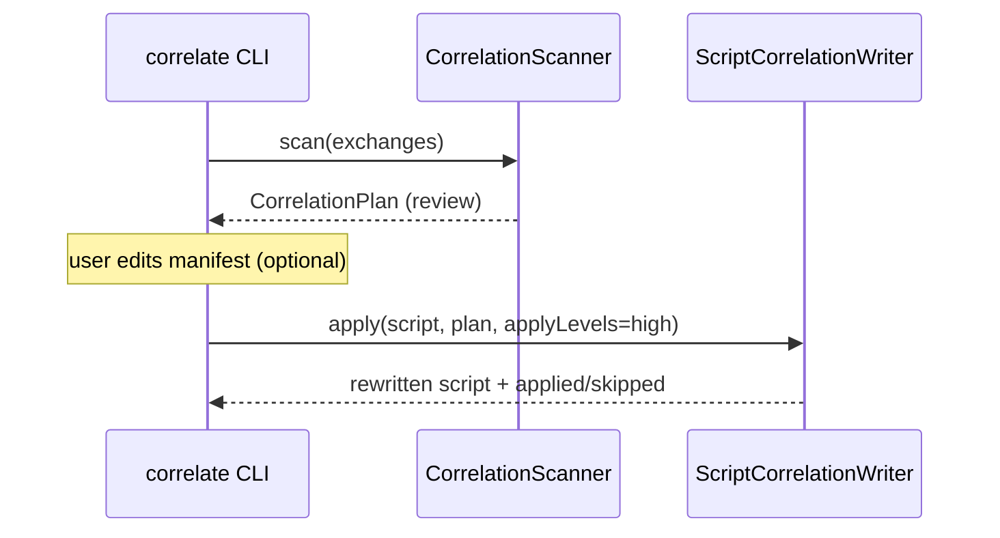

# EDD: Smart Auto-Correlation

## Executive Summary
Auto-correlation removes the hand-authored-rules burden of traditional load tooling: it **scans a
recording**, infers which dynamic values a server produces and a later request consumes (CSRF tokens,
JWTs, session ids, ViewState…), and **rewrites the generated k6 script** to capture each at its
producer and substitute `${c_var}` at each consumer. The pipeline is pure, Node-side, and produces a
reviewable manifest (`CorrelationPlan`) before touching any script.

## Problem Statement
Recorded scripts replay stale tokens → the server rejects iteration 2+. Classic tools require the
engineer to write extraction rules by hand. We want this inferred automatically, with confidence
levels and a human-review gate, without false positives corrupting a working script.

## Goals / Non-Goals
- **Goals:** infer producer→consumer links; score them high/medium/low; synthesize the right
  extractor (jsonpath/header/cookie/boundary); rewrite scripts idempotently; never touch k6/runtime.
- **Non-Goals:** correlating cookie round-trips k6's jar already replays; parameterisation (data-file
  values are `p_`, not `c_`); auto-applying low-confidence links (default applies `high` only).

## Architecture

## Component Responsibilities
| File | Symbol | Responsibility | Evidence |
|------|--------|----------------|----------|
| `CorrelationScanner.ts` | `scan` | Orchestrate 4-stage pipeline → `CorrelationPlan` | [:33](../../core_engine/src/correlation/CorrelationScanner.ts#L33) |
| `ValueIndexer.ts` | `index` | Extract producer (response) & consumer (request) occurrences | [:181](../../core_engine/src/correlation/ValueIndexer.ts#L181) |
| `LinkMatcher.ts` | `match` | Join consumer value to nearest **preceding** producer | [:7](../../core_engine/src/correlation/ValueIndexer.ts#L7) (doc) |
| `CandidateScorer.ts` | `score` | Drop noise, rank high/medium/low | [:78](../../core_engine/src/correlation/CandidateScorer.ts#L78) |
| `ExtractorSynthesizer.ts` | `synthesize` | Choose jsonpath/header/cookie/boundary, uniqueness-checked | [:1](../../core_engine/src/correlation/ExtractorSynthesizer.ts) |
| `ScriptCorrelationWriter.ts` | `apply` | Substitute + insert capture + hoist decls/imports | [:57](../../core_engine/src/correlation/ScriptCorrelationWriter.ts#L57) |

## Runtime Flow + Implementation Reverse-Engineering (§4A)

| Facet | Finding | Evidence |
|-------|---------|----------|
| **Execution entry point** | CLI `correlate` (`--list`/`--dry-run`/`--apply`) → `CorrelationScanner.scan(exchanges, opts)`. | [cli/correlate.ts], [CorrelationScanner.ts:33](../../core_engine/src/correlation/CorrelationScanner.ts#L33) |
| **Complete runtime flow** | `index` → `match` → `score` → `synthesize` → `{version:1, generatedAt, source, candidates}`. Apply stage is separate (`ScriptCorrelationWriter.apply`). | [:36-49](../../core_engine/src/correlation/CorrelationScanner.ts#L36) |
| **Decision points (scoring)** | Hard drops: deny-list literal [:102], known parameter value [:103], `handledByJar` cookie round-trip [:107-111], constant/input already sent at/before producer [:113-116]. Boosts: name-match vocabulary +3 [:125], JWT +4 [:130], UUID +3 [:133], long-hex +2 [:136], opaque base64 +2 [:139], entropy≥3.2 +2 [:145], len≥20 +1 [:153], html-hidden +1 [:157], single-use +0.5 [:161]. Penalties: low-entropy −2 [:148], short-numeric −2 [:167]. | [CandidateScorer.ts:101-170](../../core_engine/src/correlation/CandidateScorer.ts#L101) |
| **Confidence mapping** | `score ≥ high(5)` → high; `≥ medium(3)` → medium; `≥ low(1)` → low; below `low` dropped. Values `< minValueLength(6)` with no name hint dropped. | thresholds [:54](../../core_engine/src/correlation/CandidateScorer.ts#L54), map [:176-177](../../core_engine/src/correlation/CandidateScorer.ts#L176), drops [:173-174](../../core_engine/src/correlation/CandidateScorer.ts#L173) |
| **Validation logic** | Value length window 4..1024 indexed [ValueIndexer.ts:40]; extractor synthesis is **uniqueness-checked** (a locator that matches >1 value is rejected). Writer: tentative substitution, commit **only if** ≥1 consumer site actually matched. | [ValueIndexer.ts:40], [ScriptCorrelationWriter.ts:87-106](../../core_engine/src/correlation/ScriptCorrelationWriter.ts#L87) |
| **Fallback logic** | `loadConfig` on missing/invalid config file → embedded `DEFAULT_CONFIG` [:64,:73]. Writer: producer not in script → `skipped[{reason}]` [:83]; no consumer sites → skipped [:101-103]. | [CandidateScorer.ts:63-76](../../core_engine/src/correlation/CandidateScorer.ts#L63), [ScriptCorrelationWriter.ts:82-104](../../core_engine/src/correlation/ScriptCorrelationWriter.ts#L82) |
| **Error paths** | Pure functions; no throws in the scan path — noise is *dropped* not raised. Config parse errors are swallowed → defaults. | [CandidateScorer.ts:73](../../core_engine/src/correlation/CandidateScorer.ts#L73) |
| **State changes** | No global/VU state — pure transforms over arrays. Writer builds a per-request `working` text map, `declares[]`, `importsNeeded` set, `captures[]`. | [ScriptCorrelationWriter.ts:67-76](../../core_engine/src/correlation/ScriptCorrelationWriter.ts#L67) |
| **Object lifecycle** | `RecordingExchange[]` (CLI-built from HAR/recording-log) → `IndexedValues` → `RawCandidate[]` → `ScoredCandidate[]` → `CorrelationCandidate[]` → `CorrelationPlan` (persisted, editable) → applied to script text. | [CorrelationManifest.ts](../../core_engine/src/correlation/CorrelationManifest.ts) |
| **Configuration influence** | `config/correlation-rules/auto-correlation.defaults.json` overrides `minValueLength`, `vocabulary`, `denyValues`, `thresholds`. `knownParameterValues` (from data files) forces `p_` exclusion. `applyLevels` (default `{high}`) gates what the writer commits. | default path [CorrelationScanner.ts:28](../../core_engine/src/correlation/CorrelationScanner.ts#L28), applyLevels [ScriptCorrelationWriter.ts:58](../../core_engine/src/correlation/ScriptCorrelationWriter.ts#L58) |
| **Env-variable influence** | None (Node build-time tool). |
| **Interactions with other modules** | Consumes normalized exchanges built by the recording layer; the rewritten script imports `extractJson/Header/Cookie/Boundary` from `utils/extract.ts` (k6-side) and calls `trackCorrelation` from `replayLogger.ts`. Capture line shape: `c_var = trackCorrelation('c_var', extractX(resN, locator), provenance)`. | [ScriptCorrelationWriter.ts:47-52](../../core_engine/src/correlation/ScriptCorrelationWriter.ts#L47), [:113-117](../../core_engine/src/correlation/ScriptCorrelationWriter.ts#L113) |
| **Extension points** | `vocabulary`/`denyValues`/`thresholds` via config; the manifest is hand-editable (toggle `apply`, rename var, fix a boundary) before `--apply`. | [CorrelationManifest.ts:8](../../core_engine/src/correlation/CorrelationManifest.ts#L8) |
| **Known limitations** | `--apply` default only commits **high** confidence. Multi-use tokens with rotation rely on LinkMatcher's *nearest preceding* join. `generate`/`convert` in-line integration is Phase 4 — today `correlate` is a standalone step (see [known-tech-debt.md](../../ai_context/known-tech-debt.md) TD14/TD15). | [known-tech-debt.md](../../ai_context/known-tech-debt.md) |

## Sequence Diagram

## Design Patterns
Pipeline (4 pure stages); Strategy (extractor kind per candidate); Manifest/review gate before
mutation; Config-with-embedded-default fallback.

## Interfaces
`RecordingExchange`, `CorrelationCandidate`, `CorrelationPlan`, `CorrelationConfidence`
([CorrelationManifest.ts](../../core_engine/src/correlation/CorrelationManifest.ts)). Cross-layer
contract: [integration-contracts.md](../../ai_context/integration-contracts.md).

## Error Handling · Logging · Metrics
No metrics (build-time). `apply` returns structured `{applied[], skipped[{name,reason}]}` for the CLI
to print. Design rationale archived at `archive/Correlation-Engine-Design.md`.

## Performance / Security
O(values × candidates) over a recording; recordings are bounded. No secret handling beyond values
already present in the recording (which the engineer captured).

## Testing Strategy
No automated test. **Gap:** `CandidateScorer.score` and `ScriptCorrelationWriter.apply` are pure and
should have golden-file tests (idempotency: re-applying a plan = no-op, mirrors F4 for `ScriptConverter`).
See [fragile-areas.md](../../ai_context/fragile-areas.md) F4.

## Risks / Tradeoffs
F4 (regex source transformation in the sibling `ScriptConverter`); conservative default (`high`-only
apply) trades recall for precision to avoid corrupting a working script.

## Future Improvements
Inline `--apply` after `generate`/`convert` (Phase 4); function-level confidence tuning UI.

## Related Files
`correlation/*.ts`, `recording/ScriptConverter.ts`, `utils/extract.ts`, `utils/replayLogger.ts`,
`config/correlation-rules/auto-correlation.defaults.json`.

## Related ADRs
`archive/Correlation-Engine-Design.md` (design history, frozen).
