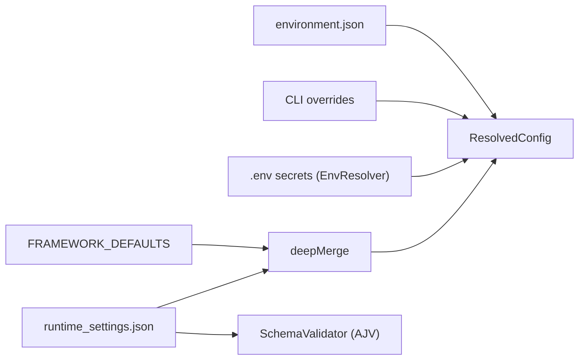
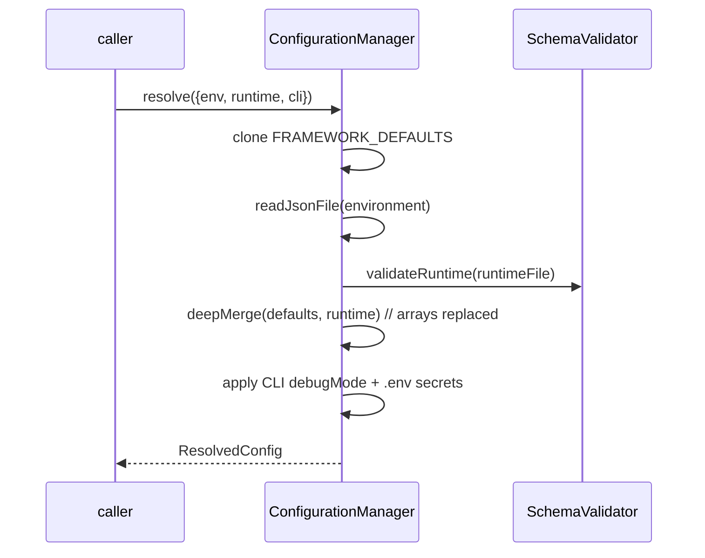

# EDD: Configuration Resolution

## Executive Summary
Every run is driven by a layered merge of configuration: framework defaults → environment → runtime
settings → suite → CLI → `.env` secrets. `ConfigurationManager.resolve()` produces a single
`ResolvedConfig`. Files are JSONC (comments allowed); each layer is AJV-schema-validated with
Levenshtein "did-you-mean" suggestions. The single most consequential invariant lives in `deepMerge`:
**arrays are replaced wholesale, never deep-merged** (RZ3/F3).

## Problem Statement
Configuration comes from several sources with a required precedence; a naive object deep-merge corrupts
array-valued settings (e.g. `transactionStats`) into index-keyed objects, and unvalidated typos fail
deep inside a run instead of at load.

## Goals / Non-Goals
- **Goals:** deterministic precedence; JSONC support; schema validation with friendly errors; safe
  array handling; secret redaction in debug output.
- **Non-Goals:** hot-reload; full CLI override surface (today only `debugMode` is wired, [ConfigurationManager.ts:50-52](../../core_engine/src/config/ConfigurationManager.ts#L50)).

## Architecture

## Component Responsibilities
| File | Symbol | Responsibility | Evidence |
|------|--------|----------------|----------|
| `ConfigurationManager.ts` | `resolve` / `deepMerge` | Layer merge → `ResolvedConfig`; array-safe merge | [:33](../../core_engine/src/config/ConfigurationManager.ts#L33) / [:127](../../core_engine/src/config/ConfigurationManager.ts#L127) |
| `SchemaValidator.ts` | `validatePlan`/`validateRuntime` | AJV validation + Levenshtein suggestions | [:1](../../core_engine/src/config/SchemaValidator.ts) |
| `EnvResolver.ts` | `getAll` | `.env` via dotenv → secrets map | [:1](../../core_engine/src/config/EnvResolver.ts) |
| `RuntimeConfigManager.ts` | typed accessors | Typed reads of runtime settings | [:1](../../core_engine/src/config/RuntimeConfigManager.ts) |
| `ScriptContractGuard.ts` | `assertClean` | Reject raw k6 `check()`/`group()` pre-flight | [:1](../../core_engine/src/config/ScriptContractGuard.ts) |
| `GatekeeperValidator.ts` | checklist | Non-short-circuit pre-flight checks | [:1](../../core_engine/src/config/GatekeeperValidator.ts) |

## Runtime Flow + Implementation Reverse-Engineering (§4A)

| Facet | Finding | Evidence |
|-------|---------|----------|
| **Execution entry point** | `new ConfigurationManager(envFilePath).resolve({environmentConfigPath, runtimeSettingsPath, cliOverrides})`. `loadTestPlan(planPath)` is a sibling entry for plans. | [ConfigurationManager.ts:33](../../core_engine/src/config/ConfigurationManager.ts#L33), [:70](../../core_engine/src/config/ConfigurationManager.ts#L70) |
| **Complete runtime flow** | (1) `structuredClone(FRAMEWORK_DEFAULTS)` [:39]; (2) load+`readJsonFile` environment [:42]; (3) load runtime file, `deepMerge(defaults, runtimeFromFile)` [:45-46]; (4) apply CLI `debugMode` [:50-52]; (5) `envResolver.getAll()` secrets [:55]; assemble `ResolvedConfig` [:57]; if `debugMode` print redacted [:59-61]. | [:38-63](../../core_engine/src/config/ConfigurationManager.ts#L38) |
| **Decision points & branch conditions** | `deepMerge`: if either side non-object/null **or `Array.isArray(source)`** → return `source ?? target` (scalar/array replace) [:128-136]; else recurse per key [:139-141]. `debugMode` gates the redacted print [:59]. Missing runtime file → warn + `{}` (defaults stand) [:86-90]. | [:127-143](../../core_engine/src/config/ConfigurationManager.ts#L127) |
| **Validation logic** | `loadTestPlan` → `schemaValidator.validatePlan`; throws with joined errors if invalid [:72-77]. `loadRuntimeSettings` → `validateRuntime` [:94-99]. AJV + Levenshtein suggests the nearest valid key on typos. | [:70-101](../../core_engine/src/config/ConfigurationManager.ts#L70) |
| **Fallback logic** | Missing runtime file → framework defaults only (warn, not throw) [:86-90]. `deepMerge` `source ?? target` keeps target when source is nullish [:135]. | [:85-90](../../core_engine/src/config/ConfigurationManager.ts#L85), [:135](../../core_engine/src/config/ConfigurationManager.ts#L135) |
| **Error paths** | Missing environment/plan file or unparseable JSONC → descriptive throw [:109-123]; schema-invalid plan/runtime → throw with all errors [:74, :96]. These fail **at load**, before k6 launches. | [:107-124](../../core_engine/src/config/ConfigurationManager.ts#L107) |
| **State changes** | None global; `resolve()` returns a fresh object. Defaults cloned so the module constant is never mutated [:39]. | [:39](../../core_engine/src/config/ConfigurationManager.ts#L39) |
| **Object lifecycle** | Per-invocation: `RuntimeSettings` clone → merged → wrapped in `ResolvedConfig {environment, runtime, cliOverrides, secrets}` → consumed by ScenarioBuilder/execution/reporting. | [:57](../../core_engine/src/config/ConfigurationManager.ts#L57) |
| **Configuration influence** | This IS the config subsystem. Inputs: `config/environments/*.json`, `config/runtime_settings/*.json`, `config/schemas/*.schema.json`, test plans, `.env`. See [config_index.json](../../ai_generated/config_index.json). | as cited |
| **Env-variable influence** | `.env` values are read via `EnvResolver` (dotenv) into `secrets`, redacted as `***REDACTED***` in debug output [:150-156]. Names catalogued in [environment_index.json](../../ai_generated/environment_index.json). | [:145-158](../../core_engine/src/config/ConfigurationManager.ts#L145) |
| **Interactions with other modules** | Produces `ResolvedConfig` consumed by ScenarioBuilder (→ `K6_PERF_RUNTIME_METADATA`), reporting (`transactionStats`), execution. Only files loaded via this class + `TestPlanLoader` get JSONC comments (RZ10). | [dependency-rules.md](../../ai_context/dependency-rules.md), [risk-zones.md](../../ai_context/risk-zones.md) RZ10 |
| **Extension points** | Add a runtime setting: extend schema + `FRAMEWORK_DEFAULTS` + `RuntimeConfigManager` accessor (see [integration-checklist.md](../../ai_context/integration-checklist.md)). CLI override surface is extensible at [:49-52]. | [:49](../../core_engine/src/config/ConfigurationManager.ts#L49) |
| **Known limitations** | CLI overrides only wire `debugMode` today [:50-52]. The header documents a 6-layer order (…→ suite →…) but `resolve()` implements defaults→environment→runtime→CLI→secrets explicitly; suite-level config is applied at journey/environment resolution, not in this method. Standard `JSON.parse` elsewhere does NOT support comments (RZ10). | [:1-5](../../core_engine/src/config/ConfigurationManager.ts#L1), [:38-63](../../core_engine/src/config/ConfigurationManager.ts#L38) |

## Sequence Diagram

## State Diagram
N/A (stateless resolver).

## Design Patterns
Layered configuration / precedence merge; schema-validated boundary; secret redaction; fail-fast at load.

## Interfaces
`ResolvedConfig`, `RuntimeSettings`, `EnvironmentConfig`, `FRAMEWORK_DEFAULTS` (`types/ConfigContracts.ts`).
Import direction rules: [dependency-rules.md](../../ai_context/dependency-rules.md).

## Error Handling · Logging · Metrics
Load-time throws with file path + parser/validator detail; no metrics. Debug print redacts secrets.

## Performance / Security
One-time cost at startup. Secrets never printed in clear; only names surface in the environment index.

## Testing Strategy
`tools/merge-validation.test.ts` (`npm run test:merge`) covers `deepMerge` array-replace behavior.
**Keep this test green** — it guards RZ3/F3.

## Risks / Tradeoffs
RZ3/F3 (array wholesale-replace — do not "fix" `deepMerge` to merge arrays), RZ10 (JSONC only via this
class + `TestPlanLoader`). Fail-fast at load trades a late partial run for an early clear error.

## Future Improvements
Wire a full CLI override map; make the "suite" layer explicit in `resolve()`; add schema-key
auto-doc generation into L3 `docs/configuration.md`.

## Related Files
`config/*.ts`, `types/ConfigContracts.ts`, `config/schemas/*.schema.json`, `config/environments/*`,
`config/runtime_settings/*`.

## Related ADRs
None; see [dependency-rules.md](../../ai_context/dependency-rules.md) and [decisions.md](../../ai_context/decisions.md).
