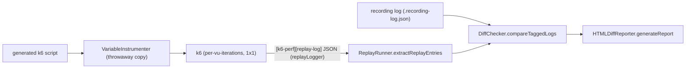
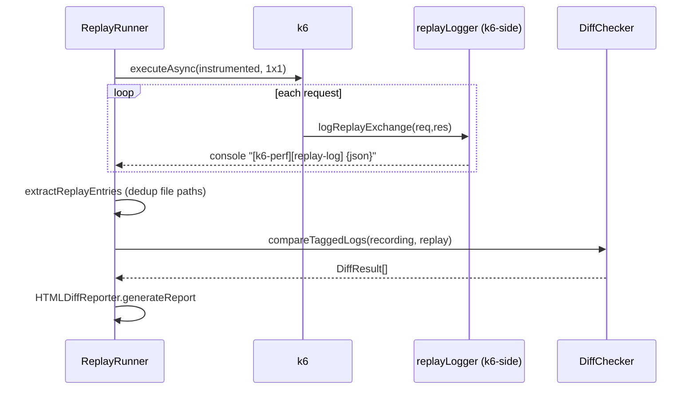

# EDD: Debug Replay & Diff

## Executive Summary
Debug replay runs a generated k6 script once (1 VU, 1 iteration), captures a **replay log** of every
HTTP exchange with the framework-tracked correlation/parameter variables, compares it entry-by-entry
against the original **recording log**, and renders a self-contained interactive HTML diff report.
It answers "did my script send what the recording did, with the right dynamic values?" without a load
run. Debug runs honor the **same** runtime settings as a load run (http/timeout/thinkTime/pacing).

## Problem Statement
A generated/correlated script can silently diverge from the recording (stale token, wrong header,
missing substitution). Engineers need a side-by-side diff plus real k6 metrics, with failures pointing
at the actual script `file:line`, not the throwaway internals.

## Goals / Non-Goals
- **Goals:** deterministic single-VU replay; auto-track every interpolated `${var}`; robust recording
  discovery; a diff report that survives binary bodies and status-0 transport errors.
- **Non-Goals:** multi-VU debug (forced to 1, [ReplayRunner.ts:114-117](../../core_engine/src/debug/ReplayRunner.ts#L114)); load-level throughput.

## Architecture

## Component Responsibilities
| File | Symbol | Responsibility | Evidence |
|------|--------|----------------|----------|
| `debug/ReplayRunner.ts` | `runDebug` | Orchestrate: instrument → run k6 → extract → diff → report | [:99](../../core_engine/src/debug/ReplayRunner.ts#L99) |
| `utils/replayLogger.ts` | `logReplayExchange` / `trackCorrelation` | k6-side: emit exchange JSON + variable registry | [:451](../../core_engine/src/utils/replayLogger.ts#L451) / [:146](../../core_engine/src/utils/replayLogger.ts#L146) |
| `debug/DiffChecker.ts` | `compareTaggedLogs` | Pair recording vs replay entries → `DiffResult[]` | [call site :325](../../core_engine/src/debug/ReplayRunner.ts#L325) |
| `debug/HTMLDiffReporter.ts` | `generateReport` | Self-contained interactive HTML (RZ6) | [call site :328](../../core_engine/src/debug/ReplayRunner.ts#L328) |
| `debug/RecordingLogResolver.ts` | `resolve` | Multi-strategy recording discovery | [:21](../../core_engine/src/debug/RecordingLogResolver.ts#L21) |

## Runtime Flow + Implementation Reverse-Engineering (§4A)

| Facet | Finding | Evidence |
|-------|---------|----------|
| **Execution entry point** | `ReplayRunner.runDebug(options)` (async). CLI `debug` / the `run --debug` path calls it. | [:99](../../core_engine/src/debug/ReplayRunner.ts#L99) |
| **Complete runtime flow** | resolve paths → force `vus=1` → `ScriptContractGuard.assertClean` → `extractTransactionNames` → sweep stale copies → `instrumentVariableTracking` writes a throwaway `.name.__debugtrack_*.js` beside original → `PipelineRunner.executeAsync` (per-vu-iterations, web-dashboard + json stream + summary-export) → `extractReplayEntries` → `extractK6Errors`/`extractK6Metrics`/`extractConsoleLogs` → read+normalize recording → `DiffChecker.compareTaggedLogs` → `HTMLDiffReporter.generateReport` → cleanup temp files → `PipelineRunner.ensureSuccess`. | [:99-366](../../core_engine/src/debug/ReplayRunner.ts#L99) |
| **Decision points & branch conditions** | `vus>1` → warn+override [:114]; `wrapped>0` → use instrumented copy else original [:157]; `replayEntries.length===0` → throw (k6 failed vs no markers) [:303-314]; `recordingEntries.length===0` → replay-only warning [:321]; `statsColumns.includes('std')` → Welford pass [:298]. | [ReplayRunner.ts](../../core_engine/src/debug/ReplayRunner.ts) |
| **Validation logic** | `ScriptContractGuard.assertClean` rejects raw k6 `check()`/`group()` (only `k6Check` inside `transaction()` yields exact pass/fail) [:131]. `readRecordingLog` requires a JSON array or throws [:509-511]. | [:131](../../core_engine/src/debug/ReplayRunner.ts#L131), [:509](../../core_engine/src/debug/ReplayRunner.ts#L509) |
| **Fallback logic** | Instrumentation failure → log + fall back to original script [:166-168]. Recording missing → replay-only report [:321-324]. `RecordingLogResolver` returns `resolved\|missing\|ambiguous` across index-registry + path strategies. base64 body decode falls back to original on failure [:541]. | [:166](../../core_engine/src/debug/ReplayRunner.ts#L166), [RecordingLogResolver.ts:12](../../core_engine/src/debug/RecordingLogResolver.ts#L12) |
| **Error paths** | k6 error lines parsed from logfmt (`level=error msg=...`) and `ERRO[..]` [:622-648], deduped, **remapped** from the instrumented copy basename back to the real script so clicking jumps to the right file [:606]. status-0 responses (timeout/reset/refused) captured with reason in the replay log [replayLogger.ts:541]. | [:611-673](../../core_engine/src/debug/ReplayRunner.ts#L611), [replayLogger.ts:532-541](../../core_engine/src/utils/replayLogger.ts#L532) |
| **State changes** | Node-side, per-invocation locals; no shared state. Temp artifacts under `.k6-temp/` (`_debug_*.log`, `_summary_*.json`, `_stream_*.json`) all removed after parse [:348-356]. Throwaway instrumented copy removed in `finally` [:281] and swept at next start [:586]. | as cited |
| **Object lifecycle** | Instrumented copy: created [:162], executed, deleted [:281]/[:586]. Replay entries → written to `<report>.replay-log.json` [:290]. Metrics parsed from k6 summary-export JSON, not stdout (keeps k6's live progress bar) [:174-178, :685]. | as cited |
| **Variable tracking (the "magic")** | Script writes to `ctx.correlation/session/...` are auto-registered via lifecycle's `createTrackedProxy`; `detectVariableEvents` then scans each request's URL/body/headers for **exact matches** of registered values and maps value→variable name — no explicit `trackCorrelation` needed. `VariableInstrumenter` additionally wraps every `${...}` so even inline interpolations show in the diff. | [replayLogger.ts:270](../../core_engine/src/utils/replayLogger.ts#L270), [:463-464](../../core_engine/src/utils/replayLogger.ts#L463), [ReplayRunner.ts:156](../../core_engine/src/debug/ReplayRunner.ts#L156) |
| **Metrics extraction** | Checks recurse nested k6 groups (group key == transaction name) [:726-735]; transaction pass/fail summed from every `<txn>_checkrate` Rate [:739-749]; std computed via Welford over the raw point stream since summary-export lacks it [:819-855]. | [:685-855](../../core_engine/src/debug/ReplayRunner.ts#L685) |
| **Configuration influence** | `noCookiesReset` (default true) [:215]; `runtimeMetadata` injected verbatim for debug=load parity, explicit `errorBehavior` still wins [:246-259]; `transactionStats` → extra report columns [:382]; `extraK6Args` (e.g. `--http-debug=full`) forwarded [:199]. | as cited |
| **Env-variable influence** | Sets `K6_PERF_DEBUG=true` [:235], `K6_PERF_TRANSACTION_NAMES` [:237], `K6_PERF_TEAM_ENVIRONMENTS` [:240], `K6_PERF_RUNTIME_METADATA` [:246], `K6_PERF_PHASES` (debug envelope) [:223]. | as cited |
| **Interactions with other modules** | `PipelineRunner.executeAsync`/`ensureSuccess` (execution), `ScenarioBuilder.computeDebugPhaseEnvelope` (scenario), `ScriptContractGuard` (config), `FileWriteSink`/`LiveConsoleLogStream` (writeData + live output), `HTMLDiffReporter`/`DiffChecker`. Contract: [replay-debug-contracts.md](../../ai_context/replay-debug-contracts.md). | [:4-14](../../core_engine/src/debug/ReplayRunner.ts#L4) |
| **Extension points** | `transactionStats` columns; `extraK6Args` passthrough; the emitted replay-log JSON schema is the stable integration surface. | as cited |
| **Known limitations** | 1 VU only. Report is a single 87KB self-contained HTML (RZ6/F1) — hard to change safely. Replay-log/DiffChecker/HTMLDiffReporter must agree on JSON shape (F2, 3-file sync). Binary/static bodies replaced with a placeholder to keep JSON parseable [:515-530]. | [risk-zones.md](../../ai_context/risk-zones.md) RZ6, [fragile-areas.md](../../ai_context/fragile-areas.md) F1/F2 |

## Sequence Diagram

## Design Patterns
Orchestrator (ReplayRunner); throwaway-instrumented-copy (never mutate the user's file);
IPC-over-console (`[k6-perf][replay-log]` line protocol); multi-strategy resolver.

## Interfaces
`TaggedExchangeLogEntry`, `DiffResult`, `K6Metrics`, `RecordingLogResolution`. The `[k6-perf][replay-log]`
line protocol is the k6↔Node contract. See [replay-debug-contracts.md](../../ai_context/replay-debug-contracts.md).

## Error Handling · Logging · Metrics
Covered in §4A. All k6 error/console lines are remapped from the instrumented copy back to the real
script ([:606](../../core_engine/src/debug/ReplayRunner.ts#L606)); framework IPC channels filtered out of the console view ([:908-913](../../core_engine/src/debug/ReplayRunner.ts#L908)).

## Performance / Security
Streaming line-reads (`readline`) over log/stream files ([:438](../../core_engine/src/debug/ReplayRunner.ts#L438), [:819](../../core_engine/src/debug/ReplayRunner.ts#L819)) — O(1) memory. No secret handling beyond recorded traffic.

## Testing Strategy
No automated test. **Gap:** golden-file test over `extractK6Metrics` (pure given a summary-export
fixture) and `RecordingLogResolver.resolve`. Per [fragile-areas.md](../../ai_context/fragile-areas.md) F2, any change to
replayLogger/DiffChecker/HTMLDiffReporter must be validated against the other two.

## Risks / Tradeoffs
RZ6/F1 (87KB self-contained HTML — coerce values with `String(v ?? '')` before `.replace`; test in a
browser). F2 (3-file JSON sync). Reading summary-export instead of scraping stdout trades a temp file
for keeping k6's animated progress bar intact.

## Future Improvements
Extract the metrics parser + resolver into pure, unit-tested modules; split HTMLDiffReporter's inline
assets to make the report maintainable.

## Related Files
`debug/*.ts`, `utils/replayLogger.ts`, `execution/PipelineRunner.ts`, `config/ScriptContractGuard.ts`.

## Related ADRs
None yet; design context in [replay-debug-contracts.md](../../ai_context/replay-debug-contracts.md).
