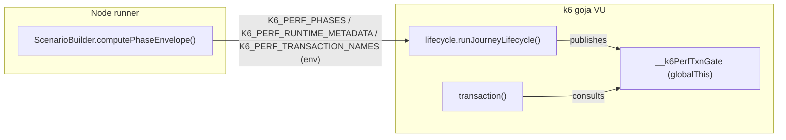
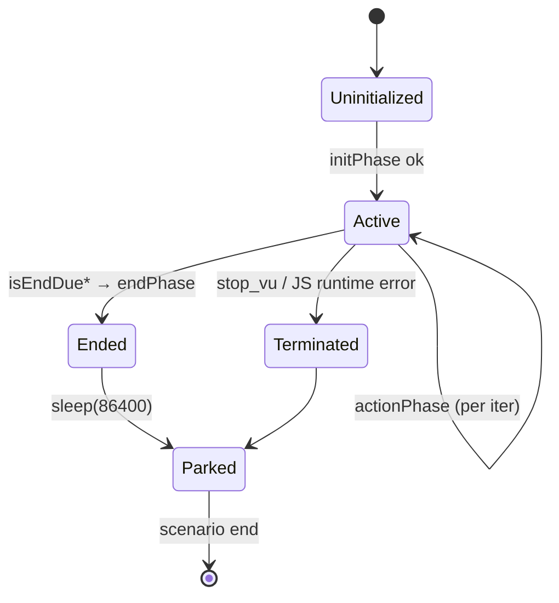

# EDD: VU Lifecycle & Phase Envelope

## Executive Summary
The framework grafts a LoadRunner-style per-VU lifecycle — `initPhase` (login, once) → `actionPhase`
(business flow, repeated) → `endPhase` (logout, once) — onto k6, whose native grain is the
*independent, stateless iteration*. The hard problem is **end-detection**: k6 culls VUs during
ramp-down without giving the doomed VU a final callback, so a naive design never runs `endPhase`
for VUs k6 removes. The solution is a **proactive, VU-driven deadline**: at init, each VU computes
when k6 will cull it (`computeEndPlan`, [lifecycle.ts:410](../../core_engine/src/utils/lifecycle.ts#L410))
from a phase envelope the runner injects as `K6_PERF_PHASES`, and runs `endPhase` a safety margin
*before* that moment while it is still scheduled.

## Problem Statement
- k6 iterations are independent; there is no built-in "first"/"last" iteration hook per VU.
- During `ramping-vus` ramp-down, k6 removes the highest-indexed VU handles first, mid-flight,
  with no further `default()` call — so end-of-session work (logout, cleanup) is lost.
- Error semantics must be uniform across every executor and across phases.

## Goals
- Run `initPhase` exactly once per VU, `endPhase` exactly once per VU before k6 culls it, across
  every executor family (ramping, count-based, arrival-rate, external).
- Preserve `initPhase/actionPhase/endPhase` + a compatibility `default` export.
- One owner of end-detection logic (constraint **C1**).

## Non-Goals
- Mid-transaction interruption (active transactions always complete cleanly).
- Deterministic per-VU end for open (arrival-rate) models — those are action-only by design.

## Functional Requirements
| # | Requirement | Evidence |
|---|-------------|----------|
| FR1 | `initPhase` runs once, guarded | [lifecycle.ts:526](../../core_engine/src/utils/lifecycle.ts#L526) |
| FR2 | `endPhase` runs before cull, once | [lifecycle.ts:557](../../core_engine/src/utils/lifecycle.ts#L557), [:578](../../core_engine/src/utils/lifecycle.ts#L578) |
| FR3 | Every executor family handled | `computeEndPlan` [lifecycle.ts:410-458](../../core_engine/src/utils/lifecycle.ts#L410) |
| FR4 | Action transactions skipped once ending | transaction gate [lifecycle.ts:288](../../core_engine/src/utils/lifecycle.ts#L288) |
| FR5 | Uniform `errorBehavior` across phases | [lifecycle.ts:158](../../core_engine/src/utils/lifecycle.ts#L158), [transaction.ts:360-394](../../core_engine/src/utils/transaction.ts#L360) |

## Non-Functional Requirements
- **RZ1 (k6/Node boundary):** this code compiles to `dist/utils/` and runs in k6's goja engine —
  **no Node built-ins**. Any `fs`/`path` import breaks the run. See [risk-zones.md](../../ai_context/risk-zones.md) RZ1.
- `isEndDueBefore`/`isEndDueAfter` run every iteration for every VU → must be cheap
  ([lifecycle.ts:468-487](../../core_engine/src/utils/lifecycle.ts#L468)).

## Architecture


## Component Responsibilities
| File | Symbol | Responsibility | Evidence |
|------|--------|----------------|----------|
| `scenario/ScenarioBuilder.ts` | `computePhaseEnvelope` | Executor → `{mode, startVUs, timeline[], ...}` envelope; inject env | [:310](../../core_engine/src/scenario/ScenarioBuilder.ts#L310), inject [:303](../../core_engine/src/scenario/ScenarioBuilder.ts#L303) |
| `utils/lifecycle.ts` | `runJourneyLifecycle` | Per-VU shell: init once, action per-iter, proactive end | [:512](../../core_engine/src/utils/lifecycle.ts#L512) |
| `utils/lifecycle.ts` | `computeEndPlan` / `terminalDeadlineMs` | Deadline/last-iteration math per family | [:410](../../core_engine/src/utils/lifecycle.ts#L410) / [:382](../../core_engine/src/utils/lifecycle.ts#L382) |
| `utils/lifecycle.ts` | `getTransactionGate` | Executor-aware skip signal for action transactions | [:288](../../core_engine/src/utils/lifecycle.ts#L288) |
| `utils/transaction.ts` | `transaction` | group + metrics + gate + errorBehavior | [:250](../../core_engine/src/utils/transaction.ts#L250) |

## Runtime Flow + Implementation Reverse-Engineering (§4A)

| Facet | Finding | Evidence |
|-------|---------|----------|
| **Execution entry point** | Generated journey `default()` calls `runJourneyLifecycle(store, {initPhase, actionPhase, endPhase})`. Store built by `createJourneyLifecycleStore()`. | [lifecycle.ts:512](../../core_engine/src/utils/lifecycle.ts#L512), [:225](../../core_engine/src/utils/lifecycle.ts#L225) |
| **Complete runtime flow** | (1) If `terminated\|ended\|isVuTerminated` → `sleep(86400)` and return (park VU). (2) If `!initialized` → `computeEndPlan`; if `endDisabled` (arrival) announce+skip init, else `runSafely('init')`; set `initialized=true`. (3) arrival/external → action + pacing, return. (4) `isEndDueBefore` → `endPhase`, `ended=true`, return. (5) `runSafely('action')`. (6) unless ending, `applyPacing`. (7) `isEndDueAfter` → `endPhase`, `ended=true`. | [:517](../../core_engine/src/utils/lifecycle.ts#L517)→[:582](../../core_engine/src/utils/lifecycle.ts#L582) |
| **Decision points & branch conditions** | `!state.initialized` [:526]; `activeEndPlan.endDisabled` [:529/549]; `isEndDueBefore()` [:557]; `actionBehavior !== 'continue'` [:565]; `!endingAfter` gates pacing [:573]; `endingAfter && endPhase` [:578]. | [lifecycle.ts:526-581](../../core_engine/src/utils/lifecycle.ts#L526) |
| **End-plan families** | `ramping-vus` (+ synthetic constant-vus) → time deadline via `terminalDeadlineMs`; `per-vu-iterations` → `lastIteration=total-1`; `shared-iterations` → per-VU assigned share, zero-work VUs `endBeforeAction`; arrival-rate → `endDisabled`; else `external`. | [:410-458](../../core_engine/src/utils/lifecycle.ts#L410) |
| **Deadline math (F5)** | Rank = interpolated curve value at the VU's **onboarding offset** (`Date.now()-scenario.startTime`), NOT `idInInstance` (shuffled). `terminalDeadlineMs` = `sup{t : target(t) ≥ rank}` — last time the curve is at/above the rank; k6 culls just after. | rank [:428-429](../../core_engine/src/utils/lifecycle.ts#L428), sup [:382-407](../../core_engine/src/utils/lifecycle.ts#L382) |
| **Validation logic** | `parseJsonEnv` swallows bad JSON → fallbacks (`{mode:'unsupported'}` / `{errorBehavior:'continue'}`). Missing counter/trend → `console.error` but no throw. | [:112-125](../../core_engine/src/utils/lifecycle.ts#L112), [transaction.ts:206-231](../../core_engine/src/utils/transaction.ts#L206) |
| **Fallback logic** | `sup<0` (curve never reaches rank) → return total duration → VU never logs out early, relies on scenario end + `gracefulStop` [:401-406]. `external` family → best-effort action-only. | [:401](../../core_engine/src/utils/lifecycle.ts#L401), [:456](../../core_engine/src/utils/lifecycle.ts#L456) |
| **Error paths** | Phase body throw → `handlePhaseError`: `isJsRuntimeError` (ReferenceError/TypeError/…) → **always `exec.test.abort`** regardless of errorBehavior; else `stop_vu`→`terminated=true`, `abort_test`→abort, `stop_iteration`/`continue`→return behavior. Inside `transaction()` the same four behaviors branch at [transaction.ts:360-394]. | [lifecycle.ts:158-194](../../core_engine/src/utils/lifecycle.ts#L158), [transaction.ts:342-394](../../core_engine/src/utils/transaction.ts#L342) |
| **State changes** | Module-scope per-VU: `activeEndPlan` [:336], `_currentPhase` [:200], `arrivalNoticePrinted` [:337]; store `state.{initialized,ended,terminated}` [:104]; `transaction.ts` `_vuTerminated` [:144], `_activeTransaction` [:140], `_currentIterationFailed` [:36]. k6 gives fresh module scope per VU, so module-level vars ARE per-VU state [:334-336]. | as cited |
| **Object lifecycle** | Metrics (`Trend`/`Counter`/`Rate`) created in **init context** via `autoInitTransactionsFromEnv` IIFE reading `K6_PERF_TRANSACTION_NAMES`; never at VU runtime. `framework_iterations` Counter at module load. | [transaction.ts:154-164](../../core_engine/src/utils/transaction.ts#L154), [lifecycle.ts:69](../../core_engine/src/utils/lifecycle.ts#L69) |
| **Configuration influence** | Test-plan load profile (`executor`, `stages`, `duration`, `vus`, `iterations`, `rate`, `preAllocatedVUs`, `maxVUs`) → envelope shape. `runtime.errorBehavior`, `runtime.pacing.{enabled,mode,fixed,min,max}`, `runtime.thinkTime.{ignoreThinkTime,globalOverride,mode,fixed,min,max}`. | envelope [ScenarioBuilder.ts:323-424], pacing [lifecycle.ts:134-150], think [:243-274] |
| **Env-variable influence** | `K6_PERF_PHASES` (envelope) [:153], `K6_PERF_RUNTIME_METADATA` (errorBehavior/pacing/thinkTime) [:121], `K6_PERF_TRANSACTION_NAMES` (metric names) [transaction.ts:156]. | as cited |
| **Interactions with other modules** | Imports `isVuTerminated`/`isJsRuntimeError` from `transaction.ts` [:7]; `trackCorrelation`/`trackParameter` from `replayLogger.ts` [:8]. Publishes gate on `globalThis.__k6PerfTxnGate` [:313] to avoid a module cycle; `transaction()` consults it [transaction.ts:271]. See [runtime-contracts.md](../../ai_context/runtime-contracts.md). | as cited |
| **Extension points** | Script-facing `isEnding()` for long action loops [:498]; `thinktime(min,max)` [:232]; `createTrackedProxy` auto-registers `ctx.*` scalar writes into the replay registry [:78]. | as cited |
| **Known limitations** | Simultaneous onboardings (`startVUs>0`/steep ramp) share a rank → whole block logs out at the earliest cull (front-loaded, safe but not gradual) [:419-426]. `constant-vus` is faked as ramping with a 5s (or 10%) synthetic ramp-down so `endPhase` fits [ScenarioBuilder.ts:353-365]. Arrival-rate disables init/end entirely [:452]. | as cited |

## Sequence Diagram
```mermaid
sequenceDiagram
  participant K6 as k6 engine
  participant LC as runJourneyLifecycle
  participant TX as transaction()
  K6->>LC: default() (iteration N)
  alt first iteration
    LC->>LC: computeEndPlan(K6_PERF_PHASES)
    LC->>LC: runSafely('init')
  end
  alt isEndDueBefore()
    LC->>LC: runSafely('end'); return
  end
  LC->>TX: actionPhase → transaction('x', fn)
  TX->>LC: gate.shouldSkipBeforeStart?
  alt ending mid-action
    TX-->>LC: skip (onSkip log)
  else
    TX->>TX: group+start+fn+checkrate+end
  end
  LC->>LC: isEndDueAfter() → runSafely('end')
```

## State Diagram


## Design Patterns
Proxy (auto-tracking `ctx` writes, [:78]); Strategy-by-mode (`computeEndPlan` family switch);
Published-hook to break a module cycle (`globalThis.__k6PerfTxnGate`, [:308-313]).

## Interfaces
`K6_PERF_PHASES` / `K6_PERF_RUNTIME_METADATA` / `K6_PERF_TRANSACTION_NAMES` and the
`TransactionGate` shape ([lifecycle.ts:282](../../core_engine/src/utils/lifecycle.ts#L282)).
Contract lives in [runtime-contracts.md](../../ai_context/runtime-contracts.md) — not restated here.

## Configuration
See §4A "Configuration influence". Envelope precedence: a pre-existing `existingEnv.K6_PERF_PHASES`
is reused verbatim ([ScenarioBuilder.ts:314](../../core_engine/src/scenario/ScenarioBuilder.ts#L314)).

## Extension Points · Error Handling · Logging
Covered in §4A. All operator output is `console.*` with `[k6-perf][phase]` / `[k6-perf][lifecycle]`
prefixes; structured `[k6-perf][error-event]` JSON lines feed the report Errors tab
([transaction.ts:309](../../core_engine/src/utils/transaction.ts#L309)).

## Metrics
`framework_iterations` Counter; per-transaction `<name>` Trend, `<name>_count` Counter,
`<name>_checkrate` Rate. **Invariant:** `<name>_checkrate.passes + .fails === <name>_count`
(one sample per iteration in `finally`, [transaction.ts:438-443](../../core_engine/src/utils/transaction.ts#L438)).

## Performance Considerations
Per-iteration cost is a `Date.now()` compare + branch ([:468-487]). `computeEndPlan` runs once per VU.

## Security Considerations
None specific; env values are framework-generated, not user secrets.

## Testing Strategy
No automated test. Manual per [fragile-areas.md](../../ai_context/fragile-areas.md) F5: test with spike
profiles (multiple ramp-down segments) and step profiles; verify `endPhase` fires exactly once and
not during ramp-up (`isDecreasing` handled by the terminal-crossing sup). **Gap: needs a unit harness
around `terminalDeadlineMs`** (pure function, highly testable).

## Risks
[risk-zones.md](../../ai_context/risk-zones.md) RZ1 (k6/Node boundary), RZ4 (`K6_PERF_PHASES`
producer/consumer format sync — `endMs` in ms, `Date.now()` in ms). [fragile-areas.md](../../ai_context/fragile-areas.md) F5 (VU exit math).

## Tradeoffs
Front-loaded logout on steep ramps (safe, not gradual) vs. exact per-VU timing; faking `constant-vus`
as ramping to gain an `endPhase` window vs. using k6's native `constant-vus` (which gives no window).

## Future Improvements
Extract `terminalDeadlineMs`/`interpolateTarget` into a pure module with unit tests; expose the
computed deadline as a metric for observability.

## Related Files
`utils/lifecycle.ts`, `utils/transaction.ts`, `scenario/ScenarioBuilder.ts`, `scenario/WorkloadModels.ts`,
`utils/replayLogger.ts`.

## Related ADRs
[adr/0002-lifecycle-redesign.md](../adr/0002-lifecycle-redesign.md),
[adr/0001-dx-simplification-proposals.md](../adr/0001-dx-simplification-proposals.md) (Proposals 1 & 3).
