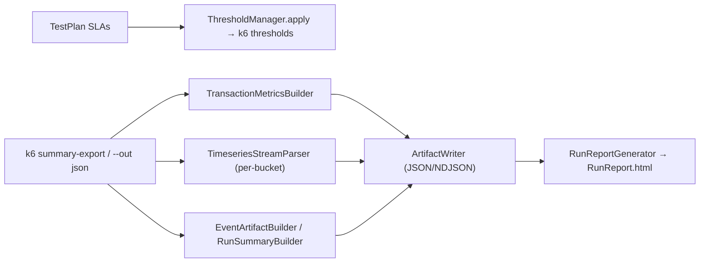
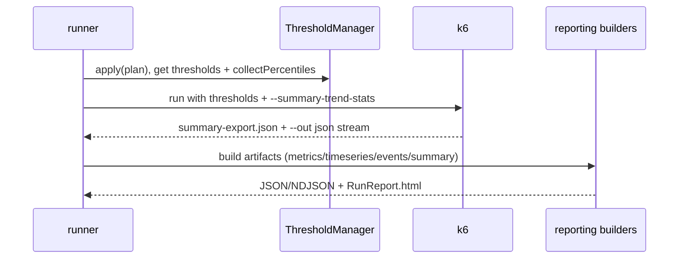

# EDD: Artifact-First Reporting & Thresholds

## Executive Summary
Reporting is **artifact-first**: k6's raw output is transformed into stable JSON/NDJSON artifacts
(`ci-summary.json`, `transaction-metrics.json`, `timeseries.json`, `errors.ndjson`, `warnings.ndjson`)
and a single interactive `RunReport.html`. CI consumes the JSON, never console text. SLAs from the test
plan become k6-native thresholds (`ThresholdManager`); transaction pass/fail is read **exactly** from
the `<name>_checkrate` Rate metric — no estimation.

## Problem Statement
k6's native summary is console-oriented and its thresholds are string DSL. We need (a) machine-readable
artifacts for CI gating, (b) exact per-transaction pass/fail (not check-count guesswork), and (c) SLA
authoring in the test plan translated to correct k6 threshold keys including arbitrary percentiles.

## Goals / Non-Goals
- **Goals:** deterministic artifacts; exact pass/fail from `_checkrate`; dynamic percentile thresholds;
  time-range-responsive HTML.
- **Non-Goals:** replacing k6's live console; estimating pass/fail when the contract metric is absent
  (render "—" instead).

## Architecture

## Component Responsibilities
| File | Symbol | Responsibility | Evidence |
|------|--------|----------------|----------|
| `assertions/ThresholdManager.ts` | `apply` / `collectPercentiles` | SLA → k6 thresholds; gather percentiles for `summaryTrendStats` | [:20](../../core_engine/src/assertions/ThresholdManager.ts#L20) / [:145](../../core_engine/src/assertions/ThresholdManager.ts#L145) |
| `reporting/TransactionMetricsBuilder.ts` | `build` | k6 summary → per-transaction rows | [:69](../../core_engine/src/reporting/TransactionMetricsBuilder.ts#L69) |
| `reporting/TimeseriesStreamParser.ts` | streaming parse | `--out json` → per-bucket aggregates | file |
| `reporting/EventArtifactBuilder.ts` | build | `errors.ndjson` + `warnings.ndjson` | file |
| `reporting/RunSummaryBuilder.ts` | build | `ci-summary.json` | file |
| `reporting/RunReportGenerator.ts` | generate | Unified `RunReport.html` (tabs) | file |

## Runtime Flow + Implementation Reverse-Engineering (§4A)

| Facet | Finding | Evidence |
|-------|---------|----------|
| **Execution entry point** | Threshold side: `ThresholdManager.apply(testPlan, journeyTransactionNames)` during k6Options assembly. Report side: builders invoked post-run from the runner over k6's summary-export + `--out json` stream. | [ThresholdManager.ts:20](../../core_engine/src/assertions/ThresholdManager.ts#L20), [TransactionMetricsBuilder.ts:69](../../core_engine/src/reporting/TransactionMetricsBuilder.ts#L69) |
| **Complete runtime flow (thresholds)** | (1) request-global from `global_sla.request` over legacy flat keys [:29-36]; (2) per-journey `http_req_duration{scenario:j}` [:39-49]; (3) transaction-level: `global_sla.transaction` default merged with `transaction_slas[t]`, applied to every transaction name [:54-76]; (4) per-request `http_req_duration{name:r}` [:82-92]. | [ThresholdManager.ts:27-92](../../core_engine/src/assertions/ThresholdManager.ts#L27) |
| **Complete runtime flow (metrics)** | `collectGroups(root_group)` → for each: `count` from `<name>_count` Counter (fallback group check-min) [:100-103]; pass/fail from `<name>_checkrate` Rate ONLY [:116-122]; `applyConfiguredStats` fills configured stat columns [:153]. Trend metrics not matched to a group become metric-only rows [:79-81]. | [TransactionMetricsBuilder.ts:69-133](../../core_engine/src/reporting/TransactionMetricsBuilder.ts#L69) |
| **Decision points & branch conditions** | Percentile key regex `^p(\d+(?:\.\d+)?)$` → `p(N)<value` [ThresholdManager.ts:129-131]; `errorRate` → `http_req_failed rate<e/100` or transaction `<txn>_checkrate rate>1-e/100` [:73-74]; metric is Trend iff `type==='trend'` or has `avg` [TMB:272]; built-in metric names excluded [TMB:293]. | as cited |
| **Validation logic** | `mergeSla` keeps only numeric values [:110-115]. `metricValue` reads either handleSummary `values.key` or summary-export flat `key` [:277-282] — tolerates both k6 output shapes. | [ThresholdManager.ts:108](../../core_engine/src/assertions/ThresholdManager.ts#L108), [TMB:277](../../core_engine/src/reporting/TransactionMetricsBuilder.ts#L277) |
| **Fallback logic** | `count` falls back to group check-min when `<name>_count` absent [TMB:102-103]. `stddev`: prefer real k6 value, else normal-dist approximation from p90/p95/min-max [TMB:205-223]. **Pass/fail have NO fallback** — off-contract (no `_checkrate`) leaves them `undefined` → report shows "—" [TMB:111-122, :177-179]. | as cited |
| **Error paths** | Builders are defensive over shape (object-map vs array groups/checks normalized [TMB:257-268]); malformed summary JSON → empty artifact rather than throw. | [TMB:256-268](../../core_engine/src/reporting/TransactionMetricsBuilder.ts#L256) |
| **State changes** | Pure transforms; no VU/global state. Artifacts written by `ArtifactWriter`. | — |
| **Object lifecycle** | Per-run: k6 summary-export JSON + `--out json` stream → in-memory rows/buckets → JSON/NDJSON files under the run dir → embedded/linked by `RunReportGenerator`. | [reporting-contracts.md](../../ai_context/reporting-contracts.md) |
| **Configuration influence** | `reporting.transactionStats` (an **array** — must be replaced wholesale on merge, see RZ3) selects stat columns; `reporting.timeseries.bucketSizeSeconds` (default 1s) and `reporting.timeseries.keepRawMetricsStream` control the stream parser. SLAs live in the test plan (`global_sla`, `journey_slas`, `transaction_slas`, `request_slas`). | stats [TMB:153-199], SLAs [ThresholdManager.ts](../../core_engine/src/assertions/ThresholdManager.ts) |
| **Env-variable influence** | `K6_PERF_TRANSACTION_NAMES` lets the parser classify each Point against known transactions; CI env (`CI_JOB_ID`, `GITHUB_RUN_ID`, `BUILD_BUILDID`) stamped into event artifacts. | [environment_index.json](../../ai_generated/environment_index.json) |
| **Interactions with other modules** | Consumes `<name>`/`<name>_count`/`<name>_checkrate` metrics emitted by `utils/transaction.ts`; `summaryTrendStats` (from `collectPercentiles`) must be passed to k6 as a **CLI flag** not JSON (RZ5/F6). Report reads structured `[k6-perf][error-event]`/`[warning-event]` lines. | [ThresholdManager.ts:145](../../core_engine/src/assertions/ThresholdManager.ts#L145), [reporting-contracts.md](../../ai_context/reporting-contracts.md) |
| **Extension points** | Add a stat via `reporting.transactionStats`; add an SLA scope in the test plan; `reporters/*` stubs (Grafana/Azure/webhook) are the external push extension surface. | [TMB:368-390](../../core_engine/src/reporting/TransactionMetricsBuilder.ts#L368) |
| **Known limitations** | RZ7: a custom SLA key matching `p<digits>` but not a valid k6 stat still generates a threshold. RZ8: if a transaction has no `k6Check`, `_checkrate` defaults to all-pass, so `fail=0` may understate real failures (the unchecked-failing-response backstop in `transaction()` mitigates this). `summaryTrendStats` JSON-config is silently ignored by k6 (F6). | [risk-zones.md](../../ai_context/risk-zones.md) RZ7/RZ8, [fragile-areas.md](../../ai_context/fragile-areas.md) F6 |

## Sequence Diagram

## Design Patterns
Translator (SLA DSL → k6 thresholds); Builder (per-artifact); tolerant parser (dual k6 output shapes);
artifact-first (JSON is the contract, HTML is a view).

## Interfaces
`TransactionMetricRow`, `TransactionMetricsFile`, `TimeSeriesFile`, `ci-summary.json`, event NDJSON.
Contract: [reporting-contracts.md](../../ai_context/reporting-contracts.md) — not restated.

## Error Handling · Logging · Metrics
Metrics are the subject, not emitted here. Builders never throw on malformed input; they degrade to
empty/partial artifacts so a run still produces a report.

## Performance / Security
`TimeseriesStreamParser` streams line-by-line over the k6 JSON output (dense contiguous buckets) — no
whole-file load. No secrets; CI identifiers only.

## Testing Strategy
`tools/validate-histogram.test.ts` (`npm run validate:histogram`) covers timeseries/histogram validation.
**Gap:** `ThresholdManager.apply` and `TransactionMetricsBuilder.build` are pure and should have
golden-file tests (percentile edge cases; missing `_checkrate` → "—").

## Risks / Tradeoffs
RZ7 (percentile-key regex accepts invalid k6 stats), RZ8 (checkless transactions), RZ3 (`transactionStats`
array must be replaced wholesale on merge — see [EDD-config](EDD-config.md)). Exact-only pass/fail trades
"always a number" for honesty ("—" when uncontracted).

## Future Improvements
Validate SLA percentile keys against k6-supported stats at plan-load; unit-test the builders; finish the
`reporters/*` external push stubs.

## Related Files
`reporting/*.ts`, `assertions/*.ts`, `utils/transaction.ts`, `config/runtime_settings/default.json`.

## Related ADRs
[adr/0001-dx-simplification-proposals.md](../adr/0001-dx-simplification-proposals.md) (Proposal 3 pass/fail metric, Proposal 5 report).
