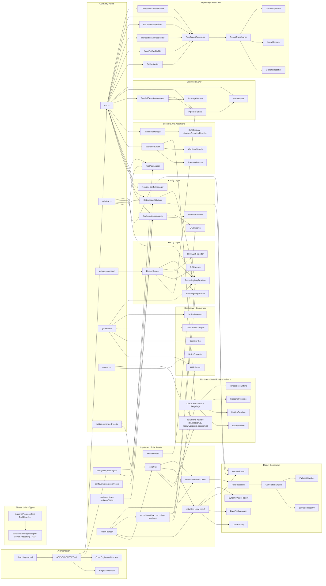

# Framework Flow Diagram

Date: 2026-04-13

## Purpose

This file is the standalone structural flow map for the framework.

AI assistants should use this file together with `AGENT-CONTEXT.md` as a token-saving orientation layer:
- read this map first to understand the repo shape quickly
- open only the modules connected to the current task
- avoid rediscovering unrelated parts of the framework

## AI Maintenance Instructions

- Keep this file synchronized with `AGENT-CONTEXT.md`.
- If architecture, CLI flow, lifecycle behavior, reporting flow, module boundaries, or suite layout change, update both files in the same pass.
- Do not keep multiple competing diagrams here.
- Replace the diagram with the latest authoritative version instead of appending obsolete ones.
- Keep the map detailed and connected enough that an AI model can traverse it before opening source files.
- Prefer structural accuracy over visual minimalism.

## Reading Order For AI Models

1. `flow diagram.md`
2. `AGENT-CONTEXT.md`
3. `config/test-plans/*.json`
4. `core-engine/src/cli/run.ts`
5. The specific connected modules for the task at hand

## Authoritative Structural Map

## Human-Readable Copy

**Maintenance rule:** When the diagram changes, update this readable copy and `AGENT-CONTEXT.md` in the same pass.

### 1. Top-Level Orientation

- `flow diagram.md` and `AGENT-CONTEXT.md` are the two orientation files AI models should read first.
- Test execution starts from `config/test-plans/*.json`, environment files, runtime settings, and optional `.env` secrets.
- Team-owned suites live under `scrum-suites/<team>/` and provide the actual tests, data files, recordings, and correlation rules.

### 2. CLI Entry Points

- `run.ts` is the main orchestration entrypoint for normal execution.
- `validate.ts` performs pre-flight checks before execution.
- `generate.ts` turns HAR files into framework-compatible scripts and recording logs.
- `convert.ts` converts conventional k6 scripts into the framework shape.
- `init.ts` and `generate-byos.ts` scaffold starter projects and journey scripts.
- The debug command routes into the replay/debug stack rather than the normal run-reporting path.

### 3. Config And Validation Flow

- `ConfigurationManager` merges framework defaults, environment config, runtime settings, CLI overrides, and `.env` secrets.
- `SchemaValidator` validates runtime and test-plan JSON contracts.
- `EnvResolver` loads secret/environment values.
- `GatekeeperValidator` checks whether scripts, recordings, data files, and plan structure are valid before execution.
- `RuntimeConfigManager` provides resolved runtime accessors for pacing, error behavior, reporting, monitoring, and related settings.

### 4. Normal Run Flow

- `run.ts` loads the test plan through `TestPlanLoader`.
- The resolved plan and configs go through `ConfigurationManager` and `GatekeeperValidator`.
- `ScenarioBuilder` converts the plan into k6 scenario definitions and injects runtime/scenario/lifecycle metadata into env.
- `ThresholdManager` builds k6-native thresholds from global, journey, and transaction SLAs.
- `ParallelExecutionManager` resolves scenarios, thresholds, and execution options.
- `PipelineRunner` launches k6.
- `HostMonitor` captures system snapshots and periodic sampling during normal runs when monitoring is enabled.
- After k6 finishes, the reporting builders generate artifacts such as:
  - `RunReport.html`
  - `ci-summary.json`
  - `transaction-metrics.json`
  - `timeseries.json`
  - `errors.ndjson`
  - `warnings.ndjson`
  - `system-metrics.json`
  - `run-manifest.json`

### 5. Debug Replay Flow

- The debug command routes into `ReplayRunner`.
- `ReplayRunner` executes the target script through `PipelineRunner` using captured output mode.
- Replay log entries are extracted from stdout/stderr and normalized.
- `DiffChecker` compares replayed traffic against the recording log.
- `HTMLDiffReporter` produces the replay/diff HTML report.
- Supporting debug modules include:
  - `ExchangeLogBuilder` for request/response log shaping
  - `RecordingLogResolver` for locating the correct recording log

### 6. Generation And Conversion Flow

- `generate.ts` uses:
  - `HARParser`
  - `DomainFilter`
  - `TransactionGrouper`
  - `ScriptGenerator`
- The output is a lifecycle-compatible framework script plus recording-log metadata.
- `convert.ts` uses `ScriptConverter` to reshape existing scripts into the framework model with:
  - replay logging
  - transaction wrapping
  - lifecycle-compatible structure
  - correlation/data tracking hooks

### 7. Runtime And Journey Script Flow

- Journey scripts in `scrum-suites/<team>/tests` are the k6-facing runtime entrypoints.
- They rely on runtime helpers such as:
  - `lifecycle.js`
  - `transaction.js`
  - `replayLogger.js`
  - `session.js`
- The runtime layer supports:
  - lifecycle orchestration
  - error handling
  - metrics aggregation
  - snapshot support
  - timeseries-related runtime helpers

### 8. Suite Asset Relationships

- `tests/*.js` consume runtime helpers and suite-local data/rules.
- `data/*.csv` and `data/*.json` flow into:
  - `DataFactory`
  - `DataPoolManager`
  - `DataValidator`
  - `DynamicValueFactory`
- `recordings/*.har` and `*.recording-log.json` flow into recording/debug modules.
- `correlation-rules/*.json` are consumed by `RuleProcessor`, `CorrelationEngine`, and extractor/fallback logic.

### 9. Reporting And Reporter Layers

- The reporting layer builds and writes local run artifacts.
- The reporters layer is where transformed results can be pushed outward.
- `RunReportGenerator` produces the unified HTML report.
- `ResultTransformer` prepares normalized output for external sinks.
- `GrafanaReporter`, `AzureReporter`, and `CustomUploader` represent downstream reporting adapters.

### 10. How AI Models Should Use This File

- Read this file before opening source files.
- Use the diagram to choose the shortest relevant path through the framework.
- For run issues, follow:
  - `run.ts -> config -> scenario/assertions -> execution -> reporting`
- For debug issues, follow:
  - `ReplayRunner -> PipelineRunner -> DiffChecker -> HTMLDiffReporter`
- For lifecycle issues, follow:
  - suite script -> `lifecycle.js` / `runtime/` -> `ScenarioBuilder`
- For generation/conversion issues, follow:
  - `generate.ts` / `convert.ts` -> `recording/` -> runtime helpers
- Keep this file synchronized with `AGENT-CONTEXT.md` so future AI models can save tokens and skip unnecessary repo-wide rediscovery.

## End-To-End Runtime Paths

### Normal Run

`run.ts -> TestPlanLoader -> ConfigurationManager -> GatekeeperValidator -> ScenarioBuilder + ThresholdManager -> ParallelExecutionManager -> PipelineRunner -> HostMonitor -> reporting builders -> RunReport.html + JSON/NDJSON artifacts`

### Debug Replay

`debug command / run debug mode -> ReplayRunner -> PipelineRunner (captured) -> replay-log extraction -> DiffChecker -> HTMLDiffReporter`

### HAR Generation

`generate.ts -> HARParser -> DomainFilter -> TransactionGrouper -> ScriptGenerator -> recording-log registration/output`

### Script Conversion

`convert.ts -> ScriptConverter -> lifecycle-compatible framework script + replay logging + transaction wrapping`

## Token-Saving Guidance For AI Models

- Start with this map before opening source files.
- Follow only the connected path relevant to the task.
- For CLI/run issues, prioritize: `run.ts -> config -> scenario -> execution -> reporting`.
- For debug issues, prioritize: `ReplayRunner -> PipelineRunner -> DiffChecker -> HTMLDiffReporter`.
- For data/correlation issues, prioritize: suite assets -> `data/` or `correlation/` -> generated/converted test script.
- For lifecycle issues, prioritize: suite script -> `lifecycle.js` / `runtime/` -> `ScenarioBuilder`.
